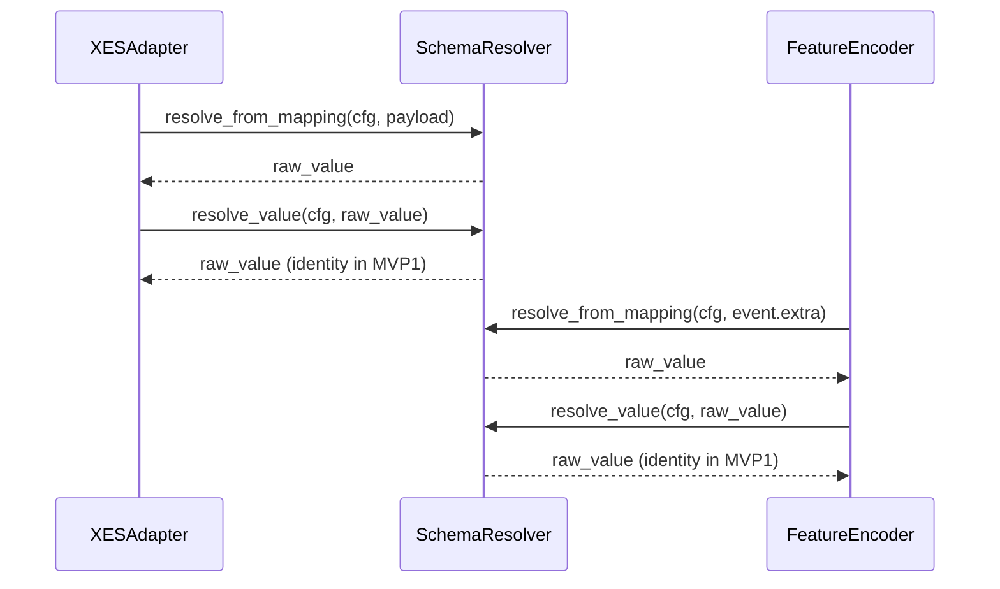

# ADAPTER_XES.MD

## 1. Статус
`APPROVED` (Core Foundation - All MVPs)

## 2. Призначення
Специфікація адаптера (Ingestion Layer) для читання сирих журналів подій (XES/CSV/MXML) та їх конвертації у канонічні DTO (`RawTrace`, `EventRecord`) перед передачею в Domain Layer.

## 3. Мінімальні вимоги (Requirements)
3.1. **Підтримка форматів:** Читання `.xes` (нативно, потоково) та `.mxml` (через конвертацію `pm4py` під капотом).
3.2. **Динамічний мапінг:** Використання конфігурації (наприклад, `mapping.yaml`) для гнучкого мапінгу колонок.
3.3. **Версіонування (κ):** Пріоритет пошуку версії процесу: `event-level` -> `trace-level` -> `log-level` -> `filename` -> значення `"default"`.
3.4. **Ізоляція:** Адаптер не створює графи і не перетворює дані на тензори. Він видає виключно плоскі DTO.
3.5. **XES Fallbacks & Classifiers:**
   - Якщо `mapping.yaml` не задає ключі, адаптер використовує стандарт IEEE XES 2.0: `concept:name` (activity), `time:timestamp` (time), `org:resource` (resource), `lifecycle:transition` (lifecycle).
   - **Правило обробки Classifier:** Якщо в конфігурації вказано `use_classifier: true`, парсер перевіряє наявність тегу `<classifier>` на рівні `<log>`. Якщо classifier існує — значення `activity_id` береться з нього (наприклад, конкатенація `concept:name` + `lifecycle:transition`). Якщо classifier відсутній або `use_classifier: false` — використовується fallback на поле, вказане в `activity_key`. Це забезпечує коректну роботу з логами BPI Challenge.

## 4. Жорсткі інваріанти парсингу та розрахунків

Адаптер зобов'язаний виконати нормалізацію для кожної траси після її витягування. Усі часові дельти рахуються **строго в секундах (float)**.

### 4.1. Timezone та Час
Усі `timestamp` обов'язково парсяться або конвертуються в UTC (`datetime.fromisoformat(...).astimezone(UTC)`), а потім переводяться в Unix epoch (float секунди).

### 4.2. Алгоритм обробки та розрахунку
Для кожного `case_id` масив подій сортується за `timestamp` (час початку) за зростанням.
- `position_in_trace`: Дорівнює індексу події (від 0 до N-1).
- `duration`: 
  - Якщо є `lifecycle:complete` і відповідний `start`: `(END_TIME - START_TIME).total_seconds()`.
  - Якщо подія точкова (один timestamp): `0.0`.
  - Від'ємні значення блокуються (`max(0.0, duration)`).
- `time_since_case_start`: Для `i = 0` -> `0.0`. Для інших -> `(timestamp[i] - timestamp[0])`.
- `time_since_previous_event`: Для `i = 0` -> `0.0`. Для інших -> `max(0.0, timestamp[i] - timestamp[i-1])`.

### 4.2.1 Duration pairing rules (якщо lifecycle присутній)

Для розрахунку `duration` в `EventRecord` (тільки для завершальних подій):
- **Стратегія by_instance:** Ключем є `(activity_id, activity_instance_id)`. Якщо атрибут `activity_instance_id` (з `lifecycle:instance` або `concept:instance`) порожній або відсутній — виконується автоматичний fallback на базову стратегію (LIFO або FIFO).
- **Стратегії LIFO / FIFO:** Композитним ключем є `(activity_id, resource_id)`. Якщо ресурс відсутній, ключем стає просто `(activity_id)`.
- Правила вирішення колізій (edge-cases):
  1. Останній `start` перед `complete` (LIFO) є найпоширенішим у реальних логах.
  2. Якщо знайдено подію `complete`, але в черзі для цього ключа немає відповідної події `start` (unmatched complete) $\to$ `duration = 0.0`.
  3. Якщо кілька `start` без `complete` $\to$ вони ігноруються.
  4. Через асинхронність записів різниця між `end` та `start` може бути від'ємною. Завжди застосовувати кліпінг: `duration = max(0.0, end_time - start_time)`.
  
---

### 4.3. Вирішення колізій та життєвих циклів (Event Deduplication)
- **Stable Sorting (Tie-breaker):** При однаковому `timestamp`, вторинним ключем сортування є оригінальний порядковий номер (index) у сирому файлі. Гарантує 100% детермінованість між запусками.
- **Lifecycle Filter:** Якщо є `lifecycle:transition`, для формування вузлів (`EventRecord`) залишаються **виключно** події зі статусом `complete`. Події `start` використовуються тільки "під капотом" для розрахунку `duration`.
- **Flat Nested Attributes:** Будь-які вкладені XML/JSON атрибути сплющуються (`parent.child = value`) або зберігаються як JSON-string у словниках `extra` / `trace_attributes`.
- **Lifecycle Filter:** Якщо в логах присутнє поле `lifecycle:transition`, до фінального списку подій (`EventRecord`) потрапляють **виключно** події з transition, що позначають завершення або скасування активності. За стандартом IEEE XES (стандартний transactional model) це такі значення:
  - `complete` — нормальне завершення активності (основний випадок).
  - `ate_abort` — аборт виконання конкретної активності.
  - `pi_abort` — аборт усього процесу для цього кейсу.
  - `manualskip` — ручне пропускання активності.
  - `autoskip` — автоматичне пропускання активності.

  Ці значення вважаються "завершальними" і генерують повноцінний `EventRecord`.  
  Інші transition (`start`, `schedule`, `assign`, `reassign`, `withdraw`, `suspend`, `resume` тощо) використовуються **виключно** "під капотом" для pairing та розрахунку `duration` і **не потрапляють** у фінальний список подій.

  Якщо потрібно — список "завершальних" transition можна налаштувати в `mapping.yaml` (наприклад: `complete_transitions: ["complete", "ate_abort", "manualskip", "autoskip"]`).

  Якщо поля `lifecycle:transition` взагалі немає — кожна подія вважається атомарною (`duration = 0.0`).

- **Збереження контексту (Flattening):** Згідно з еталонною схемою, втрата даних недопустима. Усі атрибути подій та трас, які не потрапили до основного мапінгу, мають бути сплющені. Вкладені атрибути записуються як `parent.child`. Сплющені атрибути події йдуть у словник `EventRecord.extra`, атрибути траси — у `RawTrace.trace_attributes`. Атрибут `process_version` (або `concept:version` на рівні траси) є обов'язковим; якщо він відсутній, встановлюється значення `"default"`.

- **Підготовка до об’єктно-центричного рівня (OCEL):**  
Адаптер зберігає всі `extra` атрибути подій та `trace_attributes` саме для підтримки майбутнього переходу до Object-Centric Process Graphs (OCPG). Це дозволяє без перепарсингу перейти від InstanceGraph до повноцінного EPOKG.

### 4.4. Обробка відсутніх даних
- Відсутній `resource_id`: `"UNKNOWN"`.
- Невалідний `timestamp`: подія відкидається (`logger.warning`), траса перераховується без неї.

## 5. Структура DTO Контрактів (Data Models)
Адаптер повертає дані строго у такій структурі:

```python
from typing import List, Dict, Any, Optional
from pydantic import BaseModel

class EventRecord(BaseModel):
    activity_id: str
    timestamp: float                   # Unix epoch (UTC)
    resource_id: str                   # "UNKNOWN", якщо відсутній
    lifecycle: Optional[str]
    position_in_trace: int             # Від 0 до N-1
    duration: float                    # Секунди
    time_since_case_start: float       # Секунди
    time_since_previous_event: float   # Секунди
    extra: Dict[str, Any]              # Усі не-маплені атрибути події
    activity_instance_id: Optional[str]   # lifecycle:instance або concept:instance, якщо є


class RawTrace(BaseModel):
    case_id: str
    process_version: str               # κ
    events: List[EventRecord]
    trace_attributes: Dict[str, Any]   # Усі атрибути рівня <trace>
```


**6. Приклад конфігурації (mapping.yaml)**
```yaml
xes_adapter:
  case_id_key: "concept:name"
  activity_key: "concept:name"         # Або ["concept:name", "lifecycle:transition"]
  timestamp_key: "time:timestamp"
  resource_key: "org:resource"
  lifecycle_key: "lifecycle:transition"
  version_key: "concept:version"       
  extra_event_fields: "*"              # "*" = зберігати всі інші атрибути в extra
  extra_trace_fields: "*"              # "*" = зберігати всі інші атрибути в trace_attributes
  ## Додаткові опції для lifecycle та pairing
  complete_transitions: ["complete", "ate_abort", "pi_abort", "manualskip", "autoskip"]
  pairing_strategy: "lifo"          # або "fifo", "by_instance"
  use_classifier: true              # якщо true — шукати та використовувати <classifier> для activity_id


```

## 7. Контракти виконання

**Інтерфейс-порт (у `src/application/ports/`):**
```python
from typing import Protocol, Iterator, Dict, Any
from src.domain.entities.raw_trace import RawTrace

class IXESAdapter(Protocol):
    def read(self, file_path: str, mapping_config: Dict[str, Any]) -> Iterator[RawTrace]:
        ...
```

**Input:** file_path: str, mapping_config: dict
**Output:** Iterator[RawTrace] (Генератор для потокової обробки. Запобігає OOM (Out Of Memory). Матеріалізація в List, якщо потрібно, робиться на рівні Use Case).

**Парсинг:** Обов'язкове використання потокового читання (наприклад, lxml.etree.iterparse). Після обробки тегу <trace>, обов'язково викликати elem.clear() та очищати попередні siblings, щоб не ріс memory footprint. Завантажувати весь XML-документ у пам'ять (DOM) СУВОРО ЗАБОРОНЕНО.

**Errors & Logging:** 
- logger.error: невалідні XML/XES схеми.
- logger.warning: пропущені биті події (наприклад, без timestamp).
- logger.info: після парсингу обов'язковий підсумковий запис: "Processed X traces, Y events, Z skipped".

## 8. Schema Resolution Pipeline

### 8.1. Канонічний порядок резольвінгу полів
Для кожної `FeatureConfig` резольвінг ключа виконується централізовано через `SchemaResolver` у фіксованому порядку:
\[
K_{lookup} = [\texttt{name},\;\texttt{source\_key},\;\texttt{fallback\_keys}]
\]
де `fallback_keys` задається профілем резольвера.

### 8.2. Використання `source_key`
- `source_key` є alias до зовнішнього імені поля в сирому payload.
- `XESAdapter` не виконує локальних дублюючих правил lookup; замість цього викликається `SchemaResolver.resolve_from_mapping(...)`.
- Той самий порядок lookup застосовується в `FeatureEncoder`, що гарантує симетрію ingestion/encoding.

### 8.3. Жорсткий інваріант MVP1 для `resolve_value`
У фазі MVP1 значення не нормалізуються семантично:
\[
\forall v:\; \operatorname{resolve\_value}(cfg, v) = v
\]
Заборонено:
1. зведення синонімів (`"Старт" \to "Start"`);
2. мовні або словникові заміни;
3. евристичні трансформації за підрядками/регістром.

### 8.4. Роль у підготовці до MVP2
`resolve_value` є формальним Extension Point для майбутнього `SemanticMapper` (MVP2), але в MVP1 цей hook працює виключно як identity-функція.


### 8.5. Schema resolution sequence diagram

