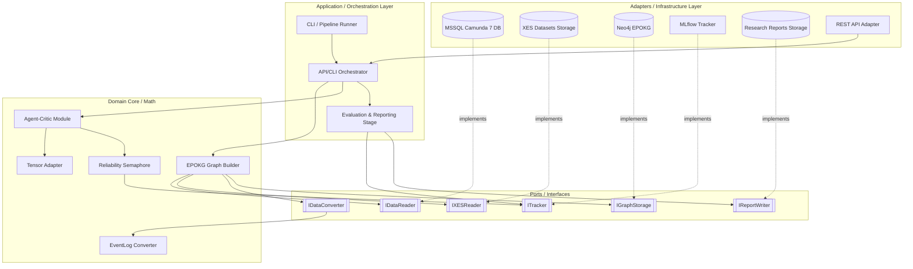
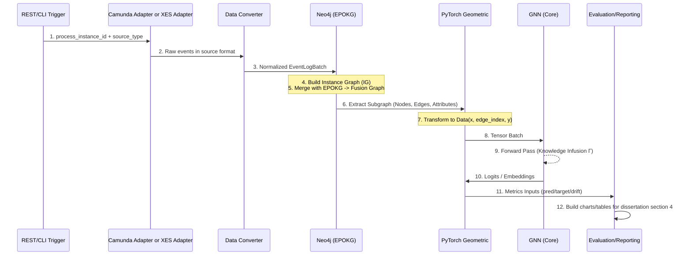
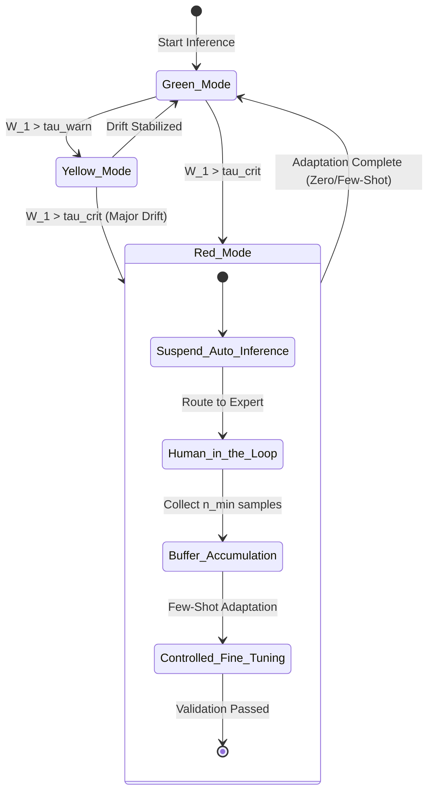

# ARCHITECTURE.MD

## 1) Призначення
Цей документ описує цільову архітектуру `bpm_prediction` і синхронізований з:
- `ARCHITECTURE_GUIDELINES.MD` (головний набір правил);
- `GLOSSARY.MD` (канон термінів);
- `VARIABLES.MD` (канон позначень і змінних).

Документ фіксує реалізаційний профіль системи, а не лише загальні принципи.

Документ фіксує реалізаційний профіль системи, а не лише загальні принципи.

## 2) Mode selected
**Обраний режим для поточної хвилі реалізації:** `ENTERPRISE_POC`.

Причина вибору:
1. Потрібен працюючий PoC в існуючому enterprise-контурі.
2. Потрібно зберегти наукову відтворюваність і трасованість для розділу 4 дисертації.
3. Не будуємо нову інфраструктуру з нуля, але ізолюємо математичне ядро.

---

## 3) Архітектурний стиль (узгоджено)
1. **Pipeline (Pipes & Filters)** — основний каркас виконання.
2. **Hexagonal (Ports & Adapters)** — ізоляція ядра від БД/тулінгу.
3. **Clean Architecture** — залежності спрямовані до доменного ядра.
4. **Strategy Pattern** — для drift/conditioning/loss у місцях варіативності.

---

## 4) High-Level Architecture (шари)

### 4.1 Core (Domain, math-only)
Містить:
- GNN-моделі прогнозування;
- Actor–Critic/Constraint-Critic логіку;
- OOD-логіку і структурний regularization;
- функції втрат (`loss_task`, `loss_reg`) і контроль `beta_relax`.

Core оперує лише тензорами/доменними DTO і **не має прямих залежностей** від Neo4j, MSSQL, MLflow.

### 4.2 Application (Orchestration)
- Сценарії `prepare/build_graph/train/evaluate/infer`;
- запуск pipeline-stage;
- виклик портів доступу до інфраструктури;
- контроль режимів `semaphore_mode` (`green`/`yellow`/`red`).

### 4.3 Adapters (Infrastructure)
- **Camunda7 MSSQL adapter**: спеціалізований адаптер під структуру Camunda 7 (історія, версії process definition, змінні).
- **XES adapter**: імпорт відкритих логів XES для тестування/бенчмарків (з підтримкою version-tagging при завантаженні в EPOKG).
- **Data Converter adapter**: нормалізує різні джерела (Camunda/XES/інші) у єдиний внутрішній контракт `EventLogBatch` перед Graph Builder.
- **Neo4j adapter**: робота з EPOKG/POKG.
- **Tracker adapter**: MLflow/інший трекер.
- **Storage adapter**: моделі, конфіги, кеші, артефакти.
- **REST API adapter (PoC)**: endpoint для запиту по поточному екземпляру виконання з подальшим запуском ingestion+inference через відповідний data adapter.

---

## 5) Pipeline stages (обов'язковий каркас)
1. **Ingestion** — читання логу процесу/батча.
2. **Graph Builder (EPOKG context)** — побудова IG і зв'язок з EPOKG.
3. **Tensor Adapter** — перехід до `torch_geometric.data.Data`.
4. **Core ML** — inference/train крок.
5. **Evaluation** — метрики якості/OOS.
6. **Drift Monitor** — обчислення drift-індикаторів.
7. **Inference** — фінальний прогноз + режим семафора.

---

## 6) Data Flow (runtime)
1. Запит надходить через CLI або REST API з `process_instance_id` і source-type.
2. Source-aware adapter (`camunda7_mssql_adapter` / `xes_adapter` / інший) читає сирі події.
3. `Data Converter` нормалізує вхід у єдиний контракт `EventLogBatch`.
4. `event_stream` + process context формують `process_graph`.
5. З EPOKG додається нормативний контекст і будується Fusion Graph.
6. Tensor Adapter формує `node_features`, `adj_matrix`/`edge_index`.
7. Core обчислює логіти/прогноз + uncertainty/drift сигнали.
8. `AllowMask` відсікає недопустимі переходи (OOS masking).
9. Reliability Semaphore обчислює `reliability_score` і встановлює `semaphore_mode`.
10. Prediction/metadata логуються в tracker і повертаються у викликаючий контур (CLI/API).

---

## 7) Reliability Semaphore (узгодження порогів)

### 7.1 Вхідні сигнали
- `wasserstein_drift` (`\mathcal{W}_1`) — структурний дрейф;
- `data_drift_score` (`D_data`);
- `concept_drift_score` (`D_concept`);
- додаткові сигнали невизначеності моделі.

### 7.2 Ієрархія порогів
1. `ood_threshold` (`\tau_{ood}`) — локальний поріг структурного OOD (по `\mathcal{W}_1`).
2. `warning_threshold` (`\tau_{warn}`) — агрегований жовтий режим.
3. `critical_threshold` (`\tau_{crit}`) — агрегований червоний режим.

Інваріант: `\tau_{warn} < \tau_{crit}`.

### 7.3 Поведінка за режимами
- **green:** стандартний inference.
- **yellow:** обмежений inference + сигнал на адаптацію.
- **red:** Human-in-the-Loop / призупинка авто-рішення.

---

## 8) Adaptation strategy
1. **Zero-Shot Structural Adaptation** — для мінорного дрейфу (оновлення графового контексту без перенавчання).
2. **Few-Shot Adaptation (Controlled Fine-Tuning)** — для глибокого OOD:
   - накопичення буфера до `min_buffer_size` (`n_min`);
   - контрольоване донавчання;
   - валідація перед поверненням у автоматичний inference.

---

## 9) Knowledge Infusion Operator
`knowledge_infusion_operator` (`\Gamma`) реалізується як `nn.Module` (або `nn.Sequential`), а не як статичний вектор.

Базова форма:
```python
fusion_repr = self.knowledge_infusion_operator(local_state_vec, global_context_vec)
```

де:
- `local_state_vec` (`h_\sigma`) — локальний стан кейсу;
- `global_context_vec` (`c_\sigma`) — глобальний контекст із EPOKG.

---

## 10) Data contracts (мінімально обов'язкові)
Між кожними stage визначаються:
1. Input schema.
2. Output schema.
3. Metadata schema.

Не допускається implicit format.

---

## 11) Versioning model
Кожний артефакт має містити:
- `dataset_id`
- `schema_version`
- `process_version` (`kappa`/`version_id`)
- `model_version`
- `git_commit`
- `experiment_id`

Додатково для експериментів:
- копії конфігів (`model.yaml`, `features.yaml`, `training.yaml`);
- `preprocessor_state` для відтворюваності inference.

---

## 12) Observability
Мінімальний набір логування на `inference/evaluate`:
- `data_drift_score`
- `concept_drift_score`
- `wasserstein_drift`
- `reliability_score`
- `semaphore_mode`
- Accuracy/F1/OOS (де застосовно)

Логування виконується на кожному batch (або іншому атомарному кроці).

---

## 13) Enterprise integration strategy (PoC)
Рекомендований контур запуску:
- CLI: `--mode prepare/build_graph/train/evaluate/infer`
- REST API (PoC): `POST /api/v1/infer-by-instance` з `process_instance_id` та `source_type`.

Правило маршрутизації даних:
1. API/CLI викликає orchestration service.
2. Orchestration service обирає потрібний data adapter (`camunda7_mssql_adapter` або `xes_adapter`).
3. Дані проходять через `Data Converter` до єдиного контракту.
4. Далі запускається стандартний pipeline до inference.

Інтеграція в існуючу екосистему:
- MSSQL Camunda 7 (обов'язково для PoC);
- XES-файли в директорії даних для відкритих датасетів;
- Neo4j (за наявності);
- існуючий трекер/registry (якщо є).

Не допускається:
- прямий зв'язок raw-джерела з EPOKG без конвертора контракту;
- мікросервісний оверінжиніринг;
- побудова повного MLOps-stack у PoC-фазі.

---

## 14) Risks & trade-offs
1. **Trade-off:** чиста ізоляція Core може уповільнювати першу ітерацію, але знижує технічний борг.
2. **Risk:** неявні схеми між stage спричинять нестабільні inference-помилки.
3. **Risk:** відсутність трекінгу `kappa` руйнує валідність експериментів дрейфу.
4. **Risk:** змішування adapter-логіки всередині Core ламає переносимість і тестованість.

---

## 15) Next architectural step
Наступний крок: деталізувати `Contracts & Abstract Base Classes` для портів/адаптерів і формалізувати схеми потоків даних для кожного pipeline-stage.

---

## 16) Component Architecture (Hexagonal View)



---

## 17) Data Flow & Transformation Schema



---

## 18) Reliability Semaphore State Machine



---

## 19) Physical Directory Structure
Обов'язкова структура репозиторію для дотримання Clean Architecture:

```text
bpm_prediction/
├── src/
│   ├── core/                  # Domain Math (без інфраструктурних залежностей)
│   │   ├── models/            # GNN, Agent, Critic (PyTorch)
│   │   ├── semaphore/         # OOD math, Wasserstein, Thresholds
│   │   └── interfaces/        # Abstract Base Classes (Ports)
│   ├── adapters/              # Infrastructure
│   │   ├── data/              # camunda7_mssql_adapter, xes_adapter, neo4j_storage
│   │   ├── api/               # rest_api_adapter
│   │   ├── tracking/          # mlflow_tracker
│   │   └── reporting/         # report_writer, chart_exporter
│   ├── pipeline/              # Orchestration (Stages)
│   │   ├── ingestion_router.py
│   │   ├── graph_builder.py
│   │   ├── data_converter.py
│   │   ├── tensor_adapter.py
│   │   ├── trainer.py
│   │   ├── evaluator.py
│   │   └── report_builder.py
│   └── cli.py                 # Entry point (--mode train/evaluate/infer)
├── data/                      # Local cache (.pt files, raw logs)
├── reports/                   # Tables/plots for dissertation section 4
├── tests/
└── ARCHITECTURE.MD
```

---

## 20) Research Reporting & Section 4 Outputs
Для підтримки розділу 4 дисертації в pipeline обов'язковий окремий `Evaluation & Reporting` крок.

### 20.1 Обов'язкові артефакти
1. Таблиці метрик по режимах (Baseline vs Augmented).
2. Графіки динаміки дрейфу (`wasserstein_drift`, `data_drift_score`, `concept_drift_score`).
3. Графіки стабільності семафора (`semaphore_mode` у часі).
4. Порівняльні графіки якості (Accuracy/F1/OOS) для різних `process_version (κ)`.

### 20.2 Вимоги до трасованості звітів
Кожен згенерований звіт має містити metadata:
- `experiment_id`
- `dataset_id`
- `schema_version`
- `process_version (κ)`
- `model_version`
- `git_commit`

### 20.3 Розміщення звітів
- Локально: `reports/`.
- У трекері: artifacts в MLflow (або сумісному tracker).

