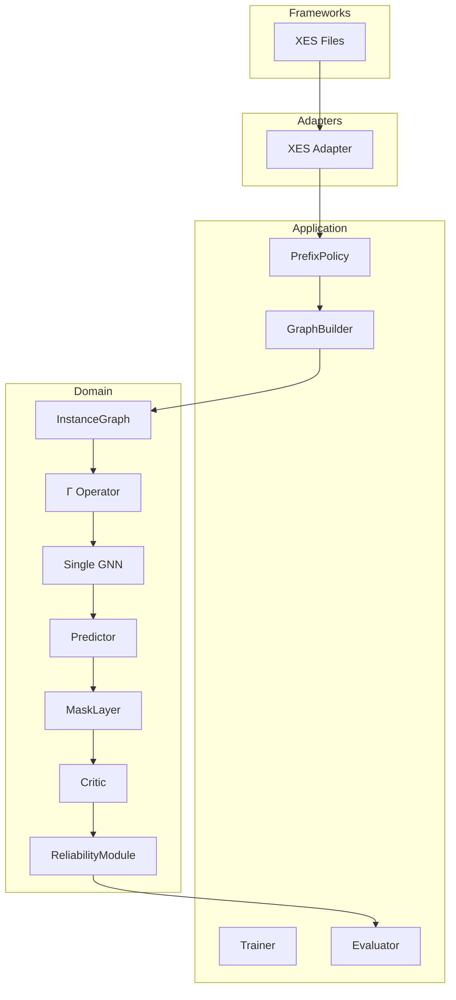
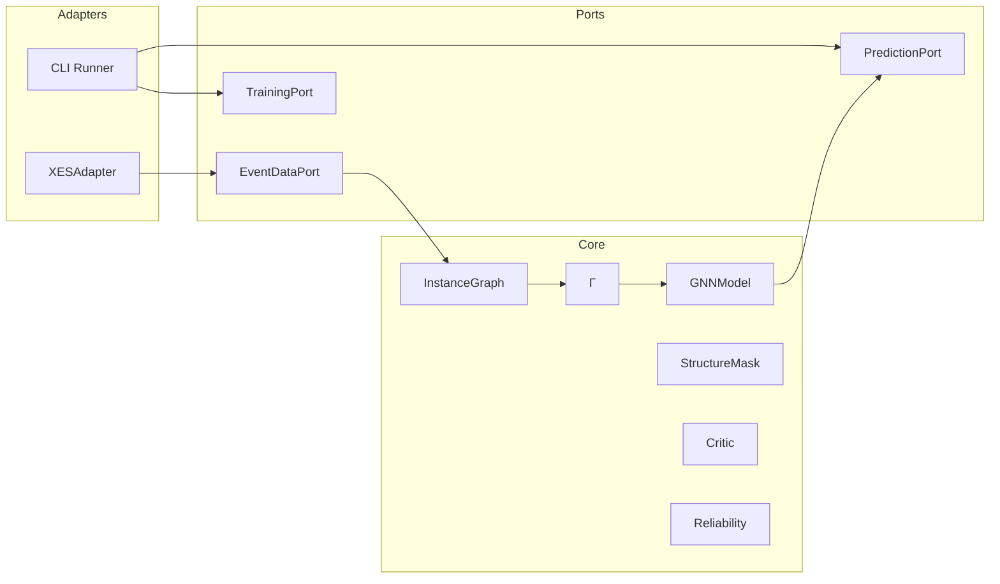
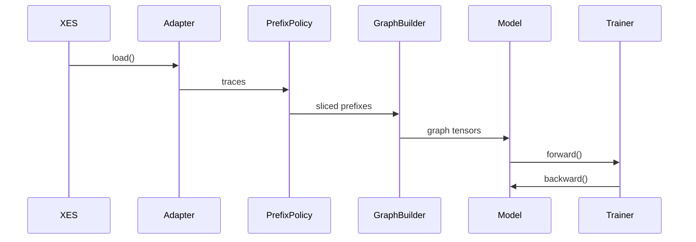
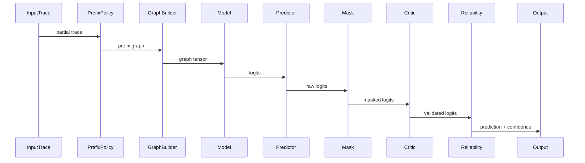

# ARCHITECTURE_MVP1.MD

## 1. Scope

MVP1 is a research-only baseline implementation.

Goal:
- validate graph-based next activity prediction,
- evaluate prefix slicing,
- provide reproducible baseline for comparison,
- serve as foundation for structural augmentation (MVP2+).

This version:
- uses XES datasets,
- supports prefix experiments,
- supports κ as static version,
- implements Γ as minimal MLP,
- uses single GNN architecture,
- includes full inference pipeline (Predictor → Mask → Critic → Reliability),
- masking implemented as IdentityMask (inactive),
- critic implemented as NullCritic (pass-through),
- drift module absent (introduced in MVP4).
- 
У MVP1 повний inference-пайплайн вже закладено архітектурно,
але Mask та Critic реалізовані як заглушки.
Це дозволяє уникнути рефакторингу в наступних етапах.

---

# 2. Clean Architecture (Layered View)

Пояснення
Frameworks — зовнішні джерела (XES).
Adapters — конвертація логів у внутрішній контракт.
Application — orchestration пайплайна.
Domain — математичне ядро (граф + Γ + GNN).
Domain не залежить від XES.
У MVP1 MaskLayer, Critic та ReliabilityModule не змінюють результат прогнозу,
але входять до пайплайну як архітектурні елементи майбутніх розширень.

# 3. Component Architecture (Hexagonal View)

Пояснення

Core не знає, що таке XES або CLI.

Всі зовнішні системи працюють через порти.
# 4. Data Flow (Use Case Scenarios)
## 4.1 Training Flow

Кроки

Зчитування XES.
Префіксна нарізка.
Побудова InstanceGraph.
Обчислення z_fused.
Навчання GNN.

## 4.2 Inference Flow

# 5. Domain Model (MVP1)

## 5.1 InstanceGraph

Represents executed prefix.

(Граф представляє виконаний префікс траси без нормативного збагачення.)

### Node Attributes

- `activity_id`
- `timestamp`
- `resource_id`
- `duration`
- `position_in_trace`

### Edge Types

- `sequential_relation`

(У MVP1 граф містить лише послідовні зв’язки між подіями.)

> No structural enrichment in MVP1.  
> (У цій версії відсутня інтеграція BPMN або EPOKG.)

---

## 5.2 Fusion Operator Γ (MVP1)

In MVP1:

z_fused = MLP([h_sigma || c_sigma])
Where:

- `h_sigma` — prefix representation (латентне представлення виконаного префіксу)
- `c_sigma` — static κ embedding (заглушка версії процесу)

Γ implemented as simple linear layer.

(Оператор Γ реалізовано як простий лінійний шар + активація.
Повноцінна мультимодальна інтеграція з’явиться у наступних MVP.)

---

## 5.3 GNN Model

Single `torch_geometric` model.

### Recommended Architecture

- `GCN` or `GraphSAGE`
- global pooling layer
- linear classification head

### Output

- `logits` over next activity space

(Модель повертає сирі логіти для задачі прогнозування наступної активності.)

---
## 5.4 Inference Pipeline Components (MVP1)
### MaskLayer (IdentityMask)

- deterministic layer
- does not modify logits in MVP1

(У MVP1 маска не застосовує жодних обмежень. Вона повертає logits без змін.)
---
### Critic (NullCritic)

- receives masked logits
- does not rescore or penalize
- forwards logits unchanged

(У MVP1 критик не впливає на результат. Він закладений як архітектурна точка розширення.)
---
### ReliabilityModule (StaticReliability)
Formal definition:
- confidence = max(softmax(logits))

(У MVP1 рівень довіри визначається як максимальна  ймовірність після softmax.)

No thresholding applied.
No drift awareness.
No OOD detection.

Output:

- predicted_class
- confidence

(Жодної додаткової логіки обмеження в MVP1 не застосовується.)

## 5.5 GraphTensorContract (PyG Data Mapping)

This section defines the formal contract between `InstanceGraph` 
and `torch_geometric.data.Data`.

(Цей підрозділ формалізує, як абстрактний InstanceGraph 
перетворюється у тензорне представлення PyG.)

### Mapping Rules

InstanceGraph → PyG Data:

- `x` → node feature matrix  
  (матриця ознак вузлів, розмір [N_nodes × d_features])

- `edge_index` → sequential edges  
  (матриця зв’язків у форматі COO, розмір [2 × N_edges])

- `batch` → batch index vector  
  (вектор приналежності вузлів до конкретного графа в батчі)

- `y` → target next activity label  
  (мітка наступної активності для задачі класифікації)

### Node Feature Vector Composition

Each node feature vector includes:

- activity embedding
- normalized timestamp
- duration
- positional encoding (position_in_trace)

(Формування ознак вузла є детермінованим та однаковим 
для train і inference.)

### Graph-Level Representation

After message passing:
- h_graph = GlobalPooling(node_embeddings)

(Граф агрегується у вектор представлення префіксу.)

This vector is passed to Γ.

---

## 5.6 Fusion Integration with GNN

In MVP1, Γ operates at graph level.

Formal pipeline:
- h_graph = GNN(InstanceGraph)
- z_fused = Γ([h_graph || c_sigma])
- logits = Linear(z_fused)

Where:

- `c_sigma` — static κ embedding
- `Γ` — single linear layer with activation
- `logits` — unnormalized scores over activity space

(У MVP1 Γ застосовується після глобального пулінгу 
та перед фінальною класифікацією.)

This explicitly binds Γ to the GNN computational graph.

# 6. PrefixPolicy (Research Module)

Prefix slicing strategies:

- `fixed_length`
- `full_prefix`
- `sliding_window`
- `random_prefix`

This module enables:

- prefix length ablation study
- forgetting effect analysis

PrefixPolicy is application-level component.

(Модуль відповідає за експериментальну нарізку трас і не входить до математичного ядра.)

---

# 7. Experiment Configuration (MVP1)

Fixed configuration:
structure_mode = "logs_only"
kappa_conditioning = "static"
drift_strategy = "off"
reliability_strategy = "off"
architecture_type = "single_gnn"

All experiments must log:

- `prefix_length`
- `dataset`
- `κ`
- `seed`
- `split_strategy`

(Жоден запуск не може бути невідтворюваним.)

---

# 7.1 Data Split Strategy

Random trace-level split with fixed seed.

(Дані розділяються на train/validation/test 
на рівні повних трас, а не окремих подій.)

Constraints:

- No leakage between traces
- Deterministic split via fixed random seed
- Seed logged in experiment metadata

This guarantees reproducibility.

---

# 7.2 Loss Function

Primary objective:
- CrossEntropyLoss(logits, target)

(Використовується стандартна крос-ентропійна функція втрат
для задачі класифікації наступної активності.)

Loss is computed at graph level.

---

# 7.3 Evaluation Metrics

The following metrics are computed:

Classification Metrics:
- accuracy
- top_k_accuracy
- precision
- recall
- f1_score
- confusion_matrix

Regression Metrics (if time prediction enabled later):
- mae
- rmse
- r2

Operational Metrics:
- out_of_scope_rate
- train_loss
- validation_loss
- training_time

(У MVP1 основний фокус — класифікаційні метрики.
Регресійні вводяться для майбутнього розширення.)

All metrics logged per epoch and per experiment.
---

# 8. Scientific Role of MVP1

MVP1 answers:

- Does graph representation outperform sequence baseline?
- How sensitive is prediction to prefix length?
- What is minimal sufficient prefix size?
- Is Γ stub harmful or neutral?

This is baseline for structural hypothesis testing.

(Це фундаментальна контрольна точка для всієї подальшої методології.)

---

# 9. Out of Scope (MVP1)

he following components are architecturally предусмотрені, 
але не активні або не реалізовані в MVP1:

- **Active structural masking**  
  (структурна κ-залежна маска буде введена у MVP2)
- **Neo4j integration and structural storage**  
  (інтеграція нормативного графа та версій процесу — MVP2)
- **Trained Critic model**  
  (навчений критик з’явиться у MVP3; у MVP1 використовується NullCritic)
- **Drift detection mechanisms**  
  (data / structural / Wasserstein drift — MVP4)
- **Reliability Semaphore (green / yellow / red)**  
  (формальна система сигналізації довіри — MVP4)
- **Enterprise API layer**  
  (REST / async / integration — MVP5)

Note:

MaskLayer, Critic interface and ReliabilityModule are present in Domain layer but implemented as pass-through components in MVP1.

(Ці компоненти знаходяться в математичному ядрі, але не активні у цій версії.)

Жодної бізнес-інфраструктури в архітектурі MVP1 немає.
---

# 10. Success Criteria

MVP1 is considered complete when:

- prefix experiments reproducible
- κ logged explicitly
- model converges
- metrics stable across seeds
- config snapshot saved
- no domain–infrastructure leakage

