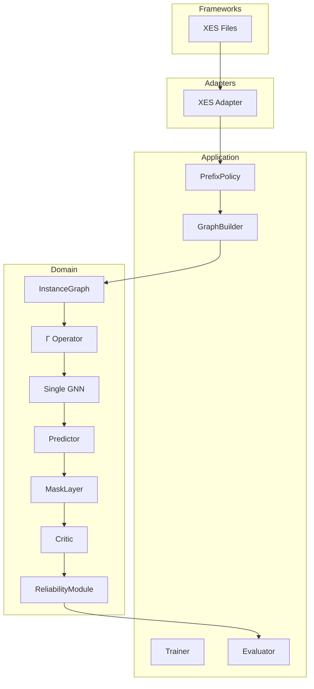
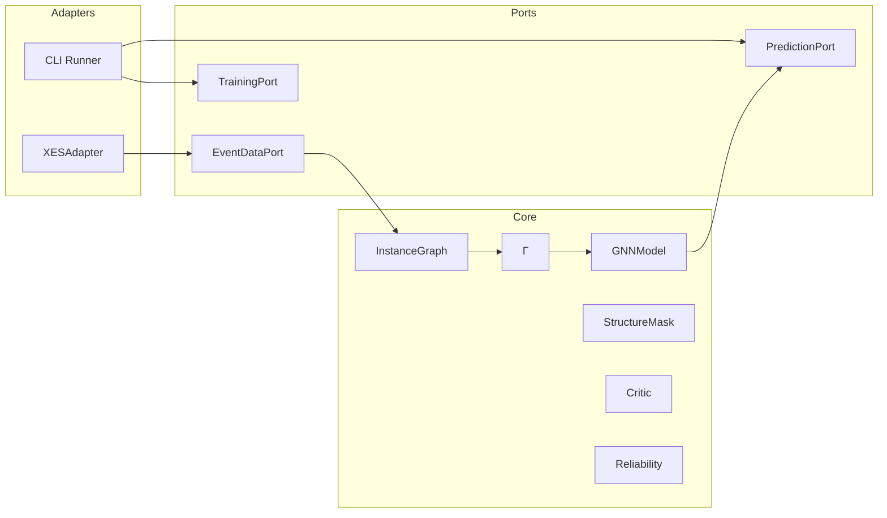
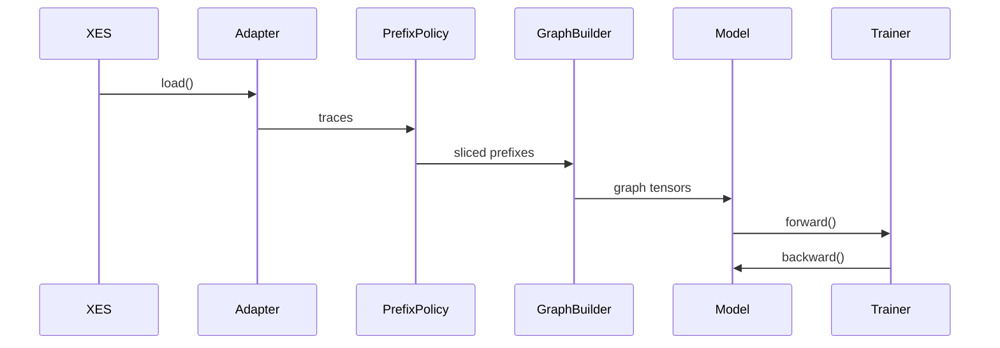
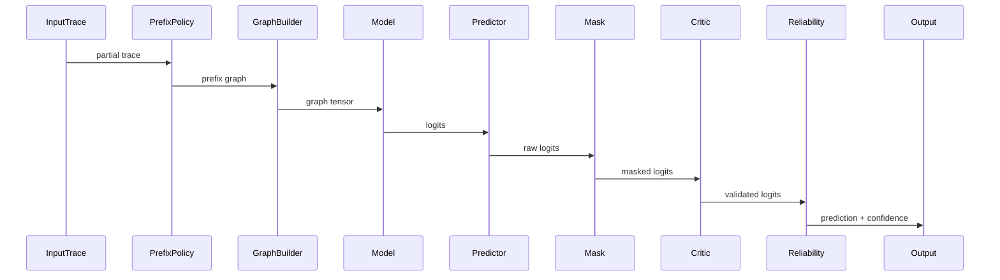

# ARCHITECTURE_MVP1.MD

## 1. Scope
### Mathematical Scope Clarification

MVP1 operates on $G_{obs}$ only.

Structural graph $G_{struct}$ (EPOKG), multi-perspective fusion $G_{fusion}$,
and structural conditioning are intentionally excluded.

(У цій версії використовується лише спостережуваний граф. Нормативний контекст інтегрується з MVP2.)
MVP1 is a research-only baseline implementation.

Goal:
- validate graph-based next activity prediction,
- evaluate prefix slicing,
- provide reproducible baseline for comparison,
- serve as foundation for structural augmentation (MVP2+).

This version:
- uses XES datasets,
- supports prefix experiments,
- supports κ as static version,
- implements Γ as minimal MLP,
- uses single GNN architecture,
- includes full inference pipeline (Predictor → Mask → Critic → Reliability),
- masking implemented as IdentityMask (inactive),
- critic implemented as NullCritic (pass-through),
- drift module absent (introduced in MVP4).
- 
У MVP1 повний inference-пайплайн вже закладено архітектурно,
але інші реалізовані як заглушки, ще дозволяє уникнути рефакторингу в наступних етапах.

---

# 2. Clean Architecture (Layered View)



Пояснення:
- Frameworks — зовнішні джерела (XES).
- Adapters — конвертація логів у внутрішній контракт.
- Application — orchestration пайплайна.
- Domain — математичне ядро (граф + Γ + GNN).
Domain не залежить від XES.

У MVP1 MaskLayer, Critic та ReliabilityModule не змінюють результат прогнозу,
але входять до пайплайну як архітектурні елементи майбутніх розширень.

# 3. Component Architecture (Hexagonal View)



Пояснення

Core не знає, що таке XES або CLI.

Всі зовнішні системи працюють через порти.
# 4. Data Flow (Use Case Scenarios)
## 4.1 Training Flow



Кроки

Зчитування XES.
Префіксна нарізка.
Побудова InstanceGraph.
Обчислення z_fused.
Навчання GNN.

## 4.2 Inference Flow



# 5. Domain Model (MVP1)

## 5.1 InstanceGraph

Represents executed prefix. (Граф представляє виконаний префікс траси без нормативного збагачення, реалізує спостережуваний граф виконання.)

InstanceGraph corresponds to observed_graph (see VARIABLES.MD). 


Normative graph $G_{struct}$ is not active in MVP1.

### Node Attributes

- `activity_id`
- `timestamp`
- `resource_id`
- `duration`
- `position_in_trace`

### Edge Types

- `sequential_relation`

(У MVP1 граф містить лише послідовні зв’язки між подіями.)

> No structural enrichment in MVP1.  
> (У цій версії відсутня інтеграція BPMN або EPOKG.)

---

## 5.2 Fusion Operator Γ (MVP1)

z_fused = MLP([h_sigma || c_sigma])
- h_sigma → local_state_vec
- c_sigma → global_context_vec
- z_fused → fused_representation
- 
Where:
- `h_sigma` — prefix representation (латентне представлення виконаного префіксу)
- `c_sigma` — static κ embedding (заглушка версії процесу)

Γ implemented as simple linear layer.

In MVP1:
- h_graph = GNN(InstanceGraph)
- z_fused = Γ([h_graph || context_embedding])
- logits = Linear(z_fused)

(Γ застосовується після глобального пулінгу, що чітко пов’язує математичний оператор з архітектурою.)

---

## 5.3 GNN Model (Port-Based Architecture)

MVP1 implements architecture-agnostic graph prediction via pluggable GNN backbones.

Model selection is externalized and resolved in the **Application layer**.  
The **Domain layer remains independent of concrete GNN implementations**.

---

### 5.3.1 Domain-Level Abstraction

The Domain depends only on an abstract interface:

```python
class GNNModelPort:
    def forward(self, graph_tensor) -> logits:
        ...
```
The Domain layer does not depend on:
- specific GNN architectures (GCN, GraphSAGE, GAT, etc.)
- torch_geometric
- CLI arguments
- configuration system

Domain logic operates strictly on GraphTensorContract.

### 5.3.2 Model Selection Mechanism

Concrete GNN implementation is injected via the Application layer.

Model selection may be defined through:
- CLI argument (--model_type)
- configuration file (architecture_type)
- experiment configuration object (ModelConfig)

Selection occurs before training begins and remains immutable during experiment execution.

### 5.3.3 Architectural Invariants

All GNN implementations MUST:
- accept GraphTensorContract
- output logits
- support batch processing
- be deterministic under fixed random seed
- be compatible with PrefixPolicy
- follow naming conventions defined in VARIABLES.MD

### 5.3.4 Architectural Constraint

The Domain layer MUST NOT:
- import concrete GNN classes
- instantiate models directly
- depend on torch_geometric
- depend on external experiment configuration

Concrete implementations belong to the Adapters layer.

### 5.3.5 Scientific Role

MVP1 is not a single-architecture baseline.

It is an architecture-agnostic experimental framework for evaluating:
- graph-based next activity prediction
- prefix sensitivity
- minimal sufficient context
- structural augmentation readiness (MVP2+)

This ensures fair comparison between multiple graph architectures under identical data contracts and training protocols.

### 5.3.6 Model Resolution Flow

Model selection follows this resolution order:

1. CLI argument (`--model_type`) if provided.
2. Configuration file (`architecture_type`) otherwise.
3. Default model defined in ExperimentConfig.

Resolution is handled by `ModelFactory` in Application layer.

Domain layer receives only an instance implementing `GNNModelPort`.

## 5.4 Inference Pipeline Components (MVP1)
### MaskLayer (IdentityMask)

- deterministic layer
- does not modify logits in MVP1

(У MVP1 маска не застосовує жодних обмежень. Вона повертає logits без змін.)
---
### Critic (NullCritic)

- receives masked logits
- does not rescore or penalize
- forwards logits unchanged

(У MVP1 критик не впливає на результат. Він закладений як архітектурна точка розширення.)
---
### ReliabilityModule (StaticReliability)
Formal definition:
- confidence_score = max(softmax(logits)) 
//confidence_score corresponds to VARIABLES.MD definition.

(У MVP1 рівень довіри визначається як максимальна  ймовірність після softmax.)

No thresholding applied.
No drift awareness.
No OOD detection.

Output:

- predicted_class
- confidence

(Жодної додаткової логіки обмеження в MVP1 не застосовується.)

## 5.5 GraphTensorContract (PyG Data Mapping)

This section defines the formal contract between `InstanceGraph` 
and `torch_geometric.data.Data`.

(Цей підрозділ формалізує, як абстрактний InstanceGraph 
перетворюється у тензорне представлення PyG.)

### Mapping Rules

InstanceGraph → PyG Data:

- `x` → node feature matrix  //x corresponds to node_features (see VARIABLES.MD)
  (матриця ознак вузлів, розмір [N_nodes × d_features])

- `edge_index` → sequential edges  
  (матриця зв’язків у форматі COO, розмір [2 × N_edges])

- `batch` → batch index vector  
  (вектор приналежності вузлів до конкретного графа в батчі)

- `y` → target next activity label  
  (мітка наступної активності для задачі класифікації)

### Node Feature Vector Composition

Each node feature vector includes:

- activity embedding
- normalized timestamp
- duration
- positional encoding (position_in_trace)

(Формування ознак вузла є детермінованим та однаковим 
для train і inference.)

### Graph-Level Representation

After message passing:
- h_graph = GlobalPooling(node_embeddings)

(Граф агрегується у вектор представлення префіксу.)

This vector is passed to Γ.

---

## 5.6 Fusion Integration with GNN

In MVP1, Γ operates at graph level.

Formal pipeline:
- h_graph = GNN(InstanceGraph)
- z_fused = Γ([h_graph || c_sigma])
- logits = Linear(z_fused)

Where:

- `c_sigma` — static κ embedding
- `Γ` — single linear layer with activation
- `logits` — unnormalized scores over activity space

(У MVP1 Γ застосовується після глобального пулінгу 
та перед фінальною класифікацією.)

This explicitly binds Γ to the GNN computational graph.

## 5.7 Dissertation-Level Objects (Planned Extensions)

The following mathematical objects are defined in the dissertation
but not activated in MVP1:

- $G_{struct}$ (EPOKG)
- $G_{fusion}$
- structural_mask ($M_{struct}$)
- critic_loss ($L_{critic}$)
- drift_signal ($\delta_{drift}$)
- macro_stability_state ($s_{macro}$)
- reliability_state ($S_{rel}$)
- version_transition_operator

All variable names follow VARIABLES.MD conventions.

These components are introduced progressively in MVP2–MVP4.

(Таким чином MVP1 є першим шаром повної методології.)

---

# 6. PrefixPolicy (Research Module)

Prefix slicing strategies:

- `fixed_length`
- `full_prefix`
- `sliding_window`
- `random_prefix`

This module enables:

- prefix length ablation study
- forgetting effect analysis

PrefixPolicy is application-level component.

(Модуль відповідає за експериментальну нарізку трас і не входить до математичного ядра.)

---

# 7. Experiment Configuration (MVP1)

Fixed configuration:
structure_mode = "logs_only"
kappa_conditioning = "static"
drift_strategy = "off"
reliability_strategy = "off"
architecture_type = "single_gnn"


All experiments must log:

- `prefix_length`
- `dataset`
- `κ`
- `seed`
- `split_strategy`

(Жоден запуск не може бути невідтворюваним.)

---

# 7.1 Data Split Strategy

Random trace-level split with fixed seed.

(Дані розділяються на train/validation/test 
на рівні повних трас, а не окремих подій.)

Constraints:

- No leakage between traces
- Deterministic split via fixed random seed
- Seed logged in experiment metadata

This guarantees reproducibility.

---

# 7.2 Loss Function

Primary objective:
- CrossEntropyLoss(logits, target)


(Використовується стандартна крос-ентропійна функція втрат
для задачі класифікації наступної активності.)

Loss is computed at graph level.

In MVP1:

total_loss (see VARIABLES.MD) = prediction_loss

Multi-objective loss components are inactive.

---

# 7.3 Evaluation Metrics

The following metrics are computed:

Classification Metrics:
- accuracy
- top_k_accuracy
- precision
- recall
- f1_score
- confusion_matrix

Regression Metrics (if time prediction enabled later):
- mae
- rmse
- r2

Operational Metrics:
- out_of_scope_rate
- train_loss
- validation_loss
- training_time

(У MVP1 основний фокус — класифікаційні метрики.
Регресійні вводяться для майбутнього розширення.)

All metrics logged per epoch and per experiment.
---

# 8. Scientific Role of MVP1

MVP1 answers:

- Does graph representation outperform sequence baseline?
- How sensitive is prediction to prefix length?
- What is minimal sufficient prefix size?
- Is Γ stub harmful or neutral?

This is baseline for structural hypothesis testing.

(Це фундаментальна контрольна точка для всієї подальшої методології.)

---

# 9. Out of Scope (MVP1)

## Логіка еволюції /  Evolution Logic

MVP1 → Pure prediction (G_obs only)  
MVP2 → Structure-aware prediction (G_obs + G_struct)  
MVP3 → Agent–Critic global validation  
MVP4 → Adaptive self-regulating system  
MVP5 → Enterprise PoC layer  

The following components are architecturally defined
but not active in MVP1.

---

## MVP2 — Structural Integration Layer

- **Active structural_mask (M_struct)**  
  κ-залежна детермінована маска допустимих переходів.

- **Structural graph integration (G_struct / EPOKG)**  
  Інтеграція нормативного графа в inference pipeline.

- **Neo4j structural storage**  
  Зберігання та версіонування нормативного графа.

- **κ-conditioning (static structural context)**  
  Підтримка версії процесу на рівні inference,
  без автоматичного переходу між версіями.

---

## MVP3 — Agent–Critic Layer

- **Trained Critic model**  
  NullCritic замінюється на навчений модуль глобальної валідації.

- **multi-objective loss (critic term)**  
  L_total = L_pred + λ₁ L_critic

- **macro_stability_state (s_macro)**  
  Глобальний стан системи (0 — стабільність, 1 — реконфігурація).

(Drift ще не активується — система поки що статична.)

---

## MVP4 — Adaptive Layer

- **drift_signal (δ_drift)**  
  Виявлення розподільчого або структурного зсуву.

- **Wasserstein-1 distance monitoring**

- **OOD detection (latent / structural)**

- **multi-objective loss (drift term)**  
  L_total = L_pred + λ₁ L_critic + λ₂ L_drift

- **automatic version_transition_operator (κ → κ+1)**  
  Автоматичний перехід версії при детекції drift.

- **Reliability semaphore (S_rel)**  
  Green / Yellow / Red режим довіри.

- **continual learning loop**  
  Механізм ініціації перенавчання.

---

## MVP5 — Enterprise Layer

- **Enterprise API layer**
  REST / async / system integration.

---

## Architectural Note

MaskLayer, Critic interface and ReliabilityModule 
are present in Domain layer in MVP1,
but implemented as pass-through components.

(Ці компоненти входять до математичного каркасу,
але не впливають на результат у базовій версії.)

MVP1 does not include any enterprise infrastructure.
---

# 10. Success Criteria (MVP1 Execution Contract)

MVP1 is considered complete when the following operational conditions are satisfied.

This section defines implementation-level constraints for the Codex agent.

---

## 1. Deterministic Experiment Setup

The system MUST:

- use fixed random seed
- use random split with fixed seed
- log seed value
- log dataset name
- log prefix_length
- log process_version (κ)
- save configuration snapshot (JSON/YAML)

No experiment is valid without these logs.

---

## 2. Functional Training Loop

The system MUST:

- perform forward pass
- compute prediction_loss (CrossEntropy)
- perform backward pass
- update model_parameters
- log train_loss and validation_loss per epoch

Training MUST converge without:
- NaN values
- exploding gradients
- runtime errors

---

## 3. Prefix Experiment Support

The system MUST support:

- fixed_length prefixes
- full_prefix mode
- sliding_window mode
- random_prefix mode

Each prefix strategy MUST be independently executable.

---

## 4. Inference Pipeline Integrity

The full pipeline MUST execute in this order:

InstanceGraph  
→ FusionOperator  
→ GNNModel  
→ Predictor // Predictor outputs: logits, predicted_activity, confidence_score (see VARIABLES.MD)
→ MaskLayer (IdentityMask)  
→ Critic (NullCritic)  
→ ReliabilityModule  
→ Output


MaskLayer and Critic MUST exist in code,
even if they do not modify logits.

Removing them is not allowed.

---

## 5. Metrics Logging

Each experiment MUST log:

- accuracy
- top_k_accuracy
- precision
- recall
- f1_score
- mae
- rmse
- r2
- out_of_scope_rate
- confusion_matrix
- train_loss
- validation_loss
- training_time

Missing metrics invalidate the run.

---

## 6. Clean Architecture Constraint

The Domain layer MUST:

- not import XES libraries
- not depend on Neo4j
- not depend on external APIs

Adapters MAY depend on external libraries.
Domain MUST remain pure.

---

## 7. No Structural Logic Activation

In MVP1 the following MUST remain inactive:

- structural_mask
- critic_loss
- drift_signal
- continual_learning
- version_transition_operator (automatic)

These components may exist as stubs only.

---

MVP1 is complete when:

- all components compile
- experiments execute end-to-end
- logs reproducible
- no architectural violations detected