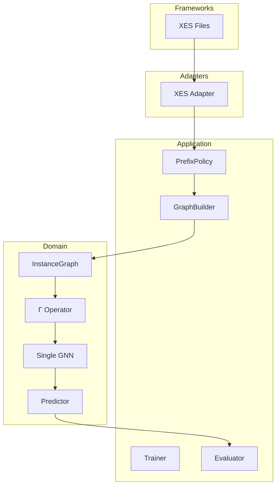
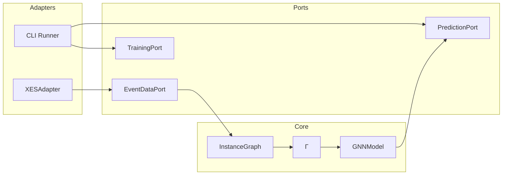
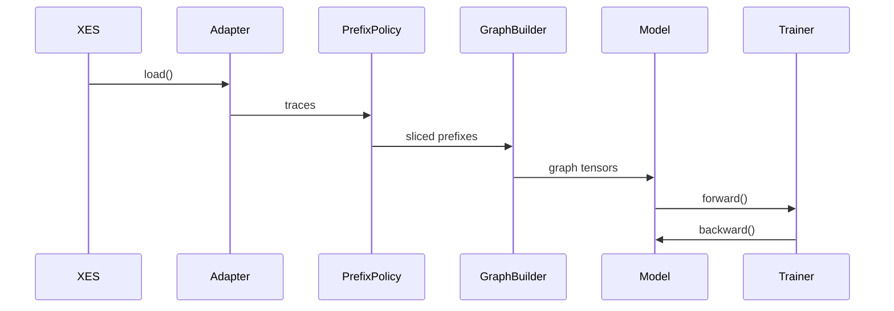
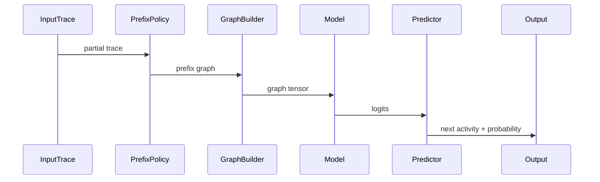

# ARCHITECTURE_MVP1.MD

## 1. Scope

MVP1 is a research-only baseline implementation.

Goal:
- validate graph-based next activity prediction,
- evaluate prefix slicing,
- provide reproducible baseline for comparison,
- serve as foundation for structural augmentation (MVP2+).

This version:
- uses XES datasets,
- supports prefix experiments,
- supports κ as static version,
- implements Γ as minimal MLP,
- uses single GNN architecture,
- has no masking,
- has no critic,
- has no drift.

---

# 2. Clean Architecture (Layered View)

Пояснення

Frameworks — зовнішні джерела (XES).
Adapters — конвертація логів у внутрішній контракт.
Application — orchestration пайплайна.
Domain — математичне ядро (граф + Γ + GNN).
Domain не залежить від XES.

# 3. Component Architecture (Hexagonal View)

Пояснення

Core не знає, що таке XES або CLI.

Всі зовнішні системи працюють через порти.
# 4. Data Flow (Use Case Scenarios)
## 4.1 Training Flow

Кроки

Зчитування XES.
Префіксна нарізка.
Побудова InstanceGraph.
Обчислення z_fused.
Навчання GNN.

## 4.2 Inference Flow

# 5. Domain Model (MVP1)

## 5.1 InstanceGraph

Represents executed prefix.

(Граф представляє виконаний префікс траси без нормативного збагачення.)

### Node Attributes

- `activity_id`
- `timestamp`
- `resource_id`
- `duration`
- `position_in_trace`

### Edge Types

- `sequential_relation`

(У MVP1 граф містить лише послідовні зв’язки між подіями.)

> No structural enrichment in MVP1.  
> (У цій версії відсутня інтеграція BPMN або EPOKG.)

---

## 5.2 Fusion Operator Γ (MVP1)

In MVP1:

z_fused = MLP([h_sigma || c_sigma])
Where:

- `h_sigma` — prefix representation (латентне представлення виконаного префіксу)
- `c_sigma` — static κ embedding (заглушка версії процесу)

Γ implemented as simple linear layer.

(Оператор Γ реалізовано як простий лінійний шар + активація.
Повноцінна мультимодальна інтеграція з’явиться у наступних MVP.)

---

## 5.3 GNN Model

Single `torch_geometric` model.

### Recommended Architecture

- `GCN` or `GraphSAGE`
- global pooling layer
- linear classification head

### Output

- `logits` over next activity space

(Модель повертає сирі логіти для задачі прогнозування наступної активності.)

---

# 6. PrefixPolicy (Research Module)

Prefix slicing strategies:

- `fixed_length`
- `full_prefix`
- `sliding_window`
- `random_prefix`

This module enables:

- prefix length ablation study
- forgetting effect analysis

PrefixPolicy is application-level component.

(Модуль відповідає за експериментальну нарізку трас і не входить до математичного ядра.)

---

# 7. Experiment Configuration (MVP1)

Fixed configuration:
structure_mode = "logs_only"
kappa_conditioning = "static"
drift_strategy = "off"
reliability_strategy = "off"
architecture_type = "single_gnn"

All experiments must log:

- `prefix_length`
- `dataset`
- `κ`
- `seed`
- `split_strategy`

(Жоден запуск не може бути невідтворюваним.)

---

# 8. Scientific Role of MVP1

MVP1 answers:

- Does graph representation outperform sequence baseline?
- How sensitive is prediction to prefix length?
- What is minimal sufficient prefix size?
- Is Γ stub harmful or neutral?

This is baseline for structural hypothesis testing.

(Це фундаментальна контрольна точка для всієї подальшої методології.)

---

# 9. Out of Scope (MVP1)

- Structural Mask
- Critic
- Drift
- Reliability Semaphore
- Enterprise API
- Neo4j
- Camunda

(Жодної бізнес-інфраструктури в MVP1.)

---

# 10. Success Criteria

MVP1 is considered complete when:

- prefix experiments reproducible
- κ logged explicitly
- model converges
- metrics stable across seeds
- config snapshot saved
- no domain–infrastructure leakage

