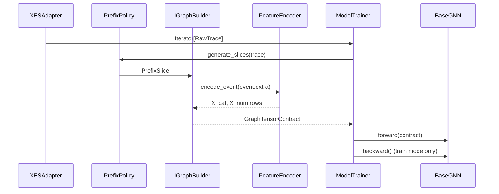

# ARCHITECTURE_MVP1.MD

## 1. Scope
MVP1 implements a single-model observed-graph baseline for next-activity prediction on event logs.

**Included:**
- XES ingestion.
- Prefix generation.
- Graph tensor construction.
- GNN training and evaluation (`train`, `eval_cross_dataset`, `eval_drift`).
- Config-driven feature policies.

**Explicitly excluded from MVP1 runtime:**
- Advanced trust-control runtime chain (reserved for MVP2).
- Semantic synonym mapping.
- EOPKG structural fusion.

---

## 2. Architectural Style
- Clean Architecture (layered responsibility separation).
- Hexagonal Architecture (ports and adapters).
- Pipeline orchestration by use-case (`ModelTrainer.run`).

Dependency rule:
\[
\text{Domain} \leftarrow \text{Application} \leftarrow \text{Adapters}
\]
(no reverse concrete dependencies).

---

## 3. Layered Components

### 3.1 Domain Layer
- DTOs: `EventRecord`, `RawTrace`, `PrefixSlice`, `GraphTensorContract`.
- Services:
  - `SchemaResolver`
  - `FeatureEncoder`
  - `BaselineGraphBuilder` (via `GraphBuilderBase` extension point)
- Model: `BaseGNN` family.

### 3.2 Application Layer
- Use case: `ModelTrainer`.
- Ports: `IXESAdapter`, `IPrefixPolicy`, `IGraphBuilder`, `ITracker`.

### 3.3 Adapter Layer
- `XESAdapter` (streaming parser).
- Tracking adapter (MLflow).

---

## 4. Canonical Data Paths

## 4.1 Training and Cross-Dataset Evaluation

```mermaid
sequenceDiagram
    participant XES as XESAdapter
    participant PP as PrefixPolicy
    participant GB as IGraphBuilder
    participant FE as FeatureEncoder
    participant TR as ModelTrainer
    participant M as BaseGNN

    XES->>TR: Iterator[RawTrace]
    TR->>PP: generate_slices(trace)
    PP->>GB: PrefixSlice
    GB->>FE: encode_event(event.extra)
    FE-->>GB: X_cat, X_num rows
    GB-->>TR: GraphTensorContract
    TR->>M: forward(contract)
    TR->>M: backward() (train mode only)
```

## 4.2 Drift Evaluation Path

```mermaid
flowchart TD
    A[RawTrace list] --> B[Sort by start_ts]
    B --> C[Generate windows by size/stride(or overlap)]
    C --> D[Build graph loaders per window]
    D --> E[Evaluate metrics per window]
    E --> F[Log: index, trace range, start_ts, end_ts, macro_f1, ece]
```

Anti-leakage ordering constraint:
\[
\text{sort} \rightarrow \text{windowing} \rightarrow \text{evaluation} \rightarrow \text{logging}
\]

---

## 5. SchemaResolver as Canonical Contract

`SchemaResolver` is the unique resolver for field lookup precedence (`name`, `source_key`, `fallback_keys`).

In MVP1:
\[
\operatorname{resolve\_value}(cfg, v) = v
\]

Interpretation:
- field lookup is centralized,
- value semantics are not transformed.

This is a deliberate scientific constraint to preserve measurable degradation under schema/language shifts.

---

## 6. Feature Representation

For each graph with \(N\) nodes:
\[
X_{cat} \in \mathbb{N}^{N \times F_{cat}},
\quad
X_{num} \in \mathbb{R}^{N \times F_{num}},
\quad
A \in \mathbb{N}^{2 \times E}
\]

Target:
\[
y \in \{0,\dots,C-1\}
\]

Model output:
\[
\hat{Y} \in \mathbb{R}^{B \times C}
\]

---

## 7. Policy-Driven Encoding (Config)

MVP1 uses external policy profiles (YAML):
- `activity_fallback_feature`
- `zscore_clip` (`enabled`, `min`, `max`)
- `time2vec.work_hours` (`working_days`, `start_hour`, `end_hour`, `timezone`)

These policies are runtime-configurable; no dataset-specific hardcoded logic is allowed in core encoding flow.

---

## 8. Trainer as Orchestrator

`ModelTrainer.run()` is a dispatcher that routes to scenario-specific pipelines:
- `_run_train_pipeline`
- `_run_eval_cross_dataset`
- `_run_eval_drift`

Responsibilities of `run()`:
1. common initialization (device, criterion, config/tracker context),
2. checkpoint routing,
3. mode dispatch,
4. structured return payload.

It does not contain dataset-specific preprocessing branches.

---

## 9. Extension Points Reserved for MVP2

1. `SchemaResolver.resolve_value` -> `SemanticMapper` integration hook.
2. `GraphBuilderBase` -> `DynamicStructuralGraphBuilder` (EOPKG-aware).

MVP1 keeps both hooks inactive by design.
