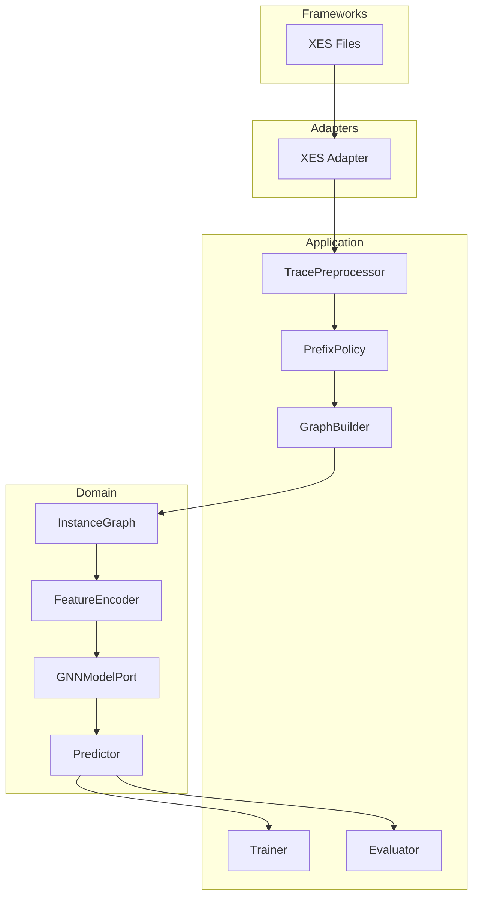
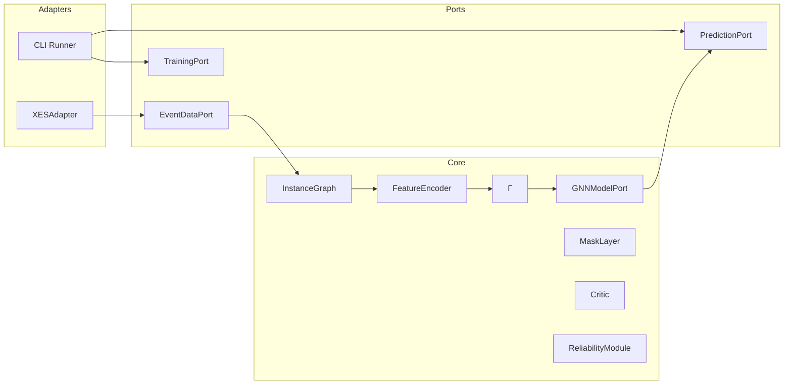
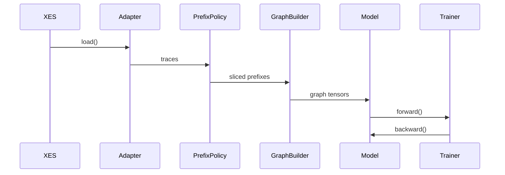
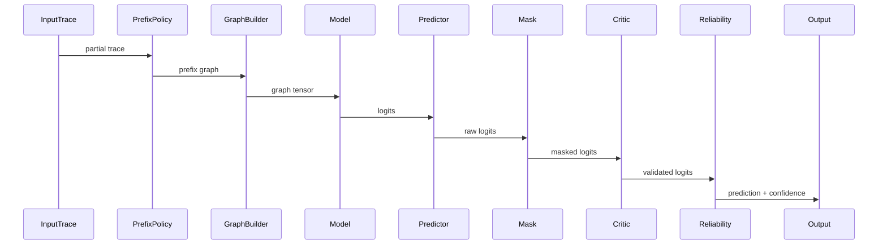
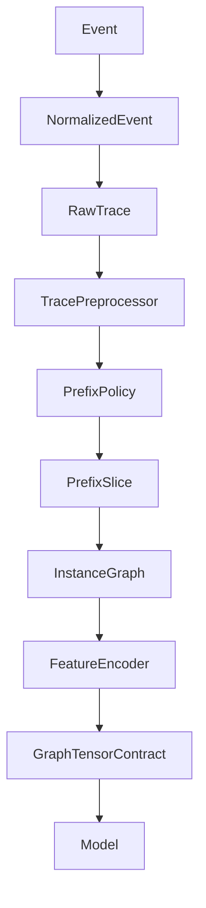
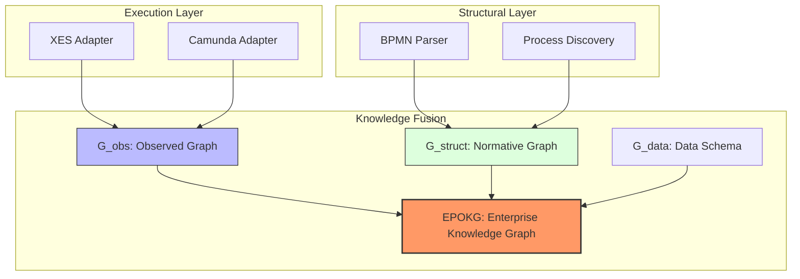
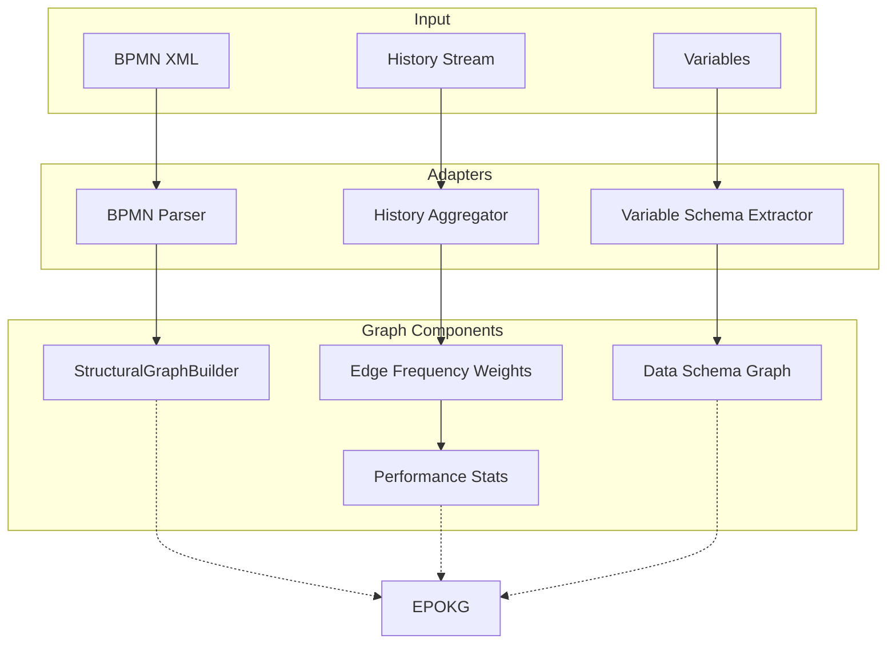

# ARCHITECTURE_MVP1.MD
Project: bpm_prediction  
Scope: MVP1 — Logs-only Baseline (Observed Graph Only)  
Mode: EXPERIMENT

---

# 1. Scope

### 1.1 Mathematical Scope Clarification

MVP1 реалізує **нативне графове подання** ($G_{obs}$) як фундаментальне рішення проблеми **топологічної невідповідності** (розділ 1.1.1 дисертації).  
Він усуває лінеаризацію паралелізму та втрату long-term dependencies, що притаманні sequence-based та image-based моделям.  
Це створює чистий baseline для подальшого порівняння з семантично збагаченими графами (MVP2+).

MVP1 operates strictly on the observed execution graph:

G_obs → observed_graph

Inactive in MVP1:
- G_struct (EPOKG)
- G_fusion
- structural_mask
- critic_loss
- drift_signal
- reliability_state

Це означає, що MVP1 є чистим execution-based baseline без нормативного або адаптивного збагачення.

---

## 1.2 Наукова роль MVP1

MVP1 використовується для:

- перевірки гіпотези, що графове представлення ефективне для next activity prediction;
- аналізу чутливості до prefix_length;
- визначення мінімального достатнього контексту;
- створення контрольної точки перед структурним збагаченням (MVP2).

Це фундамент, без якого неможливо обґрунтувати подальші ускладнення.

---

### 1.3 Algorithmic Constraints from Tragets Architecture for MVP1

- Reliability Semaphore (Mahalanobis + Wasserstein + P_diag) — НЕ реалізується в MVP1  
- Динамічний β-релаксація — НЕ реалізується в MVP1  
- Trust-Aware Inference — НЕ реалізується в MVP1 (тільки logits)  
- Prioritized Experience Replay — НЕ реалізується в MVP1 (звичайний DataLoader)  

Усе це з’явиться в MVP2+ (Reliability Layer та Version Control Layer).

---

# 2. Clean Architecture (Layered View)

```mermaid
flowchart TB
    subgraph Frameworks
        XES[XES Files]
    end

    subgraph Adapters
        XESAdapter[XES Adapter]
    end

    subgraph Application
        TracePreprocessor[TracePreprocessor]
        PrefixPolicy[PrefixPolicy]
        GraphBuilder[GraphBuilder]
        Trainer[Trainer]
        Evaluator[Evaluator]
    end

    subgraph Domain
        InstanceGraph[InstanceGraph]
        FeatureEncoder[FeatureEncoder]
        GNNModel[GNNModelPort]
        Predictor[Predictor]
    end

    %% Data Flow
    XES --> XESAdapter
    XESAdapter --> TracePreprocessor
    TracePreprocessor --> PrefixPolicy
    PrefixPolicy --> GraphBuilder
    GraphBuilder --> InstanceGraph
    InstanceGraph --> FeatureEncoder
    FeatureEncoder --> GNNModel
    GNNModel --> Predictor
    Predictor --> Trainer
    Predictor --> Evaluator
```

### Пояснення шарів

Frameworks — зовнішні джерела (XES).  
Adapters — нормалізація до канонічних об’єктів (EventRecord, RawTrace).  
Application — orchestration логіки експерименту.  
Domain — математичне ядро (граф, Γ, GNN, inference).

Domain НЕ має залежати від XES, CLI або конкретних GNN реалізацій.

---

# 3. Component Architecture (Hexagonal View)

```mermaid
flowchart LR
    subgraph Core
        Graph[InstanceGraph]
        Encoder[FeatureEncoder]
        Fusion[Γ]
        Model[GNNModelPort]
        Mask[MaskLayer]
        Critic[Critic]
        Reliability[ReliabilityModule]
    end

    subgraph Ports
        DataPort[EventDataPort]
        TrainPort[TrainingPort]
        PredictPort[PredictionPort]
    end

    subgraph Adapters
        XESAdapter[XESAdapter]
        CLIAdapter[CLI Runner]
    end

    XESAdapter --> DataPort
    CLIAdapter --> TrainPort
    CLIAdapter --> PredictPort

    DataPort --> Graph
    Graph --> Encoder
    Encoder --> Fusion
    Fusion --> Model
    Model --> PredictPort
```

### Пояснення

Core — повністю ізольований математичний центр.  
Ports — абстрактні інтерфейси для взаємодії.  
Adapters — конкретні реалізації для XES або CLI.

Це забезпечує інверсію залежностей і можливість розширення без рефакторингу ядра.

---

# 4. Data Flow (Use Case Scenarios)

## 4.1 Training Flow

```mermaid
sequenceDiagram
    participant XES
    participant Adapter
    participant PrefixPolicy
    participant GraphBuilder
    participant Model
    participant Trainer

    XES->>Adapter: load()
    Adapter->>PrefixPolicy: traces
    PrefixPolicy->>GraphBuilder: sliced prefixes
    GraphBuilder->>Model: graph tensors
    Model->>Trainer: forward()
    Trainer->>Model: backward()
```

### Логіка

1. Лог зчитується та нормалізується.
2. Формується префікс σ.
3. Будується InstanceGraph.
4. Кодуються ознаки.
5. Формується GraphTensorContract.
6. Модель навчається через CrossEntropy.

---

## 4.2 Inference Flow

```mermaid
sequenceDiagram
    participant InputTrace
    participant PrefixPolicy
    participant GraphBuilder
    participant Model
    participant Predictor
    participant Mask
    participant Critic
    participant Reliability

    InputTrace->>PrefixPolicy: partial trace
    PrefixPolicy->>GraphBuilder: prefix graph
    GraphBuilder->>Model: graph tensor
    Model->>Predictor: logits
    Predictor->>Mask: raw logits
    Mask->>Critic: masked logits
    Critic->>Reliability: validated logits
    Reliability->>Output: prediction + confidence
```

Порядок Predictor → Mask → Critic є фіксованим та відповідає архітектурній конституції.

---

## 4.3 End-to-End Pipeline

```mermaid
flowchart TD
    Event --> NormalizedEvent
    NormalizedEvent --> RawTrace
    RawTrace --> TracePreprocessor
    TracePreprocessor --> PrefixPolicy
    PrefixPolicy --> PrefixSlice
    PrefixSlice --> InstanceGraph
    InstanceGraph --> FeatureEncoder
    FeatureEncoder --> GraphTensorContract
    GraphTensorContract --> Model
```

TracePreprocessor у MVP1 — identity.  
У MVP2 тут з’явиться фільтрація технічних вузлів і буде реалізовуваитсь TracePreprocessor.
Орієнтовна структура на майбутнє

TracePreprocessor

├── TechnicalNodeFilter

├── LifecycleCollapser

├── NoiseFilter

└── Future DriftHooks

---

# 5. Domain Core (Aligned with DATA_MODEL_MVP1)

## 5.1 InstanceGraph

Represents observed_graph.  
Містить лише sequential_relation.

Node attributes:
- activity_id
- timestamp
- resource_id
- duration
- position_in_trace

---

## 5.2 GraphTensorContract

Required tensors:
- x
- edge_index
- batch
- y

Reserved (MVP2+):
- edge_attr
- doc_features
- structural_mask

Інваріант: формування x ідентичне для train та inference.

---

## 5.3 Fusion Operator Γ

z_fused = Γ(h_graph, c_sigma)

- h_graph — pooled embedding
- c_sigma — κ embedding

Γ знаходиться в Domain шарі.

---

## 5.4 Inference Components

MaskLayer — IdentityMask  
Critic — NullCritic  
Reliability — max softmax

Ці компоненти закладені архітектурно, але не активні логічно.

---

# 6. PrefixPolicy

Supports:
- fixed_length
- full_prefix
- sliding_window
- random_prefix

Відповідає за σ construction та експериментальний аналіз forgetting effect.

---

# 7. Experiment Integrity

MVP1 валідний лише якщо:

- використовується fixed seed
- split trace-level
- логуються κ, dataset, prefix_length
- немає leakage
- Domain ізольований

---

# 8. Evolution Path

MVP1 → Pure prediction  
MVP2 → Structural mask + κ conditioning  
MVP3 → Critic activation  
MVP4 → Drift & reliability  
MVP5 → Enterprise wrapper  

---

# 9. Success Criteria

- стабільне навчання
- відтворюваність
- повний inference pipeline
- відсутність структурної логіки
- відповідність DATA_MODEL_MVP1

# 10. Target Enterprise Architecture (Vision for MVP2+)

> **Note:** This section describes the future state (Post-MVP1). It is strictly informative for architectural alignment and MUST NOT be implemented in MVP1.

## 10.1 Knowledge Integration Layers
In the target state, the system fuses execution data ($G_{obs}$) with structural definitions ($G_{struct}$) into the unified EPOKG.

```mermaid
flowchart TD
    subgraph Execution Layer [Execution Layer]
        XESExec[XES Adapter]
        CamExec[Camunda Adapter]
    end

    subgraph Structural Layer [Structural Layer]
        BPMN[BPMN Parser]
        Discovery[Process Discovery]
    end

    subgraph Knowledge Integration [Knowledge Fusion]
        Gobs[G_obs: Observed Graph]
        Gstruct[G_struct: Normative Graph]
        Gdata[G_data: Data Schema]
        EPOKG[EPOKG: Enterprise Knowledge Graph]
    end

    %% Data Flow
    XESExec --> Gobs
    CamExec --> Gobs
    
    BPMN --> Gstruct
    Discovery --> Gstruct
    
    Gobs --> EPOKG
    Gstruct --> EPOKG
    Gdata --> EPOKG
    
    %% Styling
    style EPOKG fill:#f96,stroke:#333,stroke-width:2px
    style Gobs fill:#bbf,stroke:#333
    style Gstruct fill:#dfd,stroke:#333
```
## 10.2 Planned Camunda Adapter Strategy
For future enterprise integration, the Camunda adapter will decompose the source data into three graph layers before fusion.

Source Data:

BPMN XML (process_definition_id)

Execution History (history_stream)

Process Variables (variable_scope)

**Transformation Pipeline:**

```mermaid
flowchart TD
    subgraph Input
        XML[BPMN XML]
        Hist[History Stream]
        Vars[Variables]
    end

    subgraph Adapters
        BPMNParser[BPMN Parser]
        HistAgg[History Aggregator]
        SchemaExt[Variable Schema Extractor]
    end

    subgraph Graph Components
        StructBuilder[StructuralGraphBuilder]
        Weights[Edge Frequency Weights]
        PerfStats[Performance Stats]
        DataGraph[Data Schema Graph]
    end

    %% Flow
    XML --> BPMNParser
    BPMNParser --> StructBuilder
    
    Hist --> HistAgg
    HistAgg --> Weights
    Weights --> PerfStats
    
    Vars --> SchemaExt
    SchemaExt --> DataGraph

    %% Fusion
    StructBuilder -.-> EPOKG
    PerfStats -.-> EPOKG
    DataGraph -.-> EPOKG
```

END OF ARCHITECTURE_MVP1