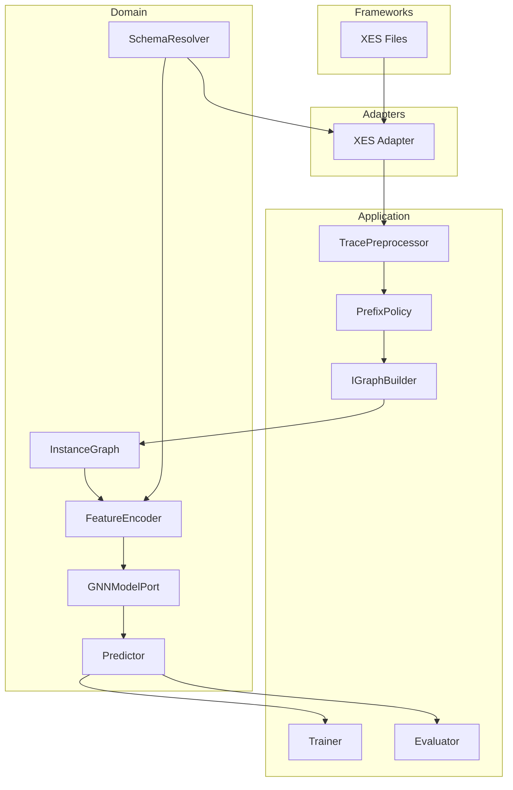
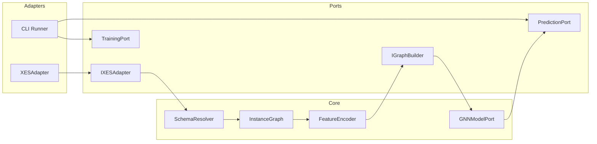
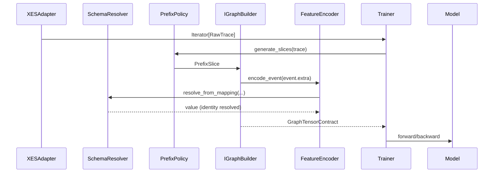
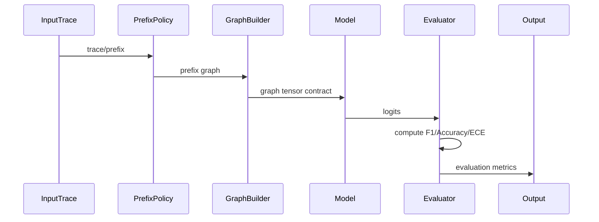
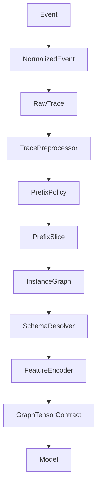

# ARCHITECTURE_MVP1.MD

## 1. Scope
MVP1 is an observed-graph baseline for next-activity prediction with explicit train/eval orchestration.

Included:
- streaming XES ingestion;
- canonical schema lookup via `SchemaResolver`;
- prefix slicing and graph tensor construction;
- execution modes: `train`, `eval_cross_dataset`, `eval_drift`.

Excluded from MVP1 runtime:
- semantic value normalization (`SemanticMapper` is planned);
- dynamic structural enrichment (EOPKG builder is planned);
- trust-control chain components (reserved for MVP2+).

---

## 2. Clean Architecture (Layered View)

```mermaid
flowchart TB
    subgraph Frameworks
        XES[XES Files]
    end

    subgraph Adapters
        XESAdapter[XES Adapter]
    end

    subgraph Application
        TracePreprocessor[TracePreprocessor]
        PrefixPolicy[PrefixPolicy]
        GraphBuilder[IGraphBuilder]
        Trainer[Trainer]
        Evaluator[Evaluator]
    end

    subgraph Domain
        SchemaResolver[SchemaResolver]
        InstanceGraph[InstanceGraph]
        FeatureEncoder[FeatureEncoder]
        GNNModel[GNNModelPort]
        Predictor[Predictor]
    end

    XES --> XESAdapter
    XESAdapter --> TracePreprocessor
    TracePreprocessor --> PrefixPolicy
    PrefixPolicy --> GraphBuilder
    GraphBuilder --> InstanceGraph
    InstanceGraph --> FeatureEncoder
    FeatureEncoder --> GNNModel
    SchemaResolver --> XESAdapter
    SchemaResolver --> FeatureEncoder
    GNNModel --> Predictor
    Predictor --> Trainer
    Predictor --> Evaluator
```

### Пояснення шарів
Frameworks — зовнішні джерела (`XES`).  
Adapters — приведення даних до канонічних DTO (`EventRecord`, `RawTrace`).  
Application — orchestration логіки експерименту (`ModelTrainer.run()` dispatch).  
Domain — математичне ядро (schema resolution, feature encoding, graph tensor path, GNN forward).

Інваріант залежностей:
\[
\text{Domain} \leftarrow \text{Application} \leftarrow \text{Adapters}
\]

---

## 3. Component Architecture (Hexagonal View)

```mermaid
flowchart LR
    subgraph Core
        Resolver[SchemaResolver]
        Graph[InstanceGraph]
        Encoder[FeatureEncoder]
        Model[GNNModelPort]
    end

    subgraph Ports
        DataPort[IXESAdapter]
        TrainPort[TrainingPort]
        PredictPort[PredictionPort]
        GraphPort[IGraphBuilder]
    end

    subgraph Adapters
        XESAdapter[XESAdapter]
        CLIAdapter[CLI Runner]
    end

    XESAdapter --> DataPort
    CLIAdapter --> TrainPort
    CLIAdapter --> PredictPort

    DataPort --> Resolver
    Resolver --> Graph
    Graph --> Encoder
    Encoder --> GraphPort
    GraphPort --> Model
    Model --> PredictPort
```

### Пояснення
Core — ізольований обчислювальний центр MVP1.  
Ports — абстракції для data/train/predict/graph контурів.  
Adapters — concrete інтеграції (`XES`, CLI).

---

## 4. Data Flow (Use Case Scenarios)

## 4.1 Training Flow

```mermaid
sequenceDiagram
    participant XES as XESAdapter
    participant SR as SchemaResolver
    participant PP as PrefixPolicy
    participant GB as IGraphBuilder
    participant FE as FeatureEncoder
    participant TR as Trainer
    participant M as Model

    XES->>TR: Iterator[RawTrace]
    TR->>PP: generate_slices(trace)
    PP->>GB: PrefixSlice
    GB->>FE: encode_event(event.extra)
    FE->>SR: resolve_from_mapping(...)
    SR-->>FE: value (identity resolved)
    GB-->>TR: GraphTensorContract
    TR->>M: forward/backward
```

## 4.2 Eval Cross Dataset Flow

```mermaid
sequenceDiagram
    participant InputTrace
    participant PrefixPolicy
    participant GraphBuilder
    participant Model
    participant Evaluator

    InputTrace->>PrefixPolicy: trace/prefix
    PrefixPolicy->>GraphBuilder: prefix graph
    GraphBuilder->>Model: graph tensor contract
    Model->>Evaluator: logits
    Evaluator->>Evaluator: compute F1/Accuracy/ECE
    Evaluator->>Output: evaluation metrics
```

## 4.3 End-to-End Pipeline

```mermaid
flowchart TD
    Event --> NormalizedEvent
    NormalizedEvent --> RawTrace
    RawTrace --> TracePreprocessor
    TracePreprocessor --> PrefixPolicy
    PrefixPolicy --> PrefixSlice
    PrefixSlice --> InstanceGraph
    InstanceGraph --> SchemaResolver
    SchemaResolver --> FeatureEncoder
    FeatureEncoder --> GraphTensorContract
    GraphTensorContract --> Model
```

---

## 5. Trainer.run() as Orchestrator

`ModelTrainer.run()` is a dispatcher for scenario-specific pipelines:
- `_run_train_pipeline`;
- `_run_eval_cross_dataset`;
- `_run_eval_drift`.

For drift evaluation, ordering is fixed:
\[
\text{chronological sort} \rightarrow \text{window generation} \rightarrow \text{evaluate} \rightarrow \text{log}
\]

---

## 6. Extension Points
1. `SchemaResolver.resolve_value` — MVP1 identity, MVP2 hook for `SemanticMapper`.
2. `IGraphBuilder` / `GraphBuilderBase` — MVP1 baseline graph path, MVP2 hook for dynamic structural builder.
