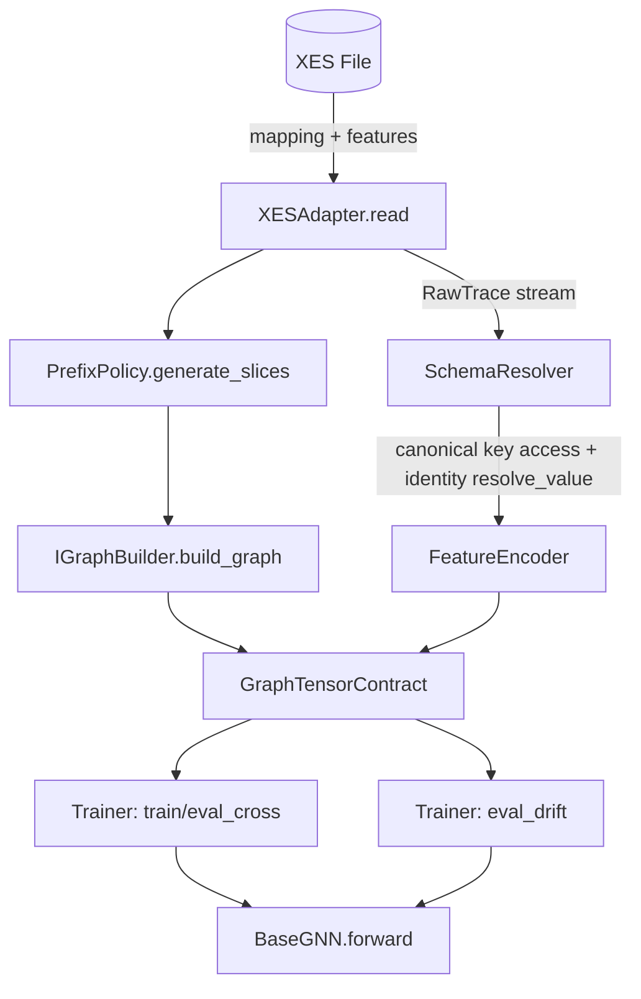

# DATA_FLOWS_MVP1.MD

**Project:** bpm_prediction  
**Scope:** MVP1 (Observed-Graph Baseline)  
**Purpose:** Canonical service contracts and execution flows for training/evaluation without semantic normalization.

---

## 1. Data Flow Architecture



### Архітектурний інваріант
`SchemaResolver` є єдиним механізмом lookup-порядку для `name/source_key/fallback_keys`. У MVP1 метод `resolve_value` є identity-функцією:  
\[
\operatorname{resolve\_value}(cfg, v)=v
\]

---

## 2. Service Contracts

### 2.1 Ingestion

```python
class IXESAdapter(Protocol):
    def read(self, file_path: str, mapping_config: Dict[str, Any]) -> Iterator[RawTrace]:
        ...
```

- Потокове читання XES.
- Формування `EventRecord`/`RawTrace`.
- Передача `event.extra` та `trace_attributes` без semantic rewriting.

### 2.2 Canonical Schema Resolution

```python
@dataclass(frozen=True)
class SchemaResolver:
    fallback_keys: tuple[str, ...] = ()

    def resolve_keys(self, cfg: FeatureConfig) -> list[str]: ...
    def resolve_from_mapping(self, cfg: FeatureConfig, payload: Mapping[str, Any], default: Any = None) -> Any: ...
    def resolve_value(self, cfg: FeatureConfig, raw_value: Any) -> Any: ...
```

- `resolve_from_mapping` забезпечує однаковий lookup у `XESAdapter` та `FeatureEncoder`.
- `resolve_value` у MVP1 не виконує нормалізацію синонімів або мовних варіантів.

### 2.3 Prefix & Graph

```python
class IPrefixPolicy(Protocol):
    def generate_slices(self, trace: RawTrace, **kwargs) -> List[PrefixSlice]: ...

class IGraphBuilder(Protocol):
    def build_graph(self, prefix: PrefixSlice) -> GraphTensorContract: ...
```

- `IPrefixPolicy` гарантує anti-leakage інваріант префіксів.
- `IGraphBuilder` повертає контракт із розділеними тензорами категоріальних/числових ознак.

### 2.4 Feature Encoding

```python
class FeatureEncoder:
    def encode_event(self, *, event_extra: Dict[str, Any]) -> EncodedNodeFeatures: ...
```

- Lookup ознак тільки через `SchemaResolver`.
- Політики (`zscore_clip`, `time2vec.work_hours`, `activity_fallback_feature`) читаються з конфігу.

---

## 3. Pipeline Lifecycles

## 3.1 Training / Eval Cross Dataset

1. `XESAdapter.read()` -> `RawTrace`.
2. Строгий temporal split на рівні трас.
3. `PrefixPolicy.generate_slices()` для кожної траси.
4. `IGraphBuilder.build_graph()` -> `GraphTensorContract`.
5. `ModelTrainer.run()` маршрутизує у train або eval_cross.
6. `BaseGNN.forward()` над батчами графів.

## 3.2 Eval Drift (Critical Path)

Критичний шлях фіксується в такому порядку (без перестановок):

1. **Chronological sort** трас за `start_ts` (час першої події).  
2. **Generate windows** за параметрами `window_size`, `window_stride` / `window_overlap`.  
3. **Evaluate window**: побудова loader -> inference -> метрики (`macro_f1`, `ece`).  
4. **Log window metadata**: `window_index`, `window_start_trace`, `window_end_trace`, `window_start_ts`, `window_end_ts`.

Формально для впорядкованої послідовності трас \(\mathcal{T}=\{\tau_i\}_{i=1}^{N}\):
\[
\tau_i \preceq \tau_j \iff t_{start}(\tau_i) \le t_{start}(\tau_j), \quad i < j
\]
Вікно \(W_k\) будується як
\[
W_k = \mathcal{T}[s_k : s_k + w), \quad s_{k+1}=s_k+\Delta
\]
де \(w\) — розмір вікна, \(\Delta\) — крок (stride).

## 3.3 MVP2 Extension Boundary (Informative)

- Семантичне value-mapping (синоніми, мультимовність) **не входить** у MVP1.
- Підключення `SemanticMapper` заплановано як розширення `SchemaResolver.resolve_value`.
