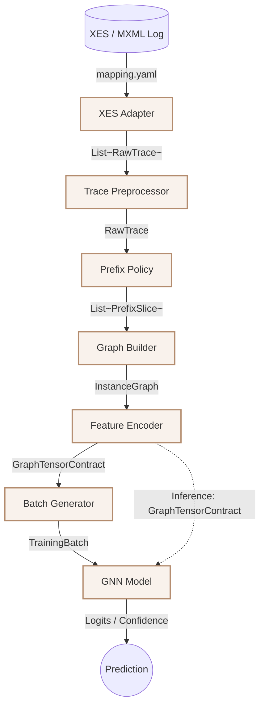

# DATA_FLOWS_MVP1.MD

**Project:** bpm_prediction  
**Scope:** MVP1 (G_obs only)  
**Purpose:** Definition of service contracts (interfaces) and data transformation flows.

---

## 1. Data Flow Architecture

Діаграма відображає конвеєр перетворення даних. Прямокутники — це Сервіси (Services/Use Cases), стрілки — це DTO (Data Transfer Objects) з `DATA_MODEL_MVP1.MD`.



---

## 2. Service Contracts (Python Protocols)

Цей розділ фіксує жорсткі контракти (Signatures) для кожного сервісу. Усі реалізації повинні слідувати принципу підстановки Лісков (Liskov Substitution Principle).

### 2.1 Ingestion & Preprocessing

**XESAdapter** Відповідає за парсинг сирого логу з урахуванням `mapping.yaml` та розрахунок базових ознак (duration, time_since_previous).
```python
from typing import Protocol, Iterator, Dict, Any
from src.domain.entities.raw_trace import RawTrace

class IXESAdapter(Protocol):
    def read(self, file_path: str, mapping_config: Dict[str, Any]) -> Iterator[RawTrace]:
        """
        Потокове читання XES файлу. 
        Повертає Iterator (генератор) для запобігання переповненню пам'яті (OOM).
        Матеріалізація в List, якщо потрібно, робиться на рівні Use Case.
        """
        ...
```

**TracePreprocessor** Відповідає за очищення від шуму. У MVP1 може бути Identity-функцією (нічого не змінює), у MVP2 — видалятиме технічні події.
```python
class ITracePreprocessor(Protocol):
    def process(self, raw_traces: Iterator[RawTrace]) -> List[RawTrace]: # Або EventLogBatch
        """Виконує глобальне очищення логу та формує фінальний батч для нарізки."""
        ...
```

### 2.2 Prefix Generation & Forgetting Mechanics

**PrefixPolicy** Відповідає за нарізку траси (Full, Fixed Length, Sliding Window) та механіки забування старих подій.
**Anti-Leakage Invariant:** Жоден згенерований `PrefixSlice` не може містити подій, індекс яких $\ge$ індексу цільової події ($y$).
```python
class IPrefixPolicy(Protocol):
    def generate_slices(self, trace: RawTrace, **kwargs) -> List[PrefixSlice]:
        """Генерує множину префіксів з однієї траси згідно зі стратегією."""
        ...
```

### 2.3 Graph Engineering

**GraphBuilder** Трансформує плоский список подій у топологію графа (додає ребра). У MVP1 формує лише `sequential_relation`.
```python
class IGraphBuilder(Protocol):
    def build(self, prefix: PrefixSlice) -> InstanceGraph:
        """Конвертує DTO подій у структурний граф G_obs."""
        ...
```

**FeatureEncoder** Перетворює доменні типи (Datetime, String) у числові тензори. Відповідає за One-Hot кодування `activity_id` та векторизацію часу (Time2Vec/Standardization).
```python
class IFeatureEncoder(Protocol):
    def encode(self, graph: InstanceGraph, vocab: dict) -> GraphTensorContract:
        """Генерує тензори x, edge_index, y для PyTorch Geometric."""
        ...
```

### 2.4 ML Operations

**GNNModelPort** Інтерфейс взаємодії з моделлю. Захищає бізнес-логіку від прив'язки до конкретної архітектури нейромережі.
```python
class IGNNModelPort(Protocol):
    def forward(self, batch: TrainingBatch) -> Tensor:
        """Приймає батч графів, повертає логіти для наступної активності."""
        ...
```

---

## 3. Pipeline Lifecycles (Use Cases)

### 3.1 Training Pipeline
Послідовність викликів при запуску експерименту:
1. `IXESAdapter` завантажує весь датасет $\to$ `List[RawTrace]`.
2. Застосовується спліт (Train/Val/Test) на рівні `RawTrace`.
3. Для кожної траси у Train:
   - `ITracePreprocessor` $\to$ чистить.
   - `IPrefixPolicy` $\to$ генерує `List[PrefixSlice]`.
   - `IGraphBuilder` $\to$ конвертує у `InstanceGraph`.
   - `IFeatureEncoder` $\to$ створює `GraphTensorContract`.
4. PyG DataLoader групує контракти у `TrainingBatch`.
5. `IGNNModelPort.forward()` + Backpropagation.

### 3.2 Inference Pipeline
Послідовність викликів під час передбачення у реальному часі:
1. Зовнішня система надсилає `PredictionRequest` (містить готовий `PrefixSlice` та $\kappa$).
2. `IGraphBuilder` $\to$ `InstanceGraph`.
3. `IFeatureEncoder` $\to$ `GraphTensorContract`.
4. `IGNNModelPort.forward()` (в режимі `eval()`, без бекпропагації) $\to$ логіти.
5. Розподіл `softmax` та вибір активності з найбільшим `confidence_score`.

### 3.3 Future Extension (MVP2+)

- Додати ReliabilitySemaphore → повертає (s_micro, s_macro, P_diag, M_gap)
- Додати динамічний β в loss: loss = L_task + β(t) * L_reg
- Додати PrioritizedExperienceReplay для фонового донавчання
- Forward повертає не тільки ŷ, а й O = (ŷ, Trust Score)