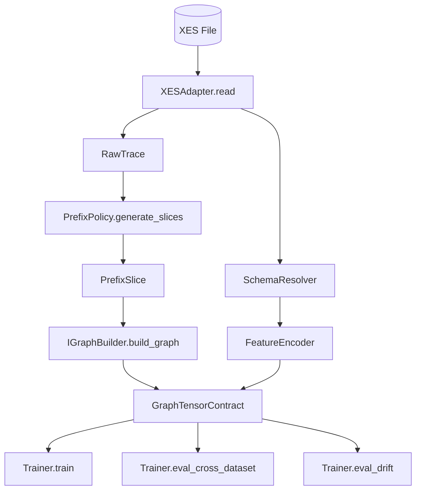
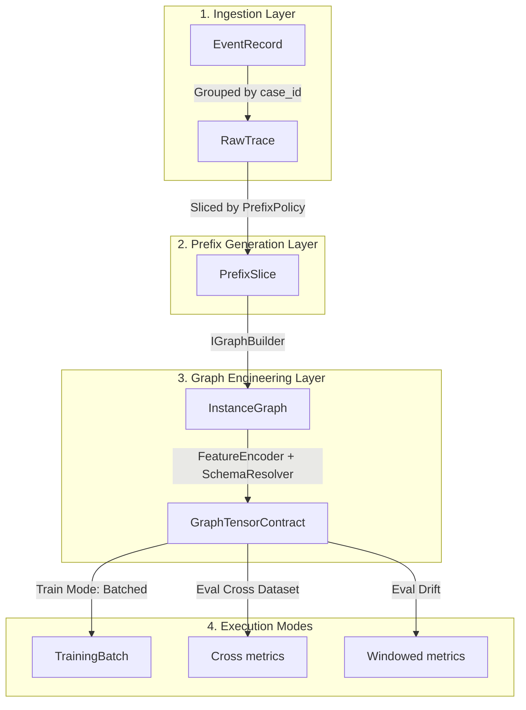

# DATA_FLOWS_MVP1.MD

**Project:** bpm_prediction  
**Scope:** MVP1 (Observed-Graph Baseline)  
**Purpose:** Canonical service contracts and lifecycle flows for data transformation.

---

## 1. Data Flow Architecture



---

## 2. Data Flow Overview (Lifecycle)

Ця діаграма відображає динамічний життєвий цикл об'єктів від сирих логів до тензорів моделі залежно від режиму виконання.

> Деталізація портів/контрактів наведена нижче в розділах 3-4.



---

## 3. Service Contracts (Essential)

### 3.1 Ingestion
```python
class IXESAdapter(Protocol):
    def read(self, file_path: str, mapping_config: Dict[str, Any]) -> Iterator[RawTrace]: ...
```

### 3.2 Schema Resolution
```python
@dataclass(frozen=True)
class SchemaResolver:
    def resolve_from_mapping(self, cfg: FeatureConfig, payload: Mapping[str, Any], default: Any = None) -> Any: ...
    def resolve_value(self, cfg: FeatureConfig, raw_value: Any) -> Any: ...
```

MVP1 invariant:
\[
\operatorname{resolve\_value}(cfg,v)=v
\]

### 3.3 Prefix/Graph
```python
class IPrefixPolicy(Protocol):
    def generate_slices(self, trace: RawTrace, **kwargs) -> List[PrefixSlice]: ...

class IGraphBuilder(Protocol):
    def build_graph(self, prefix: PrefixSlice) -> GraphTensorContract: ...
```

---

## 4. Eval Drift Critical Path

Critical order is fixed:
1. chronological sort;
2. window generation (`window_size`, `window_stride`/`window_overlap`);
3. per-window evaluation;
4. per-window logging.


Formalization:
\[
W_k = \mathcal{T}[s_k:s_k+w),\quad s_{k+1}=s_k+\Delta
\]

---

## 5. MVP2 Extension Boundary
- semantic mapping is excluded from MVP1 runtime;
- dynamic structural graph enrichment is excluded from MVP1 runtime.
