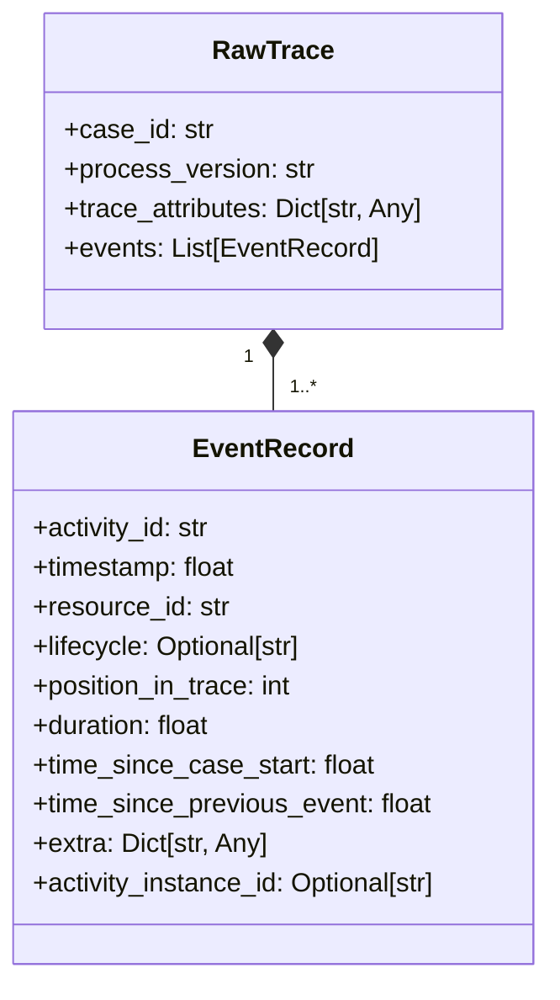
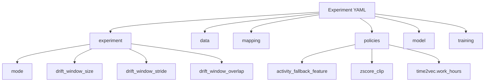
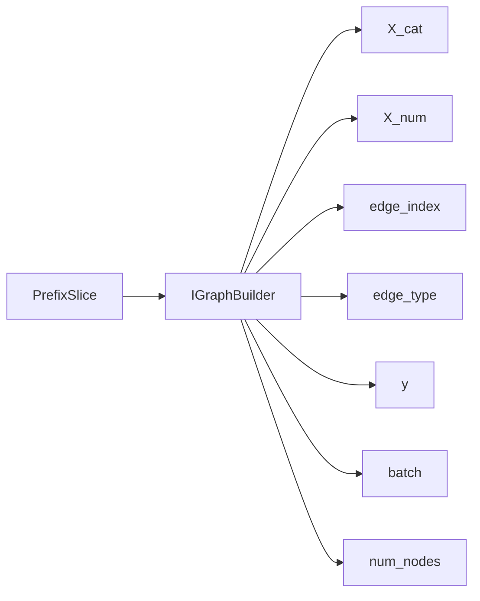
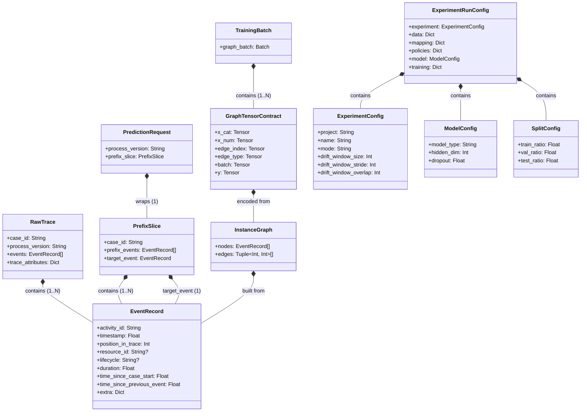

# DATA_MODEL_MVP1.MD

## 0. Canon & Naming Rules
- Scope: MVP1 observed-graph baseline.
- Domain DTO must be infrastructure-agnostic.
- Symbolic notation follows `VARIABLES.MD`.

---

## 1. External Boundary Objects (Adapters Layer)

### 1.1 EventRecord
```python
class EventRecord(BaseModel):
    activity_id: str
    timestamp: float
    resource_id: str
    lifecycle: Optional[str]
    position_in_trace: int
    duration: float
    time_since_case_start: float
    time_since_previous_event: float
    extra: Dict[str, Any]
    activity_instance_id: Optional[str]
```

### 1.2 RawTrace
```python
class RawTrace(BaseModel):
    case_id: str
    process_version: str
    events: List[EventRecord]
    trace_attributes: Dict[str, Any]
```

### 1.3 Boundary DTO composition (cascade)


---

## 2. Experiment Configuration Schema (Application Layer)

### 2.1 Canonical run config (MVP1)

```yaml
experiment:
  project: "bpm_prediction_mvp1"
  name: "MVP1_Baseline"
  mode: "train" # train | eval_cross_dataset | eval_drift
  drift_window_size: 500
  drift_window_stride: 0
  drift_window_overlap: 0

data:
  log_path: ".../log.xes"
  fraction: 1.0
  split_strategy: "time"
  split_ratio: [0.7, 0.2, 0.1]

mapping:
  xes_adapter:
    case_id_key: "concept:name"
    activity_key: "concept:name"
    timestamp_key: "time:timestamp"
    resource_key: "org:resource"
    lifecycle_key: "lifecycle:transition"
    version_key: "concept:version"
  features: []

policies:
  profile: "mvp1_default"
  activity_fallback_feature: "concept:name"
  zscore_clip:
    enabled: true
    min: -3.0
    max: 3.0
  time2vec:
    work_hours:
      timezone: "UTC"
      working_days: [0, 1, 2, 3, 4]
      start_hour: 9
      end_hour: 18

model:
  type: "BaselineGATv2"
  hidden_dim: 64
  dropout: 0.2
  pooling_strategy: "global_mean"

training:
  batch_size: 128
  epochs: 30
  learning_rate: 0.001
  patience: 10
  delta: 1e-4
  device: "cpu"
```

### 2.2 Config cascade structure


### 2.3 Drift window policy constraints
Let \(w\) be window size, \(\Delta\) stride, \(o\) overlap.
\[
w > 0,
\quad
\Delta > 0 \;\text{or}\; \Delta = w-o,
\quad
0 \le o < w
\]

---

## 3. Schema Resolution DTO (Domain Service Contract)

```python
@dataclass(frozen=True)
class SchemaResolver:
    fallback_keys: tuple[str, ...] = ()

    def resolve_keys(self, cfg: FeatureConfig) -> list[str]: ...
    def resolve_from_mapping(self, cfg: FeatureConfig, payload: Mapping[str, Any], default: Any = None) -> Any: ...
    def resolve_value(self, cfg: FeatureConfig, raw_value: Any) -> Any: ...
```

### MVP1 invariant
\[
\forall v:\; \operatorname{resolve\_value}(cfg, v) = v
\]
No semantic synonym normalization is allowed in MVP1.

---

## 4. Prefix & Graph DTO (Application/Domain Boundary)

### 4.1 PrefixSlice
```python
class PrefixSlice(BaseModel):
    case_id: str
    prefix_events: List[EventRecord]
    target_event: EventRecord
```

### 4.2 GraphTensorContract
```python
class GraphTensorContract(TypedDict):
    x_cat: torch.LongTensor      # X_cat \in \mathbb{N}^{N \times F_cat}
    x_num: torch.FloatTensor     # X_num \in \mathbb{R}^{N \times F_num}
    edge_index: torch.LongTensor # edge_index \in \mathbb{N}^{2 \times E}
    edge_type: torch.LongTensor  # edge_type \in \mathbb{N}^{E}
    y: torch.LongTensor          # y \in \mathbb{N}^{1}
    batch: torch.LongTensor      # batch \in \mathbb{N}^{N}
    num_nodes: int               # N
```

### 4.3 Graph tensor attribute cascade


### 4.4 Tensor shape invariants
For one graph sample:
\[
X_{cat} \in \mathbb{N}^{N \times F_{cat}},
\quad
X_{num} \in \mathbb{R}^{N \times F_{num}},
\quad
A \equiv edge\_index \in \mathbb{N}^{2 \times E}
\]

a target label:
\[
y \in \{0,\dots,C-1\}
\]

---

## 5. Model Interface DTO

```python
class IGNNModelPort(Protocol):
    def forward(self, data: GraphTensorContract) -> torch.Tensor: ...
```

Output logits shape:
\[
\hat{Y} \in \mathbb{R}^{B \times C}
\]
where \(B\) is batch size and \(C\) is number of activity classes.

    def resolve_keys(self, cfg: FeatureConfig) -> list[str]: ...
    def resolve_from_mapping(self, cfg: FeatureConfig, payload: Mapping[str, Any], default: Any = None) -> Any: ...
    def resolve_value(self, cfg: FeatureConfig, raw_value: Any) -> Any: ...
```

## 6. MVP2 Reserved Placeholders (Inactive in MVP1)
- SemanticMapper (for multilingual/synonym value normalization).
- DynamicStructuralGraphBuilder (EOPKG-aware graph enrichment).
- Reliability/Critic components.


## 10. Object Composition Schema (Що є частиною чого)

Діаграма відображає структурну залежність (композицію) об'єктів моделі даних.


