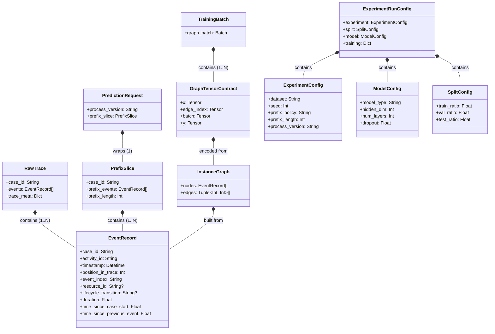
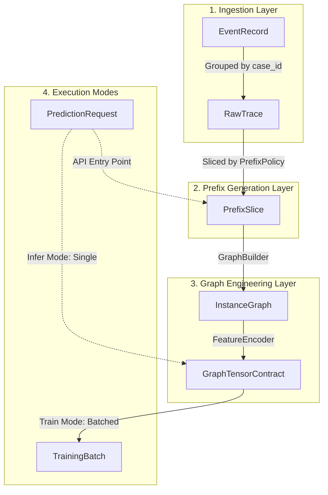
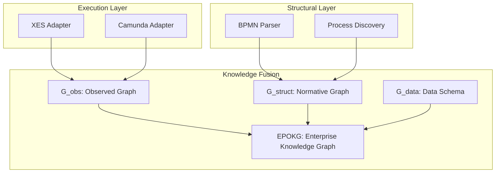

# DATA_MODEL_MVP1.MD

**Project:** bpm_prediction  
**Scope:** MVP1 (G_obs only)  
**Purpose:** Formal data model specification for implementation and strict layer boundaries.

---

## 0. Canon & Naming Rules
- Усі змінні використовують `snake_case`.
- Канонічні назви строго відповідають `VARIABLES.MD`.
- MVP1 оперує виключно `observed_graph` ($G_{obs}$).

> **Архітектурний коментар:** Ці правила діють наскрізно через усі шари системи.

---

## 1. Attribute Tiering (Класифікація атрибутів)

### 1.1 Fundamental (System Core)
Критичні ідентифікатори та поля впорядкування.
- `case_id` — ID траси/кейсу (мапиться з XES через YAML-конфіг).
- `activity_id` — назва/код активності.
- `timestamp` — час події.
- `position_in_trace` — позиція події у трасі (0-indexed, обчислюється).
- `event_index` — стабільний детермінований хеш події.

**Invariant:** Без цих полів побудова графа неможлива. Адаптер генерує виняток.

### 1.2 Base & Research (Standard BPM + Derived)
Метрики виконання та похідні часові ознаки.
- `process_version` (κ) — мітка версії процесу.
- `case_type` — бізнес-варіант процесу.
- `resource_id` — виконавець події.
- `lifecycle_transition` — статус (`start`, `complete`).
- `duration` — тривалість активності (float).
- `time_since_case_start` — час від початку кейсу.
- `time_since_previous_event` — час від попередньої події.

**Invariant:** Base фічі не можуть порушувати Anti-Leakage Rule. Відсутні значення = `null` або `0.0`.

### 1.3 Custom (Disabled in MVP1)
Доменні специфічні поля. У MVP1 існують лише як пасивні метадані.

### 1.4 Anti-Leakage Rule
Ознака $f(t)$ має бути доступною на момент події $t$. Агрегати, що заглядають у майбутнє, суворо заборонені у всіх шарах.

---

## 2. Identification & Hierarchy

### 2.1 IDs in MVP1
- `case_id` (Trace ID)
- `event_id` (deterministic hash: `hash(case_id, position_in_trace, activity_id, timestamp)`)
- `activity_id` (Activity template ID)

---

## 3. External Boundary Objects (Adapters Layer)

> **Архітектурний коментар:** Об'єкти цього розділу існують виключно на етапі Data Ingestion. Domain Core про них нічого не знає.

### 3.0 Adapter Configuration (Mapping Contract)
Зовнішній конфігураційний файл, який керує мапінгом сирих XES-полів у канонічні для [EventRecord](#31-eventrecord).

**Приклад `mapping_xes.yaml`:**
```yaml
dataset_name: "bpi_challenge_2015"
trace_level:
  case_id_key: "case:concept:name"
  version_key: "case:municipality"    # Мапиться у process_version (κ)
event_level:
  activity_key: "concept:name"
  timestamp_key: "time:timestamp"
  resource_key: "org:resource"
  lifecycle_key: "lifecycle:transition"
```

### 3.1 EventRecord
Нормалізована подія з XES після мапінгу та розрахунку похідних ознак.  
**Fields:** Включає всі поля з 1.1 та 1.2.

### 3.2 RawTrace
Впорядкований список подій одного кейсу.  
**Fields:**
- `case_id`: string
- `events`: List[[EventRecord](#31-eventrecord)]
- `trace_meta`: Dict (містить `process_version`, `case_type`)

**Invariant:** Події відсортовані за `timestamp`.

---

## 4. Experiment-Level Objects (Application Layer)

> **Архітектурний коментар:** Ці конфіги ініціалізують пайплайн навчання та тестування.

### 4.0 Training & Evaluation Configuration
Єдиний конфіг для запуску експериментів, який об'єднує [ExperimentConfig](#41-experimentconfig), [ModelConfig](#42-modelconfig) та [SplitConfig](#43-splitconfig).

**Приклад `experiment_run.yaml`:**
```yaml
experiment:
  name: "baseline_gnn_bpic2015"
  dataset_name: "bpi_challenge_2015"
  seed: 42
  prefix_policy: "fixed_length"
  prefix_length: 5
  process_version: "kappa_1"
split:
  train_ratio: 0.7
  val_ratio: 0.15
  test_ratio: 0.15
model:
  model_type: "agent_critic_dual"
  hidden_dim: 64
  num_layers: 3
  dropout: 0.2
training:
  batch_size: 128
  learning_rate: 0.001
  epochs: 50
```

### 4.1 ExperimentConfig
**Fields:** `dataset`, `seed`, `prefix_policy`, `prefix_length`, `process_version` (κ).

### 4.2 ModelConfig
**Fields:** `model_type`, `hidden_dim`, `num_layers`, `dropout`.

### 4.3 SplitConfig
**Fields:** `train_ratio`, `val_ratio`, `test_ratio`.  
**Invariant:** Split виконується строго на рівні [RawTrace](#32-rawtrace) (по `case_id`), щоб уникнути витоку даних.

---

## 5. Application DTO (Application Layer)

> **Архітектурний коментар:** Транзитні об'єкти для обміну між генератором префіксів, білдером графів та тренером.

### 5.1 PrefixSlice
Нарізаний префікс однієї траси.  
**Fields:**
- `case_id`: string
- `prefix_events`: List[[EventRecord](#31-eventrecord)]
- `prefix_length`: int

### 5.2 PredictionRequest
Стандартизований запит на інференс.  
**Fields:**
- `process_version`: string (κ)
- `prefix_slice`: [PrefixSlice](#51-prefixslice)

### 5.3 TrainingBatch
Батч для навчання.  
**Fields:**
- `graph_batch`: PyTorch Geometric `Batch` (містить набір [GraphTensorContract](#62-graphtensorcontract)).

---

## 6. Domain Core Objects (Domain Layer)

> **Архітектурний коментар:** Математичне ядро. Повна ізоляція від XES/Pandas. Оперує лише тензорами.

### 6.1 InstanceGraph (observed_graph, $G_{obs}$)
Графове подання виконаного префікса.  
**Nodes:**  
- `activity_id` (categorical)  
- `timestamp` (Unix epoch float — вже нормалізовано в адаптері)  
- `resource_id`  
- `duration`  
- `position_in_trace`  
- `time_since_case_start`  
- `time_since_previous_event`

**Edges:** Лише `sequential_relation`.

### 6.2 GraphTensorContract
Строгий тензорний контракт для `forward()`.  
**Required tensors:**
- `x` (`node_features`): `[num_nodes, node_dim]`, float32
- `edge_index`: `[2, num_edges]`, int64
- `batch`: `[num_nodes]`, int64
- `y`: `[batch_size]`, int64 (клас цільової активності)

**Invariant:** Логіка формування `x` є ідентичною для train та inference.

---

## 7. Modeling & Inference Objects (Domain Layer)

### 7.1 GNNModel (GNNModelPort)
**Input:** [TrainingBatch](#53-trainingbatch)  
**Output:** `logits`

### 7.2 FusionOperator (Γ)
**Input:** `prefix_embedding` + `context_embedding`  
**Output:** `fused_representation`

### 7.3 ContextEmbedding
Ембеддінг `process_version` (κ).

### 7.4 ReliabilityModule
**Output:** `confidence_score = max(softmax(logits))`

---

## 8. Training Objects (Application Layer)

### 8.1 LossBundle
У MVP1: лише `prediction_loss` (CrossEntropy).

### 8.2 MetricBundle
**Required:** `accuracy`, `precision`, `recall`, `f1_score`, `train_loss`, `validation_loss`.

---

## 9. Planned Placeholders (Inactive in MVP1)
Зарезервовані сутності для MVP2/MVP3: `structural_mask`, `critic_loss`, `drift_signal`, `macro_stability_state`, `version_transition_operator`.

---

## 10. Object Composition Schema (Що є частиною чого)

Діаграма відображає структурну залежність (композицію) об'єктів моделі даних.



---

## 11. Data Flow Overview (Lifecycle)

Ця діаграма відображає динамічний життєвий цикл об'єктів від сирих логів до тензорів моделі залежно від режиму виконання.

> **Важливо:** Детальний опис потоків даних, трансформацій DTO та процесів інференсу/навчання розглядається в окремому документі: `DATA_FLOWS_MVP1.MD`.



---
## 12. Target Enterprise Architecture (Vision for MVP2+)

> **Note:** Цей розділ описує цільовий стан (Post-MVP1) і НЕ реалізується в межах MVP1.

Система інтегруватиме лог виконання ($G_{obs}$), BPMN-структуру ($G_{struct}$) та схему даних ($G_{data}$) у єдиний нормативний простір (EPOKG).



---

