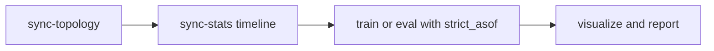

# BPM Prediction Platform (Scientific Core)

**bpm_prediction** — це науково-дослідницька платформа для прогнозування поведінки бізнес-процесів (наступна активність, час виконання, результат, аномалії) з використанням Графових Нейронних Мереж (GNN).

Проєкт реалізує новітню концепцію **Fusion Graph** — механізму динамічного збагачення фактичного стану процесу (Instance Graph) нормативним та організаційним контекстом, формалізованим у **EPOKG (Enterprise Process-Organizational Knowledge Graph)**.

Це дозволяє моделям враховувати не лише лінійну історію подій, а й багатовимірні зв'язки та обмеження, закладені в архітектуру підприємства, що є критичним для прогнозування складних, багатоверсійних процесів.

---

## 📚 Зміст Документації

### 1) Governance / Canon
- **[README.MD](./README.MD)** — головна точка входу, контекст дослідження, поточні правила.
- **[Глосарій (GLOSSARY.MD)](docs/GLOSSARY.MD)** — терміни предметної області.
- **[Змінні (VARIABLES.MD)](docs/VARIABLES.MD)** — канон позначень і змінних з математичної моделі.

### 2) Architecture / HLD
- **[ARCHITECTURE_GUIDELINES.MD](docs/ARCHITECTURE_GUIDELINES.MD)** — нормативи та обов'язкові принципи.
- **[TARGET_ARCHITECTURE.MD](docs/TARGET_ARCHITECTURE.MD)** — цільова архітектура в режимі `ENTERPRISE_POC`.
- **[ARCHITECTURE_RULES.MD](docs/ARCHITECTURE_RULES.MD)** — формалізовані правила Clean + Hexagonal та dependency boundaries.

### 3) Data specifications
- **[ARCHITECTURE_MVP1.MD](docs/ARCHITECTURE_MVP1.MD)** — цільова архітектура в режимі `ENTERPRISE_POC`.
- **[DATA_MODEL_MVP1.MD](docs/DATA_MODEL_MVP1.MD)** — опис моделі даних та їх труктурні залежності.
- **[DATA_FLOWS_MVP1.MD](docs/DATA_FLOWS_MVP1.MD)** — контракти функції, та флоу даних.
- **[ADAPTER_XES.MD](docs/ADAPTER_XES.MD)** — специфікація XES-адаптера.* 
- **[ADAPTER_CAMUNDA_SQL.MD](docs/ADAPTER_CAMUNDA_SQL.MD)** — специфікація адаптера Camunda7 MSSQL.

### 4) Algorithm / Validation
- **[LLD_MVP1.MD](docs/LLD_MVP1.MD)** — low-level design (алгоритмічні деталі, каркас) *(draft).* 
- **[EVF_MVP1.MD](docs/EVF_MVP1.MD)** — experimentation & validation framework (каркас) *(draft).* 

### 5) Legacy reference
- **[etalon/README.md](./etalon/README.md)** — попередня реалізація (legacy baseline), використовується як референс.


### `etalon/` — попередня реалізація (reference baseline)
- `etalon/` зафіксований як **попередня (legacy) реалізація**, яку використовуємо як референс.
- Реалізація була зосереджена на інтеграції з **Camunda BPMN/BPMS**, отриманні даних про документи з BPMS та експериментах, зокрема тестуванні на **довжину префікса**.
- Має **одношарову архітектуру у форматі script-pipeline**, що вважається архітектурно некоректним для цільового стану (обмежена ізоляція відповідальностей).
- Водночас підтримує **довільний процес** та **універсальний вхід для GNN**, тому залишається корисним baseline для порівняння й міграції.
- Подальше використання `etalon/` виконується лише з урахуванням поточних викликів і затверджених архітектурних принципів проєкту.

## 1. Проблематика та наукові GAPs (Бекграунд дослідження)
Проєкт реалізує методологію, спрямовану на подолання фундаментальних обмежень сучасних систем предиктивного моніторингу бізнес-процесів (PPM), ідентифікованих у межах дисертаційного дослідження:
* **Базовий документ дослідження:** **[Дисертація Коротенко.docx](docs/Дисертація Коротенко.docx)**.
* **Статус:** це основний документ, який визначає цілі, принципи, гіпотези та пріоритети реалізації проєкту.


### 1.1. Структурна сліпота та втрата контексту (GAP 2.4.1)
* **Проблема:** Традиційні PPM-методи (LSTM, RNN) сприймають процеси як лінійні послідовності («сплющені логи»), ігноруючи топологічну складність регламентів: паралелізм, виключні шлюзи та ієрархічні зв'язки. Це призводить до критичної втрати точності на довгих трасах (Стаття 3).
* **Рішення (Принцип Structural Awareness):** Впровадження динамічного структурного шару **EPOKG (Enterprise Process-Organizational Knowledge Graph)**. GNN-архітектура обробляє процес як багатовімірний граф, інтегруючи фактичні події з нормативною топологією BPMN.

### 1.2. Епістемічна впевненість та структурний дрейф (GAP 2.4.2)
* **Проблема:** ML-моделі схильні до «галюцинацій» та помилкової впевненості при зміні регламентів (Structural Drift). Класичні системи не мають механізму самодіагностики меж власної компетенції в умовах еволюції підприємства.
* **Рішення (Принцип Epistemic Caution):** Розробка **«Семафора надійності» (Reliability Semaphore)** на основі аналізу станів поза розподілом (Out-of-Distribution, OOD). Система використовує метрику відстані Вассерштейна ($\mathcal{W}_1$) для ідентифікації дрейфу та безпечної маршрутизації управління на експерта (Human-in-the-Loop).


### 1.3. «Жадібність» прогнозів та стратегічна цілісність (GAP 2.4.3)
* **Проблема:** Оптимізація локальної точності (наступного кроку) часто суперечить глобальній логіці процесу, що заводить виконання у структурні «глухі кути».
* **Рішення (Принцип Goal-Oriented Execution):** Впровадження **Дуальної архітектури (Агент-Критик)**. Локальний генератор прогнозів (Агент) коригується модулем макро-планування (Критик), що забезпечує відповідність кожного кроку стратегічному регламенту $\kappa$.

### 1.4. Відсутність прозорості та наукової відтворюваності (GAP 2.4.4)
* **Проблема:** Дослідження в галузі PPM часто неможливо відтворити через «зашиті» в код параметри (hardcoded hyperparameters) та відсутність ізольованого аналізу внеску окремих компонентів.
* **Рішення (Config-Driven Experimentation & Ablation Study):**
    * **YAML-центричність:** Усі параметри архітектури (`model.yaml`), ознак (`features.yaml`) та стратегій навчання винесені за межі коду, що гарантує детермінованість експериментів.
    * **Ablation Flags (Прапори абляції):** Система підтримує спеціальні перемикачі (наприклад, `use_epokg: true/false`, `use_critic: true/false`), що дозволяє проводити порівняльні експерименти для доведення наукової новизни (Розділ 4 дисертації) шляхом точної ізоляції впливу кожного модуля методології на фінальний результат.
---

## 2. Наукова Гіпотеза та Стратегічна Візія

Фундаментальна гіпотеза дослідження полягає в тому, що представлення бізнес-процесу у вигляді **Fusion Graph**, який формується шляхом проєкції динаміки виконання **(IG)** на розширений граф знань підприємства **(EPOKG)**, забезпечує алгоритмічну життєздатність (survivability) предиктивної системи в умовах структурного дрейфу.

### Ключові положення гіпотези:
1. **Топологічна стабілізація:** **EPOKG** виступає як стабільний семантичний та регуляторний «якір». Це дозволяє моделі коректно інтерпретувати нові версії процесів ($\kappa \to \kappa+1$), зберігаючи високу точність прогнозування на довгих трасах, де традиційні методи (Logs-only) деградують.
2. **Епістемічний контроль:** Використання метрик позарозподільних станів (OOD) у поєднанні з топологією графа дозволяє системі ідентифікувати межі власної компетенції («Семафор надійності»), мінімізуючи ризик хибних рішень.
3. **Дуальна корекція:** Інтеграція модуля «Критик» (макро-плану) у процес інференсу дозволяє усунути структурні суперечності («глухі кути»), забезпечуючи цілеспрямованість прогнозів.

> **Стратегічний наслідок:** Реалізація методології як **замкненого адаптивного циклу (Closed-loop control)** дозволяє створити самостійну інтелектуальну екосистему. Така система здатна до безперервного навчання (Continual Learning) та функціонування в динамічному Enterprise-середовищі протягом тривалого часу без необхідності ручного перепроектування архітектури при кожній зміні бізнес-регламентів.
---

## 3. Методологічний фундамент

Система базується на чотирьох фундаментальних принципах, що забезпечують алгоритмічну життєздатність (survivability):

1. **Structural Awareness (Принцип структурної обізнаності):** Відмова від "flat logs". Використання `EPOKG` як динамічного обмеження.
2. **Epistemic Caution (Принцип епістемічної обережності):** Механізм самодіагностики меж компетенції через `Reliability Semaphore` та OOD-детекцію.
3. **Continual Adaptation (Принцип безперервної еволюції):** Синхронізація ваг моделі з версійністю регламентів ($\kappa$) через інкрементальне навчання.
4. **Goal-Oriented Execution (Принцип цілеспрямованої дії):** Дуальна архітектура "Агент-Критик" для уникнення структурних "глухих кутів".

---

## 4. Режими роботи системи

Система проєктується як адаптивний регулятор, що функціонує у двох взаємодоповнюючих режимах, забезпечуючи як наукову валідацію, так і промислову стійкість.

### Режим А: Scientific Benchmarking (Лабораторія валідації)
* **Мета:** Проведення порівняльних досліджень та закриття наукових GAPs через верифікацію гіпотез дисертації.
* **Ключовий функціонал (Ablation Study):**
    * **Structural Sensitivity Analysis:** Дослідження впливу технічних вузлів (*Gateways, Events, Pools*) на точність предиктивного графа (Розділ 4.2).
    * **Prefix-Length Resilience Test:** Оцінка деградації прогнозів на довгих трасах (Стаття 3) та підтвердження переваги GNN над RNN/LSTM.
    * **OOD Calibration:** Тестування «Семафора надійності» на синтетичних дрейфах для визначення оптимального порогу епістемічної впевненості ($\beta$).
    * **Порівняння в дуальній архітектурі:** Порівняння «жадібних» прогнозів Агента із суворо обмеженими прогнозами Критика.

### Режим Б: Industrial Operations (Адаптивна експлуатація)
* **Мета:** Забезпечення алгоритмічної життєздатності (survivability) предиктивного сервісу в реальному Enterprise-середовищі.
* **Ключовий функціонал (Closed-loop Control):**
    * **Real-time Fusion Inference:** Безперервне збагачення потоку подій з Camunda актуальною топологією POKG.
    * **Active Epistemic Monitoring:** Робота «Семафора надійності» у режимі реального часу:
        * 🟢 *Green:* Автоматичне виконання прогнозу.
        * 🟡 *Yellow:* Детекція дрейфу, ініціалізація інкрементального донавчання (Continual Learning).
        * 🔴 *Red:* Висока невизначеність, маршрутизація на експерта (Human-in-the-Loop).
    * **Seamless Versioning ($\kappa \to \kappa+1$):** Автоматична адаптація моделі до нових версій процесів через механізм урахування версійного контексту ($\kappa$) без зупинки інференсу.

## 5. Інтегрований життєвий цикл адаптивного управління

Методологія розглядає предиктивну модель не як статичний артефакт, а як динамічний елемент замкненого циклу управління. Життєвий цикл системи інтегрує обидва режими роботи (A та Б) у безперервний процес:

### 5.1. Фаза ініціалізації та калібрування (Режим А)
1. **Cold Start:** Навчання базової GNN-моделі на історичних логах та актуальному **EPOKG**.
2. **Calibration:** Проведення *Ablation Studies* для визначення оптимальної архітектури та ваги структурних ознак.
3. **Threshold Setting:** Налаштування критичного порогу $\beta$ для «Семафора надійності» на основі ретроспективного аналізу дрейфів.

### 5.2. Фаза активного моніторингу та інференсу (Режим Б)
1. **Contextual Prediction:** Отримання події з BPMS $\to$ Формування `Fusion Graph` $\to$ Генерація прогнозу дуальною архітектурою (Агент-Критик).
2. **Reliability Check:** Оцінка епістемічної невизначеності поточного стану.
3. **Execution:** * Якщо стан «Зелений» — передача прогнозу в бізнес-контур.
    * Якщо стан «Червоний» (OOD) — блокування автоматичного рішення та алерт експерту.

### 5.3. Фаза адаптації та еволюції (Closed-loop)
1. **Drift Detection:** При накопиченні критичної маси «жовтих» станів або при детекції нової версії регламенту $\kappa+1$, система ініціює цикл адаптації.
2. **Continual Learning:** Запуск фонового інкрементального донавчання моделі з використанням версійного контексту ($\kappa$) для збереження знань попередніх епох.
3. **Validation:** Автоматичне тестування оновленої моделі в режимі «Лабораторія» перед її переведенням в режим «Експлуатація».

> **Результат циклу:** Забезпечення безперервної відповідності (alignment) інтелектуального шару та мінливої бізнес-логіки підприємства без деградації точності.


## 6. Контакти та Авторство

Цей проєкт є частиною наукового дослідження.
* **Автор:** Serhii Korotenko
* **Контакт:** kor.srg@gmail.com
* **ORCID:** 0009-0003-9236-4775


## Quick Start

```bash
python main.py --config experiments/02_train_bpi2012.yaml
```

## MVP1 Non-Regression Gate

Run before merge:

```bash
py -3 tools/architecture_guard.py
pytest tests/ -v
```

Show topology graph (typed colors + rich labels)
```bash
python main.py visualize-topology \
  --config configs/experiments/02_train_bpi2012.yaml \
  --version bpi2012 \
  --renderer graphviz \
  --label-mode id+name+type \
  --typed-colors \
  --min-freq 10
```

Save topology graph to `outputs/`
```bash
python main.py visualize-topology \
  --config configs/experiments/02_train_bpi2012.yaml \
  --version bpi2012 \
  --renderer graphviz \
  --label-mode id+name+type \
  --typed-colors \
  --min-freq 10 \
  --out outputs/topology_v7.png
```

Topology CLI keys:
```text
--config PATH            experiment config path (includes data/mapping)
--version VALUE          process version key to render
--renderer               graphviz | pm4py (default: graphviz)
--label-mode             id | name | id+name | id+name+type
--typed-colors           enable type-based colors (use --no-typed-colors to disable)
--min-freq N             keep only edges with frequency >= N
--out PATH               save image to file (.png/.pdf/.svg), otherwise open viewer
```

Type color mapping (graphviz renderer):
```text
start/end events         green/orange
gateways                 blue (diamond)
user tasks               light blue
service tasks            teal
other events (timer/escalation/message/...) yellow
fallback/unknown         gray
```

Show one Instance Graph (IG) for parser sanity-check:
```bash
    python main.py visualize-graph --config configs/experiments/mvp2_5_stage3_1_baseline_files.yaml --list-cases --top 20
```

Render a specific process instance by id:
```bash
python main.py visualize-graph --config configs/experiments/mvp2_5_stage3_1_baseline_files.yaml --case-id <PROC_INST_ID> --out outputs/ig_case.png
python main.py visualize-graph --config configs/experiments/mvp2_5_stage3_1_baseline_files.yaml --case-id 5b4f4435-1c62-11f1-8767-aa0a79ffc04e --out outputs/ig_case.png
```

Render one case by strategy (when there are thousands of cases):
```bash
python main.py visualize-graph \
  --config configs/experiments/mvp2_5_stage3_1_baseline_files.yaml \
  --pick with-call-activity \
  --index 0 \
  --out outputs/ig_call_case.png
```

IG CLI keys:
```text
--config PATH            experiment config path (camunda or xes mapping)
--data PATH              direct XES path (XES-only mode)
--case-id ID             exact process instance id (case_id / PROC_INST_ID_)
--pick STRATEGY          latest | random | longest | shortest | with-call-activity
--index N                choose N-th case in ranked list for selected strategy
--seed N                 random seed for --pick random
--list-cases             print ranked candidate list
--top N                  how many rows to print with --list-cases
--mode                   activity-centric | execution-centric (Camunda mode override)
--max-nodes N            limit nodes/events in rendered graph (default: 500)
--out PATH               save image to file (.png), otherwise open viewer
--title TEXT             custom graph title
```

## Operational Commands (MVP2.5)

1) Build topology artifacts (decoupled ingestion)
```bash
python main.py ingest-topology --config configs/experiments/02_train_bpi2012.yaml --out outputs/bpi2012_ingest_summary.json
```

2) Visualize topology from knowledge repository (default mode)
```bash
python main.py visualize-topology --config configs/experiments/02_train_bpi2012.yaml --version bpi2012 --min-freq 10 --out outputs/topology_repo.png
```

3) Visualize topology directly from raw logs (legacy/quick check)
```bash
python main.py visualize-topology --config configs/experiments/02_train_bpi2012.yaml --from-raw --version bpi2012 --min-freq 10 --out outputs/topology_raw.png
```

4) Train model
```bash
python main.py --config configs/experiments/02_train_bpi2012.yaml
```

5) Evaluate drift
```bash
python main.py --config configs/experiments/01_eval_drift_bpi2012.yaml
```

6) Run tests
```bash
pytest tests/ -v
pytest -m mvp1_regression -v
```

7) Bulk sync topology (all process definitions / all XES files)
```bash
# Camunda files -> Neo4j
python main.py sync-topology --config configs/experiments/mvp2_5_stage4_2_sync_camunda_files_neo4j.yaml --out outputs/sync_camunda_files_neo4j.json

# Camunda SQL -> Neo4j
python main.py sync-topology --config configs/experiments/mvp2_5_stage4_2_sync_camunda_sql_neo4j.yaml --out outputs/sync_camunda_sql_neo4j.json

# XES directory -> file backend
python main.py sync-topology --config configs/experiments/mvp2_5_stage4_2_sync_xes_dir_file.yaml --out outputs/sync_xes_dir_file.json
```

8) Sync Tier A runtime statistics (Stage 3.4)
```bash
# Files exports -> file knowledge backend
python main.py sync-stats --config configs/experiments/mvp2_5_stage3_4_sync_stats_files.yaml --out outputs/sync_stats_files.json

# SQL runtime -> file knowledge backend
python main.py sync-stats --config configs/experiments/mvp2_5_stage3_4_sync_stats_sql.yaml --out outputs/sync_stats_sql.json

# Explicit cutoff timestamp for strict historical evaluation
python main.py sync-stats --config configs/experiments/mvp2_5_stage3_4_sync_stats_files.yaml --as-of 2026-03-12T00:00:00Z --out outputs/sync_stats_asof.json
```

sync-stats CLI keys:
```text
--config PATH            experiment config (must include mapping.adapter=camunda)
--out PATH               summary JSON output path
--as-of ISO_TS           optional historical cutoff for strict_asof policy
```

Notes:
```text
- visualize-topology without --from-raw reads only pre-ingested structure via knowledge_graph backend.
- If topology is missing, run ingest-topology first.
- For drift-safe research runs use: sync-topology -> sync-stats (strict_asof) -> train/eval.
- knowledge backend is configured in mapping.knowledge_graph (backend/path/strict_load/ingest_split).
- sync-topology writes Camunda namespaces as process_key@tenant when tenant_id is available.
```

---

## MVP2.5 Documentation Pack

- [ARCHITECTURE_MVP2_5.MD](docs/ARCHITECTURE_MVP2_5.MD)
- [DATA_FLOWS_MVP2_5.MD](docs/DATA_FLOWS_MVP2_5.MD)
- [DATA_MODEL_MVP2_5.MD](docs/DATA_MODEL_MVP2_5.MD)
- [LLD_MVP2_5.MD](docs/LLD_MVP2_5.MD)
- [EVF_MVP2_5.MD](docs/EVF_MVP2_5.MD)
- [ADAPTER_CAMUNDA_SQL.MD](docs/ADAPTER_CAMUNDA_SQL.MD)

## MVP2.5 Quick Operations

1. Build topology artifact (offline)
```bash
python main.py ingest-topology --config configs/experiments/02_train_bpi2012.yaml --out outputs/bpi2012_ingest_summary.json
```

2. Train using pre-ingested structure
```bash
python main.py --config configs/experiments/02_train_bpi2012.yaml
```

3. Run drift evaluation
```bash
python main.py --config configs/experiments/01_eval_drift_bpi2012.yaml
```

4. Visualize topology from repository (default)
```bash
python main.py visualize-topology --config configs/experiments/02_train_bpi2012.yaml --version bpi2012 --out outputs/topology_repo.png
```

5. Visualize topology from raw logs (legacy mode)
```bash
python main.py visualize-topology --config configs/experiments/02_train_bpi2012.yaml --from-raw --version bpi2012 --out outputs/topology_raw.png
```

6. Visualize one instance graph
```bash
python main.py visualize-graph --config configs/experiments/mvp2_5_stage3_1_baseline_files.yaml --case-id <PROC_INST_ID> --out outputs/ig_case.png
```

7. Regression and full test runs
```bash
.\.venv\Scripts\python.exe -m pytest -m mvp1_regression -v
.\.venv\Scripts\python.exe -m pytest tests/ -v
```

8. Sync-topology config matrix
```text
configs/experiments/mvp2_5_stage4_2_sync_camunda_files_file.yaml
configs/experiments/mvp2_5_stage4_2_sync_camunda_files_neo4j.yaml
configs/experiments/mvp2_5_stage4_2_sync_camunda_sql_file.yaml
configs/experiments/mvp2_5_stage4_2_sync_camunda_sql_neo4j.yaml
configs/experiments/mvp2_5_stage4_2_sync_xes_dir_file.yaml
configs/experiments/mvp2_5_stage4_2_sync_xes_dir_neo4j.yaml
```

9. Stage 3.4 stats configs
```text
configs/experiments/mvp2_5_stage3_4_sync_stats_files.yaml
configs/experiments/mvp2_5_stage3_4_sync_stats_sql.yaml
configs/experiments/mvp2_5_stage3_4_baseline_files.yaml
configs/experiments/mvp2_5_stage3_4_eopkg_files.yaml
configs/experiments/mvp2_5_stage3_4_baseline_sql.yaml
configs/experiments/mvp2_5_stage3_4_eopkg_sql.yaml
```

Worklogs and historical plans are now stored in:
- `docs/worklogs/`

## MVP2.5 Stage 3.4 Runbook (Canonical)

Use this section as the primary operational reference for MVP2.5.

### 1. Modes and Commands

1. `train`
```bash
python main.py --config <train_experiment.yaml>
```

2. `eval_drift`
```bash
python main.py --config <eval_drift_experiment.yaml>
```

3. `eval_cross_dataset`
```bash
python main.py --config <eval_cross_dataset_experiment.yaml>
```

4. `ingest-topology` (single dataset structure build)
```bash
python main.py ingest-topology --config <experiment.yaml> --out outputs/ingest_summary.json
```

5. `sync-topology` (bulk structure sync)
```bash
python main.py sync-topology --config <sync_topology_experiment.yaml> --out outputs/sync_topology.json
```

6. `sync-stats` (offline stats enrichment)
```bash
python main.py sync-stats --config <sync_stats_experiment.yaml> --out outputs/sync_stats.json
python main.py sync-stats --config <sync_stats_experiment.yaml> --as-of 2024-01-01T00:00:00Z --out outputs/sync_stats_asof.json
```
XES-lite examples:
```bash
python main.py sync-stats --config configs/experiments/mvp2_5_stage3_4_sync_stats_xes.yaml --out outputs/sync_stats_xes.json
python main.py sync-stats --config configs/experiments/mvp2_5_stage3_4_sync_stats_xes.yaml --as-of 2024-01-01T00:00:00Z --out outputs/sync_stats_xes_asof.json
```

7. `visualize-topology` (repository-first)
```bash
python main.py visualize-topology --config <experiment.yaml> --version <version_key> --out outputs/topology.png
```

8. `visualize-topology --from-raw` (legacy quick check)
```bash
python main.py visualize-topology --config <experiment.yaml> --from-raw --version <version_key> --out outputs/topology_raw.png
```

9. `visualize-graph` (single IG)
```bash
python main.py visualize-graph --config <experiment.yaml> --case-id <PROC_INST_ID> --out outputs/ig_case.png
```

### 2. Key Config Attributes

#### 2.1 `experiment` block
1. `mode`: `train | eval_drift | eval_cross_dataset`
2. `split_strategy`: `temporal | none`
3. `train_ratio`, `fraction`, `split_ratio`
4. `stats_time_policy`: `latest | strict_asof`

#### 2.2 `mapping.knowledge_graph` block
1. `backend`: `in_memory | file | neo4j`
2. `strict_load`: fail-fast when topology is required
3. backend-specific storage/connection settings

#### 2.3 `mapping.graph_feature_mapping` block
1. `enabled: true`
2. `node_numeric`: list of mapped stats metrics
3. `edge_weight`: edge metric mapping

### 3. How Sync and Timestamps Work

#### 3.1 `sync-stats` timestamp source
1. With `--as-of`: snapshot timestamp is forced to provided ISO time.
2. Without `--as-of`: snapshot timestamp is current UTC.

#### 3.2 Runtime lookup timestamp
1. If `stats_time_policy = strict_asof`:
   - for each prefix, lookup uses timestamp of the last event in that prefix.
2. If `stats_time_policy = latest`:
   - latest available snapshot/structure is used.

#### 3.3 Window semantics in snapshot payload
Each snapshot stores windows relative to its own `as_of`:
1. `last_7d`
2. `last_30d`
3. `last_90d`
4. `all_time`

Each window is computed for scopes:
1. `version`
2. `process`

Source note:
1. `mapping.adapter: camunda` -> Tier A full runtime stats (recommended).
2. `mapping.adapter: xes` -> Tier A-lite stats (no execution-tree concurrency semantics).

### 4. Recommended Stage 3.4 Workflow


### 5. Notes for Research Safety
1. For temporal studies, create periodic snapshots (for example monthly) and run with `strict_asof`.
2. Keep experiment namespace/storage isolated to avoid mixing with unrelated latest snapshots.
3. Always include snapshot metadata (`knowledge_version`, `as_of_ts`) in report artifacts.
