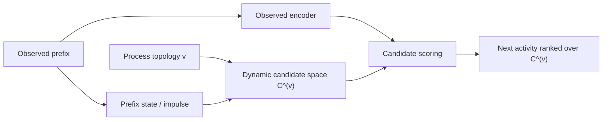

# BPM Prediction Research Toolkit

`bpm_prediction` is an active research toolkit for predictive business process
monitoring experiments. It focuses on next-activity prediction under process
version drift, with graph neural networks, topology-aware runtime artifacts,
and EOPKG-style structural context.

The repository is intentionally broader than a single-paper code dump. It keeps
multiple model families, experiment controls, data adapters, diagnostics, and UI
tools so new hypotheses can be tested without rewriting the pipeline.

## What This Project Supports

- fixed-vocabulary baselines: `LSTM_Baseline`, `BaselineGATv2`, `BaselineGCN`;
- topology-aware EOPKG models: `EOPKGGATv2`, `EOPKGGCN`,
  `EOPKGTopologyConditioned`;
- topology-native candidate scoring for process versions with added or removed
  activities;
- version-aware train/eval/eval_drift workflows;
- XES and Camunda-oriented ingestion paths;
- offline topology and stats preparation through repository-backed artifacts;
- MLflow-based metrics, calibration diagnostics, drift-window metrics, and
  selective tracing;
- desktop experiment UIs for editing presets and running experiments.

## Current Research Direction

The active research path is topology-conditioned prediction under structural
process drift. The central question is whether a model can use the topology of
the current process version before enough logs of that version exist for full
retraining.

Classic next-activity prediction usually predicts over a fixed activity
vocabulary observed during training. That becomes fragile when a deployed
process version adds activities, removes activities, or changes valid
transitions. `EOPKGTopologyConditioned` instead scores candidates in the
topology-native candidate space of the current version and uses impulse
activation routing to align the observed prefix with the structural graph.


```mermaid
flowchart LR
    P["Observed prefix"] --> O["Observed encoder"]
    V["Process topology v"] --> C["Dynamic candidate space C^(v)"]
    P --> S["Prefix state / impulse"]
    S --> C
    O --> R["Candidate scoring"]
    C --> R
    R --> Y["Next activity ranked over C^(v)"]
```

The project also keeps negative controls and experimental modes: logs-only
GNNs, LSTM/GRU baselines, GATv2 with topology-mask post-filtering, historical
EOPKG fusion modes, and EOPKG variants without impulse routing. These modes are
retained to test alternative hypotheses and reviewer controls; they are not the
primary topology-native research path.

## Repository Layout

```text
src/                     Domain, application, adapter, and infrastructure code
tools/                   CLI helpers, UI tools, export utilities, audits
configs/                 Tracked experiment, data, UI catalog, and UI presets
tests/                   Unit, integration, regression, and architecture tests
docs/current/            Current project state and active architecture debt
docs/adr/                Accepted/proposed architecture decisions
docs/runbooks/           Operational commands and experiment runbooks
docs/GNN_*.MD            GNN runtime, learning strategy, and methodology docs
data/camunda_exports/    Small checked-in mock process artifacts
```

Local/generated paths are intentionally not tracked:

```text
outputs/                 Generated figures, exported metrics, UI state
scratch/                 Local analysis notes and temporary material
mlruns/                  Local MLflow file-store runs
checkpoints/             Local model checkpoints
docs/worklogs/           Local historical plans/reports
docs/superpowers/        Local agent planning specs
docs/archive/            Local deprecated agent contexts
```

## Environment

Use the modern local virtual environment:

```powershell
.\.venv-modern\Scripts\python.exe <command>
```

Do not use `python`, `py -3`, or the old `.venv` path for project commands.

Install dependencies from the maintained requirements file used by your
environment. If a frozen requirements file is present, prefer it for exact local
reconstruction:

```powershell
.\.venv-modern\Scripts\python.exe -m pip install -r requirements-freeze.txt
```

## Quick Start

Run an experiment config:

```powershell
.\.venv-modern\Scripts\python.exe main.py --config configs/experiments/<experiment>.yaml
```

Launch the legacy Tkinter experiment UI:

```powershell
.\.venv-modern\Scripts\python.exe main.py experiment-ui
```

Launch the PySide6 desktop UI prototype:

```powershell
.\.venv-modern\Scripts\python.exe main.py ui
```

Active desktop UI presets are tracked in:

```text
configs/ui/experiment_ui_presets.json
```

Runtime UI state and generated configs are written under `outputs/ui/` and are
not tracked.

## Common Commands

Prepare or synchronize process topology:

```powershell
.\.venv-modern\Scripts\python.exe main.py ingest-topology --config <config.yaml> --split train --out outputs/topology_ingest_summary.json
.\.venv-modern\Scripts\python.exe main.py sync-topology --config <config.yaml> --out outputs/sync_topology_summary.json
```

Prepare statistics snapshots:

```powershell
.\.venv-modern\Scripts\python.exe main.py sync-stats --config <config.yaml> --out outputs/sync_stats_summary.json
.\.venv-modern\Scripts\python.exe main.py sync-stats-backfill --config <config.yaml> --step weekly --out-dir outputs/stats_backfill
```

Clean graph dataset cache:

```powershell
.\.venv-modern\Scripts\python.exe main.py cache-clean --cache-dir .cache/graph_datasets --dry-run
```

For the full command catalog, see
[docs/runbooks/mvp2_5-commands.md](docs/runbooks/mvp2_5-commands.md).

## Reproducibility

Research-grade temporal runs should use strict as-of statistics:

```yaml
experiment:
  stats_time_policy: strict_asof
  on_missing_asof_snapshot: raise
```

Recommended reproducibility checklist:

1. Record the preset name and the resolved generated YAML config.
2. Record dataset version scope, `fraction`, `fraction_strategy`,
   `split_strategy`, and seed.
3. Record model type, topology mode, gateway mode, mask settings, and candidate
   contract settings.
4. Record checkpoint path and verify that eval/eval_drift uses the intended
   checkpoint.
5. Export MLflow metrics and drift-window metrics to `outputs/`.
6. Keep generated figures, raw metric exports, and run tables as supplementary
   artifacts outside the Git repository.

Experiment validity guards:

- `vocab_activity_size` must be greater than 1;
- mask-aware runs must report meaningful `target_in_mask_rate`;
- `F1=1.0` with `target_in_mask_rate=0` or `test_oos=1` is invalid until
  explained;
- for XES task-label prediction, `gateway_mode=collapse_for_prediction` is the
  canonical setting unless preserve-mode behavior is being studied.

## Validation

Architecture boundary check:

```powershell
.\.venv-modern\Scripts\python.exe tools\architecture_guard.py
```

MVP1 regression subset:

```powershell
.\.venv-modern\Scripts\python.exe -m pytest -m mvp1_regression -v
```

Full test suite:

```powershell
.\.venv-modern\Scripts\python.exe -m pytest tests/ -v
```

## Documentation Map

- [docs/index.md](docs/index.md) - documentation navigation.
- [docs/current/project-state.md](docs/current/project-state.md) - current
  runtime state.
- [docs/current/architecture-debt.md](docs/current/architecture-debt.md) -
  active architecture and research-grade debt.
- [docs/GNN_RUNTIME_MVP2_5.MD](docs/GNN_RUNTIME_MVP2_5.MD) - model and tensor
  runtime behavior.
- [docs/GNN_LEARNING_STRATEGY.MD](docs/GNN_LEARNING_STRATEGY.MD) - training
  strategy contract.
- [docs/GNN_LEARNING_METODOLOGY.MD](docs/GNN_LEARNING_METODOLOGY.MD) -
  topology-conditioned research methodology.
- [docs/adr/README.md](docs/adr/README.md) - architecture decisions.

## Development Notes

This project is still evolving. Some model modes are experimental, some
research directions are retained as ablations, and not every configuration is
intended as a production-ready default. The canonical current state is kept in
`docs/current/`, while historical local worklogs are intentionally excluded from
the public repository.
