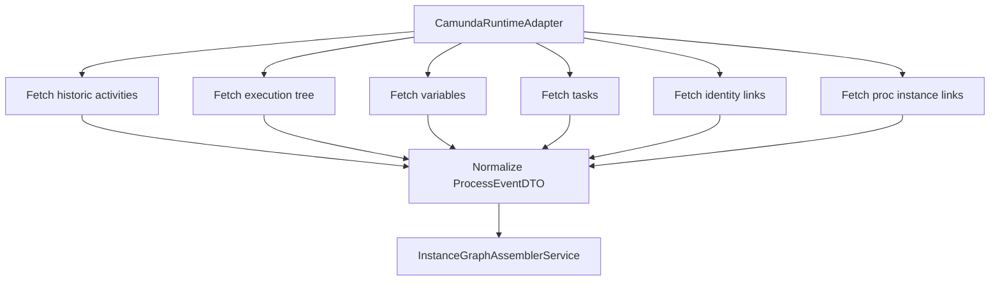
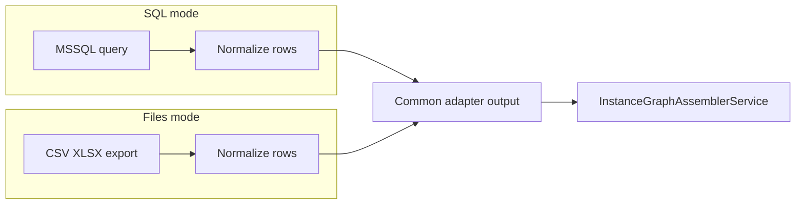

# ADAPTER_CAMUNDA_SQL.MD

Updated: 2026-03-15  
Status: ACTIVE (MVP2.5 Stage 3.1), Stage 3.2 BPMN ingestion in progress

## 1. Purpose
This specification defines the Camunda 7 MSSQL adapter contract used by `CamundaRuntimeAdapter` and related services.

Goals:
- extract runtime activity data for Instance Graph assembly,
- support manual file exports and direct SQL mode,
- stay resilient to history cleanup,
- keep clean boundaries for future BPMN ingestion and Neo4j migration.

## 2. Source tables
Primary tables currently used:
- `bpms_camunda_mssql_tst.dbo.ACT_HI_ACTINST`
- `bpms_camunda_mssql_tst.dbo.ACT_RU_EXECUTION`
- `bpms_camunda_mssql_tst.dbo.ACT_HI_VARINST`
- `bpms_camunda_mssql_tst.dbo.ACT_HI_TASKINST`
- `bpms_camunda_mssql_tst.dbo.ACT_HI_IDENTITYLINK`
- `bpms_camunda_mssql_tst.dbo.ACT_HI_PROCINST`

Optional process variables:
- `bpms_camunda_mssql_tst.dbo.ACT_HI_VARINST` (process-level extraction by naming convention)

## 3. Adapter modes
- `runtime_source: sql` for direct MSSQL querying.
- `runtime_source: files` for CSV/Excel manual exports from SQL templates.

Both modes must produce the same normalized DTO contracts.

## 4. Data extraction overview


## 5. Cleanup-aware guard
For each historical query with `REMOVAL_TIME_` support:
```sql
AND (REMOVAL_TIME_ IS NULL OR REMOVAL_TIME_ > GETDATE())
```

Fallback behavior:
- if column is absent in older database version, retry query without this predicate,
- do not hard-fail entire pipeline,
- diagnostics must report fallback and effective coverage.

## 6. Key field mapping

### 6.1 ACT_HI_ACTINST -> ProcessEventDTO
| SQL field | DTO field | note |
|---|---|---|
| `ID_` | `activity_instance_id` | runtime unique id |
| `PROC_INST_ID_` | `case_id` | process instance |
| `ACT_ID_` | `activity_id` | activity definition id |
| `ACT_TYPE_` | `activity_type` | userTask gateway etc |
| `START_TIME_` | `start_time` | datetime |
| `END_TIME_` | `end_time` | datetime |
| `DURATION_` | `duration_ms` | milliseconds |
| `TASK_ID_` | `task_id` | optional |
| `CALL_PROC_INST_ID_` | `call_proc_inst_id` | call activity child link |
| `PARENT_ACT_INST_ID_` | `parent_activity_instance_id` | subprocess scope |
| `REMOVAL_TIME_` | `removal_time` | diagnostics |

### 6.2 ACT_RU_EXECUTION refinement
| SQL field | usage |
|---|---|
| `ID_` | execution id |
| `ACT_ID_` | activity link |
| `PROC_INST_ID_` | case link |
| `PARENT_ID_` | hierarchy |
| `IS_CONCURRENT_` | parallel token marker |
| `IS_SCOPE_` | scope node marker |
| `IS_EVENT_SCOPE_` | event scope marker |
| `REV_` | optional update marker |

### 6.3 Multi-instance variables
Expected variable names:
- `loopCounter`
- `nrOfInstances`
- `nrOfCompletedInstances`

## 7. Canonical graph assembly contract
Adapter output must support both assembler modes:
- `activity-centric` (default and scalable)
- `execution-centric` (higher fidelity, bounded depth)

Config controls:
- `history_cleanup_aware: true`
- `execution_tree_depth_limit`
- `canonical_mode`
- `call_activity_mode`

## 8. Call activity support
Required links:
- parent call activity node retains `call_proc_inst_id`,
- relation to child process instance resolved from `ACT_HI_PROCINST` when available,
- unresolved links remain valid with warning and no hard failure.

## 9. SQL templates location
- `src/adapters/ingestion/camunda/sql/manual/*.sql`
- `src/adapters/ingestion/camunda/sql/runtime/*.sql`

Manual templates are intended for selective export (for example by process definition list).

## 10. Recommended filtered query pattern
```sql
WHERE PROC_DEF_KEY_ IN ('B2BContracts_ApproveProject', 'BP_MediumRiskCheck')
```

Use this filter for controlled extraction and avoid full database scan.

## 11. Failure policy
- Never raise fatal error on missing enrichment rows.
- Use left joins and preserve partial records.
- Return diagnostics with explicit warning list.
- Instance graph must still be produced (possibly fallback mode).

## 12. Diagram: SQL mode and files mode


## 13. Security and operational notes
- use read-only DB user for runtime adapter,
- avoid full table scans in production,
- enforce process filters and time windows,
- log query source and row counts per dataset.
