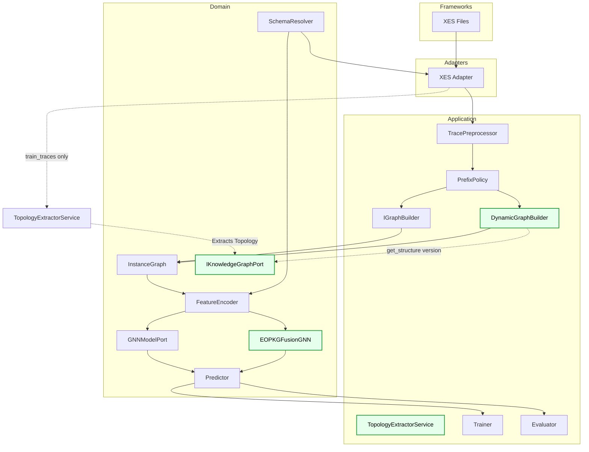
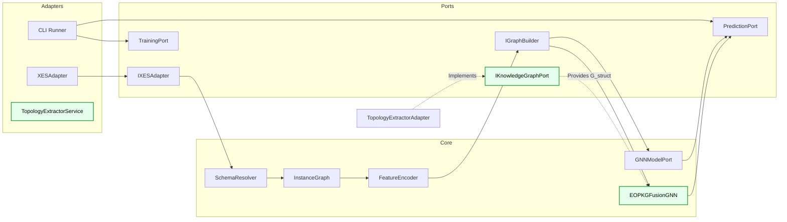
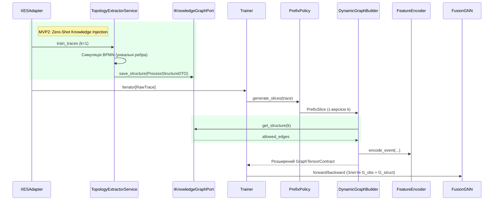
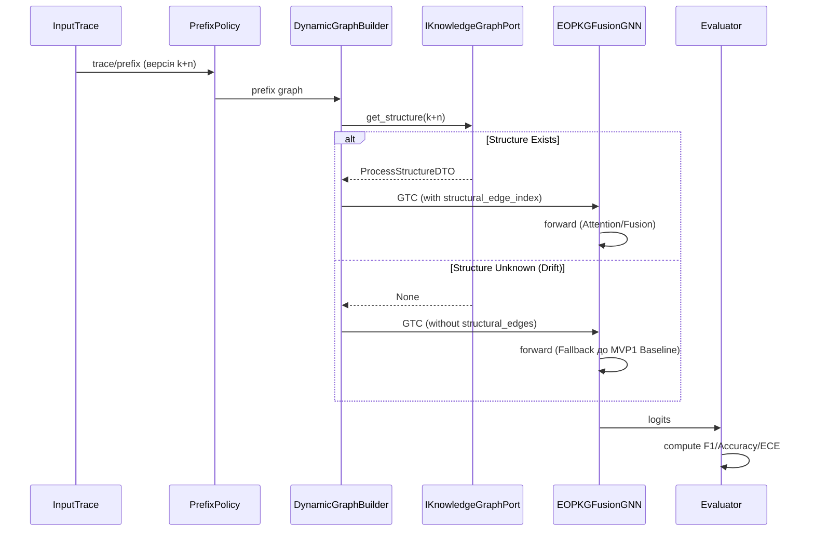
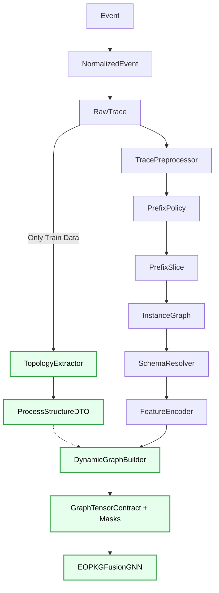

# ARCHITECTURE_MVP2.MD

## 1. Scope (Призначення)
MVP2 розширює Baseline-архітектуру (MVP1) шляхом впровадження Enterprise Operational Process Knowledge Graph (EOPKG) та оператора злиття ($\Gamma$).
Головна мета: довести гіпотезу про те, що використання нормативного графа ($G_{struct}$) зменшує деградацію моделі під час структурного дрейфу.

## 2. Головний архітектурний інваріант (Зворотна сумісність)
Впровадження MVP2 **не повинно ламати MVP1**. 
- Всі існуючі контракти розширюються через `Optional` поля.
- Якщо дані з EOPKG відсутні (наприклад, `structural_edge_index is None`), система (включаючи `forward` моделі) повинна автоматично перемикатися в режим Baseline (MVP1).

## 3. Нові компоненти системи
1. **IKnowledgeGraphPort (Domain Layer)**: Порт для отримання $G_{struct}$.
2. **TopologyExtractorService (Application Layer)**: Реалізація порту для MVP2. Екстрагує нормативну топологію безпосередньо з `train_traces` (без Data Leakage цільових змінних на тестовій вибірці) для симуляції BPMN-каркасу.
3. **DynamicGraphBuilder (Application Layer)**: Розширює `BaselineGraphBuilder`. Додає маски з EOPKG у тензорний контракт, якщо включено відповідний режим у конфігу.
4. **EOPKGFusionGNN (Domain Layer)**: Нова архітектура моделі. Реалізує оператор $\Gamma$, який застосовує увагу (Attention) або гейтинг (Gating) на основі $G_{struct}$.

## 4. Clean Architecture (Layered View)

### Пояснення шарів (Оновлено для MVP2)
*Нові компоненти MVP2 підсвічені зеленим.*
- **Application:** Додано `TopologyExtractorService` для безпечної екстракції топології (без Leakage) та `DynamicGraphBuilder`, який вміє звертатися до графа знань.
- **Domain:** Додано порт `IKnowledgeGraphPort` (для інверсії залежностей бази знань) та нову модель `EOPKGFusionGNN` з оператором $\Gamma$.

---

## 5. Component Architecture (Hexagonal View)

---

## 6.1 Training Flow (із Zero-Shot Topology Extraction)

## 6.2 Eval Drift Flow (З урахуванням EOPKG)

## 6.3 End-to-End Pipeline

