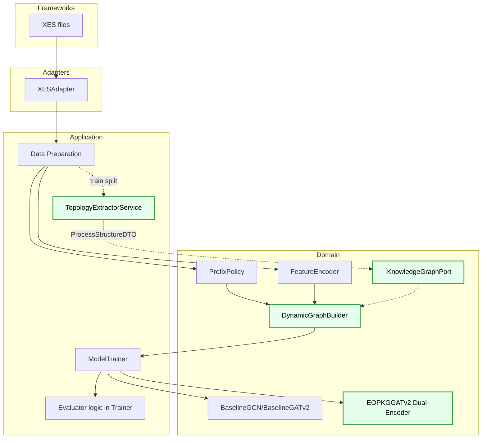
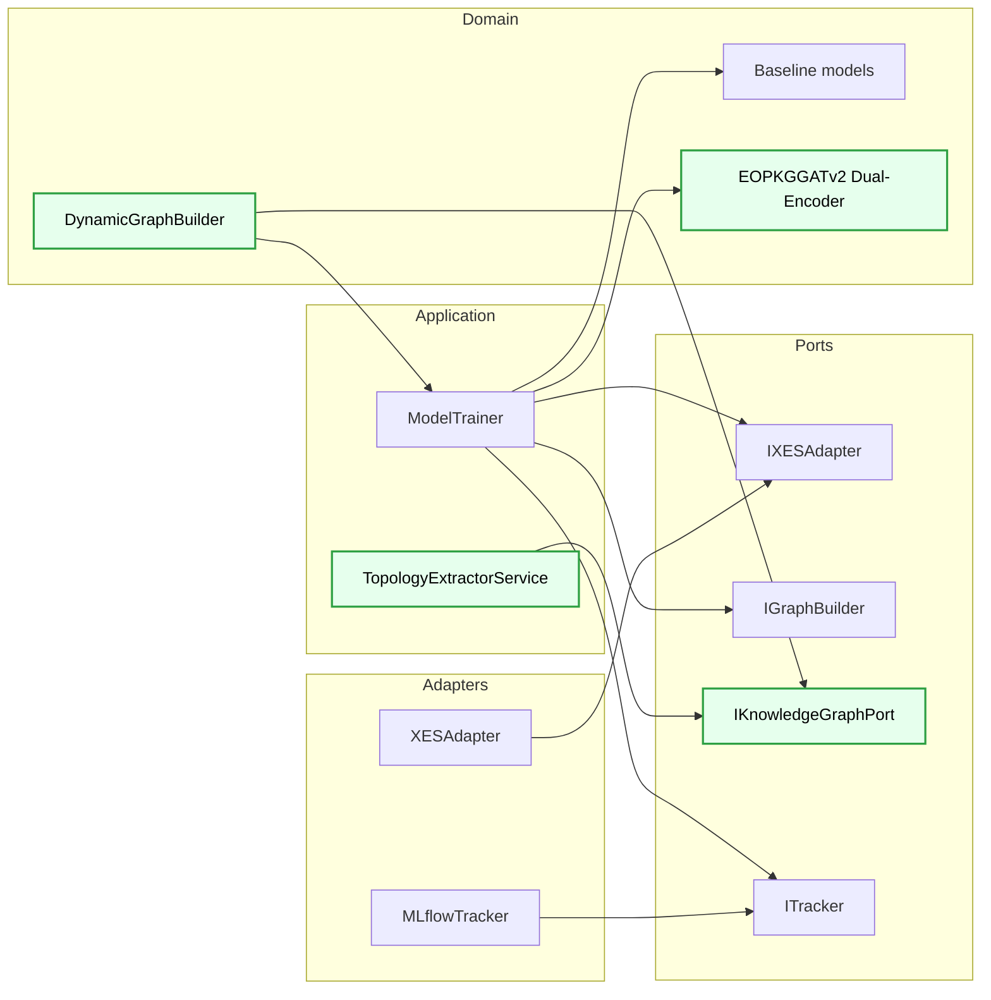
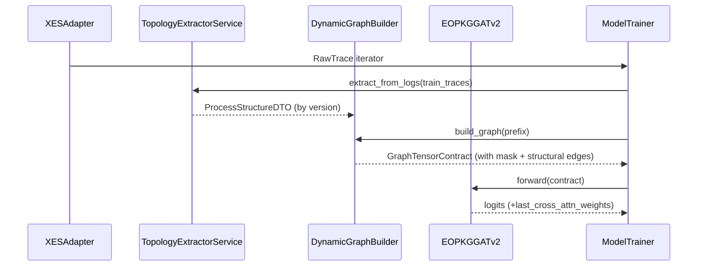
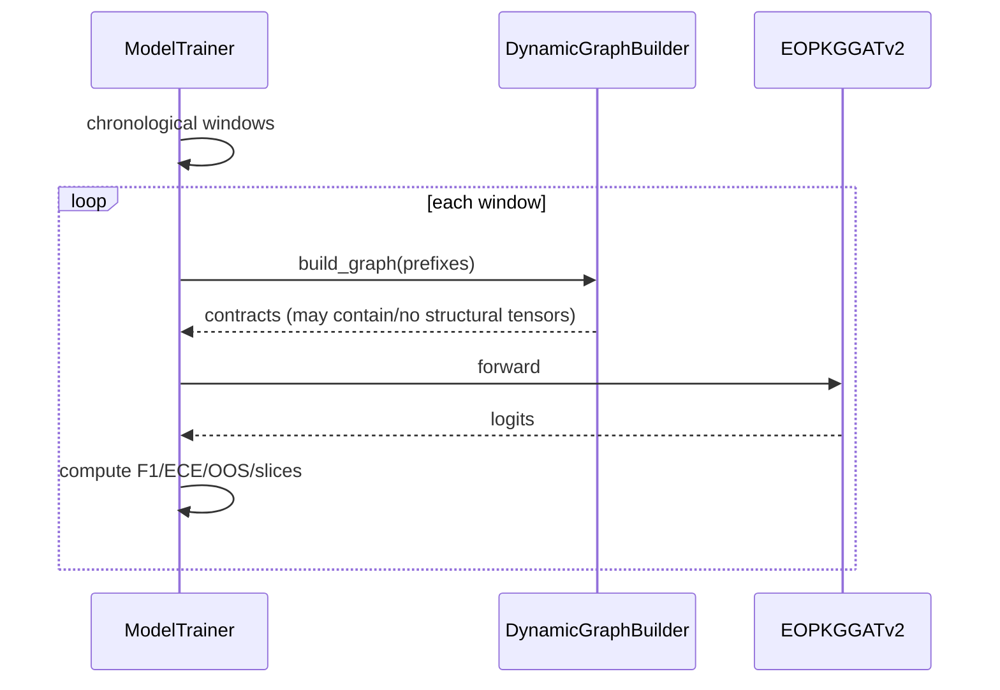

# ARCHITECTURE_MVP2.MD

## 1. Scope
MVP2 extends MVP1 with Zero-Shot Knowledge Injection through EOPKG and introduces a Dual-Encoder architecture for `EOPKGGATv2`.

Primary goal:
1. Keep MVP1 fully runnable.
2. Inject structural process knowledge into model inference.
3. Improve drift robustness (F1 stability, ECE stability, OOS reduction).

## 2. Backward Compatibility Invariant
MVP2 is additive and must not break MVP1:
1. `GraphTensorContract` is extended only with optional fields.
2. If structural tensors are absent, model falls back to baseline path.
3. Evaluator must compute base metrics even when OOS data is unavailable.

## 3. Core Components
1. `IKnowledgeGraphPort` (Domain port): provides structural process topology.
2. `TopologyExtractorService` (Application service): extracts topology from train traces.
3. `DynamicGraphBuilder` (Domain service): produces `allowed_target_mask` and structural tensors.
4. `EOPKGGATv2` (Domain model): Dual-Encoder + Soft Cross-Attention.
5. `ModelTrainer` (Application use case): orchestrates training/evaluation, slicing, OOS.

## 4. Clean Architecture (Layered View)



## 5. Component Architecture (Hexagonal View)



## 6. Dual-Encoder Model Structure (Main Diagram)

This is the key Sprint 3 architecture.

### 6.1 Tensor Routing Overview

```mermaid
flowchart LR
    classDef obs fill:#e6f0ff,stroke:#1f6feb,stroke-width:2px,color:#000;
    classDef struct fill:#e6ffed,stroke:#2ea043,stroke-width:2px,color:#000;
    classDef fuse fill:#fff4e5,stroke:#b26a00,stroke-width:2px,color:#000;

    XCAT[x_cat, x_num, edge_index, batch]:::obs --> OBSENC[Observed Encoder\nGATv2Conv stack]:::obs
    OBSENC --> HOBS["H_obs: [B, hidden_dim]"]:::obs

    SEI[structural_edge_index]:::struct --> SENC[Structural Encoder\nstruct_gnn]:::struct
    SX[struct_x optional]:::struct --> SXSEL[if None -> struct_node_emb]:::struct
    SXSEL --> SENC
    SEW[structural_edge_weight optional]:::struct -. optional .-> SENC
    SENC --> HNORM["H_norm: [C, struct_hidden_dim]"]:::struct

    HOBS --> Q["Q: [B,1,hidden_dim"]]:::fuse
    HNORM --> PROJ["struct_to_attn\n[C,hidden_dim]"]:::fuse
    PROJ --> KV["expand -> [B,C,hidden_d im]"]:::fuse

    Q --> ATTN[MultiheadAttention\nbatch_first=True]:::fuse
    KV --> ATTN
    ATTN --> CXT["context: [B,hidden_dim]\nattn_weights: [B,H,1,C]"]:::fuse

    CXT --> CPROJ["attn_to_struct\n[B,struct_hidden_dim]"]:::fuse
    HOBS --> CONCAT["concat(H_obs, context_struct)"]:::fuse
    CPROJ --> CONCAT

    CONCAT --> FUSION["Fusion MLP\nLinear(hidden+struct_hidden -> hidden)+ReLU"]:::fuse
    FUSION --> CLS[Classifier -> logits [B,C]]:::fuse
```

### 6.2 Forward Contract Rules
1. If `structural_edge_index` is missing/empty: baseline fallback.
2. If `struct_x` is missing: use `struct_node_emb` (expected in Sprint 3).
3. Cross-attention weights are stored in `self.last_cross_attn_weights` for XAI.
4. `allowed_target_mask` is not used by model forward; it is used by evaluator (OOS).

## 7. Runtime Flows

### 7.1 Training Flow



### 7.2 Eval Drift Flow



## 8. Scope Limits and MVP3 Boundary
1. Sprint 3 scope is only `EOPKGGATv2` Dual-Encoder refactor.
2. `EOPKGGCN` stays on previous fusion path (compatibility mode).
3. Rich `struct_x` features from graph DB (resources, policies, advanced stats) are Sprint 4+.
4. Agent-Critic and dynamic beta regularization remain MVP3.
