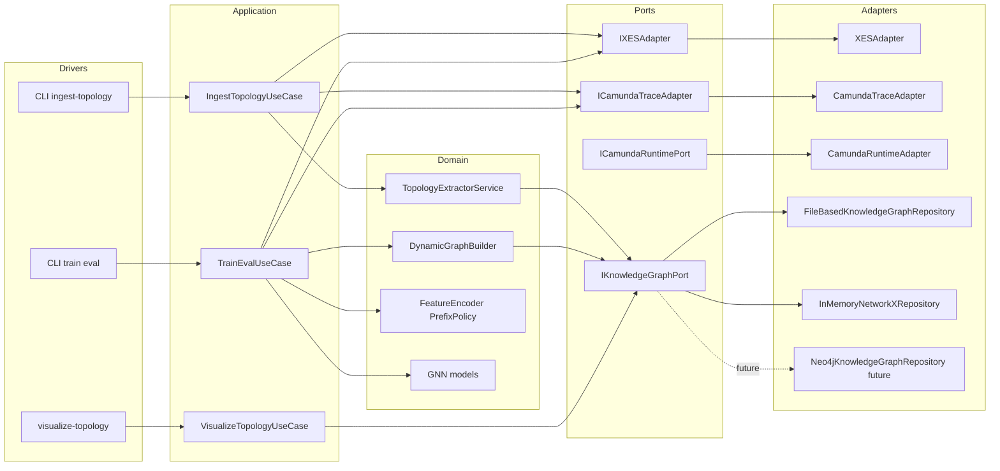

# ARCHITECTURE_MVP2_5.MD

Updated: 2026-03-15  
Status: ACTIVE (MVP2.5 Stage 3.x)

## 1. Purpose
This document fixes the architecture baseline for MVP2.5 after introducing:
- offline topology ingestion (`ingest-topology`),
- repository-backed knowledge storage (`IKnowledgeGraphPort`),
- file-backed implementation (`FileBasedKnowledgeGraphRepository`),
- runtime Camunda adapters and resilient fallback behavior in Stage 3.1.

MVP2.5 keeps MVP1 training compatibility while preparing Stage 3.2 BPMN ingestion and Stage 4 Neo4j backend.

## 2. Architectural Principle
Core principle: **decouple ingestion from training/inference**.

- Ingestion pipeline builds and persists structure artifacts.
- Training/evaluation pipeline consumes already persisted structure artifacts.
- Runtime does not synchronously rebuild process topology during model training.

## 3. Hexagonal Architecture View


## 4. Pipeline Separation
### 4.1 Ingestion Pipeline (offline)
1. Read traces from XES or Camunda trace adapter.
2. Apply configured split policy for ingestion scope (`train` or `full`).
3. Extract process transitions with `TopologyExtractorService`.
4. Persist `ProcessStructureDTO` through `IKnowledgeGraphPort`.
5. Emit machine-readable ingestion summary.

### 4.2 Training and Evaluation Pipeline
1. Read traces/events via adapter.
2. Fit feature encoder and build prefixes.
3. Build tensors with `DynamicGraphBuilder`.
4. Resolve structure from `IKnowledgeGraphPort` (file or memory backend).
5. If structure missing, fallback path remains valid (no crash).

## 5. Repository Backends
### 5.1 Current backends
- `in_memory`: fast tests and local transient flow.
- `file`: persistent JSON artifacts in `data/knowledge_graph`.

### 5.2 Target backend
- `neo4j` is planned as production backend under same port contract.

## 6. Resilience Strategy
- Missing topology artifact must not crash baseline training unless `strict_load=true`.
- Camunda runtime fetch remains cleanup-aware and fallback-safe.
- Training always has a valid path (structure-enhanced or baseline fallback).

## 7. Physical Directory Structure
```text
bpm_prediction/
  configs/
    data/
    experiments/
    model/
  data/
    knowledge_graph/
      <process_name>/<version>/process_structure.json
    camunda_exports/
  docs/
    ARCHITECTURE_MVP2_5.MD
    DATA_FLOWS_MVP2_5.MD
    DATA_MODEL_MVP2_5.MD
    LLD_MVP2_5.MD
    EVF_MVP2_5.MD
    ADAPTER_CAMUNDA_SQL.MD
    ADAPTER_XES.MD
    TARGET_ARCHITECTURE.MD
  src/
    adapters/ingestion/
    application/services/
    application/use_cases/
    domain/services/
    infrastructure/repositories/
  tools/
    ingest_topology.py
    visualize_topology.py
    visualize_graph.py
```

## 8. MVP1 Compatibility Guard
MVP1 regression remains mandatory:
- architecture_guard,
- `pytest -m mvp1_regression`,
- at least one MVP1 smoke training run.

No MVP2.5 component may break baseline execution path.
