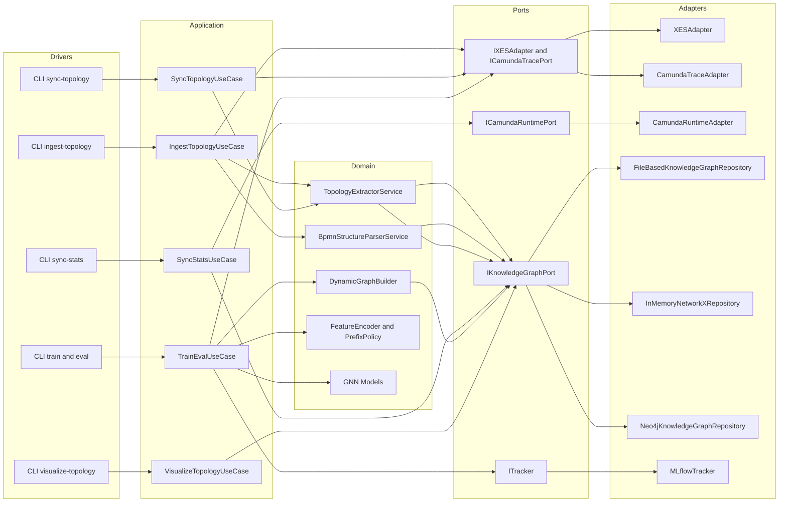

# ARCHITECTURE_MVP2_5.MD

Updated: 2026-03-26
Status: ACTIVE (Stage 4.2 implemented, closure sync in progress)

## 1. Purpose
This document is the canonical architecture baseline for MVP2.5.

MVP2.5 currently includes:
1. Offline topology ingestion (`ingest-topology`, `sync-topology`).
2. Offline statistics enrichment (`sync-stats`).
3. Repository-backed structure consumption in train/eval/infer via `IKnowledgeGraphPort`.
4. Snapshot-based historical lookup (`as_of`) for temporal-safe experiments.

Runtime model/tensor details are specified in:
1. `docs/GNN_RUNTIME_MVP2_5.MD`.

## 2. Core Architecture Principle
The system is split into independent pipelines:
1. Ingestion pipeline: reads raw sources and persists structure/snapshots.
2. Runtime ML pipeline: reads traces and consumes prebuilt artifacts only.

Training must not build topology/stats synchronously from raw sources.

## 3. Hexagonal View


## 4. Pipeline Separation

### 4.1 Structure ingestion (offline)
1. Read traces or BPMN source.
2. Build `ProcessStructureDTO`.
3. Save structure through `IKnowledgeGraphPort`.

### 4.2 Topology bulk sync (offline)
1. Iterate all configured process definitions/files.
2. Save/update structure by `(process_name, version)`.

### 4.3 Stats sync (offline)
1. Read runtime activity events from Camunda runtime adapter.
2. Load existing structure from repository.
3. Compute Tier A stats windows (`last_7d`, `last_30d`, `last_90d`, `all_time`) relative to `as_of`.
4. Persist immutable snapshot (`knowledge_version`) in repository.

### 4.4 Train/eval/infer (online runtime)
1. Read traces and build prefixes.
2. Resolve structure (+ stats snapshot) from repository.
3. Build tensors (`GraphTensorContract`) and run model forward.

## 5. Stage 3.4 Snapshot Policy

1. Immutable snapshots are append-only.
2. Snapshot key is strict:
   - `tenant_id + process_name + version_key + proc_def_id + knowledge_version`.
3. Stats storage is JSON-only payload in snapshot node/document.
4. `as_of` lookup returns nearest snapshot with timestamp `<= as_of`.
5. TTL is not used.

## 6. Timestamp Semantics

1. `sync-stats --as-of <ISO>`: snapshot timestamp is forced to provided value.
2. `sync-stats` without `--as-of`: effective snapshot timestamp is derived from selected train-cut events (`max(event_ts)` per process scope).
3. In train/eval with `experiment.stats_time_policy = strict_asof`:
   - builder uses prefix last-event timestamp as runtime `as_of`.
4. In `latest` policy:
   - builder uses latest available structure/snapshot.

## 7. Backward Compatibility and Fallback

1. MVP1 path must remain functional.
2. Missing structure/snapshot does not crash unless strict load mode is explicitly enabled.
3. EOPKG stats enrichment is additive to existing contracts.

## 8. Physical Structure (relevant)
```text
bpm_prediction/
  configs/
    data/
    experiments/
    model/
  data/
    knowledge_graph/
    camunda_exports/
  src/
    adapters/ingestion/
    application/use_cases/
    domain/services/
    infrastructure/repositories/
  tools/
    ingest_topology.py
    sync_topology.py
    sync_stats.py
    visualize_topology.py
```

## 9. Runtime GNN Reference
For model-specific behavior and tensor assembly details, use:
1. `docs/GNN_RUNTIME_MVP2_5.MD`
