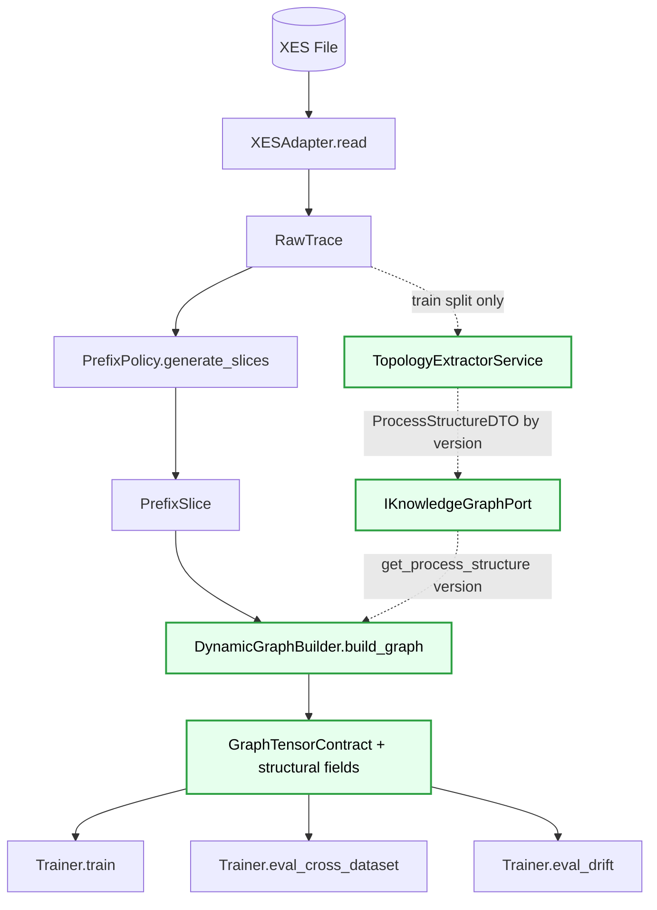
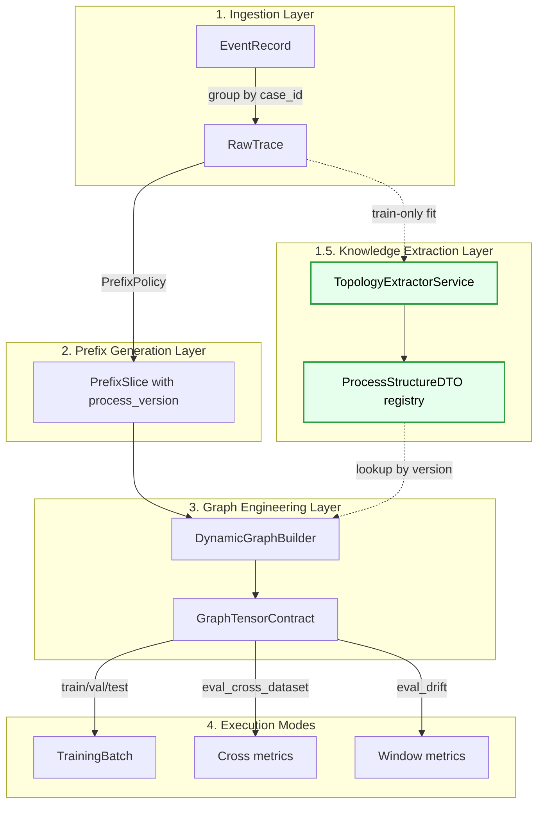
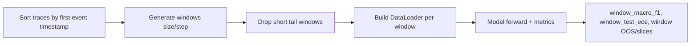
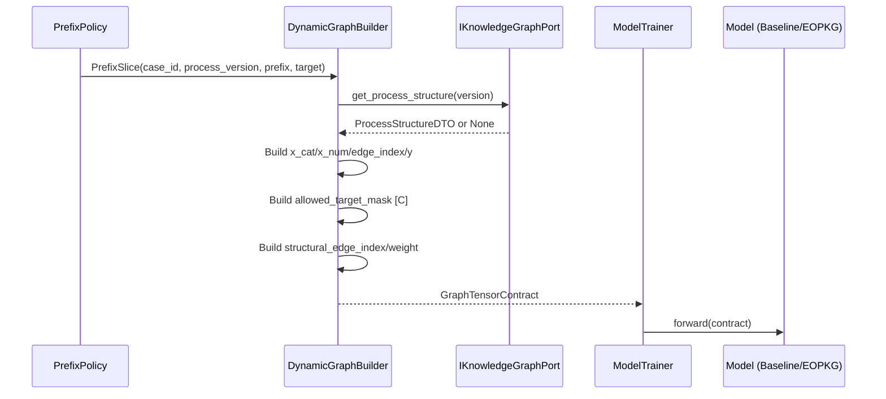

# DATA_FLOWS_MVP2.MD

**Project:** bpm_prediction  
**Scope:** MVP2 Sprint 3 (Dual-Encoder `EOPKGGATv2`)  
**Purpose:** Canonical lifecycle flows for topology extraction, tensor injection, and drift-time evaluation.

---

## 1. Data Flow Architecture (Updated for MVP2)

MVP2 adds a structural knowledge branch: train traces are used to extract version-scoped topology, then `DynamicGraphBuilder` injects structural tensors into contracts.

Architecture invariant:
- `SchemaResolver` and feature lookup order remain unchanged from MVP1.
- MVP2 injects optional contract fields only, preserving baseline execution path.

---

## 2. Data Flow Overview (Lifecycle)

---

## 3. Eval Drift Critical Path (Sliding Windows + Tail Drop)

Drift evaluation is chronological and leakage-safe. Windows are generated with:
- `size = drift_window_size`
- `step = drift_window_sliding or size`
- short tail windows (`len(window) < size`) are dropped.

Formalization:
\[
W_k = \mathcal{T}[s_k:s_k+w), \quad s_{k+1}=s_k+\Delta, \quad \Delta=\text{sliding}\;\text{or}\;w
\]

---

## 4. Dynamic Graph Building Flow (Train/Inference)

---

## 5. Runtime Integrity Gates

1. Train fit scope: topology extraction is built from train traces only.
2. Contract purity: model receives tensors only (`GraphTensorContract`), no Python objects.
3. Fallback safety: if structural tensors are absent, model executes baseline path without crash.
4. OOS safety: evaluator computes OOS only when `allowed_target_mask` exists; otherwise `test_oos=None`.

---

## 6. Dual-Encoder Attention Flow (Main Tensor Diagram)

```mermaid
flowchart LR
    classDef obs fill:#e6f0ff,stroke:#1f6feb,stroke-width:2px,color:#000;
    classDef struct fill:#e6ffed,stroke:#2ea043,stroke-width:2px,color:#000;
    classDef fuse fill:#fff4e5,stroke:#b26a00,stroke-width:2px,color:#000;

    C1[Contract: x_cat,x_num,edge_index,batch]:::obs --> O1["Observed encoder -> H_obs [B,H]"]:::obs

    C2[Contract: structural_edge_index]:::struct --> S1[Structural encoder]:::struct
    C3[Contract: struct_x optional]:::struct --> S0["if None -> struct_node_emb [C,S]"]:::struct
    S0 --> S1
    S1 --> HN["H_norm [C,S]"]:::struct

    HN --> P["struct_to_attn -> [C,H]"]:::fuse
    P --> KV["expand -> [B,C,H]"]:::fuse
    O1 --> Q["Q [B,1,H]"]:::fuse
    Q --> A[MultiheadAttention]:::fuse
    KV --> A
    A --> CTX["context [B,H], attn_weights [B,heads,1,C]"]:::fuse

    CTX --> T1["attn_to_struct -> [B,S]"]:::fuse
    O1 --> T2["concat(H_obs, context_struct)"]:::fuse
    T1 --> T2
    T2 --> FUS[Fusion MLP]:::fuse
    FUS --> OUT["logits [B,C]"]:::fuse
```

Notes:
- Structural branch is active when `structural_edge_index` is present.
- `struct_x` is optional in Sprint 3 and is replaced by structural embeddings when absent.
- Attention weights are retained in model state for XAI diagnostics.
