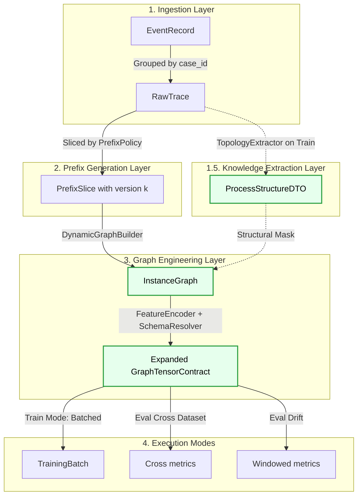
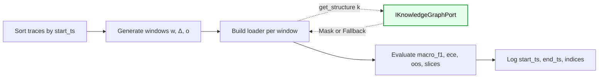
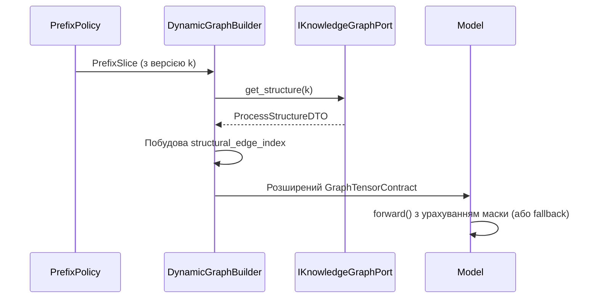

# DATA_FLOWS_MVP2.MD

**Project:** bpm_prediction  
**Scope:** MVP2 (EOPKG Fusion GNN)  
**Purpose:** Canonical service contracts and lifecycle flows for data transformation with Zero-Shot Knowledge Injection.

---

## 1. Data Flow Architecture (Updated for MVP2)

У цій діаграмі показано, як пайплайн розгалужується: тренувальні дані додатково проходять через TopologyExtractorService для екстракції топології, а `GraphBuilder` стає динамічним.

```mermaid
flowchart TD
    classDef mvp2 fill:#e6ffed,stroke:#2ea043,stroke-width:2px,color:#000;

    Log[(XES File)] --> Adapter[XESAdapter.read]
    Adapter --> SR[SchemaResolver]
    Adapter --> RT[RawTrace]

    %% MVP2 Extension: Topology Knowledge Extraction
    RT -.->|Only Train Split| TopologyExtractor [TopologyExtractorService]:::mvp2
    TopologyExtractor -.->|Extracts ProcessStructureDTO| KGPort[IKnowledgeGraphPort]:::mvp2

    RT --> PP[PrefixPolicy.generate_slices]
    PP --> PS[PrefixSlice]
    
    %% MVP2 Extension: Dynamic Graph Building
    PS --> GB[DynamicGraphBuilder.build_graph]:::mvp2
    KGPort -.->|get_structure version| GB
    
    SR --> FE[FeatureEncoder]
    GB --> GTC[Expanded GraphTensorContract]:::mvp2
    FE --> GTC

    GTC --> TRAIN[Trainer.train]
    GTC --> CROSS[Trainer.eval_cross_dataset]
    GTC --> DRIFT[Trainer.eval_drift]
```

### Архітектурний інваріант (Збережено з MVP1)
`SchemaResolver` залишається єдиним механізмом lookup-порядку. 
Але до `GraphTensorContract` додаються нові `Optional` поля, які заповнюються лише якщо `IKnowledgeGraphPort` повертає структуру для поточної версії.

---

## 2. Data Flow Overview (Lifecycle)

Ця діаграма відображає життєвий цикл з урахуванням нового шару екстракції знань.



---

## 3. Eval Drift Critical Path (З урахуванням Fallback)

Критичний порядок залишається незмінним, але під час побудови лоадера для вікна (коли формуються батчі), система динамічно запитує EOPKG. Якщо стається дрейф і структура невідома, відбувається Fallback.



Formalization (Оновлена для MVP2):
\[
W_k = \mathcal{T}[s_k:s_k+w),\quad s_{k+1}=s_k+\Delta
\]
Для кожного вікна $W_k$ модель обробляє префікси версії $\kappa$. Якщо $\kappa_{current} \neq \kappa_{train}$ і структура відсутня, активується `fallback=True` у forward-pass нейромережі.


## 4. Dynamic Graph Building Flow (Інференс / Навчання)
