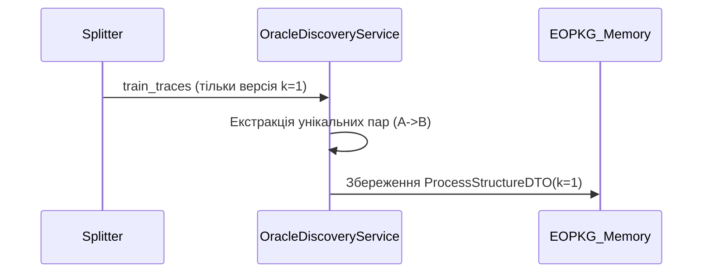
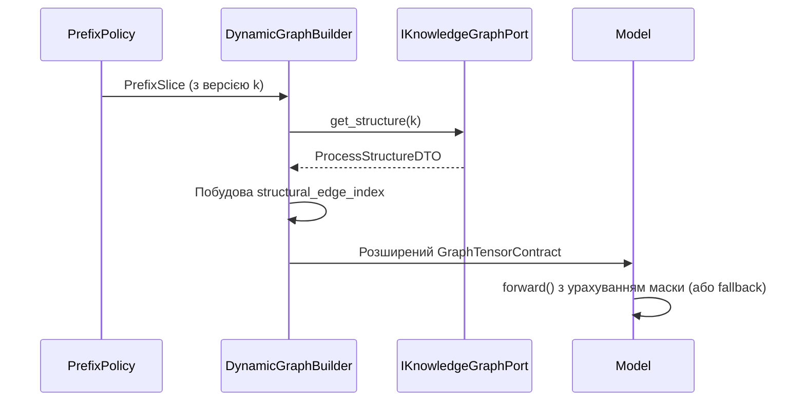

# DATA_FLOWS_MVP2.MD

## 1. Zero-Shot EOPKG Extraction Flow (Тренувальна фаза)
Щоб уникнути Data Leakage, $G_{struct}$ будується як "Oracle" виключно на тренувальній вибірці:

## 2. Dynamic Graph Building Flow (Інференс / Навчання)
