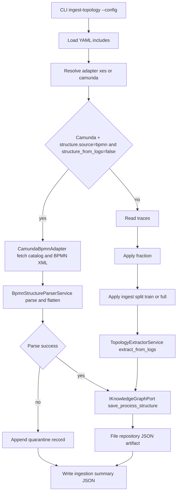
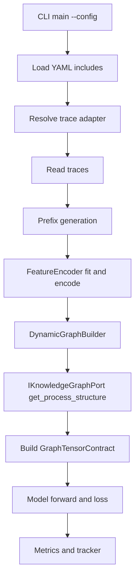
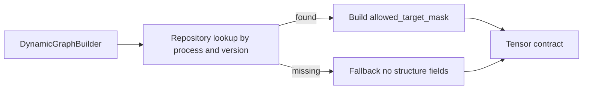
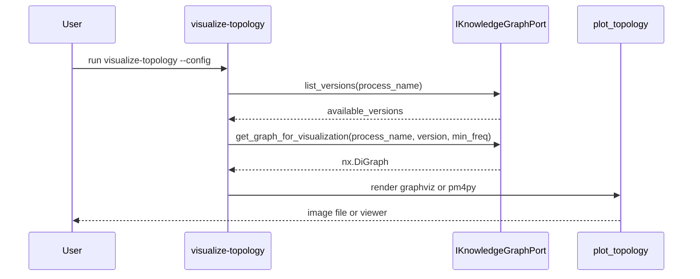

# DATA_FLOWS_MVP2_5.MD

Updated: 2026-03-17  
Status: ACTIVE

## 1. Scope
This document defines runtime data flows for MVP2.5 with strict separation between:
- topology ingestion,
- model train and eval.

## 2. Flow A: ingest-topology

## 3. Flow B: train/eval

## 4. Train flow with fallback branch

## 5. Sequence for repository-backed visualization

## 6. Data leakage control points
- Ingestion split uses chronological train subset by default.
- Training split is independent and re-applied in train pipeline.
- No evaluation records are used to build topology when `ingest_split=train`.
- File-backed topology artifacts make split boundary explicit and reproducible.

## 7. Deterministic diagnostics
For Camunda BPMN ingest summary:
1. `quarantined_procdefs` is explicit.
2. `quarantine_error_codes` is a stable sorted list.
3. `quarantine_records[*].source_hint` is available for operator debugging.
