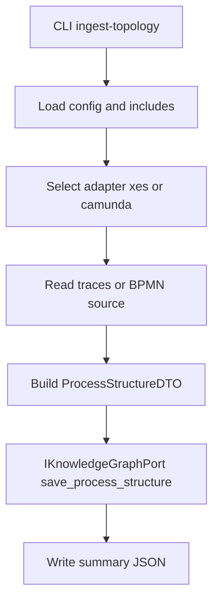
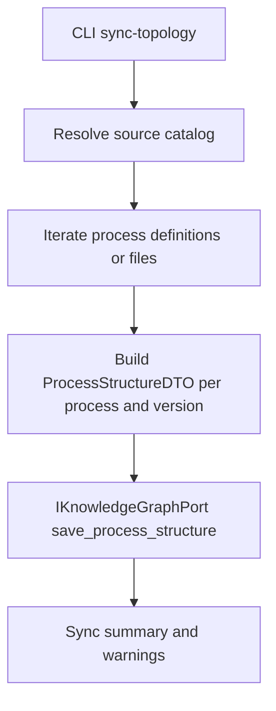
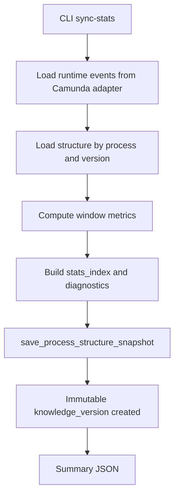
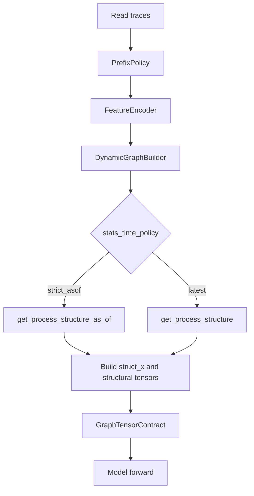
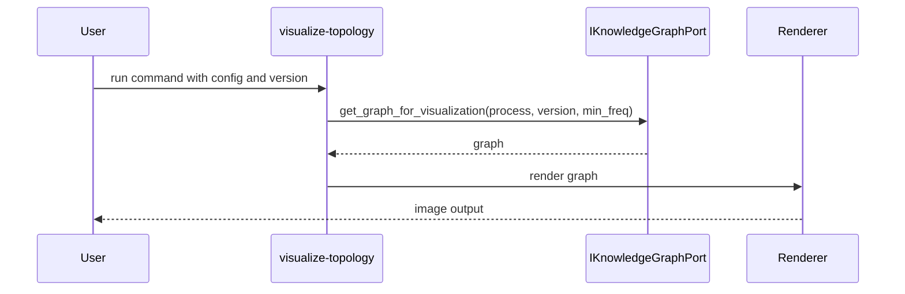

# DATA_FLOWS_MVP2_5.MD

Updated: 2026-03-26
Status: ACTIVE

## 1. Scope
Runtime and offline data flows for MVP2.5 after Stage 3.4.

Detailed runtime model and tensor semantics are documented in:
1. `docs/GNN_RUNTIME_MVP2_5.MD`.

## 2. Flow A - ingest-topology (single dataset)

## 3. Flow B - sync-topology (bulk)

## 4. Flow C - sync-stats (offline enrichment)

## 5. Flow D - train/eval/infer consumption

## 6. Timestamp Semantics

### 6.1 Snapshot creation timestamp
1. `sync-stats --as-of <ISO>`: snapshot uses provided timestamp.
2. `sync-stats` without `--as-of`: snapshot uses derived `effective_as_of=max(event_ts)` from selected train-cut events per process scope.

### 6.2 Snapshot retrieval timestamp
1. `strict_asof`: builder uses prefix last-event timestamp as lookup time.
2. `latest`: builder ignores prefix time and reads latest structure/snapshot.

### 6.3 Selection rule
For `get_process_structure_as_of`:
1. select latest snapshot where `snapshot.as_of_ts <= requested_as_of`.
2. if no snapshot matches, repository fallback path is applied (current implementation behavior).

## 7. Stats Windows and Scopes
Computed during `sync-stats`:
1. windows: `last_7d`, `last_30d`, `last_90d`, `all_time`
2. scopes: `version`, `process`
3. flattened index key: `window.scope.metric`

## 8. Leakage Control Points
1. Structure and stats are generated offline.
2. Experiment timeline is controlled via `--as-of` snapshots.
3. Runtime consumes repository artifacts only.
4. To avoid future leakage in research timelines, maintain historical snapshot cadence and isolated namespace/storage for experiments.

## 9. Visualization Flow

