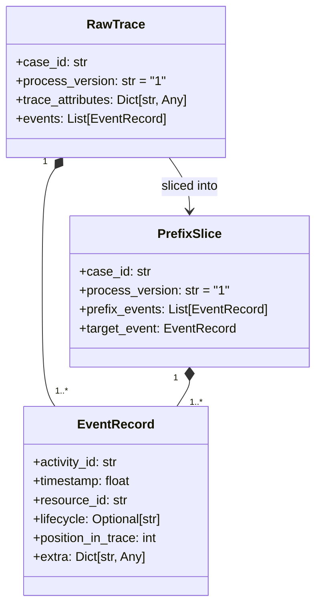
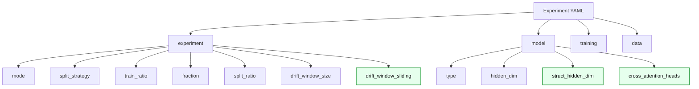
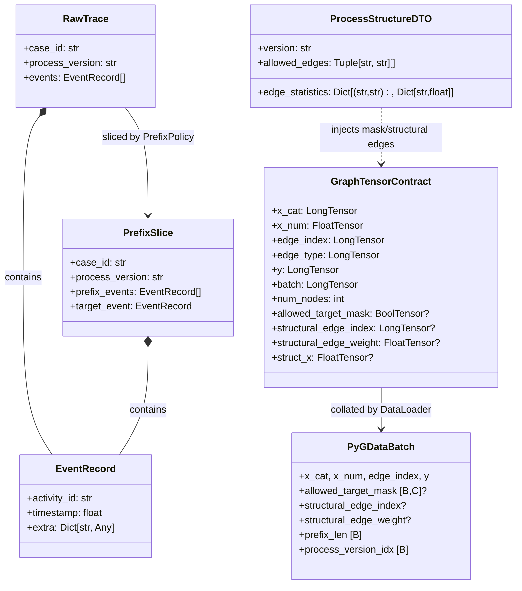

# DATA_MODEL_MVP2.MD

## 0. Canon & Naming Rules
- Scope: MVP2 Sprint 3 (`EOPKGGATv2` Dual-Encoder + Soft Cross-Attention).
- Backward compatibility invariant: all MVP2 contract extensions are optional and do not break MVP1 runs.
- Notation follows `docs/VARIABLES.MD`.

---

## 1. External Boundary Objects (Adapters Layer)

`RawTrace` and `PrefixSlice` remain the canonical ingestion/training boundary DTOs. In MVP2, `process_version` is mandatory routing metadata for topology lookup.

### 1.1 Boundary DTO Composition (Cascade)



---

## 2. New Knowledge Graph DTOs (Domain Layer)

`TopologyExtractorService` publishes version-scoped structural process knowledge via `ProcessStructureDTO`.

### 2.1 ProcessStructureDTO

```python
class ProcessStructureDTO(BaseModel):
    version: str
    allowed_edges: List[Tuple[str, str]]
    edge_statistics: Optional[Dict[Tuple[str, str], Dict[str, float]]] = None
```

Semantics:
- `allowed_edges`: normative directly-follows transitions.
- `edge_statistics[(src, dst)]["count"]`: observed transition frequency in train traces.

---

## 3. Graph Tensor Contract (Core Extension)

`GraphTensorContract` is the single model input DTO. MVP2 extends it with structural tensors and OOS mask while preserving MVP1 fields.

### 3.1 Extended Contract

```python
class GraphTensorContract(TypedDict):
    # MVP1 required fields
    x_cat: torch.LongTensor
    x_num: torch.FloatTensor
    edge_index: torch.LongTensor
    edge_type: torch.LongTensor
    y: torch.LongTensor
    batch: torch.LongTensor
    num_nodes: int

    # MVP2 optional fields
    struct_x: NotRequired[torch.FloatTensor | None]
    structural_edge_index: NotRequired[torch.LongTensor | None]
    structural_edge_weight: NotRequired[torch.FloatTensor | None]
    version_emb_idx: NotRequired[torch.LongTensor | None]
    allowed_target_mask: NotRequired[torch.BoolTensor | None]
```

Key rules:
- `allowed_target_mask` shape is `[C]` on single sample and `[B, C]` after PyG batch collation.
- `struct_x` may be `None` in Sprint 3 by design.
- `structural_edge_index` is required for structural branch activation in `EOPKGGATv2`.

### 3.2 Graph Tensor Attribute Cascade

```mermaid
flowchart LR
    classDef mvp2 fill:#e6ffed,stroke:#2ea043,stroke-width:2px,color:#000;

    PS[PrefixSlice] --> DGB[DynamicGraphBuilder]
    KG[ProcessStructureDTO]:::mvp2 -.->|get_process_structure(version)| DGB

    DGB --> XC[x_cat]
    DGB --> XN[x_num]
    DGB --> EI[edge_index]
    DGB --> ET[edge_type]
    DGB --> Y[y]
    DGB --> B[batch]
    DGB --> N[num_nodes]

    DGB --> MASK[allowed_target_mask]:::mvp2
    DGB --> SEI[structural_edge_index]:::mvp2
    DGB --> SEW[structural_edge_weight]:::mvp2
    DGB --> SX[struct_x optional]:::mvp2
```

---

## 4. Experiment Configuration Schema (MVP2 Updates)

Data split and drift-window policies are experiment hyperparameters.

### 4.1 Relevant Fields

```yaml
experiment:
  mode: "train"                  # train | eval_cross_dataset | eval_drift
  split_strategy: "temporal"     # temporal | none
  train_ratio: 0.7
  fraction: 1.0
  split_ratio: [0.7, 0.2, 0.1]
  drift_window_size: 500
  drift_window_sliding: 0         # 0 -> fallback to drift_window_size

model:
  type: "EOPKGGATv2"             # factory key
  hidden_dim: 64
  struct_encoder_type: "GATv2Conv"
  struct_hidden_dim: 64
  cross_attention_heads: 4
```

### 4.2 Config Cascade Structure (MVP2)



---

## 5. Object Composition Schema (What Belongs to What)

This section is the authoritative composition map for MVP2 data objects and their ownership boundaries.



---

## 6. Dual-Encoder Attention Tensor Map (Sprint 3 Main)

This is the main tensor-level contract for `EOPKGGATv2`.

### 6.1 End-to-End Tensor Routing

```mermaid
flowchart LR
    classDef obs fill:#e6f0ff,stroke:#1f6feb,stroke-width:2px,color:#000;
    classDef struct fill:#e6ffed,stroke:#2ea043,stroke-width:2px,color:#000;
    classDef fuse fill:#fff4e5,stroke:#b26a00,stroke-width:2px,color:#000;

    OBSIN[x_cat,x_num,edge_index,batch]:::obs --> OBSENC[Observed GATv2 encoder]:::obs
    OBSENC --> HOBS[H_obs: [B, hidden_dim]]:::obs

    SX[struct_x optional]:::struct --> SXSEL[if None -> struct_node_emb weight [C,struct_hidden_dim]]:::struct
    SXSEL --> SENC[struct_gnn over structural_edge_index]:::struct
    SEI[structural_edge_index [2,E_struct]]:::struct --> SENC
    SENC --> HNORM[H_norm: [C, struct_hidden_dim]]:::struct

    HNORM --> STOATTN[struct_to_attn -> [C,hidden_dim]]:::fuse
    STOATTN --> KV[expand -> [B,C,hidden_dim]]:::fuse
    HOBS --> Q[unsqueeze -> [B,1,hidden_dim]]:::fuse

    Q --> ATTN[MultiheadAttention(batch_first=True)]:::fuse
    KV --> ATTN
    ATTN --> AOUT[attn_output [B,1,hidden_dim]\nattn_weights [B,H,1,C]]:::fuse

    AOUT --> ATS[attn_to_struct -> [B,struct_hidden_dim]]:::fuse
    HOBS --> CAT[concat(H_obs, context_struct)]:::fuse
    ATS --> CAT

    CAT --> FUS[Fusion MLP -> [B,hidden_dim]]:::fuse
    FUS --> CLS[Classifier -> logits [B,C]]:::fuse
```

### 6.2 Shape and Fallback Invariants
- Baseline fallback path is triggered only when `structural_edge_index` is absent or empty.
- `struct_x=None` is valid: model uses learned structural embeddings and still executes structural GNN + attention branch.
- `allowed_target_mask` is not consumed by forward; it is consumed by evaluator for OOS.
- `last_cross_attn_weights` is retained for XAI/MLflow artifacts.
