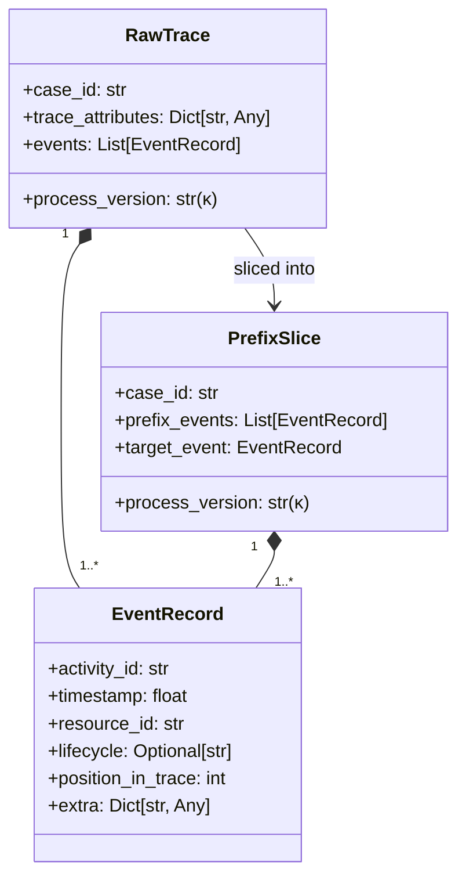
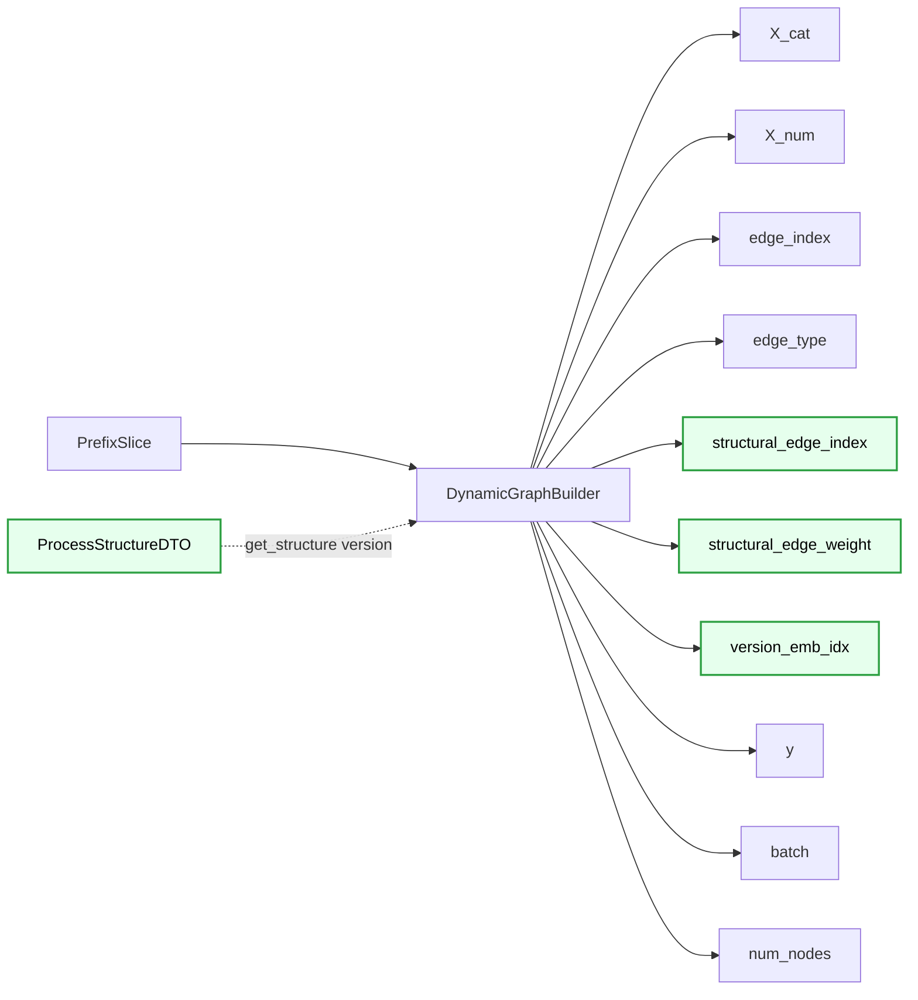
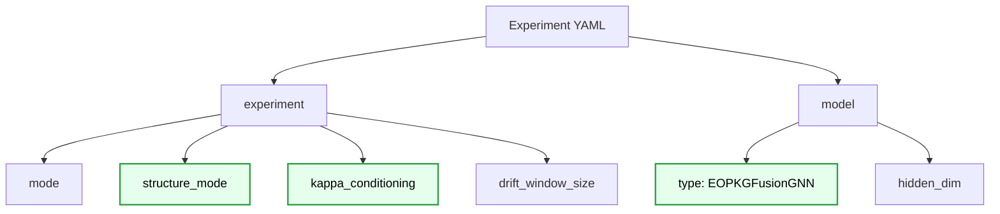
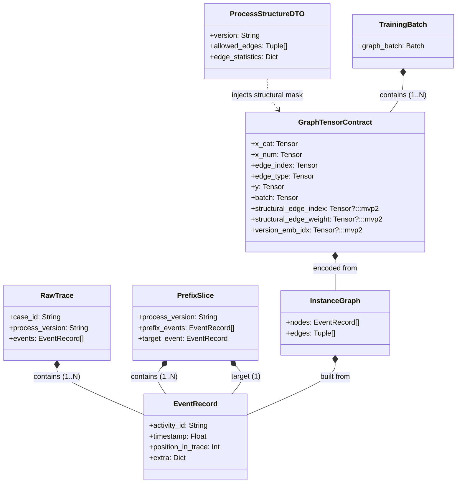

# DATA_MODEL_MVP2.MD

## 0. Canon & Naming Rules
- **Scope:** MVP2 (EOPKG Fusion GNN & Zero-Shot Knowledge Injection).
- **Інваріант сумісності:** Усі зміни структури даних зберігають повну зворотну сумісність із MVP1 (використання `Optional`).
- Symbolic notation follows `VARIABLES.MD`.

---

## 1. External Boundary Objects (Adapters Layer)

Об'єкти `EventRecord` та `RawTrace` залишаються сумісними з MVP1, але для MVP2 поле `process_version` ($\kappa$) стає критично важливим маршрутизатором для графа знань.

### 1.1 Boundary DTO Composition (Cascade)



---

## 2. Нові Knowledge Graph DTOs (Domain Layer)

Для передачі нормативної структури (BPMN-каркасу) від TopologyExtractor (або Neo4j у майбутньому) до `DynamicGraphBuilder` вводиться новий контракт.

### 2.1 ProcessStructureDTO
```python
class ProcessStructureDTO(BaseModel):
    version: str # Відповідає \kappa
    allowed_edges: List[Tuple[str, str]] # Список дозволених переходів (Activity A -> Activity B)
    edge_statistics: Optional[Dict[Tuple[str, str], Dict[str, float]]] = None # Опціональна статистика для MVP2+
```

---

## 3. Graph Tensor Contract (The Core Extension)

Найважливіша зміна MVP2: розширення єдиного формату даних, який приймає нейромережа, додаванням нормативних масок.

### 3.1 Розширений контракт
```python
class GraphTensorContract(TypedDict):
    # --- MVP1 (Обов'язкові поля локального графа G_obs) ---
    x_cat: torch.LongTensor      # X_cat \in \mathbb{N}^{N \times F_cat}
    x_num: torch.FloatTensor     # X_num \in \mathbb{R}^{N \times F_num}
    edge_index: torch.LongTensor # edge_index \in \mathbb{N}^{2 \times E}
    edge_type: torch.LongTensor  # edge_type \in \mathbb{N}^{E}
    y: torch.LongTensor          # y \in \mathbb{N}^{1}
    batch: torch.LongTensor      # batch \in \mathbb{N}^{N}
    num_nodes: int               # N
    
    # --- MVP2 (Опціональні поля нормативного графа G_struct) ---
    structural_edge_index: Optional[torch.LongTensor] = None # \in \mathbb{N}^{2 \times E_struct}
    structural_edge_weight: Optional[torch.FloatTensor] = None 
    version_emb_idx: Optional[torch.LongTensor] = None       # Індекс \kappa для embedding шару
```

### 3.2 Graph Tensor Attribute Cascade



---

## 4. Experiment Configuration Schema (MVP2 Updates)

Конфігурація експерименту розширюється осями дослідження з `ARCHITECTURE_GUIDELINES.MD`.

### 4.1 Додані поля конфігурації
```yaml
experiment:
  # ... параметри MVP1 (mode, windows) ...
  # Нові дослідницькі осі MVP2:
  structure_mode: "epokg"         # logs_only | bpmn | epokg
  kappa_conditioning: "static"    # none | static | latent

model:
  type: "EOPKGFusionGNN"          # Динамічно завантажується через ModelFactory
  hidden_dim: 64
  # ...
```

### 4.2 Config Cascade Structure (MVP2)


---

## 5. Object Composition Schema (Що є частиною чого)

Ця глобальна діаграма відображає структурну залежність (композицію) об'єктів моделі даних для MVP2. Вона показує, як нормативні знання (EOPKG) інтегруються в існуючий потік тензорів.



## 6. Tensor Shape Invariants (Оновлено)
Для одного графа (суміш $G_{obs}$ та $G_{struct}$):
\[
X_{cat} \in \mathbb{N}^{N \times F_{cat}}, \quad X_{num} \in \mathbb{R}^{N \times F_{num}}
\]
\[
edge\_index_{obs} \in \mathbb{N}^{2 \times E_{obs}}
\]
\[
edge\_index_{struct} \in \mathbb{N}^{2 \times E_{struct}} \quad \text{(Optional)}
\]
Цільова змінна:
\[
y \in \{0,\dots,C-1\}
\]