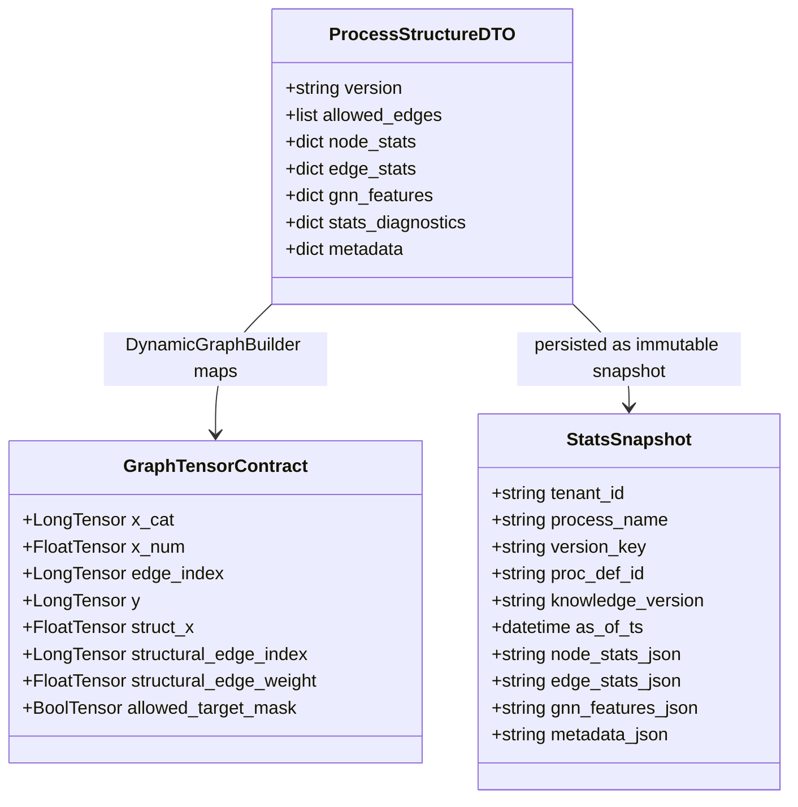

# DATA_MODEL_MVP2_5.MD

Updated: 2026-03-19
Status: ACTIVE (Stage 3.4 contract freeze)

## 1. Purpose
Canonical DTO and artifact contracts for MVP2.5:
1. structure ingestion,
2. runtime assembly,
3. stats snapshots,
4. model tensor consumption.

## 2. Core DTOs

### 2.1 `ProcessEventDTO`
Runtime event DTO (Camunda adapter output) used by stats sync and IG assembly.

Important diagnostic field:
1. `removal_time: datetime | None`

### 2.2 `ProcessStructureDTO`
Source: `src/domain/entities/process_structure.py`

Required:
1. `version: str`
2. `allowed_edges: list[tuple[str, str]]`

Optional structure:
1. `proc_def_id`, `proc_def_key`, `deployment_id`
2. `nodes`, `edges`
3. `edge_statistics`, `node_metadata`
4. `call_bindings`, `graph_topology`, `metadata`

Optional stats payload (Stage 3.4):
1. `node_stats: dict`
2. `edge_stats: dict`
3. `gnn_features: dict`
4. `stats_diagnostics: dict`

### 2.3 `RuntimeFetchDiagnosticsDTO`
Operational diagnostics for runtime data quality:
1. `history_coverage_percent`
2. `cleaned_instances_percent`
3. `fallback_triggered`
4. `fallback_reason`
5. `warnings`

## 3. Stats Snapshot Contract

Snapshot is immutable and append-only.

### 3.1 Strict identity key
1. `tenant_id`
2. `process_name`
3. `version_key`
4. `proc_def_id`
5. `knowledge_version`

### 3.2 Payload policy
No normalization into dedicated `NodeStat`/`EdgeStat` graph nodes.
All stats are stored as JSON payload fields.

Snapshot payload fields:
1. `node_stats_json`
2. `edge_stats_json`
3. `gnn_features_json`
4. `stats_diagnostics_json`
5. `metadata_json`

### 3.3 Timestamp fields
1. `as_of_ts`: snapshot temporal cutoff.
2. `created_at_utc`: repository write timestamp.

## 4. `metadata.stats_index` Contract

`sync-stats` writes flattened indexes for fast tensor assembly:
1. `metadata.stats_index.node`
2. `metadata.stats_index.edge`
3. `metadata.stats_index.global`

Key format:
1. `"<window>.<scope>.<metric>"`
2. example: `"last_30d.version.exec_count"`

## 5. GraphTensorContract (MVP2 extension)

Optional fields used by EOPKG path:
1. `structural_edge_index: torch.LongTensor | None`
2. `structural_edge_weight: torch.FloatTensor | None`
3. `allowed_target_mask: torch.BoolTensor | None`
4. `struct_x: torch.FloatTensor | None`

Current Stage 3.4 semantics:
1. `struct_x` is built from `metadata.stats_index` mapping.
2. Shape: `[num_classes, num_graph_features]`.
3. Dtype: `float32`.
4. Missing values use configured defaults.

## 6. Quarantine Contract (BPMN parser)

Required fields:
1. `proc_def_id`
2. `proc_def_key`
3. `deployment_id`
4. `version`
5. `error_code`
6. `error_message`
7. `source_hint`
8. `xml_snippet`
9. `created_at`

## 7. Object Composition Schema

## 8. Compatibility Rules
1. MVP1-compatible fields remain unchanged.
2. Missing optional MVP2.5 fields must not break baseline training.
3. Unknown future stats keys are ignored by current builder unless explicitly mapped.
