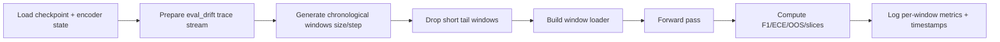
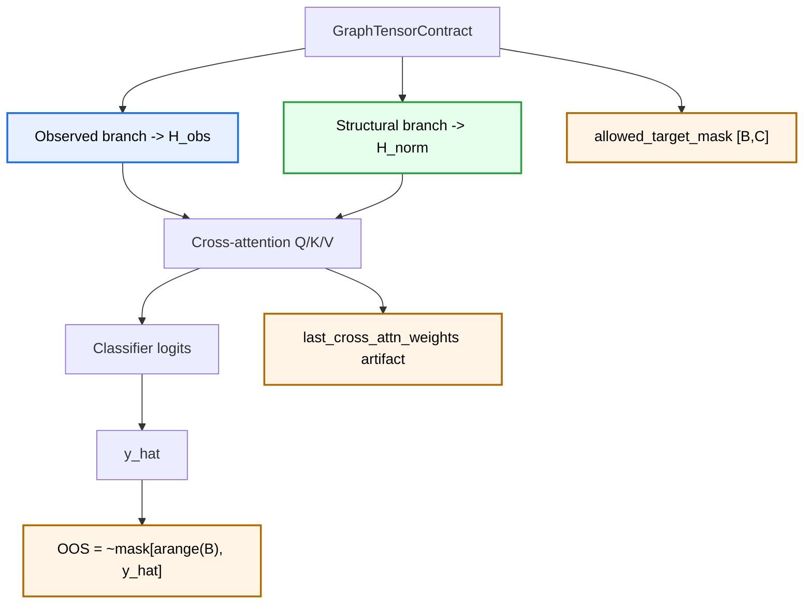

# EVF_MVP2.MD

## 1. Purpose
Methodology for comparing MVP1 baselines (`BaselineGCN`, `BaselineGATv2`) vs MVP2 (`EOPKGGATv2` Dual-Encoder + Soft Cross-Attention) under identical data and split policies.

Primary evaluation focus:
1. Predictive quality under drift (`F1`, `Accuracy`).
2. Calibration stability (`ECE`).
3. Structural hallucination control (`OOS`).
4. Slice behavior by process version and prefix length.

## 2. Experimental Protocol
1. Data freeze:
- Use the same source log and deterministic preparation.
- Apply cascade filter in strict order: temporal sort -> macro split (`train_ratio`) -> fraction -> micro split (`split_ratio`).

2. Baseline run:
- Train baseline model with the same training protocol.
- Evaluate on same validation/test/drift windows.

3. EOPKG run:
- Build topology registry from train traces only (`TopologyExtractorService.extract_from_logs(train_traces)`).
- Train/evaluate `EOPKGGATv2` with identical optimization settings.

4. Drift run:
- Use chronological windows with `size=drift_window_size`, `step=drift_window_sliding or size`.
- Drop short tail windows (`len(window) < size`).

## 3. Scientific Hypotheses and Success Criteria

### H1 Drift resilience
Expectation: `EOPKGGATv2` has lower F1 degradation than baseline on drift windows.

\[
\Delta F1 = F1_{pre\_drift} - F1_{drift}
\]

Success criterion:
\[
\Delta F1_{EOPKG} < \Delta F1_{Baseline}
\]

### H2 Calibration stability
Expectation: `ECE` growth under drift is smaller for EOPKG model.

\[
\Delta ECE = ECE_{drift} - ECE_{pre\_drift}
\]

### H3 OOS control
Expectation: OOS rate is lower for EOPKG on structurally constrained regimes.

\[
OOS = \frac{1}{B} \sum_{i=1}^{B} \mathbb{1}[\hat{y}_i \notin \mathcal{A}_i]
\]

Where \(\mathcal{A}_i\) is allowed target set from `allowed_target_mask`.

### H4 Version consistency
Expectation: quality does not collapse for specific process versions.

Tracked keys:
- `test_f1_<version>`
- `test_accuracy_<version>`
- `test_oos_<version>` (if mask exists)

### H5 Prefix-length robustness
Expectation: model remains stable on long prefixes.

Length bins:
- `len_1_5`
- `len_6_10`
- `len_11_20`
- `len_21_plus`

## 4. Metric Contract and Logging Schema

Global metrics:
- `test_macro_f1`
- `test_weighted_f1`
- `test_accuracy`
- `test_top3_accuracy`
- `test_ece`
- `test_oos` (`None` when mask unavailable)
- `test_precision_macro`
- `test_recall_macro`

Sliced metrics:
- By length: `test_f1_len_1_5`, `test_oos_len_6_10`, etc.
- By version: `test_f1_v1`, `test_accuracy_v2`, `test_oos_v2`, etc.

Drift metrics per window:
- `window_macro_f1`
- `window_test_ece`
- `window_start_ts`
- `window_end_ts`

## 5. Drift Evaluation Protocol (Operational)

Anti-leakage invariant:
- No topology fitting on evaluation windows.
- Topology is extracted only from train split.

## 6. Dual-Encoder Evaluation View (Tensor + Explainability)

Interpretability note:
- `last_cross_attn_weights` should be captured as a research artifact (heatmap/table) for qualitative analysis across drift windows.
