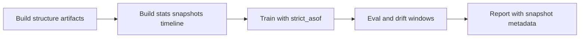

# EVF_MVP2_5.MD

Updated: 2026-04-27
Status: ACTIVE

## 1. Purpose
Evaluation framework for MVP2.5 with offline topology + offline stats snapshots.

## 2. Scientific Validity Goals
1. prevent future leakage,
2. keep reproducible artifact timeline,
3. compare baseline vs EOPKG fairly.

## 3. Stage 3.4 Temporal Policy

### 3.1 Artifact preparation order
1. `ingest-topology` or `sync-topology`
2. `sync-stats` (optional repeated timeline snapshots)
3. train/eval/infer

### 3.2 Snapshot timestamp source
1. explicit `--as-of`: fixed historical cutoff.
2. no `--as-of`: derived snapshot cutoff `effective_as_of=max(event_ts)` after train-cut selection.

### 3.3 Runtime retrieval policy
1. `stats_time_policy = strict_asof`:
   - lookup uses prefix last-event time.
2. `stats_time_policy = latest`:
   - lookup uses latest snapshot/structure.

## 4. Recommended Research Protocol

For drift-safe studies:
1. Build periodic snapshot timeline (for example monthly).
2. Use isolated experiment namespace/storage.
3. Run train/eval with `experiment.stats_time_policy = strict_asof`.
4. Use `experiment.on_missing_asof_snapshot = raise` for dissertation-grade evidence.
5. Keep fixed seed and identical train split for baseline and EOPKG.

## 5. Leakage Risk Notes
1. If no eligible snapshot exists for requested `as_of`, runtime behavior is controlled by `experiment.on_missing_asof_snapshot`.
2. Fallback policies (`disable_stats`, `use_base`) must be explicitly reported in experiment notes and treated as exploratory.
3. For strict historical studies, ensure snapshots cover required timeline points.

## 6. Metrics
Mandatory:
1. Accuracy
2. F1 macro
3. ECE
4. OOS (when mask exists)

Optional sliced metrics:
1. by process version
2. by prefix length bins

## 7. Stats Enrichment Audit Metrics
Track in reports:
1. `history_coverage_percent`
2. `cleaned_instances_percent`
3. `fallback_triggered`
4. `knowledge_version`
5. effective `as_of_ts`

## 8. Experiment Reproducibility Checklist
1. Save config artifact.
2. Save sync-topology summary.
3. Save sync-stats summary (with `as_of` value).
4. Log backend mode and storage path.
5. Log selected process/version scope.
6. Run non-regression tests.

## 9. Validation Commands
```bash
.\.venv\Scripts\python.exe main.py sync-topology --config <sync_topology.yaml> --out outputs/sync_topology.json
.\.venv\Scripts\python.exe main.py sync-stats --config <sync_stats.yaml> --as-of 2024-01-01T00:00:00Z --out outputs/sync_stats_asof.json
.\.venv\Scripts\python.exe main.py --config <train_or_eval.yaml>
.\.venv\Scripts\python.exe -m pytest -m mvp1_regression -v
```

## 10. Evaluation Timeline Diagram

