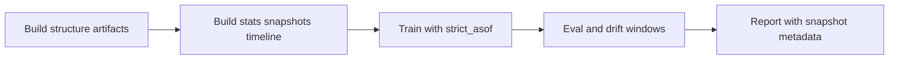

# EVF_MVP2_5.MD

Updated: 2026-05-20
Status: ACTIVE

## 1. Purpose
Evaluation framework for MVP2.5 with offline topology + offline stats snapshots.

## 2. Scientific Validity Goals
1. prevent future leakage,
2. keep reproducible artifact timeline,
3. compare baseline vs EOPKG fairly.

## 3. Stage 3.4 Temporal Policy

### 3.1 Artifact preparation order
1. `ingest-topology` or `sync-topology`
2. `sync-stats` (optional repeated timeline snapshots)
3. train/eval/infer

### 3.2 Snapshot timestamp source
1. explicit `--as-of`: fixed historical cutoff.
2. no `--as-of`: derived snapshot cutoff `effective_as_of=max(event_ts)` after train-cut selection.

### 3.3 Runtime retrieval policy
1. `stats_time_policy = strict_asof`:
   - lookup uses prefix last-event time.
2. `stats_time_policy = latest`:
   - lookup uses latest snapshot/structure.

## 4. Recommended Research Protocol

For drift-safe studies:
1. Build periodic snapshot timeline (for example monthly).
2. Use isolated experiment namespace/storage.
3. Run train/eval with `experiment.stats_time_policy = strict_asof`.
4. Use `experiment.on_missing_asof_snapshot = raise` for dissertation-grade evidence.
5. Keep fixed seed and identical train split for baseline and EOPKG.
6. For small topology-conditioned experiments on versioned logs, use
   `experiment.fraction_strategy=versioned` to sample a fraction per process
   version instead of only the earliest chronological slice.
7. Use `experiment.split_strategy=versioned` when train/val/test must preserve
   per-version proportions.
8. Use `experiment.version_scope_policy=train_cut` when future-version leakage
   must be prevented: train uses only versions known before `train_ratio`, while
   eval tail keeps future versions for drift/zero-shot checks.

## 5. Leakage Risk Notes
1. If no eligible snapshot exists for requested `as_of`, runtime behavior is controlled by `experiment.on_missing_asof_snapshot`.
2. Fallback policies (`disable_stats`, `use_base`) must be explicitly reported in experiment notes and treated as exploratory.
3. For strict historical studies, ensure snapshots cover required timeline points.

## 6. Metrics
Mandatory:
1. Accuracy
2. F1 macro
3. ECE
4. OOS (when mask exists)

`top3_accuracy` is a diagnostic metric. For small class spaces the runtime uses
an effective `k = min(3, n_classes - 1)` when `n_classes > 2`; for binary or
single-class windows it falls back to plain accuracy. This avoids meaningless
perfect top-k scores when `k >= n_classes`.

### 6.1 Topology-Mask Uniform Baseline Metrics

`eval_topology_mask_uniform` reports a topology-only control, not a learned
model score. Primary fields:

1. `uniform_mask_expected_accuracy`: analytical expected accuracy from uniform
   probability mass over allowed topology candidates.
2. `test_target_in_mask_rate`: structural ceiling indicator; it is not an F1
   upper bound.
3. `mask_failure_{count,rate}` and `ranking_eligible_{count,rate}`: separate
   target-out-of-mask rows from in-mask ranking rows.
4. `mask_card_{1,2,3_plus}_{count,rate}`, `mean_mask_cardinality`,
   `median_mask_cardinality`, `candidate_reduction_ratio_{mean,median}`.
5. `strict_test_macro_f1_mc_mean`, `strict_test_macro_f1_mc_std`, and
   `strict_test_macro_f1_mc_sampling_uncertainty_95_{low,high}` for seeded
   Monte Carlo draw reporting. The interval is conditional on the fixed
   evaluation set and is not a dataset-level significance claim.
6. `test_macro_f1_mc_*` follows the existing `ModelTrainer` hybrid semantics:
   valid multi-candidate mask hits are treated as admissible for the hybrid
   target, while singleton rows remain strict.
7. `strict_error_but_allowed_rate_mc_*` is computed per seeded draw. For valid
   MOU rows the prediction is always inside the topology mask, so each strict
   miss is a structurally allowed error.

The research default for empty masks is `raise`. `record_invalid` is allowed
only to report empty rows without falling back to the whole candidate space.

### 6.2 RS-01 Outcome Partition Audit

`RS-01` is an evaluation-only audit contract for `eval_drift` and MOU
diagnostics. It does not change logits, masks, checkpoints, datasets, training,
or historical metric definitions.

For cross-model comparisons, contract `state_aware_activity_label_mask.v2`
uses one canonical policy applied automatically to every `eval_*` run. A model may still use
its own decoding mask to select a prediction. The selected prediction is then
evaluated against the common state-aware mask. Mask construction preserves the
reference structural-candidate identities and cardinality basis before projecting
the selected candidates to canonical activity labels. Duplicate activity labels
therefore do not alter structural cardinality limits.

The valid audited population is partitioned into exactly three instance-level
cells:

1. `strict_correct`
2. `parallelism_admissible_error`
3. `oos_error`

`parallelism_admissible_error_rate` is an instance-level mask-admissible
alternative error rate. It is not a BPMN parallel-gateway detector and does not
establish causal source. `strict_test_macro_f1` is class-balanced and is not
additive with the error partition.

For valid audited rows only:

```text
strict_correct_rate + parallelism_admissible_error_rate + oos_error_rate = 1
```

Exact-correct predictions outside the current mask are retained as
`exact_outside_mask_*` diagnostics and do not enter `oos_error_rate`. Empty
masks are valid under the v2 common-mask contract: exact predictions remain
strict-correct and wrong predictions are out-of-mask errors. Unknown predictions,
unknown observed targets, and unresolved mask construction are excluded from the
valid denominator and reported against `audited_prefix_count`. An activity label
observed in XES remains a valid target when it is absent from a checkpoint's
closed vocabulary.

The common safety bridge is:

```text
common_oos_rate = oos_error_rate + exact_outside_mask_rate
common_pred_in_mask_rate = 1 - common_oos_rate
```

Both identities and `common_target_in_mask_rate` use
`common_safety_denominator_count=valid_prediction_count`. Exports must include
the numerator counts, `audited_prefix_count`, exclusions, abstentions, prediction
coverage, audit coverage, the metric contract, and the reference policy identity.
Legacy `test_oos` retains its historical mask semantics and must be labelled as
such when presented alongside common safety metrics.
Overlapping drift windows are descriptive slices and are not independent
observations.

`eval_drift` logs the same three RS-01 rates once at endpoint scope over the
selected non-overlapping evaluation population, alongside `audited_prefix_count`,
`valid_prediction_count`, `excluded_count`, and `unresolved_mapping_count`.
These endpoint metrics are the article-facing denominator evidence; moving
window metrics remain temporal diagnostics only.

Optional sliced metrics:
1. by process version
2. by prefix length bins

Qualitative diagnostics:

1. Selective structural prediction traces may be enabled through
   `tracking.tracing.*`.
2. Traces explain individual predictions and structural-path contribution.
3. Traces are not primary evidence for article/dissertation conclusions.
4. Primary evidence remains aggregate metrics, drift-window metrics,
   calibration/ECE, OOS/mask diagnostics, and seed variance.

## 7. Stats Enrichment Audit Metrics
Track in reports:
1. `history_coverage_percent`
2. `cleaned_instances_percent`
3. `fallback_triggered`
4. `knowledge_version`
5. effective `as_of_ts`

## 7.1 Learning Strategy Evaluation Notes

`training.learning_strategy` is part of experiment interpretation:

1. `standard` is the control strategy and must preserve previous training behavior.
2. `topology_conditioned` adds train-only topology dependency objectives while
   keeping the selected `model.fusion_mode` unchanged.
3. Compare `standard` vs `topology_conditioned` with identical data split,
   seed set, `fusion_mode`, mask setting, and stats setting.
4. Track:
   - `topology_conditioned_wrong_version_ce_delta`
   - `topology_conditioned_drop_edges_ce_delta`
   - `topology_conditioned_allowed_set_loss`
   - `topology_conditioned_retention_loss`
   - `topology_conditioned_mixed_version_batches`
   - `topology_conditioned_wrong_version_skipped_mixed_batches`
5. Positive `wrong_version_ce_delta` means the correct topology gives lower CE
   than a known wrong-version topology.
6. Mixed-version batch counters must be reported when interpreting transition
   windows.

## 8. Experiment Reproducibility Checklist
1. Save config artifact.
2. Save sync-topology summary.
3. Save sync-stats summary (with `as_of` value).
4. Log backend mode and storage path.
5. Log selected process/version scope.
6. Run non-regression tests.

## 9. Validation Commands
```bash
.\.venv\Scripts\python.exe main.py sync-topology --config <sync_topology.yaml> --out outputs/sync_topology.json
.\.venv\Scripts\python.exe main.py sync-stats --config <sync_stats.yaml> --as-of 2024-01-01T00:00:00Z --out outputs/sync_stats_asof.json
.\.venv\Scripts\python.exe main.py --config <train_or_eval.yaml>
.\.venv\Scripts\python.exe -m pytest -m mvp1_regression -v
```

## 10. Evaluation Timeline Diagram

```mermaid
flowchart LR
    T0[Build structure artifacts] --> T1[Build stats snapshots timeline]
    T1 --> T2[Train with strict_asof]
    T2 --> T3[Eval and drift windows]
    T3 --> T4[Report with snapshot metadata]
```
