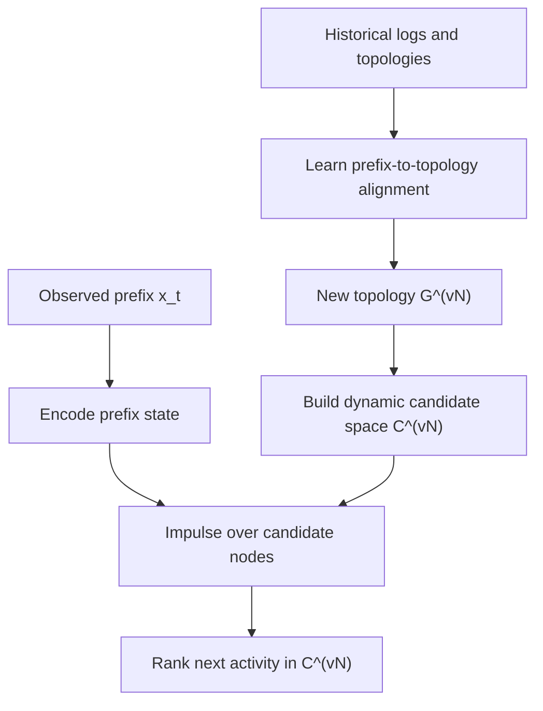
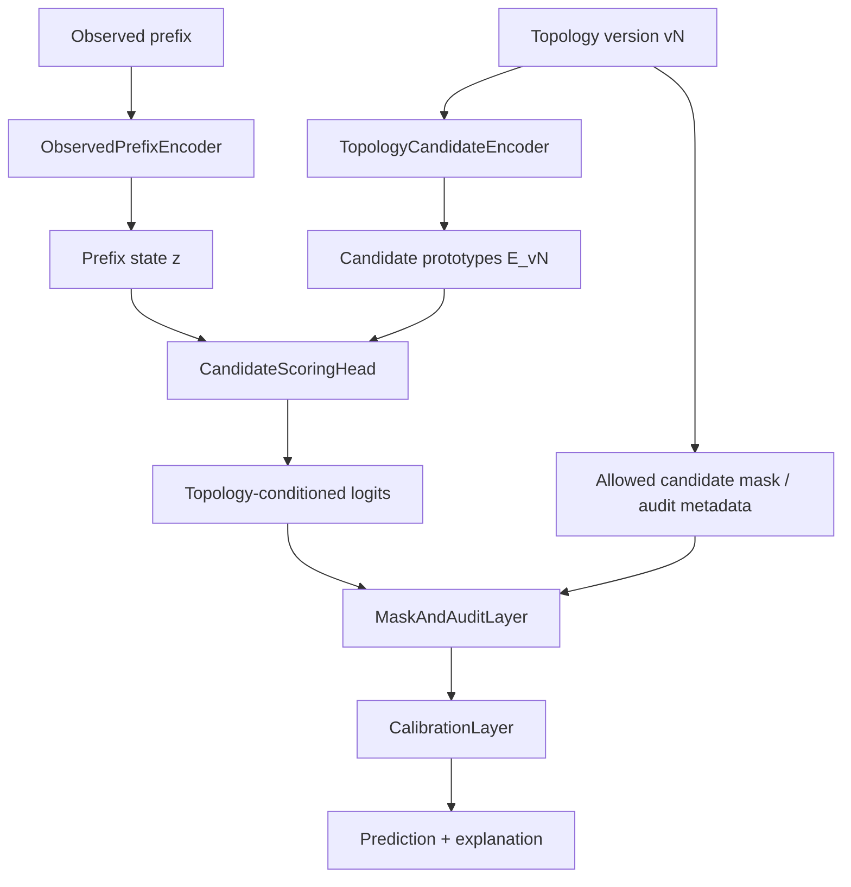
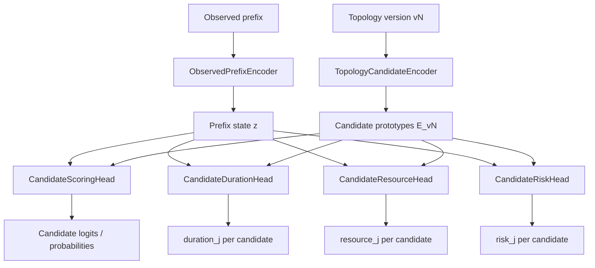

# GNN_LEARNING_METODOLOGY.MD

Methodology-level roadmap for structure-conditioned zero-shot adaptation in
MVP2.5+.

This document is intentionally separate from `docs/GNN_LEARNING_STRATEGY.MD`.
`GNN_LEARNING_STRATEGY.MD` describes concrete implemented or near-implemented
training strategies and fusion architecture behavior. This document defines the
research methodology target: how the project should move from fixed-head
fusion ablations to business-valid topology-conditioned zero-shot prediction.

---

## Metadata

- `status`: proposed
- `audience`: human-and-agent
- `source_of_truth`: methodology direction
- `language_policy`: keys and section headers in English, explanations in Ukrainian
- `last_updated`: 2026-05-25
- `related_docs`:
  - `docs/GNN_RUNTIME_MVP2_5.MD`
  - `docs/GNN_LEARNING_STRATEGY.MD`
  - `docs/EVF_MVP2_5.MD`
  - `docs/VARIABLES.MD`
  - `docs/current/project-state.md`
  - `docs/current/architecture-debt.md`
  - `docs/dissertation_changes.MD`

---

## Research Goal

Target hypothesis:

```text
Historical versions provide logs and topology.
The model learns how topology conditions next-activity prediction.
When a new topology vN appears before enough vN logs exist,
the model can use topology vN as a prediction condition.
```

Target objective:

```text
P(y_next | observed_prefix, topology_version)
```

The methodology must support:

- `zero_shot_topology_adaptation`: use new topology before new logs are available;
- `candidate_set_drift`: handle added/removed BPMN nodes and activity candidates;
- `calibrated_prediction`: avoid overconfident wrong predictions after drift;
- `business_explainability`: explain whether a prediction came from observed
  prefix evidence, topology constraints, candidate prototypes, or mask/audit rules.

---

## Active Hypothesis Path

The active methodology path is topology-native candidate scoring with impulse
activation routing. This is different from simply adding structure as another
feature stream. The current process version defines the candidate universe
`C^(v)`, and the prefix state is injected into that topology before the model
ranks candidates.



Other structural modes remain valid experiment controls:

- fixed-vocabulary baselines test the static-head limitation;
- `GATv2 + Mask` tests whether topology post-filtering alone is enough;
- historical EOPKG fusion modes test whether adding structure as features,
  logits, or cross-attention is sufficient;
- EOPKG without impulse tests whether topology-native candidates alone are
  enough.

The active hypothesis is stronger: topology is not only an auxiliary signal. It
defines the version-specific candidate space and provides the graph over which
prefix state is propagated before prediction.

---

## Current Evidence

Recent experiments and audit show:

1. Simple structural fusion can reduce some diagnostics such as OOS/ECE, but
   does not yet provide stable strict-F1 improvement after structural drift.
2. Stronger structural scale can worsen drift by creating negative transfer.
3. StructXAttn requires stable residual normalization before conclusions about
   cross-attention are valid.
4. The topology drift audit confirmed that post-drift failures are not only
   fusion-scale failures. They include:

```text
changed_transition_zone
oos_prediction
strict_error_but_allowed
new topology candidate risk
```

For the `loan_v1_v4_simulated` audit, v4 adds BPMN activity id
`Activity_07k7tyn` (`Monitor Ten`). This is a direct candidate-set drift signal.

Methodological conclusion:

```text
Do not keep optimizing only fusion strength.
Move toward topology-conditioned candidate scoring.
```

---

## Problem Decomposition

### Problem 1: Fixed Parametric Head

Current classifier:

```text
logits = Linear(hidden_dim, C_train)
```

This is insufficient for business-valid zero-shot when a new topology adds
candidates not represented during training.

Why:

- the output dimension is tied to the training vocabulary;
- unseen or rare candidates receive no reliable supervised signal;
- topology can know a candidate exists before the classifier can score it
  meaningfully;
- the model may confidently choose a seen class even when topology suggests a
  new route.

### Problem 2: Conditional Structure Shift

Structural drift changes more than feature distribution. It can change:

```text
allowed successors
candidate set
route semantics
topology-conditioned P(y | prefix)
```

This matches graph conditional structure shift research: aligning only node
representations is often insufficient when structure changes the conditional
relationship between inputs and labels.

### Problem 3: Stream Normalization And Calibration

Dual-stream models can fail because the structural stream:

- dominates observed evidence;
- becomes too weak and is ignored;
- is amplified by residual LayerNorm artifacts;
- produces overconfident OOS predictions after drift.

Therefore, flow normalization and calibration are not optional diagnostics;
they are part of the methodology.

### Problem 4: Interpretability Gap

For dissertation/business use, it is not enough to show a metric delta. The
system must explain:

```text
Was the predicted candidate allowed by topology?
Was the true target in the mask?
Was the prefix in a changed transition zone?
Was the candidate new/removed in this topology version?
Did structure flip the prediction?
How confident was the model when it went OOS?
```

---

## Methodology Levels

### Level 0: Fixed-Head Fusion Ablations

Purpose:

```text
Establish what simple structure injection can and cannot do.
```

Applicable current modes:

```text
ClassMeanAttention
ClassMeanConcat
ClassAwareStructuralScoring
TopologyStateEncoder
TopologyStateGraphEncoder
StructuralPriorEncoder
StructXAttn
```

Expected contribution:

- useful for ablation;
- useful for showing that structure can affect OOS/ECE/mask diagnostics;
- not sufficient as final zero-shot method when candidate set changes.

Status:

```text
implemented / experimental
```

### Level 1: Stabilized Dual-Stream Fusion

Purpose:

```text
Make structural signal safe before training stronger topology dependency.
```

Required mechanisms:

- Pre-LN or context normalization before residual merge;
- bounded structural delta ratio;
- stream dropout / modality dropout;
- gradient and scale diagnostics;
- OOS confidence and calibration diagnostics.

Target metrics:

```text
struct_xattn_raw_to_observed_ratio
struct_xattn_pre_norm_to_observed_ratio
struct_xattn_post_norm_to_observed_ratio
structural_flip_rate
oos_confidence_mean
nll
ece
```

Status:

```text
partially implemented for StructXAttn stabilization
```

### Level 2: Topology-Conditioned Candidate Scoring

Purpose:

```text
Replace fixed class scoring with scoring against topology-version candidates.
```

Core idea:

```text
z_prefix = ObservedEncoder(prefix)
E_candidates_v = TopologyCandidateEncoder(topology_v)
score_j = sim(z_prefix, E_candidates_v[j])
```

Prediction:

```text
y_hat = argmax_j score_j, where j belongs to candidates(topology_v)
```

Recommended scoring:

```text
score_j = cosine(normalize(z_prefix), normalize(e_j)) / tau
```

or controlled bilinear scoring:

```text
score_j = z_prefix^T W e_j
```

Interpretation:

Модель не питає: "який з C_train класів обрати?". Вона
питає: "який candidate з поточної topology найкраще відповідає
поточному prefix-state?".

This is the main target level for business-valid zero-shot.

Status:

```text
partially implemented: EOPKGTopologyConditioned can score topology-local
candidates, and impulse_activation_routing adds prefix-state impulse propagation
over the current topology before candidate scoring
```

Impulse Activation Routing is the first Level 2 dynamic routing implementation.
It keeps the observed prefix encoder active, injects `struct_prefix_state_x` as
an execution impulse into topology candidate nodes, propagates that impulse over
the current BPMN/EOPKG edges, and scores `candidate_logits [B, K_v]` directly.

It intentionally does not add another fixed-head `EOPKGGATv2.fusion_mode`.
Projection to fixed activity labels is only for legacy metrics and comparison.

### Level 3: Semantic-Topological Candidate Prototypes

Purpose:

```text
Support new activity candidates with little or no log supervision.
```

Candidate prototype:

```text
e_j = f_semantic(activity_name_j, BPMN_metadata_j)
e_j = GNN_struct(e_j, topology_edges_v)
```

Before `f_semantic`, labels must pass a normalization and quality gate:

```text
raw BPMN label -> normalized text -> abbreviation expansion -> quality flag
```

Semantic embeddings are evidence, not ground truth. Low-quality labels must be
audited separately from architecture failure.

Possible sources:

- BPMN node id;
- BPMN task name;
- lane/role/resource metadata;
- gateway context;
- predecessor/successor context;
- stats snapshot if available;
- textual description if available.

Zero-shot benefit:

```text
new candidate has an embedding before it has logs
```

This is the clean answer to added-node / new-candidate drift.

Status:

```text
target methodology, staged after Level 2
```

### Level 4: Versioned Operational Learning Loop

Purpose:

```text
Evaluate the methodology as a business lifecycle, not isolated train/eval runs.
```

Lifecycle:

1. train on known versions and logs;
2. new topology appears;
3. run `pre_adaptation_zero_shot_eval` using new topology only;
4. accumulate new logs;
5. adapt with controlled rehearsal;
6. evaluate seen and future tails;
7. advance version.

This belongs to future `experiment.mode=versioned_zero_shot`.

Status:

```text
planned after candidate scoring architecture is defined
```

---

## Recommended Target Architecture

### Main Components

```text
ObservedPrefixEncoder
TopologyCandidateEncoder
CandidateScoringHead
TopologyMaskAndAuditLayer
CalibrationLayer
VersionedLearningLoop
```

### Data Flow



### Candidate Scoring Contract

Inputs:

```text
z_prefix: FloatTensor [B, D]
candidate_embeddings: FloatTensor [B or 1, C_v, D]
candidate_ids: list[str] per version
allowed_candidate_mask: BoolTensor [B, C_v]
```

Outputs:

```text
candidate_logits: FloatTensor [B, C_v]
candidate_probs: FloatTensor [B, C_v]
prediction_candidate_id
explanation_payload
```

Important:

```text
C_v is version-specific.
It must not be assumed equal to C_train.
```

Metric interpretation:

```text
strict_* = exact next-activity quality in the active prediction space.
```

For Baseline and other fixed-head models, the active prediction space is the
fixed activity vocabulary learned during training. For
`EOPKGTopologyConditioned` with `candidate_id + topology_native`, the active
prediction space is the version-specific candidate set `C_v`. Therefore the
same `strict_*` metric names are used for article/dissertation comparisons, but
the topology-conditioned model receives credit for a correct unseen candidate
when its `candidate_id` or `candidate_label` matches the next event label in
the log.

Candidate-local numeric offsets are implementation details of one compiled
topology and are not stable across versions. Macro-F1, accuracy slices, and
drift-window metrics must use stable activity labels/ids as metric keys.

Fixed-vocabulary compatibility metrics are logged separately as
`fixed_label_*`. They are useful for debugging vocabulary collapse to `<UNK>`,
but they are not the primary evidence for zero-shot topology-native prediction.

Calibration and negative log-likelihood follow the same rule. Primary
`test_ece` and `test_set_nll` are evaluated in the active stable-label
prediction space. A fixed-head Baseline that confidently predicts `<UNK>` for a
future activity therefore receives poor primary ECE/NLL, even if its numeric
fixed-vocabulary target index is also `<UNK>`. The legacy numeric interpretation
is retained only under `fixed_label_test_ece` and `fixed_label_test_set_nll`.

---

## Training Methodology

### Stage A: Observed Prefix Pretraining

Goal:

```text
Learn robust prefix dynamics without over-relying on topology.
```

Loss:

```text
L_observed = CE(fixed_head(z_prefix), y)
```

Usage:

- establishes observed baseline;
- can initialize the observed encoder;
- prevents topology stream from becoming a crutch.

### Stage B: Candidate Prototype Alignment

Goal:

```text
Align prefix embeddings with topology candidate embeddings.
```

Loss:

```text
L_metric =
  -log exp(sim(z_prefix, e_y) / tau)
       / sum_j exp(sim(z_prefix, e_j) / tau)
```

This replaces or complements fixed CE.

Important:

- negatives are all valid candidates in the current topology;
- hard negatives are allowed successors that are not the target;
- future topology must not leak into training.

### Stage C: Topology Corruption Sensitivity

Goal:

```text
Force the model to react to topology differences without exploding logits.
```

Preferred losses:

```text
representation-level contrastive loss
candidate-ranking delta loss
```

Avoid first:

```text
unbounded final-CE margin losses that incentivize scale shortcuts
```

Safe objective:

```text
score_correct_topology(y) > score_corrupted_topology(y) + margin
```

but computed on normalized candidate scores or representation similarity.

### Stage D: Stream Dropout And Calibration

Goal:

```text
Prevent co-adaptation and overconfidence.
```

Mechanisms:

- randomly zero structural contribution during training;
- temperature scaling for candidate logits;
- entropy/OOS confidence monitoring;
- optional confidence penalty for OOS-heavy windows.

### Stage E: Controlled Version Adaptation

Goal:

```text
Adapt when new logs arrive without pretending old versions are equally important forever.
```

Policy:

```text
current version: high weight
recent previous versions: rehearsal_ratio ~= 0.05
older versions: low or decayed weight
future versions: eval only
```

This matches business reality: old versions fade out but may remain active for
running process instances.

---

## Evaluation Protocol

### Required Comparisons

Run at least:

```text
Baseline fixed-head observed-only
Best current fixed-head structural fusion
CandidateScoringHead without semantic prototypes
CandidateScoringHead with semantic-topological prototypes
```

For each:

```text
standard vs topology_conditioned methodology
masked vs unmasked
multiple seeds
same version split policy
```

### Primary Metrics

Do not rely on one strict-F1 line only.

Primary:

```text
degradation_slope_by_version_distance
future_zero_shot_macro_f1
future_zero_shot_strict_macro_f1
oos_rate
ece
nll
candidate_hit_rate
target_in_candidate_set_rate
prediction_in_candidate_set_rate
```

### Audit Metrics

For each drift window:

```text
new_candidate_target_rate
removed_candidate_prediction_rate
changed_transition_zone_error_rate
strict_error_but_allowed_rate
oos_confidence_mean
structural_prediction_flip_rate
candidate_prototype_similarity_to_target
```

### Success Criterion

A run is methodologically better only if:

```text
future-zero-shot degradation slope is lower
AND calibration does not worsen materially
AND OOS does not increase
AND audit does not show hidden candidate-set invalidity
```

---

## Business Interpretation

Prediction explanation should expose:

```text
prefix_last_activity
predicted_candidate_id
target_candidate_id
candidate_seen_in_train
candidate_new_in_topology
prediction_in_allowed_set
target_in_allowed_set
changed_successor_zone
topology_score_component
observed_score_component
semantic_similarity_component
calibrated_confidence
```

Business-readable interpretation:

```text
The model selected activity X because:
1. the observed prefix state is similar to candidate prototype X;
2. topology vN allows X after the current prefix zone;
3. X is a new/changed topology candidate, so confidence is calibrated/audited;
4. no removed candidate was selected.
```

---

## Multi-Task Extension

The methodology must support future predictive monitoring targets beyond
next-activity classification, especially:

```text
next activity duration
next resource / role
remaining time
risk / SLA breach probability
cost or workload
```

These targets should not be implemented as unrelated standalone models by
default. They should extend the same topology-conditioned candidate framework.

### Principle

First predict or score the topology-conditioned candidate, then predict
candidate-conditioned attributes.

```text
P(candidate_j | observed_prefix, topology_v)
E(duration | observed_prefix, topology_v, candidate_j)
P(resource | observed_prefix, topology_v, candidate_j)
P(risk | observed_prefix, topology_v, candidate_j)
```

This avoids averaging incompatible process branches into one scalar regression
target.

### Architecture Pattern



Candidate scoring remains the primary routing task. Additional heads consume
the same prefix representation and candidate prototypes.

### Duration Head

Target:

```text
duration_j = E(duration_seconds | prefix, topology_v, candidate_j)
```

Recommended output:

```text
pred_log_duration_j = DurationHead(z_prefix, e_j)
```

Recommended loss:

```text
L_duration = HuberLoss(
  pred_log_duration_for_true_candidate,
  log1p(true_duration_seconds)
)
```

Interpretation:

Прогноз часу не повинен бути одним scalar для всього prefix. Час
залежить від того, яка гілка процесу буде вибрана. Тому треба
рахувати `duration_j` для кожного candidate або хоча б для top-k candidates.

Business output:

```text
candidate: t_approve_loan
probability: 0.62
expected_duration: 3.1h

candidate: t_return_form
probability: 0.24
expected_duration: 18.5h
```

### Resource / Role Head

Target:

```text
P(resource_or_role | prefix, topology_v, candidate_j)
```

Recommended form:

```text
resource_logits_j = ResourceHead(z_prefix, e_j)
```

This can predict:

- concrete resource id, if stable and business-valid;
- role/lane/group, if concrete resource id is too sparse;
- resource availability bucket, if operational data is available.

### Risk / SLA Head

Target:

```text
P(SLA_breach | prefix, topology_v, candidate_j)
```

This is useful for business decisions because it combines:

- candidate probability;
- expected duration;
- topology route;
- current case state.

### Multi-Task Loss

Generic form:

```text
L_total =
  L_candidate
  + lambda_duration * L_duration
  + lambda_resource * L_resource
  + lambda_risk * L_risk
  + topology_conditioning_losses
```

Rules:

- `L_candidate` remains primary for route prediction.
- Multi-task heads must remain disabled until Level 2 and Level 3 candidate
  scoring show stable strict-F1 / OOS / ECE improvement.
- First implementation must use `stop_gradient(z_prefix)` for auxiliary heads
  so duration/resource/risk losses cannot corrupt the shared prefix encoder.
- Regression/classification heads are trained only when their target labels are
  available and valid.
- Duration/resource/risk losses should be computed for the true next candidate
  first; top-k counterfactual prediction can be added later.
- Do not let auxiliary losses dominate candidate scoring.

### Evaluation

For duration:

```text
MAE_seconds
RMSE_log_duration
MAPE, only when durations are never near zero
calibration by duration bucket
error_by_candidate
error_by_version_distance
```

For resource:

```text
macro_f1
top_k_accuracy
role_level_accuracy
resource_oos_rate
```

For business reporting:

```text
expected_duration_top1
expected_duration_weighted_by_candidate_probability
SLA_risk_top1
SLA_risk_expected_over_top_k
```

### Implementation Implication

This extension should be implemented after the candidate-scoring contract is
introduced. It should not be added directly to the current fixed-head fusion
modes as a single global regression scalar, because that would mix branch
semantics and hide topology drift effects.

---

## Staged Implementation Roadmap

### Phase 1: Methodology Documentation And Audit Baseline

Deliverables:

- this document;
- topology drift audit with `prefix_last_activity`;
- candidate-set drift reporting in dissertation notes.

Exit criteria:

```text
We can explain whether a bad drift run failed due to:
fusion instability, candidate-set drift, mask mismatch, or fixed-head limitation.
```

### Phase 2: Candidate Set Contract

Deliverables:

- version-specific candidate registry;
- dynamic candidate ids;
- mapping from BPMN nodes to prediction candidates;
- duplicate activity identity diagnostics.

Implementation status:

- Stage 1 implemented through `model.type=EOPKGTopologyConditioned`;
- the model scores topology nodes internally and pools them back to fixed label
  logits `[B, C_train]`;
- `struct_node_to_class_index == -1` is isolated from class pooling;
- duplicate node candidates are handled through MIL pooling;
- Stage 2 model-level `forward_candidate(contract)` returns dynamic candidate
  logits `[B, C_v]`, `candidate_class_index`, `node_logits`, and
  `node_to_candidate_index`;
- `training.dynamic_candidate_contract_enabled=true` makes trainer/evaluator
  consume `forward_candidate()` and project `[B, C_v]` back to sparse
  `[B, C_train]` for compatibility with existing losses and metrics;
- direct candidate-id training/evaluation without fixed-vocab projection
  remains active architecture debt.

Exit criteria:

```text
The runtime can represent C_v independently of C_train.
```

### Phase 3: Non-Parametric CandidateScoringHead

Deliverables:

- cosine/bilinear candidate scoring;
- metric loss;
- candidate-level diagnostics;
- fallback compatibility with existing fixed-head experiments.

Implementation status:

- Stage 1 candidate scoring is implemented for `EOPKGTopologyConditioned` with
  `model.candidate_scoring=cosine|bilinear`;
- `model.candidate_temperature_*` controls candidate score scaling;
- trainer and selective traces expose candidate scale, entropy,
  duplicate-count, dynamic-candidate count, and target-vs-predicted score-gap
  diagnostics;
- metric loss and fully non-parametric dynamic retrieval are not implemented
  yet.

Exit criteria:

```text
The model can score candidates supplied by topology_vN.
```

### Phase 4: Semantic-Topological Prototypes

Deliverables:

- initial semantic embeddings from activity names/metadata;
- structural propagation over topology;
- prototype cache per topology version;
- prototype audit output.

Exit criteria:

```text
New topology candidates can receive non-random embeddings before logs exist.
```

### Phase 5: Versioned Zero-Shot Lifecycle

Deliverables:

- `experiment.mode=versioned_zero_shot`;
- phase-level MLflow runs;
- pre/post adaptation evaluation;
- rehearsal buffer;
- future-tail holdout reporting.

Exit criteria:

```text
The project can simulate realistic business deployment:
new topology first, logs later, controlled adaptation over versions.
```

### Phase 6: Candidate-Conditioned Multi-Task Monitoring

Deliverables:

- candidate-conditioned duration head;
- optional resource/role head;
- optional SLA/risk head;
- multi-task loss weighting and diagnostics;
- business report with candidate probability plus expected operational impact.

Exit criteria:

```text
The system can report not only which activity is likely next, but also
the expected time/resource/risk conditional on each topology candidate.
```

---

## Risk Register

### Risk: Multi-Task Gradient Interference

Impact:

```text
duration/resource/risk auxiliary heads can damage the candidate-ranking latent
space if their losses backpropagate through ObservedPrefixEncoder too early.
```

Why:

- duration regression gradients can optimize for temporal magnitude instead of
  candidate separability;
- resource/risk losses can emphasize operational correlations that conflict
  with topology-conditioned candidate retrieval;
- auxiliary losses can make early experiments impossible to interpret.

Policy:

```text
Multi-task heads are disabled until Level 2 and Level 3 candidate scoring show
stable strict-F1 / OOS / ECE improvement.
```

First safe implementation:

```text
z_aux = stop_gradient(z_prefix)
duration_j = DurationHead(z_aux, e_j)
resource_j = ResourceHead(z_aux, e_j)
risk_j = RiskHead(z_aux, e_j)
```

Auxiliary heads may train their own parameters, but must not update the shared
prefix encoder until candidate scoring is stable.

Graduation criterion:

```text
enable auxiliary gradients into shared encoder only after candidate-scoring
metrics remain stable across seeds and version-distance drift tails.
```

### Risk: Semantic Embeddings Are Too Weak

Mitigation:

- start with activity id/name metadata only as baseline;
- add BPMN neighborhood text and role/lane metadata when available;
- report semantic-only vs semantic+topological ablation.
- add a semantic normalization stage before embedding generation.

Required semantic normalization:

```text
raw label -> normalized label -> token-expanded label -> semantic embedding
```

Examples:

```text
Chk_Doc -> check document
KYC_Verif -> kyc verification
ApproveLoan -> approve loan
```

Quality gate:

```text
if semantic label is empty, too short, unresolved abbreviation, or duplicate
without topology disambiguation:
    mark candidate_semantic_quality = weak
```

Research interpretation:

```text
weak semantic prototypes must be reported separately from topology failures.
```

### Risk: Duplicate Activity Identity Ambiguity

Mitigation:

- keep `duplicate_activity_identity_ambiguity` as P0 debt;
- report whether prediction is label-level or node-level;
- do not claim node-level topology interpretability until identity is resolved.

For topology-conditioned metric classification, this is not just a generic
debt item; it is a loss-contract blocker.

Problem:

```text
multiple topology nodes can map to the same activity label/class
```

If target `y` is label-level and topology candidates are node-level, the model
does not know which duplicate node prototype should attract `z_prefix`.

Required first policy:

```text
Multi-Instance Learning (MIL) class aggregation
```

For a label/class `c` with topology candidate nodes `V_c`:

```text
score_class_c = LogSumExp(score_node_v for v in V_c) - log(|V_c|)
```

The `- log(|V_c|)` normalization prevents duplicate count inflation while
still allowing the model to choose the best matching topology instance.

Audit requirement:

```text
log duplicate_candidate_count_by_class
log selected_node_within_class
log score_gap_between_duplicate_nodes
```

Future stronger policy:

```text
node-level target identity from logs or route-inferred node identity
```

### Next Step: Edge/Path-Aware Prefix State For Cyclic Processes

Current `impulse_activation_routing` injects prefix state mostly as node-level
signals:

```text
is_last_event
prefix_executed_count_log1p
prefix_recency_norm
```

This is sufficient to mark where the process currently is and which topology
nodes were recently visited, but it is not enough to fully disambiguate cyclic
routes. In cyclic processes, two prefixes can visit the same activity nodes but
arrive through different edges or loop iterations. A purely node-level impulse
can therefore highlight the right area of the topology while still failing to
rank the exact next candidate.

After `impulse_activation_routing` is stabilized, the next research step is to
extend `struct_prefix_state_x` / structural payloads with edge/path-aware
execution state, for example:

```text
prefix_last_visit_distance
prefix_visit_count_per_node
prefix_edge_traversal_count
prefix_last_edge_or_transition
loop_iteration_estimate
```

The target behavior is:

```text
topology signal = where the prefix is now + which path led there
```

This should be treated as a separate follow-up, not mixed into the current
impulse stabilization experiment.

### Risk: Candidate Scoring Hurts Seen Versions

Mitigation:

- keep fixed-head baseline;
- compare seen-version retention;
- use controlled rehearsal and checkpoint smoothing.

### Risk: Topology Is Wrong Or Incomplete

Mitigation:

- strict topology alignment gates;
- audit `target_in_candidate_set_rate`;
- fail-fast research profile when topology cannot explain targets.

---

## Relationship To Current Docs

Use this document for:

```text
research direction
dissertation methodology framing
future architecture planning
zero-shot candidate-set reasoning
```

Use `docs/GNN_LEARNING_STRATEGY.MD` for:

```text
current config keys
implemented losses
implemented learning_strategy behavior
versioned_zero_shot protocol details when implemented
```

Use `docs/GNN_RUNTIME_MVP2_5.MD` for:

```text
tensor shapes
fusion_mode forward behavior
model runtime contracts
```

---

## Research Sources

- Structural Re-weighting Improves Graph Domain Adaptation:
  <https://arxiv.org/abs/2306.03221>
- Explaining and Adapting Graph Conditional Shift:
  <https://arxiv.org/abs/2306.03256>
- DREAM: Dual Structured Exploration with Mixup for Open-Set Graph Domain
  Adaptation, ICLR 2024:
  <https://proceedings.iclr.cc/paper_files/paper/2024/file/562c5b0480bb5a670f44abfabb4fd0cc-Paper-Conference.pdf>
- SpeAr: A Spectral Approach for Zero-Shot Node Classification, NeurIPS 2024:
  <https://proceedings.neurips.cc/paper_files/paper/2024/file/7fa46657df480226112d5be3faf096c4-Paper-Conference.pdf>
- GaGSL: Global-augmented Graph Structure Learning via Graph Information
  Bottleneck:
  <https://arxiv.org/abs/2411.04356>
