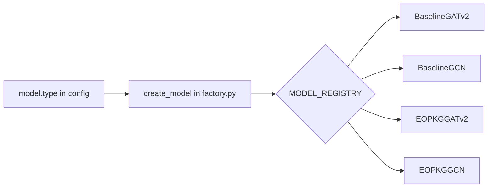
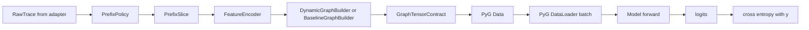
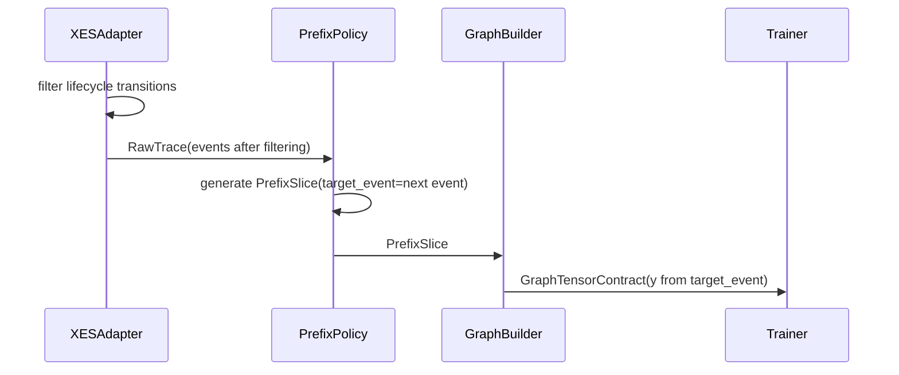
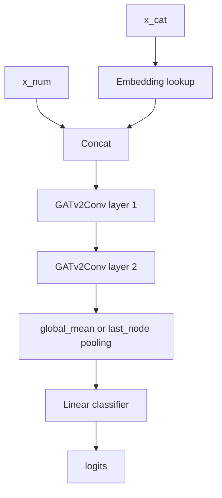
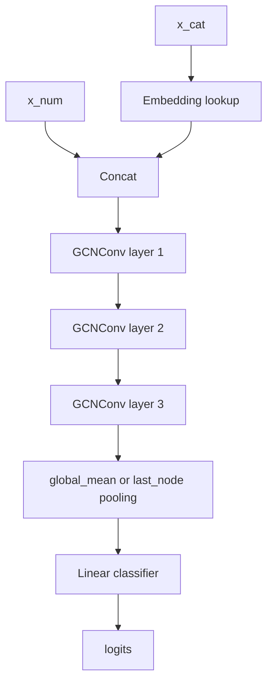
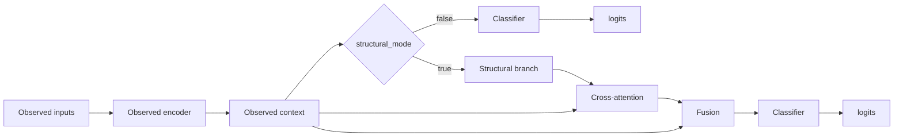
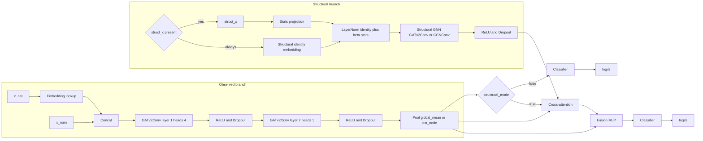
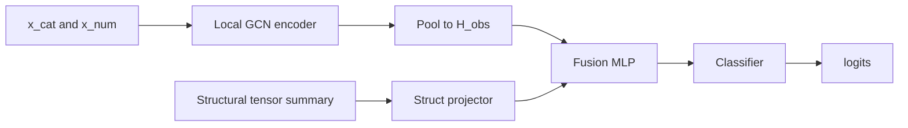
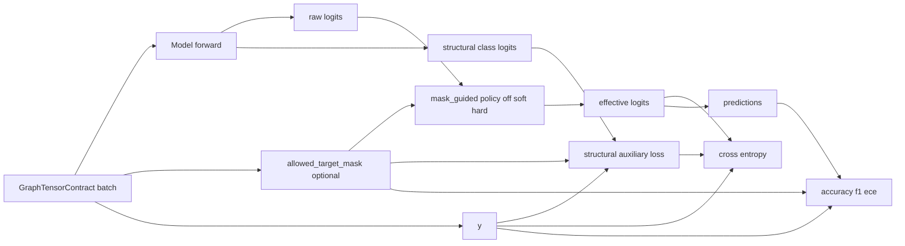

# GNN_RUNTIME_MVP2_5.MD

Updated: 2026-05-12
Status: ACTIVE (canonical runtime reference for MVP2.5)

## 1. Purpose
This document is the canonical runtime-level specification for:
1. model variants used in MVP2.5,
2. end-to-end training tensor pipeline,
3. tensor contracts and shape semantics,
4. target `y` generation rules.

This document complements:
1. `ARCHITECTURE_MVP2_5.MD` (system-level architecture),
2. `DATA_FLOWS_MVP2_5.MD` (pipeline flow),
3. `DATA_MODEL_MVP2_5.MD` (DTO/contracts),
4. `LLD_MVP2_5.MD` (low-level behavior).

## 2. Model Registry and Source Files

### 2.1 Registered model types
1. `BaselineGATv2`
2. `BaselineGCN`
3. `EOPKGGATv2`
4. `EOPKGGCN`

### 2.2 Source files
1. `src/domain/models/factory.py`
2. `src/domain/models/baseline_gat.py`
3. `src/domain/models/baseline_gcn.py`
4. `src/domain/models/eopkg_models.py`
5. `src/domain/models/base_gnn.py`

### 2.3 Registration flow


## 3. End-to-End Training Data and Tensor Pipeline

### 3.1 Runtime flow


### 3.2 Tensor assembly ownership
1. `PrefixPolicy` defines target event (`target_event`) for each prefix.
2. `FeatureEncoder` converts event features to split node tensors (`x_cat`, `x_num`).
3. `BaselineGraphBuilder` builds observed graph tensors (`edge_index`, `edge_type`, `y`, `batch`).
4. `DynamicGraphBuilder` optionally injects structural tensors (`allowed_target_mask`, `structural_edge_index`, `structural_edge_weight`, `struct_node_to_class_index`, `struct_x`).
5. `ModelTrainer` maps contract to PyG `Data` and back to forward contract.

## 4. Target Generation Rule (`y`)

### 4.1 Canonical rule
`y` is always the next event from `PrefixSlice.target_event`.

`PrefixSlice` is generated by all-prefix slicing:
1. observed prefix: `events[0:k]`,
2. target event: `events[k]`.

### 4.2 XES lifecycle filtering impact
For XES path, adapter-level lifecycle filtering is applied before prefix generation:
1. start-like transitions are used only for `start_ts` pairing,
2. by default only complete-like transitions become training events,
3. therefore, by default `y` is the next complete-like event.



## 5. GraphTensorContract Semantics

### 5.1 Baseline-required tensors
1. `x_cat: LongTensor [N, C_cat]`
2. `x_num: FloatTensor [N, C_num]`
3. `edge_index: LongTensor [2, E_obs]`
4. `edge_type: LongTensor [E_obs]`
5. `y: LongTensor [1]` per sample, `[B]` in batch
6. `batch: LongTensor [N]`

### 5.2 Optional structural tensors
1. `allowed_target_mask: BoolTensor [C]` per sample, `[B, C]` in batch
2. `structural_edge_index: LongTensor [2, E_struct]`
3. `structural_edge_weight: FloatTensor [E_struct]`
4. `struct_node_to_class_index: LongTensor [|V|]`, where `-1` means non-target structural node
5. `struct_x: FloatTensor [|V|, F_struct]` (stats-backed structural node features)

### 5.3 Snapshot metadata tensors
1. `stats_snapshot_version_seq: int | None`
2. `stats_snapshot_as_of_epoch: float | None`
3. `stats_allowed: bool | None`
4. `stats_missing_asof_snapshot: bool | None`
5. batch diagnostic variants for snapshot ids, timestamps, and missing-as-of markers.

## 6. Model Architecture Behavior

### 6.1 BaselineGATv2
Observed graph only:
1. embeddings for categorical node features,
2. two GATv2 layers,
3. global pooling,
4. linear classifier.



### 6.2 BaselineGCN
Observed graph only:
1. embeddings for categorical node features,
2. three GCN layers with residual where shape-compatible,
3. global pooling,
4. linear classifier.



### 6.3 EOPKGGATv2
Dual-encoder model with configurable structural ablation:
1. observed branch is GATv2-based and uses the same high-level pattern as BaselineGATv2 (`embed + concat + 2 x GATv2 + pool + classifier`),
2. structural branch uses structural identity embeddings enriched by `struct_x` statistics when present, then structural GNN,
3. `model.fusion_mode=ClassMeanAttention` keeps the previous cross-attention path and compresses structural nodes into one context vector,
4. `model.fusion_mode=ClassMeanConcat` keeps the previous mean structural context path,
5. `model.fusion_mode=ClassAwareStructuralScoring` adds prefix-conditioned structural class logits to observed logits,
6. `model.structural_mode=false` disables structural branch and runs observed-only path inside the same EOPKG class.

Conceptual view:


Detailed runtime view:


### 6.4 ClassAwareStructuralScoring Fusion

`ClassAwareStructuralScoring` computes structural representations at structural
node level, scores each structural node against the observed prefix context, and
then projects node scores to activity classes:

```text
identity_v = Embedding(class_or_node_identity_v)
stats_v = W_stats struct_x_v
h0_v = LayerNorm(identity_v + beta * stats_v)
h_node_v = StructuralGNN(h0_v)

q_i = W_q obs_context_i
k_v = W_k h_node_v

node_score(i, v) = q_i^T W_bilinear k_v + W_prior h_node_v
raw_struct_class(i, j) = logsumexp({node_score(i, v) | struct_node_to_class_index[v] = j})
norm_struct(i, :) = LayerNorm(raw_struct_class(i, :))
obs_scale(i) = clamp(mean(abs(observed_logits_i)).detach(), min, max)
structural_logits(i, :) = gamma * obs_scale(i) * norm_struct(i, :)
final_logits = observed_logits + structural_logits
```

This is not classical attention. It does not reduce structural nodes into one
context vector. It creates node-level structural scores and aggregates them into
one score per candidate class. `struct_node_to_class_index=-1` is used for
gateways, events, and other non-target nodes: they affect predictions through
message passing but do not receive a direct class logit.

Default `model.structural_score_mode=bilinear_with_prior`. The previous
cosine-style scorer remains available as `model.structural_score_mode=cosine`
for ablations. `struct_x` is additive enrichment, not a replacement for
structural identity. `model.structural_stats_beta` controls beta in
`identity + beta * stats_projection(struct_x)` and defaults to `0.1`.
The structural scale `gamma` is initialized conservatively via
`model.structural_logit_scale_init=0.1` and clamped by
`model.structural_logit_scale_max`.

Trainer forward diagnostics log `observed_logits_mean_abs`,
`structural_logits_mean_abs`, `structural_logits_max_abs`, and
`structural_to_observed_logit_ratio` to show whether the structural branch is
silent, useful, or dominating the observed branch.

### 6.5 EOPKGGCN
Compatibility EOPKG variant:
1. observed branch with GCN encoder,
2. structural summary context from structural tensors,
3. fusion MLP + classifier,
4. baseline fallback when structural tensors are missing.



## 7. Loss, Evaluation, and Mask Application
1. Base objective remains cross-entropy on `y`.
2. `allowed_target_mask` is used for Stage2 diagnostics (`target_in_mask_rate`, `pred_in_mask_rate`, `strict_error_but_allowed_rate`, OOS, cardinality slices).
3. Stage3 adds optional mask-guided logits policy in trainer:
   - `off`: no mask effect on logits,
   - `soft`: subtract penalty from disallowed classes,
   - `hard`: suppress disallowed classes.
4. Hard versus soft decision uses mask reliability:
   - if `target_in_mask_rate` meets threshold, policy may be hard,
   - otherwise policy stays soft.
5. `ClassAwareStructuralScoring` may add an auxiliary structural loss:
   - `training.structural_aux_loss_enabled`: enables the auxiliary objective,
   - `training.structural_aux_loss_weight`: set-aware CE over allowed target candidates,
   - `training.structural_aux_exact_loss_weight`: small exact CE component.
6. Auxiliary structural loss uses `last_structural_class_logits` before mask
   policy application. The set-aware component treats every `allowed_target_mask`
   candidate as valid and always includes the exact target, which keeps the loss
   compatible with parallel or ambiguous target regions.



## 8. Compatibility Rules
1. Baseline path must remain valid when all structural tensors are absent.
2. EOPKG path must degrade safely to observed-only forward when structural tensors are absent.
3. Optional tensor fields must never break MVP1-compatible execution.

## 8.1 Stats-Backed Structural Payload Caching

Full drift runs with `statistic_enabled=true` use snapshot-aware stats payload
loading and deduplicated sharded structural payloads.

Repository behavior:

1. Neo4j snapshot timelines are loaded as lightweight identity rows.
2. Heavy snapshot JSON payloads are loaded by resolved snapshot identity.
3. `cache_diagnostics()` exposes timeline and payload load/cache-hit counters.

Graph dataset behavior:

1. Sharded graph cache files may use `format=dedup_structural_payloads`.
2. Per-prefix `Data` objects store `structural_payload_key`.
3. `struct_x`, `structural_edge_index`, `structural_edge_weight`, and
   `struct_node_to_class_index` are stored once per shard payload key.
4. CLI diagnostics and `ShardedGraphDataset` rehydrate structural tensors when
   iterating or loading samples.
5. Legacy `list[Data]` shard files remain supported.

Runtime diagnostics:

```text
GRAPH_DATASET_STRUCT_PAYLOADS split=<split> graphs=<n> shards=<n> structural_payloads=<n>
```

For healthy stats-backed drift runs, `structural_payloads` should be bounded by
resolved version/snapshot diversity rather than by prefix graph count.

## 9. Current Batch Snapshot Limitation

Stage 4.2 uses transitional Option-A behavior for structural payload selection:

1. PyG batches may contain samples from different stats snapshots.
2. `ModelTrainer` warns when mixed snapshot version ids are detected.
3. The structural forward payload is selected from the first graph in the batch.
4. This is acceptable for exploratory/runtime compatibility, but not the final
   research-grade batching contract.

Target direction is tracked in
`docs/adr/0005-snapshot-homogeneous-batching.md`.
