# GNN_RUNTIME_MVP2_5.MD

Updated: 2026-05-16
Status: ACTIVE (canonical runtime reference for MVP2.5)

## 1. Purpose
This document is the canonical runtime-level specification for:
1. model variants used in MVP2.5,
2. end-to-end training tensor pipeline,
3. tensor contracts and shape semantics,
4. target `y` generation rules.

This document complements:
1. `ARCHITECTURE_MVP2_5.MD` (system-level architecture),
2. `DATA_FLOWS_MVP2_5.MD` (pipeline flow),
3. `DATA_MODEL_MVP2_5.MD` (DTO/contracts),
4. `LLD_MVP2_5.MD` (low-level behavior).

## 2. Model Registry and Source Files

### 2.1 Registered model types
1. `BaselineGATv2`
2. `BaselineGCN`
3. `EOPKGGATv2`
4. `EOPKGGCN`

### 2.2 Source files
1. `src/domain/models/factory.py`
2. `src/domain/models/baseline_gat.py`
3. `src/domain/models/baseline_gcn.py`
4. `src/domain/models/eopkg_models.py`
5. `src/domain/models/base_gnn.py`

### 2.3 Registration flow
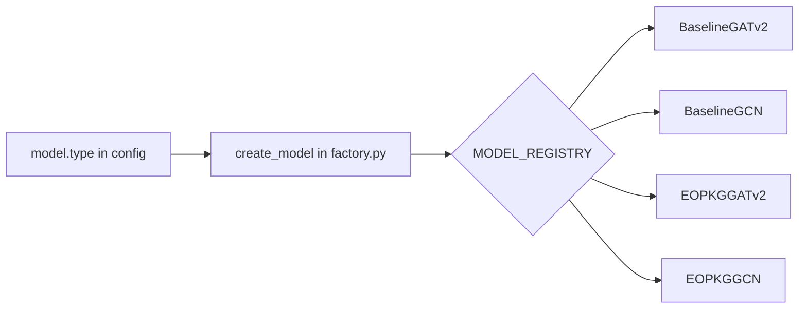

## 3. End-to-End Training Data and Tensor Pipeline

### 3.1 Runtime flow
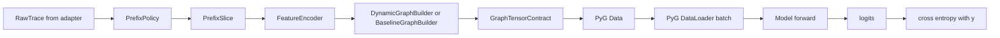

### 3.2 Tensor assembly ownership
1. `PrefixPolicy` defines target event (`target_event`) for each prefix.
2. `FeatureEncoder` converts event features to split node tensors (`x_cat`, `x_num`).
3. `BaselineGraphBuilder` builds observed graph tensors (`edge_index`, `edge_type`, `y`, `batch`).
4. `DynamicGraphBuilder` optionally injects structural tensors (`allowed_target_mask`, `structural_edge_index`, `structural_edge_weight`, `struct_node_to_class_index`, `struct_x`, `struct_prefix_state_x`).
5. `ModelTrainer` maps contract to PyG `Data` and back to forward contract.

## 4. Target Generation Rule (`y`)

### 4.1 Canonical rule
`y` is always the next event from `PrefixSlice.target_event`.

`PrefixSlice` is generated by all-prefix slicing:
1. observed prefix: `events[0:k]`,
2. target event: `events[k]`.

### 4.2 XES lifecycle filtering impact
For XES path, adapter-level lifecycle filtering is applied before prefix generation:
1. start-like transitions are used only for `start_ts` pairing,
2. by default only complete-like transitions become training events,
3. therefore, by default `y` is the next complete-like event.

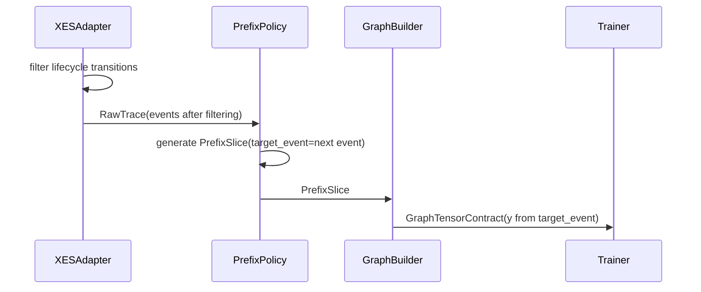

## 5. GraphTensorContract Semantics

### 5.1 Baseline-required tensors
1. `x_cat: LongTensor [N, C_cat]`
2. `x_num: FloatTensor [N, C_num]`
3. `edge_index: LongTensor [2, E_obs]`
4. `edge_type: LongTensor [E_obs]`
5. `y: LongTensor [1]` per sample, `[B]` in batch
6. `batch: LongTensor [N]`

### 5.2 Optional structural tensors
1. `allowed_target_mask: BoolTensor [C]` per sample, `[B, C]` in batch
2. `structural_edge_index: LongTensor [2, E_struct]`
3. `structural_edge_weight: FloatTensor [E_struct]`
4. `struct_node_to_class_index: LongTensor [|V|]`, where `-1` means non-target structural node
5. `struct_x: FloatTensor [|V|, F_struct]` (stats-backed structural node features)
6. `struct_prefix_state_x: FloatTensor [|V|, 6]` per sample, `[B, |V|, 6]` in batch, used by `TopologyStateEncoder`

### 5.3 Snapshot metadata tensors
1. `stats_snapshot_version_seq: int | None`
2. `stats_snapshot_as_of_epoch: float | None`
3. `stats_allowed: bool | None`
4. `stats_missing_asof_snapshot: bool | None`
5. batch diagnostic variants for snapshot ids, timestamps, and missing-as-of markers.

## 6. Model Architecture Behavior

### 6.1 BaselineGATv2
Observed graph only:
1. embeddings for categorical node features,
2. two GATv2 layers,
3. global pooling,
4. linear classifier.

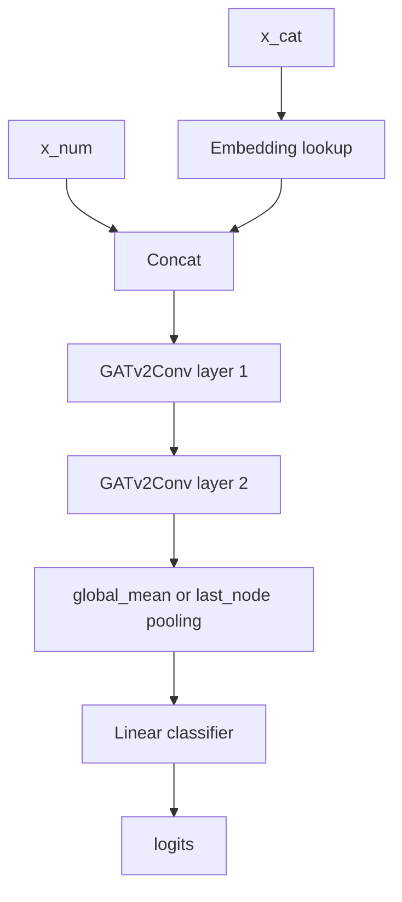

### 6.2 BaselineGCN
Observed graph only:
1. embeddings for categorical node features,
2. three GCN layers with residual where shape-compatible,
3. global pooling,
4. linear classifier.

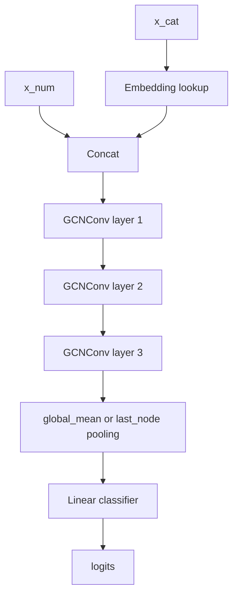

### 6.3 EOPKGGATv2
`EOPKGGATv2` is the configurable EOPKG model family. It has one shared
observed prefix encoder and several structural fusion modes. The most important
runtime switch is `experiment.structural_mode`:

1. `structural_mode=false`: the model ignores all structural tensors and runs
   the observed-only path, even if `model.fusion_mode` is set.
2. `structural_mode=true`: the model consumes structural tensors and applies
   the selected `model.fusion_mode`.

**Опис (ukr):** у цьому розділі однакові блоки на схемах мають однаковий
колір. Це дозволяє швидко побачити, що саме змінюється між режимами: місце
інтеграції структури, форма structural signal та те, чи залишається observed
encoder активним.

#### 6.3.1 Diagram Legend

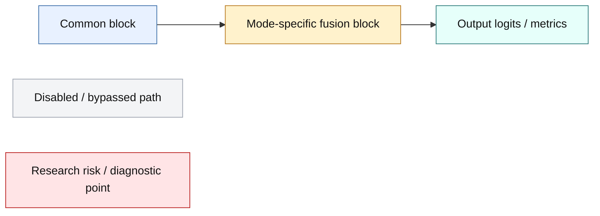

#### 6.3.2 Shared Structural Switch

**Опис (ukr):** `fusion_mode` має значення лише тоді, коли
`experiment.structural_mode=true`. Якщо `structural_mode=false`, усі режими
стають observed-only baseline всередині того самого класу `EOPKGGATv2`.

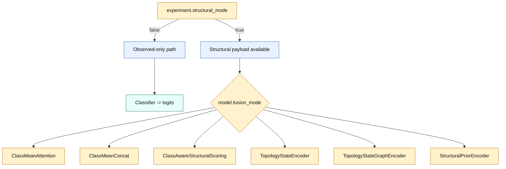

#### 6.3.3 Fusion Mode Comparison

Backward-compatible aliases are normalized before runtime selection:
`Attention -> ClassMeanAttention`, `Concat -> ClassMeanConcat`,
`struct_pool_concat -> ClassMeanConcat`, and
`ClassAwareAdditive -> ClassAwareStructuralScoring`.

| `fusion_mode` | `structural_mode=false` | `structural_mode=true` | Де діє структура | Основна відмінність |
|---|---|---|---|---|
| `ClassMeanAttention` | observed-only | observed encoder + structural GNN + cross-attention | representation before classifier | структура стискається в один attended context |
| `ClassMeanConcat` / `struct_pool_concat` | observed-only | observed encoder + mean structural context | representation before classifier | найпростіший mean-pooled structural context |
| `ClassAwareStructuralScoring` | observed-only | observed logits + structural class logits | logits / class ranking | структура напряму додає score для кожного класу |
| `TopologyStateEncoder` | observed-only | topology node state -> node logits -> class pooling | early topology-state path | observed IG branch вимкнено; prefix state переноситься на ноди структури |
| `TopologyStateGraphEncoder` | observed-only | topology node state -> graph context -> classifier | pure structural graph path | etalon/article-like structural graph baseline |
| `StructuralPriorEncoder` | observed-only | observed encoder + pooled structural prior | representation before classifier | структура як global prior до observed context |

**Коментар (ukr):** `ClassMeanAttention`, `ClassMeanConcat` і
`StructuralPriorEncoder` зберігають observed encoder як основну гілку.
`ClassAwareStructuralScoring` також зберігає observed encoder, але додає
структуру вже на рівні логітів. `TopologyStateEncoder` і
`TopologyStateGraphEncoder` є topology-state ablations: при
`structural_mode=true` вони перевіряють, що дає сама структура з prefix-state
ознаками, без повноцінного observed IG encoder.

#### 6.3.4 Common Observed-Only Path

**Опис (ukr):** ця схема однакова для всіх `fusion_mode`, якщо
`experiment.structural_mode=false`.

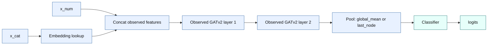

#### 6.3.5 ClassMeanAttention

**Опис (ukr):** legacy attention режим. Observed prefix формує `obs_context`.
Structural branch формує `h_struct`. Cross-attention використовує
`obs_context` як query і стискає всі structural nodes в один structural context.

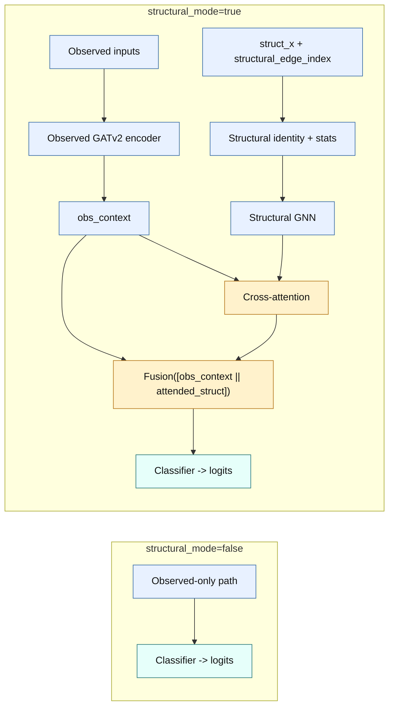

**Відмінність:** структура впливає на representation, але не дає окремий logit
для кожного target class. Це може бути слабким сигналом, якщо один pooled
context не розрізняє кандидатів.

#### 6.3.6 ClassMeanConcat

**Опис (ukr):** найпростіший representation-level режим. Structural nodes
усереднюються в один `struct_context`, який конкатенується з `obs_context`.

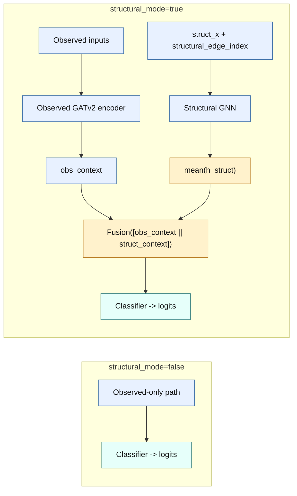

**Відмінність:** структура є global prior без class-aware ranking. Це корисно
для ablation, але може майже не впливати на strict-F1, якщо mean context
згладжує topology signal.

#### 6.3.7 ClassAwareStructuralScoring

**Опис (ukr):** late class-aware режим. Observed branch дає `observed_logits`,
а structural branch дає окремі `structural_logits` для кандидатів. Фінальний
результат: `final_logits = observed_logits + structural_logits`.

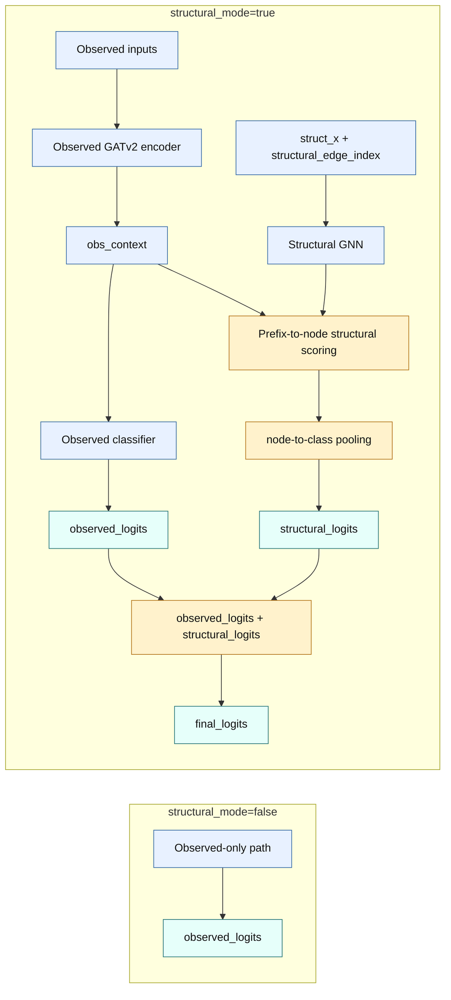

**Відмінність:** структура впливає саме на ranking класів. Це не classical
attention, а structural logit scoring. Ключові діагностики:
`structural_logits_mean_abs`, `structural_logits_max_abs`,
`observed_logits_mean_abs`, `structural_to_observed_logit_ratio`.

#### 6.3.8 TopologyStateEncoder

**Опис (ukr):** early topology-state ablation. Prefix state переноситься на
структурні ноди через `struct_prefix_state_x`, далі structural GNN рахує node
logits, а потім вони агрегуються у class logits.

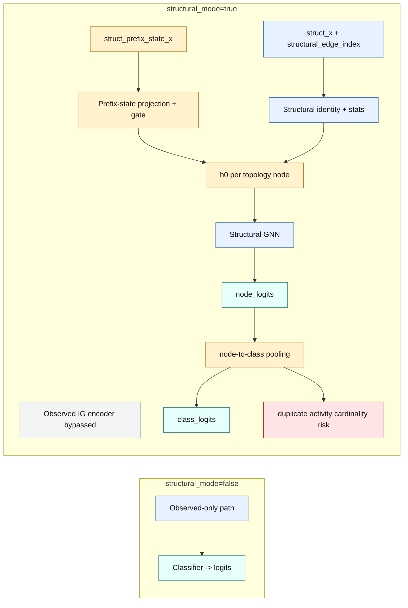

**Відмінність:** це не dual-encoder fusion. При `structural_mode=true` observed
IG branch не формує logits. Режим потрібен для перевірки раннього topology-state
сигналу та structural overfitting.

#### 6.3.9 TopologyStateGraphEncoder

**Опис (ukr):** etalon/article-like structural graph baseline. Prefix state
переноситься на topology nodes, structural GNN робить message passing, після
чого весь граф стискається в `graph_context`.

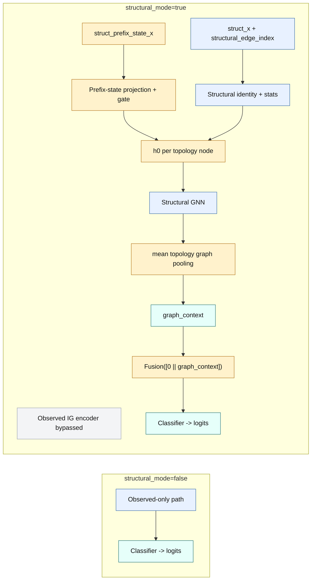

**Відмінність:** на відміну від `TopologyStateEncoder`, немає node-to-class
pooling. Це чистіший structural graph baseline для перевірки, чи сама
топологія з prefix-state ознаками корисна в same-version prediction.

#### 6.3.10 StructuralPriorEncoder

**Опис (ukr):** representation-level prior. Observed encoder залишається
основним джерелом контексту, а structural GNN дає pooled `struct_context`,
який додається через `concat` або `gated_concat`.

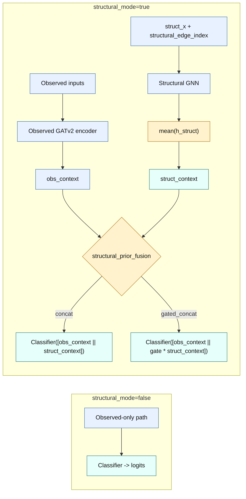

**Відмінність:** структура є global structural prior, а не per-class scorer і
не pure topology-state path. `gated_concat` додатково вчить, наскільки сильно
пропускати structural context у classifier.

### 6.4 ClassAwareStructuralScoring Fusion

`ClassAwareStructuralScoring` computes structural representations at structural
node level, scores each structural node against the observed prefix context, and
then projects node scores to activity classes:

**Коментар (ukr):** це режим, де структура найближче підходить до прямого
впливу на вибір наступної активності. Observed encoder відповідає за контекст
префікса, а structural branch додає окремий structural score для кожного
candidate class. Тому головна перевірка для цього режиму - чи structural logits
мають ненульовий, але не домінуючий масштаб відносно observed logits.

```text
identity_v = Embedding(class_or_node_identity_v)
stats_v = W_stats struct_x_v
h0_v = LayerNorm(identity_v + beta * stats_v)
h_node_v = StructuralGNN(h0_v)

q_i = W_q obs_context_i
k_v = W_k h_node_v

node_score(i, v) = q_i^T W_bilinear k_v + W_prior h_node_v
raw_struct_class(i, j) = logsumexp({node_score(i, v) | struct_node_to_class_index[v] = j})
norm_struct(i, :) = LayerNorm(raw_struct_class(i, :))
obs_scale(i) = clamp(mean(abs(observed_logits_i)).detach(), min, max)
structural_logits(i, :) = gamma * obs_scale(i) * norm_struct(i, :)
final_logits = observed_logits + structural_logits
```

This is not classical attention. It does not reduce structural nodes into one
context vector. It creates node-level structural scores and aggregates them into
one score per candidate class. `struct_node_to_class_index=-1` is used for
gateways, events, and other non-target nodes: they affect predictions through
message passing but do not receive a direct class logit.

Default `model.structural_score_mode=bilinear_with_prior`. The previous
cosine-style scorer remains available as `model.structural_score_mode=cosine`
for ablations. `struct_x` is additive enrichment, not a replacement for
structural identity. `model.structural_stats_beta` controls beta in
`identity + beta * stats_projection(struct_x)` and defaults to `0.1`.
The structural scale `gamma` is initialized conservatively via
`model.structural_logit_scale_init=0.1` and clamped by
`model.structural_logit_scale_max`.

Trainer forward diagnostics log `observed_logits_mean_abs`,
`structural_logits_mean_abs`, `structural_logits_max_abs`, and
`structural_to_observed_logit_ratio` to show whether the structural branch is
silent, useful, or dominating the observed branch.

### 6.5 TopologyStateEncoder Fusion

`TopologyStateEncoder` is an experimental early/input-level fusion mode. It is
enabled only when `experiment.structural_mode=true` and
`model.fusion_mode=TopologyStateEncoder`. If `experiment.structural_mode=false`,
the model keeps the observed-only path regardless of this fusion setting.

**Коментар (ukr):** цей режим переносить стан префікса на ноди topology і
класифікує через node-to-class pooling. Він корисний як ablation для питання
"чи може сама структура з prefix-state ознаками передбачати наступну дію", але
не є повним аналогом observed IG encoder. Через duplicate activity labels
потрібно уважно дивитись на class cardinality та entropy.

The graph builder emits `struct_prefix_state_x` for every structural node. The
current fixed feature order is:

1. `prefix_executed_count_log1p`
2. `prefix_was_executed`
3. `prefix_is_last_event`
4. `prefix_last_position_norm`
5. `prefix_recency_norm`
6. `prefix_is_active_after_complete`

Runtime formula:

```text
base_v = structural_identity_v + structural_stats_beta * stats_projection(struct_x_v)
prefix_v = W_prefix struct_prefix_state_x_v
gate_v = sigmoid(W_gate struct_prefix_state_x_v + topology_state_gate_init_bias)
h0_v = LayerNorm(base_v + beta * gate_v * prefix_v)
h_topology_v = StructuralGNN(h0_v, structural_edge_index)
node_logit_v = W_node h_topology_v
class_logit_j = pool({node_logit_v | struct_node_to_class_index[v] = j})
```

Default class pooling is `model.topology_state_class_pooling=logmeanexp`, which
uses `logsumexp(values) - log(cardinality)` to avoid inflating a class solely
because it has more duplicate structural nodes. `mean`, `max`, and `logsumexp`
remain available for ablations.

Diagnostics logged by trainer:

1. `topology_state_prefix_mean_abs`
2. `topology_state_prefix_max_abs`
3. `topology_state_entropy`
4. `topology_state_mean_class_cardinality`
5. `topology_state_max_class_cardinality`
6. `topology_state_gate_mean`
7. `topology_state_gate_max`

This mode is an ablation for early structural fusion and structural overfitting
analysis. It is not the canonical final drift-generalization mechanism.

### 6.6 TopologyStateGraphEncoder Fusion

`TopologyStateGraphEncoder` is a structural graph encoder baseline. It uses the
same `struct_prefix_state_x` tensor as `TopologyStateEncoder`, but it does not
emit node logits and does not perform node-to-class pooling. Instead, it
classifies a graph-level topology context after structural message passing.

**Коментар (ukr):** це чистий structural graph baseline у стилі старого etalon
підходу: модель працює з графом структури як з основним носієм стану. На
відміну від `TopologyStateEncoder`, тут немає ризику inflation через
node-to-class `LogSumExp`, бо рішення приймається з pooled graph context.

Runtime formula:

```text
base_v = structural_identity_v + structural_stats_beta * stats_projection(struct_x_v)
prefix_v = W_prefix struct_prefix_state_x_v
gate_v = sigmoid(W_gate struct_prefix_state_x_v + topology_state_gate_init_bias)
h0_v = LayerNorm(base_v + beta * gate_v * prefix_v)
h_topology_v = StructuralGNN(h0_v, structural_edge_index)
graph_context = mean_v(h_topology_v)
logits = Classifier(Fusion([0 || graph_context]))
```

This mode is closest to the old etalon/article-style GNN baseline: structure is
the graph on which node state is propagated before graph-level classification.
It should be used to test whether topology helps same-version predictive
monitoring before drawing conclusions about structural drift transfer.

Diagnostics logged by trainer:

1. `topology_state_prefix_mean_abs`
2. `topology_state_prefix_max_abs`
3. `topology_state_gate_mean`
4. `topology_state_gate_max`
5. `topology_graph_context_mean_abs`
6. `topology_graph_context_max_abs`
7. `topology_graph_logits_mean_abs`
8. `topology_graph_entropy`

### 6.7 StructuralPriorEncoder Fusion

`StructuralPriorEncoder` is an etalon-like representation-level structural
fusion mode. It keeps the observed prefix encoder as the primary path, computes
a pooled structural context from EOPKG/BPMN tensors, and fuses both contexts
before the classifier.

**Коментар (ukr):** цей режим залишає observed model головною, а структуру
подає як prior. Його треба читати як сильніший і чистіше задокументований
аналог `ClassMeanConcat`: структура не ранжує класи напряму, але може змінювати
representation перед classifier. `gated_concat` показує, чи модель взагалі
хоче пропускати structural context.

It differs from:

1. `ClassMeanConcat`: legacy mean structural context without explicit
   structural-prior diagnostics.
2. `ClassAwareStructuralScoring`: late structural class-logit additive scoring.
3. `TopologyStateEncoder`: topology-state branch that directly emits class
   logits and clears observed-logit diagnostics.

Runtime formula for `model.structural_prior_fusion=concat`:

```text
obs_context_i = ObservedGNN(prefix_i)
h_struct_v = StructuralGNN(h0_v, structural_edge_index)
struct_context = mean_v(h_struct_v)
logits_i = Classifier(Fusion([obs_context_i || struct_context]))
```

Runtime formula for `model.structural_prior_fusion=gated_concat`:

```text
gate_i = sigmoid(W_gate([obs_context_i || struct_context]) + b)
logits_i = Classifier(Fusion([obs_context_i || gate_i * struct_context]))
```

Current supported pooling:

```yaml
model.structural_prior_pooling: mean
```

`mean` mirrors the old etalon `global_mean_pool` behavior. The mode is intended
as the clean structural baseline for testing whether structure improves
same-version prediction before testing transfer between process versions.

Trainer diagnostics:

1. `observed_context_mean_abs`
2. `structural_prior_context_mean_abs`
3. `structural_prior_to_observed_context_ratio`
4. `structural_prior_gate_mean`
5. `structural_prior_gate_max`

### 6.8 EOPKGGCN
Compatibility EOPKG variant:
1. observed branch with GCN encoder,
2. structural summary context from structural tensors,
3. fusion MLP + classifier,
4. baseline fallback when structural tensors are missing.

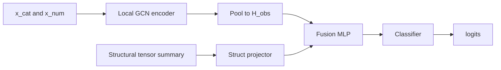

## 7. Loss, Evaluation, and Mask Application
1. Base objective remains cross-entropy on `y`.
2. `allowed_target_mask` is used for Stage2 diagnostics (`target_in_mask_rate`, `pred_in_mask_rate`, `strict_error_but_allowed_rate`, OOS, cardinality slices).
3. Stage3 adds optional mask-guided logits policy in trainer:
   - `off`: no mask effect on logits,
   - `soft`: subtract penalty from disallowed classes,
   - `hard`: suppress disallowed classes.
4. Hard versus soft decision uses mask reliability:
   - if `target_in_mask_rate` meets threshold, policy may be hard,
   - otherwise policy stays soft.
5. `ClassAwareStructuralScoring` may add an auxiliary structural loss:
   - `training.structural_aux_loss_enabled`: enables the auxiliary objective,
   - `training.structural_aux_loss_weight`: set-aware CE over allowed target candidates,
   - `training.structural_aux_exact_loss_weight`: small exact CE component.
6. Auxiliary structural loss uses `last_structural_class_logits` before mask
   policy application. The set-aware component treats every `allowed_target_mask`
   candidate as valid and always includes the exact target, which keeps the loss
   compatible with parallel or ambiguous target regions.

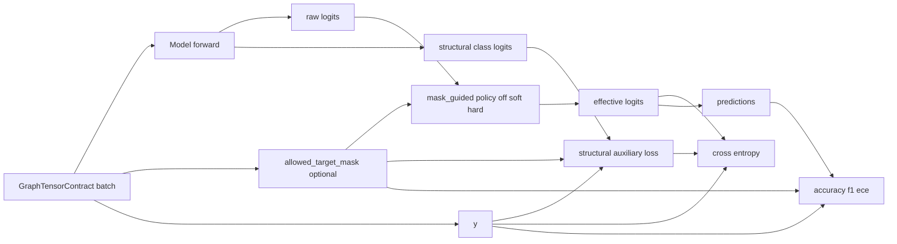

## 8. Compatibility Rules
1. Baseline path must remain valid when all structural tensors are absent.
2. EOPKG path must degrade safely to observed-only forward when structural tensors are absent.
3. Optional tensor fields must never break MVP1-compatible execution.

## 8.1 Stats-Backed Structural Payload Caching

Full drift runs with `statistic_enabled=true` use snapshot-aware stats payload
loading and deduplicated sharded structural payloads.

Repository behavior:

1. Neo4j snapshot timelines are loaded as lightweight identity rows.
2. Heavy snapshot JSON payloads are loaded by resolved snapshot identity.
3. `cache_diagnostics()` exposes timeline and payload load/cache-hit counters.

Graph dataset behavior:

1. Sharded graph cache files may use `format=dedup_structural_payloads`.
2. Per-prefix `Data` objects store `structural_payload_key`.
3. `struct_x`, `structural_edge_index`, `structural_edge_weight`, and
   `struct_node_to_class_index` are stored once per shard payload key.
4. CLI diagnostics and `ShardedGraphDataset` rehydrate structural tensors when
   iterating or loading samples.
5. Legacy `list[Data]` shard files remain supported.

Runtime diagnostics:

```text
GRAPH_DATASET_STRUCT_PAYLOADS split=<split> graphs=<n> shards=<n> structural_payloads=<n>
```

For healthy stats-backed drift runs, `structural_payloads` should be bounded by
resolved version/snapshot diversity rather than by prefix graph count.

## 8.2 One-Pass Drift Window Evaluation

Optimized `eval_drift` uses prebuilt test graph datasets when every graph sample
contains trace metadata:

1. `trace_idx`
2. `prefix_idx`
3. `trace_start_ts`
4. `trace_end_ts`

The trainer runs one non-shuffled inference pass over the full test graph
dataset, stores compact per-sample records, then aggregates drift-window metrics
from those records. It must not retain full `N x C` probability matrices for
drift windows. Store scalar values such as `confidence`, `correct`, `top3_hit`,
mask flags, `hybrid_set_nll`, prefix length, and version label.

Expected runtime log:

```text
Drift evaluation path: one_pass_prebuilt_dataset
Drift one-pass records: samples=<n> traces=<n> max_trace_idx=<n>
```

Fallback behavior:

```text
Drift evaluation path: legacy_raw_trace_windows
```

Fallback is used for old graph caches or non-prebuilt runs without `trace_idx`.

## 9. Current Batch Snapshot Limitation

Stage 4.2 uses transitional Option-A behavior for structural payload selection:

1. PyG batches may contain samples from different stats snapshots.
2. `ModelTrainer` warns when mixed snapshot version ids are detected.
3. The structural forward payload is selected from the first graph in the batch.
4. This is acceptable for exploratory/runtime compatibility, but not the final
   research-grade batching contract.

Target direction is tracked in
`docs/adr/0005-snapshot-homogeneous-batching.md`.
