# GNN_RUNTIME_MVP2_5.MD

Updated: 2026-05-24
Status: ACTIVE (canonical runtime reference for MVP2.5)

## 1. Purpose
This document is the canonical runtime-level specification for:
1. model variants used in MVP2.5,
2. end-to-end training tensor pipeline,
3. tensor contracts and shape semantics,
4. target `y` generation rules.

This document complements:
1. `ARCHITECTURE_MVP2_5.MD` (system-level architecture),
2. `DATA_FLOWS_MVP2_5.MD` (pipeline flow),
3. `DATA_MODEL_MVP2_5.MD` (DTO/contracts),
4. `LLD_MVP2_5.MD` (low-level behavior).

## 2. Model Registry and Source Files

### 2.1 Registered model types
1. `BaselineGATv2`
2. `BaselineGCN`
3. `LSTM_Baseline`
4. `EOPKGGATv2`
5. `EOPKGGCN`
6. `EOPKGTopologyConditioned`

### 2.2 Source files
1. `src/domain/models/factory.py`
2. `src/domain/models/baseline_gat.py`
3. `src/domain/models/baseline_gcn.py`
4. `src/domain/models/lstm_baseline.py`
5. `src/domain/models/eopkg_models.py`
6. `src/domain/models/base_gnn.py`
7. `src/domain/models/topology_conditioned.py`

### 2.3 Registration flow
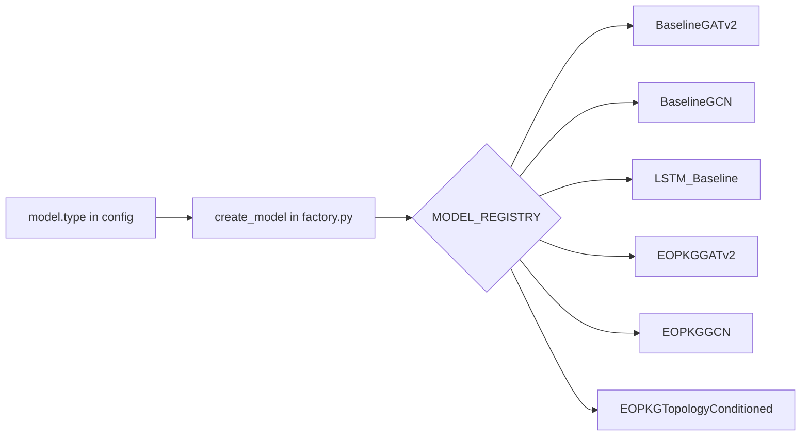
```mermaid
flowchart LR
    CFG[model.type in config] --> FACTORY[create_model in factory.py]
    FACTORY --> REG{MODEL_REGISTRY}
    REG --> BGAT[BaselineGATv2]
    REG --> BGCN[BaselineGCN]
    REG --> BLSTM[LSTM_Baseline]
    REG --> EGAT[EOPKGGATv2]
    REG --> EGCN[EOPKGGCN]
    REG --> ETC[EOPKGTopologyConditioned]
```

## 3. End-to-End Training Data and Tensor Pipeline

### 3.1 Runtime flow
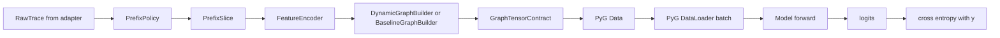
```mermaid
flowchart LR
    A[RawTrace from adapter] --> B[PrefixPolicy]
    B --> C[PrefixSlice]
    C --> D[FeatureEncoder]
    D --> E[DynamicGraphBuilder or BaselineGraphBuilder]
    E --> F[GraphTensorContract]
    F --> G[PyG Data]
    G --> H[PyG DataLoader batch]
    H --> I[Model forward]
    I --> J[logits]
    J --> K[cross entropy with y]
```

### 3.2 Tensor assembly ownership
1. `PrefixPolicy` defines target event (`target_event`) for each prefix.
2. `FeatureEncoder` converts event features to split node tensors (`x_cat`, `x_num`).
3. `BaselineGraphBuilder` builds observed graph tensors (`edge_index`, `edge_type`, `y`, `batch`).
4. `DynamicGraphBuilder` optionally injects structural tensors (`allowed_target_mask`, `structural_edge_index`, `structural_edge_weight`, `struct_node_to_class_index`, `struct_x`, `struct_prefix_state_x`).
5. `ModelTrainer` maps contract to PyG `Data` and back to forward contract.

## 4. Target Generation Rule (`y`)

### 4.1 Canonical rule
`y` is always the next event from `PrefixSlice.target_event`.

`PrefixSlice` is generated by all-prefix slicing:
1. observed prefix: `events[0:k]`,
2. target event: `events[k]`.

### 4.2 XES lifecycle filtering impact
For XES path, adapter-level lifecycle filtering is applied before prefix generation:
1. start-like transitions are used only for `start_ts` pairing,
2. by default only complete-like transitions become training events,
3. therefore, by default `y` is the next complete-like event.

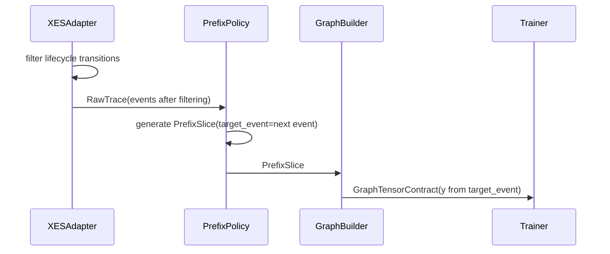
```mermaid
sequenceDiagram
    participant X as XESAdapter
    participant P as PrefixPolicy
    participant B as GraphBuilder
    participant T as Trainer

    X->>X: filter lifecycle transitions
    X->>P: RawTrace(events after filtering)
    P->>P: generate PrefixSlice(target_event=next event)
    P->>B: PrefixSlice
    B->>T: GraphTensorContract(y from target_event)
```

## 5. GraphTensorContract Semantics

### 5.1 Baseline-required tensors
1. `x_cat: LongTensor [N, C_cat]`
2. `x_num: FloatTensor [N, C_num]`
3. `edge_index: LongTensor [2, E_obs]`
4. `edge_type: LongTensor [E_obs]`
5. `y: LongTensor [1]` per sample, `[B]` in batch
6. `batch: LongTensor [N]`

### 5.2 Optional structural tensors
1. `allowed_target_mask: BoolTensor [C]` per sample, `[B, C]` in batch
2. `structural_edge_index: LongTensor [2, E_struct]`
3. `structural_edge_weight: FloatTensor [E_struct]`
4. `struct_node_to_class_index: LongTensor [|V|]`, where `-1` means non-target structural node
5. `struct_x: FloatTensor [|V|, F_struct]` (stats-backed structural node features)
6. `struct_prefix_state_x: FloatTensor [|V|, 6]` per sample, `[B, |V|, 6]` in batch, used by topology-state and topology-conditioned modes. Channel 5 is the active candidate flag.

### 5.2.1 Process-State-Aware Masks

For XES logs with parallel/interleaved task execution, the direct successor of
the last completed event is not always the only valid next event. A sibling task
that was already started and not completed is still a valid next completion.

The runtime can merge such active candidates into both `allowed_target_mask` and
`candidate_allowed_target_mask`:

```yaml
training.process_state_mask_enabled: true
training.process_state_mask_source: lifecycle_active_set
training.process_state_mask_include_direct_successors: true
training.process_state_mask_include_active_candidates: true
```

`lifecycle_active_set` reconstructs active tasks from prefix events by tracking
`lifecycle:transition=start|complete` pairs keyed by
`sim:activity_instance_id`. The tensor shape is unchanged: reconstructed active
tasks populate the existing `struct_prefix_state_x[:, 5]` channel.

For flattened/completion-oriented parallel XES where already-active tasks are
not enough, use approximate relaxed reachability:

```yaml
training.process_state_mask_enabled: true
training.process_state_mask_source: relaxed_reachability
training.process_state_mask_relaxed_lookback_events: 8
training.process_state_mask_relaxed_max_depth: 1
training.process_state_mask_relaxed_max_cardinality_ratio: 0.35
training.process_state_mask_relaxed_suppress_completed: true
training.process_state_mask_relaxed_anchor_policy: open_successors
training.process_state_mask_relaxed_loop_policy: keep_direct_successor_repeats
```

This adds bounded reachable successors from recent prefix anchors over the
collapsed prediction topology. The state-aware variant suppresses relaxed-only
candidates that were already completed in the prefix, but keeps direct
successors, explicit active candidates, active task tokens, and direct
loop/rework repeats. It is a diagnostic/engineering approximation, not strict
BPMN marking replay. Track
`*_process_state_mask_active_candidate_count` and
`*_process_state_mask_relaxed_candidate_count` to confirm that the mode expands
the mask. Track `*_process_state_mask_target_suppressed_by_completed_filter_rate`
to ensure completed-candidate suppression does not remove the true target.

### 5.3 Snapshot metadata tensors
1. `stats_snapshot_version_seq: int | None`
2. `stats_snapshot_as_of_epoch: float | None`
3. `stats_allowed: bool | None`
4. `stats_missing_asof_snapshot: bool | None`
5. batch diagnostic variants for snapshot ids, timestamps, and missing-as-of markers.

## 6. Model Architecture Behavior

### 6.1 BaselineGATv2
Observed graph only:
1. embeddings for categorical node features,
2. two GATv2 layers,
3. global pooling,
4. linear classifier.

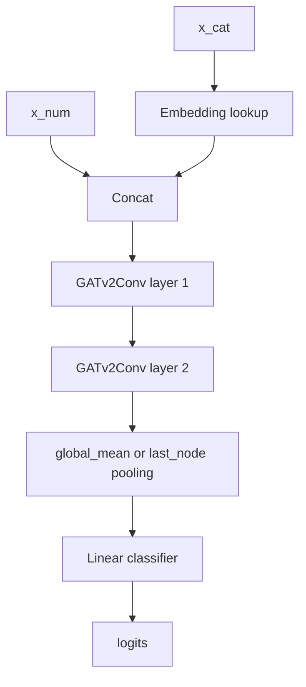
```mermaid
flowchart TD
    XCAT[x_cat] --> EMB[Embedding lookup]
    XNUM[x_num] --> CAT[Concat]
    EMB --> CAT
    CAT --> G1[GATv2Conv layer 1]
    G1 --> G2[GATv2Conv layer 2]
    G2 --> POOL[global_mean or last_node pooling]
    POOL --> CLS[Linear classifier]
    CLS --> LOGITS[logits]
```

### 6.2 BaselineGCN
Observed graph only:
1. embeddings for categorical node features,
2. three GCN layers with residual where shape-compatible,
3. global pooling,
4. linear classifier.

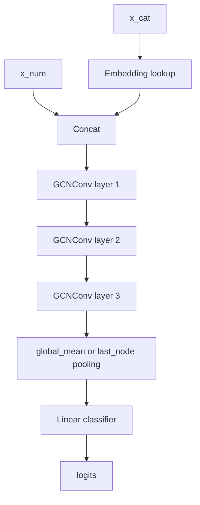
```mermaid
flowchart TD
    XCAT[x_cat] --> EMB[Embedding lookup]
    XNUM[x_num] --> CAT[Concat]
    EMB --> CAT
    CAT --> G1[GCNConv layer 1]
    G1 --> G2[GCNConv layer 2]
    G2 --> G3[GCNConv layer 3]
    G3 --> POOL[global_mean or last_node pooling]
    POOL --> CLS[Linear classifier]
    CLS --> LOGITS[logits]
```

### 6.2.1 LSTM_Baseline

Observed sequence only:
1. embeddings for categorical event features plus numeric event features,
2. one or more LSTM/GRU recurrent layers,
3. `last_node` or `global_mean` readout over the prefix sequence,
4. linear classifier over the fitted training activity vocabulary `C_train`.

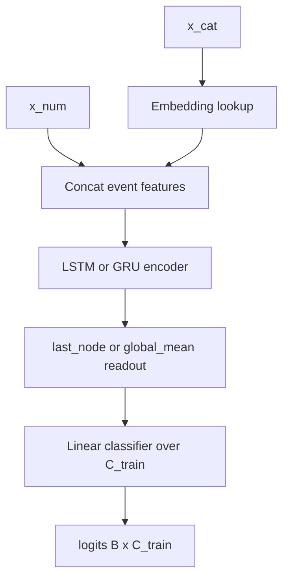
```mermaid
flowchart TD
    XCAT[x_cat] --> EMB[Embedding lookup]
    XNUM[x_num] --> CAT[Concat event features]
    EMB --> CAT
    CAT --> RNN[LSTM or GRU encoder]
    RNN --> POOL[last_node or global_mean readout]
    POOL --> CLS[Linear classifier over C_train]
    CLS --> LOGITS[logits B x C_train]
```

`LSTM_Baseline` intentionally keeps the classic fixed-softmax PPM formulation:
it does not consume structural tensors and cannot emit future-version
activities that were absent from the fitted training vocabulary. For structural
drift experiments it is a fixed-vocabulary comparison baseline, not a
topology-native adaptation model.

### 6.3 EOPKGGATv2
`EOPKGGATv2` is the configurable EOPKG model family. It has one shared
observed prefix encoder and several structural fusion modes. The most important
runtime switch is `experiment.structural_mode`:

1. `structural_mode=false`: the model ignores all structural tensors and runs
   the observed-only path, even if `model.fusion_mode` is set.
2. `structural_mode=true`: the model consumes structural tensors and applies
   the selected `model.fusion_mode`.

**Опис (ukr):** у цьому розділі однакові блоки на схемах мають однаковий
колір. Це дозволяє швидко побачити, що саме змінюється між режимами: місце
інтеграції структури, форма structural signal та те, чи залишається observed
encoder активним.

#### 6.3.1 Diagram Legend

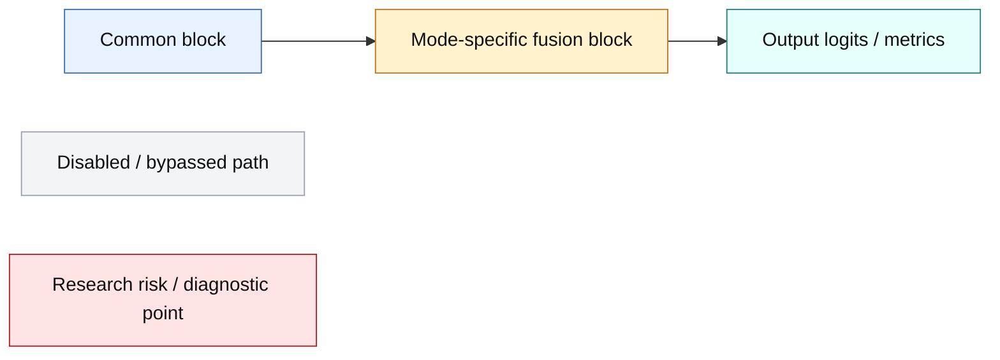
```mermaid
flowchart LR
    C["Common block"]:::common --> V["Mode-specific fusion block"]:::variable
    V --> O["Output logits / metrics"]:::output
    D["Disabled / bypassed path"]:::disabled
    R["Research risk / diagnostic point"]:::risk

    classDef common fill:#E8F1FF,stroke:#3B6EA8,color:#111;
    classDef variable fill:#FFF2CC,stroke:#B7791F,color:#111;
    classDef output fill:#E6FFFA,stroke:#2C7A7B,color:#111;
    classDef disabled fill:#F3F4F6,stroke:#9CA3AF,color:#111;
    classDef risk fill:#FFE4E6,stroke:#B91C1C,color:#111;
```

#### 6.3.2 Shared Structural Switch

**Опис (ukr):** `fusion_mode` має значення лише тоді, коли
`experiment.structural_mode=true`. Якщо `structural_mode=false`, усі режими
стають observed-only baseline всередині того самого класу `EOPKGGATv2`.

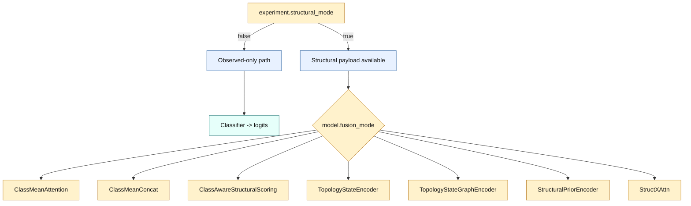
```mermaid
flowchart TD
    CFG["experiment.structural_mode"]:::variable
    CFG -->|false| OBSONLY["Observed-only path"]:::common
    OBSONLY --> OBSLOGITS["Classifier -> logits"]:::output

    CFG -->|true| PAYLOAD["Structural payload available"]:::common
    PAYLOAD --> MODE{"model.fusion_mode"}:::variable
    MODE --> CMA["ClassMeanAttention"]:::variable
    MODE --> CMC["ClassMeanConcat"]:::variable
    MODE --> CASS["ClassAwareStructuralScoring"]:::variable
    MODE --> TSE["TopologyStateEncoder"]:::variable
    MODE --> TSG["TopologyStateGraphEncoder"]:::variable
    MODE --> SPE["StructuralPriorEncoder"]:::variable
    MODE --> XAT["StructXAttn"]:::variable

    classDef common fill:#E8F1FF,stroke:#3B6EA8,color:#111;
    classDef variable fill:#FFF2CC,stroke:#B7791F,color:#111;
    classDef output fill:#E6FFFA,stroke:#2C7A7B,color:#111;
```

#### 6.3.3 Fusion Mode Comparison

Backward-compatible aliases are normalized before runtime selection:
`Attention -> ClassMeanAttention`, `Concat -> ClassMeanConcat`,
`struct_pool_concat -> ClassMeanConcat`, and
`ClassAwareAdditive -> ClassAwareStructuralScoring`.

| `fusion_mode` | `structural_mode=false` | `structural_mode=true` | Де діє структура | Основна відмінність |
|---|---|---|---|---|
| `ClassMeanAttention` | observed-only | observed encoder + structural GNN + cross-attention | representation before classifier | структура стискається в один attended context |
| `ClassMeanConcat` / `struct_pool_concat` | observed-only | observed encoder + mean structural context | representation before classifier | найпростіший mean-pooled structural context |
| `ClassAwareStructuralScoring` | observed-only | observed logits + structural class logits | logits / class ranking | структура напряму додає score для кожного класу |
| `TopologyStateEncoder` | observed-only | topology node state -> node logits -> class pooling | early topology-state path | observed IG branch вимкнено; prefix state переноситься на ноди структури |
| `TopologyStateGraphEncoder` | observed-only | topology node state -> graph context -> classifier | pure structural graph path | etalon/article-like structural graph baseline |
| `StructuralPriorEncoder` | observed-only | observed encoder + pooled structural prior | representation before classifier | структура як global prior до observed context |
| `StructXAttn` | observed-only | observed encoder + structural GNN + token-level structural cross-attention | observed node representations before pooling | кожен observed IG node робить query до structural nodes; структура впливає на hidden states до classifier |

**Коментар (ukr):** `ClassMeanAttention`, `ClassMeanConcat` і
`StructuralPriorEncoder` зберігають observed encoder як основну гілку.
`ClassAwareStructuralScoring` також зберігає observed encoder, але додає
структуру вже на рівні логітів. `TopologyStateEncoder` і
`TopologyStateGraphEncoder` є topology-state ablations: при
`structural_mode=true` вони перевіряють, що дає сама структура з prefix-state
ознаками, без повноцінного observed IG encoder.

#### 6.3.4 Common Observed-Only Path

**Опис (ukr):** ця схема однакова для всіх `fusion_mode`, якщо
`experiment.structural_mode=false`.

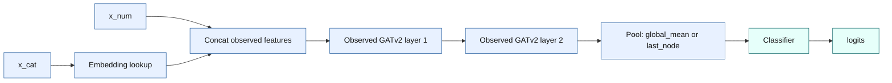
```mermaid
flowchart LR
    XCAT["x_cat"]:::common --> EMB["Embedding lookup"]:::common
    XNUM["x_num"]:::common --> CAT["Concat observed features"]:::common
    EMB --> CAT
    CAT --> G1["Observed GATv2 layer 1"]:::common
    G1 --> G2["Observed GATv2 layer 2"]:::common
    G2 --> POOL["Pool: global_mean or last_node"]:::common
    POOL --> CLS["Classifier"]:::output
    CLS --> LOGITS["logits"]:::output

    classDef common fill:#E8F1FF,stroke:#3B6EA8,color:#111;
    classDef output fill:#E6FFFA,stroke:#2C7A7B,color:#111;
```

#### 6.3.5 ClassMeanAttention

**Опис (ukr):** legacy attention режим. Observed prefix формує `obs_context`.
Structural branch формує `h_struct`. Cross-attention використовує
`obs_context` як query і стискає всі structural nodes в один structural context.

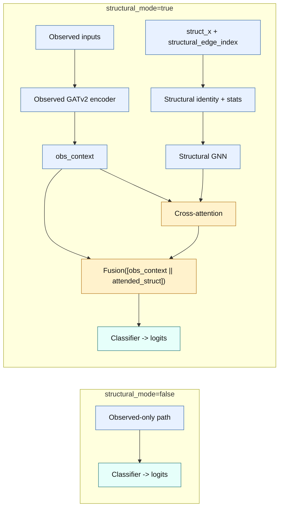
```mermaid
flowchart LR
    subgraph F["structural_mode=false"]
        F1["Observed-only path"]:::common --> F2["Classifier -> logits"]:::output
    end

    subgraph T["structural_mode=true"]
        O1["Observed inputs"]:::common --> O2["Observed GATv2 encoder"]:::common
        O2 --> O3["obs_context"]:::common
        S1["struct_x + structural_edge_index"]:::common --> S2["Structural identity + stats"]:::common
        S2 --> S3["Structural GNN"]:::common
        O3 --> A["Cross-attention"]:::variable
        S3 --> A
        A --> FU["Fusion([obs_context || attended_struct])"]:::variable
        O3 --> FU
        FU --> C["Classifier -> logits"]:::output
    end

    classDef common fill:#E8F1FF,stroke:#3B6EA8,color:#111;
    classDef variable fill:#FFF2CC,stroke:#B7791F,color:#111;
    classDef output fill:#E6FFFA,stroke:#2C7A7B,color:#111;
```

**Відмінність:** структура впливає на representation, але не дає окремий logit
для кожного target class. Це може бути слабким сигналом, якщо один pooled
context не розрізняє кандидатів.

#### 6.3.6 ClassMeanConcat

**Опис (ukr):** найпростіший representation-level режим. Structural nodes
усереднюються в один `struct_context`, який конкатенується з `obs_context`.

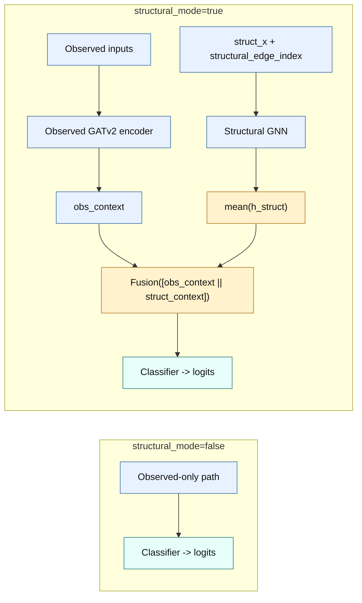
```mermaid
flowchart LR
    subgraph F["structural_mode=false"]
        F1["Observed-only path"]:::common --> F2["Classifier -> logits"]:::output
    end

    subgraph T["structural_mode=true"]
        O1["Observed inputs"]:::common --> O2["Observed GATv2 encoder"]:::common
        O2 --> O3["obs_context"]:::common
        S1["struct_x + structural_edge_index"]:::common --> S2["Structural GNN"]:::common
        S2 --> MP["mean(h_struct)"]:::variable
        O3 --> FU["Fusion([obs_context || struct_context])"]:::variable
        MP --> FU
        FU --> C["Classifier -> logits"]:::output
    end

    classDef common fill:#E8F1FF,stroke:#3B6EA8,color:#111;
    classDef variable fill:#FFF2CC,stroke:#B7791F,color:#111;
    classDef output fill:#E6FFFA,stroke:#2C7A7B,color:#111;
```

**Відмінність:** структура є global prior без class-aware ranking. Це корисно
для ablation, але може майже не впливати на strict-F1, якщо mean context
згладжує topology signal.

#### 6.3.7 ClassAwareStructuralScoring

**Опис (ukr):** late class-aware режим. Observed branch дає `observed_logits`,
а structural branch дає окремі `structural_logits` для кандидатів. Фінальний
результат: `final_logits = observed_logits + structural_logits`.

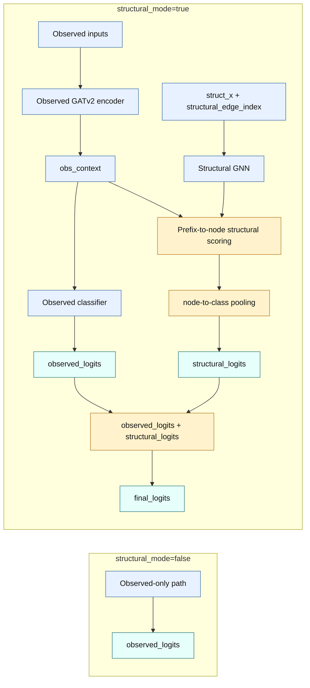
```mermaid
flowchart LR
    subgraph F["structural_mode=false"]
        F1["Observed-only path"]:::common --> F2["observed_logits"]:::output
    end

    subgraph T["structural_mode=true"]
        O1["Observed inputs"]:::common --> O2["Observed GATv2 encoder"]:::common
        O2 --> O3["obs_context"]:::common
        O3 --> OL["Observed classifier"]:::common
        OL --> OBSL["observed_logits"]:::output

        S1["struct_x + structural_edge_index"]:::common --> S2["Structural GNN"]:::common
        O3 --> SC["Prefix-to-node structural scoring"]:::variable
        S2 --> SC
        SC --> NC["node-to-class pooling"]:::variable
        NC --> SL["structural_logits"]:::output
        OBSL --> ADD["observed_logits + structural_logits"]:::variable
        SL --> ADD
        ADD --> FL["final_logits"]:::output
    end

    classDef common fill:#E8F1FF,stroke:#3B6EA8,color:#111;
    classDef variable fill:#FFF2CC,stroke:#B7791F,color:#111;
    classDef output fill:#E6FFFA,stroke:#2C7A7B,color:#111;
```

**Відмінність:** структура впливає саме на ranking класів. Це не classical
attention, а structural logit scoring. Ключові діагностики:
`structural_logits_mean_abs`, `structural_logits_max_abs`,
`observed_logits_mean_abs`, `structural_to_observed_logit_ratio`.

#### 6.3.8 TopologyStateEncoder

**Опис (ukr):** early topology-state ablation. Prefix state переноситься на
структурні ноди через `struct_prefix_state_x`, далі structural GNN рахує node
logits, а потім вони агрегуються у class logits.

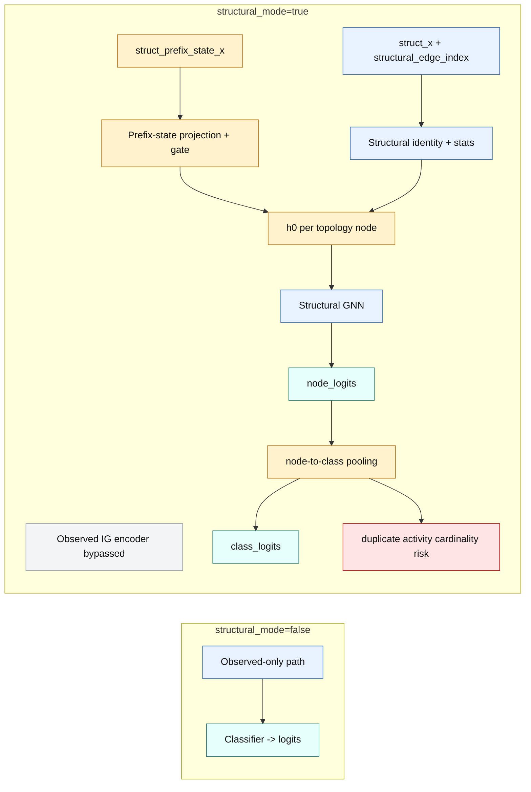
```mermaid
flowchart LR
    subgraph F["structural_mode=false"]
        F1["Observed-only path"]:::common --> F2["Classifier -> logits"]:::output
    end

    subgraph T["structural_mode=true"]
        OX["Observed IG encoder bypassed"]:::disabled
        P1["struct_prefix_state_x"]:::variable --> P2["Prefix-state projection + gate"]:::variable
        S1["struct_x + structural_edge_index"]:::common --> S2["Structural identity + stats"]:::common
        P2 --> H0["h0 per topology node"]:::variable
        S2 --> H0
        H0 --> SG["Structural GNN"]:::common
        SG --> NL["node_logits"]:::output
        NL --> CP["node-to-class pooling"]:::variable
        CP --> CL["class_logits"]:::output
        CP --> R["duplicate activity cardinality risk"]:::risk
    end

    classDef common fill:#E8F1FF,stroke:#3B6EA8,color:#111;
    classDef variable fill:#FFF2CC,stroke:#B7791F,color:#111;
    classDef output fill:#E6FFFA,stroke:#2C7A7B,color:#111;
    classDef disabled fill:#F3F4F6,stroke:#9CA3AF,color:#111;
    classDef risk fill:#FFE4E6,stroke:#B91C1C,color:#111;
```

**Відмінність:** це не dual-encoder fusion. При `structural_mode=true` observed
IG branch не формує logits. Режим потрібен для перевірки раннього topology-state
сигналу та structural overfitting.

#### 6.3.9 TopologyStateGraphEncoder

**Опис (ukr):** etalon/article-like structural graph baseline. Prefix state
переноситься на topology nodes, structural GNN робить message passing, після
чого весь граф стискається в `graph_context`.

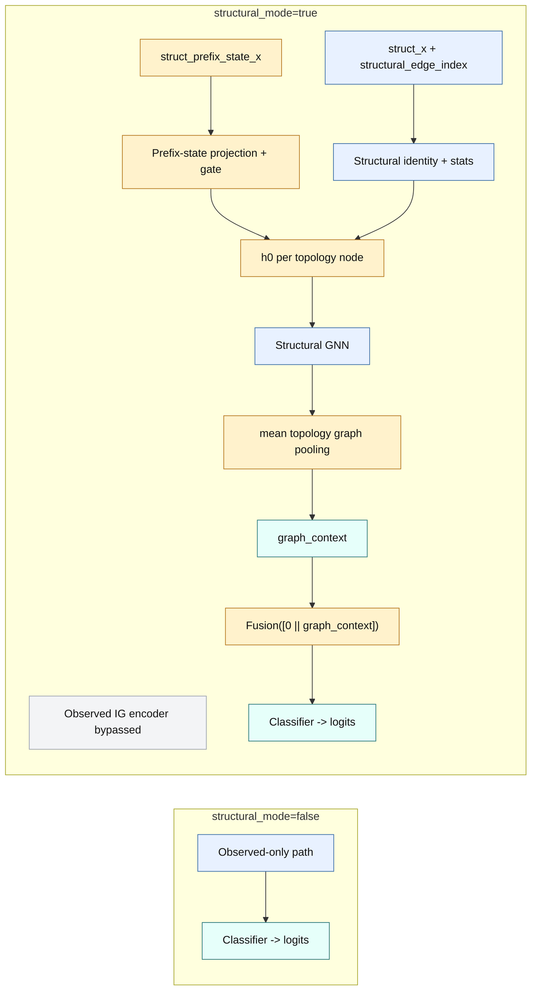
```mermaid
flowchart LR
    subgraph F["structural_mode=false"]
        F1["Observed-only path"]:::common --> F2["Classifier -> logits"]:::output
    end

    subgraph T["structural_mode=true"]
        OX["Observed IG encoder bypassed"]:::disabled
        P1["struct_prefix_state_x"]:::variable --> P2["Prefix-state projection + gate"]:::variable
        S1["struct_x + structural_edge_index"]:::common --> S2["Structural identity + stats"]:::common
        P2 --> H0["h0 per topology node"]:::variable
        S2 --> H0
        H0 --> SG["Structural GNN"]:::common
        SG --> GP["mean topology graph pooling"]:::variable
        GP --> GC["graph_context"]:::output
        GC --> FU["Fusion([0 || graph_context])"]:::variable
        FU --> CL["Classifier -> logits"]:::output
    end

    classDef common fill:#E8F1FF,stroke:#3B6EA8,color:#111;
    classDef variable fill:#FFF2CC,stroke:#B7791F,color:#111;
    classDef output fill:#E6FFFA,stroke:#2C7A7B,color:#111;
    classDef disabled fill:#F3F4F6,stroke:#9CA3AF,color:#111;
```

**Відмінність:** на відміну від `TopologyStateEncoder`, немає node-to-class
pooling. Це чистіший structural graph baseline для перевірки, чи сама
топологія з prefix-state ознаками корисна в same-version prediction.

#### 6.3.10 StructuralPriorEncoder

**Опис (ukr):** representation-level prior. Observed encoder залишається
основним джерелом контексту, а structural GNN дає pooled `struct_context`,
який додається через `concat` або `gated_concat`.

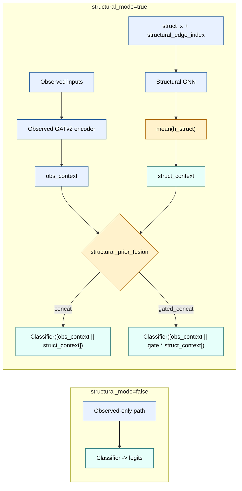
```mermaid
flowchart LR
    subgraph F["structural_mode=false"]
        F1["Observed-only path"]:::common --> F2["Classifier -> logits"]:::output
    end

    subgraph T["structural_mode=true"]
        O1["Observed inputs"]:::common --> O2["Observed GATv2 encoder"]:::common
        O2 --> O3["obs_context"]:::common
        S1["struct_x + structural_edge_index"]:::common --> S2["Structural GNN"]:::common
        S2 --> MP["mean(h_struct)"]:::variable
        MP --> SC["struct_context"]:::output
        O3 --> FU{"structural_prior_fusion"}:::variable
        SC --> FU
        FU -->|concat| C1["Classifier([obs_context || struct_context])"]:::output
        FU -->|gated_concat| C2["Classifier([obs_context || gate * struct_context])"]:::output
    end

    classDef common fill:#E8F1FF,stroke:#3B6EA8,color:#111;
    classDef variable fill:#FFF2CC,stroke:#B7791F,color:#111;
    classDef output fill:#E6FFFA,stroke:#2C7A7B,color:#111;
```

**Відмінність:** структура є global structural prior, а не per-class scorer і
не pure topology-state path. `gated_concat` додатково вчить, наскільки сильно
пропускати structural context у classifier.

### 6.4 ClassAwareStructuralScoring Fusion

`ClassAwareStructuralScoring` computes structural representations at structural
node level, scores each structural node against the observed prefix context, and
then projects node scores to activity classes:

**Коментар (ukr):** це режим, де структура найближче підходить до прямого
впливу на вибір наступної активності. Observed encoder відповідає за контекст
префікса, а structural branch додає окремий structural score для кожного
candidate class. Тому головна перевірка для цього режиму - чи structural logits
мають ненульовий, але не домінуючий масштаб відносно observed logits.

```text
identity_v = Embedding(class_or_node_identity_v)
stats_v = W_stats struct_x_v
h0_v = LayerNorm(identity_v + beta * stats_v)
h_node_v = StructuralGNN(h0_v)

q_i = W_q obs_context_i
k_v = W_k h_node_v

node_score(i, v) = q_i^T W_bilinear k_v + W_prior h_node_v
raw_struct_class(i, j) = logsumexp({node_score(i, v) | struct_node_to_class_index[v] = j})
norm_struct(i, :) = LayerNorm(raw_struct_class(i, :))
obs_scale(i) = clamp(mean(abs(observed_logits_i)).detach(), min, max)
structural_logits(i, :) = gamma * obs_scale(i) * norm_struct(i, :)
final_logits = observed_logits + structural_logits
```

This is not classical attention. It does not reduce structural nodes into one
context vector. It creates node-level structural scores and aggregates them into
one score per candidate class. `struct_node_to_class_index=-1` is used for
gateways, events, and other non-target nodes: they affect predictions through
message passing but do not receive a direct class logit.

Default `model.structural_score_mode=bilinear_with_prior`. The previous
cosine-style scorer remains available as `model.structural_score_mode=cosine`
for ablations. `struct_x` is additive enrichment, not a replacement for
structural identity. `model.structural_stats_beta` controls beta in
`identity + beta * stats_projection(struct_x)` and defaults to `0.1`.
The structural scale `gamma` is initialized conservatively via
`model.structural_logit_scale_init=0.1` and clamped by
`model.structural_logit_scale_max`.

Trainer forward diagnostics log `observed_logits_mean_abs`,
`structural_logits_mean_abs`, `structural_logits_max_abs`, and
`structural_to_observed_logit_ratio` to show whether the structural branch is
silent, useful, or dominating the observed branch.

### 6.5 TopologyStateEncoder Fusion

`TopologyStateEncoder` is an experimental early/input-level fusion mode. It is
enabled only when `experiment.structural_mode=true` and
`model.fusion_mode=TopologyStateEncoder`. If `experiment.structural_mode=false`,
the model keeps the observed-only path regardless of this fusion setting.

**Коментар (ukr):** цей режим переносить стан префікса на ноди topology і
класифікує через node-to-class pooling. Він корисний як ablation для питання
"чи може сама структура з prefix-state ознаками передбачати наступну дію", але
не є повним аналогом observed IG encoder. Через duplicate activity labels
потрібно уважно дивитись на class cardinality та entropy.

The graph builder emits `struct_prefix_state_x` for every structural node. The
current fixed feature order is:

1. `prefix_executed_count_log1p`
2. `prefix_was_executed`
3. `prefix_is_last_event`
4. `prefix_last_position_norm`
5. `prefix_recency_norm`
6. `prefix_is_active_after_complete`

Runtime formula:

```text
base_v = structural_identity_v + structural_stats_beta * stats_projection(struct_x_v)
prefix_v = W_prefix struct_prefix_state_x_v
gate_v = sigmoid(W_gate struct_prefix_state_x_v + topology_state_gate_init_bias)
h0_v = LayerNorm(base_v + beta * gate_v * prefix_v)
h_topology_v = StructuralGNN(h0_v, structural_edge_index)
node_logit_v = W_node h_topology_v
class_logit_j = pool({node_logit_v | struct_node_to_class_index[v] = j})
```

Default class pooling is `model.topology_state_class_pooling=logmeanexp`, which
uses `logsumexp(values) - log(cardinality)` to avoid inflating a class solely
because it has more duplicate structural nodes. `mean`, `max`, and `logsumexp`
remain available for ablations.

Diagnostics logged by trainer:

1. `topology_state_prefix_mean_abs`
2. `topology_state_prefix_max_abs`
3. `topology_state_entropy`
4. `topology_state_mean_class_cardinality`
5. `topology_state_max_class_cardinality`
6. `topology_state_gate_mean`
7. `topology_state_gate_max`

This mode is an ablation for early structural fusion and structural overfitting
analysis. It is not the canonical final drift-generalization mechanism.

### 6.6 TopologyStateGraphEncoder Fusion

`TopologyStateGraphEncoder` is a structural graph encoder baseline. It uses the
same `struct_prefix_state_x` tensor as `TopologyStateEncoder`, but it does not
emit node logits and does not perform node-to-class pooling. Instead, it
classifies a graph-level topology context after structural message passing.

**Коментар (ukr):** це чистий structural graph baseline у стилі старого etalon
підходу: модель працює з графом структури як з основним носієм стану. На
відміну від `TopologyStateEncoder`, тут немає ризику inflation через
node-to-class `LogSumExp`, бо рішення приймається з pooled graph context.

Runtime formula:

```text
base_v = structural_identity_v + structural_stats_beta * stats_projection(struct_x_v)
prefix_v = W_prefix struct_prefix_state_x_v
gate_v = sigmoid(W_gate struct_prefix_state_x_v + topology_state_gate_init_bias)
h0_v = LayerNorm(base_v + beta * gate_v * prefix_v)
h_topology_v = StructuralGNN(h0_v, structural_edge_index)
graph_context = mean_v(h_topology_v)
logits = Classifier(Fusion([0 || graph_context]))
```

This mode is closest to the old etalon/article-style GNN baseline: structure is
the graph on which node state is propagated before graph-level classification.
It should be used to test whether topology helps same-version predictive
monitoring before drawing conclusions about structural drift transfer.

Diagnostics logged by trainer:

1. `topology_state_prefix_mean_abs`
2. `topology_state_prefix_max_abs`
3. `topology_state_gate_mean`
4. `topology_state_gate_max`
5. `topology_graph_context_mean_abs`
6. `topology_graph_context_max_abs`
7. `topology_graph_logits_mean_abs`
8. `topology_graph_entropy`

### 6.7 StructuralPriorEncoder Fusion

`StructuralPriorEncoder` is an etalon-like representation-level structural
fusion mode. It keeps the observed prefix encoder as the primary path, computes
a pooled structural context from EOPKG/BPMN tensors, and fuses both contexts
before the classifier.

**Коментар (ukr):** цей режим залишає observed model головною, а структуру
подає як prior. Його треба читати як сильніший і чистіше задокументований
аналог `ClassMeanConcat`: структура не ранжує класи напряму, але може змінювати
representation перед classifier. `gated_concat` показує, чи модель взагалі
хоче пропускати structural context.

It differs from:

1. `ClassMeanConcat`: legacy mean structural context without explicit
   structural-prior diagnostics.
2. `ClassAwareStructuralScoring`: late structural class-logit additive scoring.
3. `TopologyStateEncoder`: topology-state branch that directly emits class
   logits and clears observed-logit diagnostics.

Runtime formula for `model.structural_prior_fusion=concat`:

```text
obs_context_i = ObservedGNN(prefix_i)
h_struct_v = StructuralGNN(h0_v, structural_edge_index)
struct_context = mean_v(h_struct_v)
logits_i = Classifier(Fusion([obs_context_i || struct_context]))
```

Runtime formula for `model.structural_prior_fusion=gated_concat`:

```text
gate_i = sigmoid(W_gate([obs_context_i || struct_context]) + b)
logits_i = Classifier(Fusion([obs_context_i || gate_i * struct_context]))
```

Current supported pooling:

```yaml
model.structural_prior_pooling: mean
```

`mean` mirrors the old etalon `global_mean_pool` behavior. The mode is intended
as the clean structural baseline for testing whether structure improves
same-version prediction before testing transfer between process versions.

Trainer diagnostics:

1. `observed_context_mean_abs`
2. `structural_prior_context_mean_abs`
3. `structural_prior_to_observed_context_ratio`
4. `structural_prior_gate_mean`
5. `structural_prior_gate_max`

### 6.8 StructXAttn Token-Level Structural Cross-Attention

`StructXAttn` is the TokenXAttn-style dual-stream mode for `EOPKGGATv2`.
It keeps both streams active:

1. observed IG stream encodes prefix nodes;
2. structural stream encodes BPMN/EOPKG topology nodes;
3. every observed node queries structural nodes before pooling;
4. classifier receives structurally updated observed node context.

**Опис (ukr):** це перший режим, де структура не стискається в один global
context і не додається лише на рівні logits. Структура впливає на
`H_ig` до pooling/classifier. Тому цей режим перевіряє сильнішу гіпотезу:
нормативний граф має керувати формуванням observed representations, а не лише
після факту фільтрувати/додавати score.

Runtime formula:

```text
H_ig = ObservedGATv2(prefix_graph)
H_struct = StructuralGNN(struct_x, structural_edge_index)

Q = W_q H_ig
K = W_k H_struct
V = W_v H_struct
A = softmax(Q K^T / sqrt(d))
C = A V
gate = sigmoid(W_gate([H_ig || C]) + b)
delta = gamma * gate * C
H_ig' = merge(H_ig, delta)

obs_context = pool(H_ig')
logits = Classifier(obs_context)
```

Merge semantics are controlled by:

```yaml
model.struct_xattn_merge_mode: post_norm_residual | pre_norm_context | residual_only
model.struct_xattn_delta_ratio_max: null
```

`post_norm_residual` is the compatibility mode:

```text
delta = gamma * gate * C
H_ig' = LayerNorm(H_ig + delta)
```

It reproduces historical StructXAttn behavior, but can amplify a small
pre-merge structural delta into a large post-merge hidden-state change.

`pre_norm_context` is the recommended research mode after the 2026-05-23
stabilization:

```text
C_norm = LayerNorm(C)
delta = gamma * gate * C_norm
delta = clamp_delta_ratio(delta, H_ig, model.struct_xattn_delta_ratio_max)
H_ig' = H_ig + delta
```

There is intentionally no `LayerNorm(H_ig + delta)` after the residual merge in
this mode. `model.struct_xattn_delta_ratio_max` is optional; when set, it caps
`mean_abs(delta) / mean_abs(H_ig)`.

`residual_only` is an ablation mode:

```text
delta = gamma * gate * C
delta = clamp_delta_ratio(delta, H_ig, model.struct_xattn_delta_ratio_max)
H_ig' = H_ig + delta
```

Use it to isolate whether context normalization or post-merge normalization is
responsible for a run's behavior.

Layer placement:

```yaml
model.struct_xattn_layers: post_conv2      # safe smoke/integration mode
model.struct_xattn_layers: after_each_conv # research target mode
```

`post_conv2`:

```text
conv1 -> conv2 -> StructXAttn -> pooling -> classifier
```

This is safer for implementation, but observed message passing is still blind
to structure until after `conv2`.

`after_each_conv`:

```text
conv1 -> StructXAttn_1 -> conv2 -> StructXAttn_2 -> pooling -> classifier
```

This is the main research variant because structural guidance enters observed
message passing at each GATv2 layer.

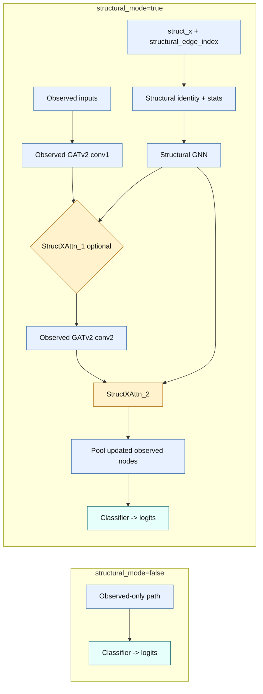
```mermaid
flowchart LR
    subgraph F["structural_mode=false"]
        F1["Observed-only path"]:::common --> F2["Classifier -> logits"]:::output
    end

    subgraph T["structural_mode=true"]
        O1["Observed inputs"]:::common --> G1["Observed GATv2 conv1"]:::common
        S1["struct_x + structural_edge_index"]:::common --> S2["Structural identity + stats"]:::common
        S2 --> SG["Structural GNN"]:::common
        G1 --> XA1{"StructXAttn_1 optional"}:::variable
        SG --> XA1
        XA1 --> G2["Observed GATv2 conv2"]:::common
        G2 --> XA2["StructXAttn_2"]:::variable
        SG --> XA2
        XA2 --> POOL["Pool updated observed nodes"]:::common
        POOL --> CLS["Classifier -> logits"]:::output
    end

    classDef common fill:#E8F1FF,stroke:#3B6EA8,color:#111;
    classDef variable fill:#FFF2CC,stroke:#B7791F,color:#111;
    classDef output fill:#E6FFFA,stroke:#2C7A7B,color:#111;
```

Model config:

```yaml
model.fusion_mode: StructXAttn
model.struct_xattn_layers: post_conv2 | after_each_conv
model.struct_xattn_heads: 4
model.struct_xattn_dropout: 0.2
model.struct_xattn_scale_init: 0.1
model.struct_xattn_scale_max: 2.0
model.struct_xattn_use_layer_norm: true
model.struct_xattn_use_gate: true
model.struct_xattn_gate_init_bias: -2.0
model.struct_xattn_merge_mode: post_norm_residual
model.struct_xattn_delta_ratio_max: null
```

Recommended stabilization profile for new StructXAttn drift experiments:

```yaml
model.fusion_mode: StructXAttn
model.struct_xattn_layers: after_each_conv
model.struct_xattn_merge_mode: pre_norm_context
model.struct_xattn_scale_init: 0.1
model.struct_xattn_scale_max: 0.1
model.struct_xattn_use_gate: true
model.struct_xattn_gate_init_bias: -2.0
model.struct_xattn_delta_ratio_max: 0.3
```

Trainer diagnostics:

1. `struct_xattn_context_mean_abs`
2. `struct_xattn_delta_mean_abs`
3. `struct_xattn_to_observed_ratio`
4. `struct_xattn_attention_entropy`
5. `struct_xattn_scale`
6. `struct_xattn_gate_mean`
7. `struct_xattn_l1_delta_mean_abs`
8. `struct_xattn_l2_delta_mean_abs`
9. `struct_xattn_l1_attention_entropy`
10. `struct_xattn_l2_attention_entropy`

Interpretation:

- near-zero `struct_xattn_to_observed_ratio`: structure is ignored or too weak;
- very high `struct_xattn_post_norm_to_observed_ratio`: structure dominates or
  post-merge normalization amplified the residual delta;
- high `struct_xattn_raw_to_observed_ratio` with low
  `struct_xattn_pre_norm_to_observed_ratio`: raw structural context is large but
  gated/scale-controlled before merge;
- in `pre_norm_context`, `post_norm_to_observed_ratio` should stay close to
  `pre_norm_to_observed_ratio`;
- low entropy with poor F1/ECE: structural overconfidence;
- `l1` metrics are expected only for `after_each_conv`.

### 6.9 EOPKGGCN
Compatibility EOPKG variant:
1. observed branch with GCN encoder,
2. structural summary context from structural tensors,
3. fusion MLP + classifier,
4. baseline fallback when structural tensors are missing.

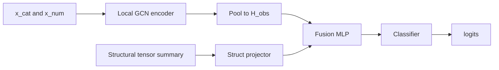
```mermaid
flowchart LR
    O1[x_cat and x_num] --> O2[Local GCN encoder]
    O2 --> O3[Pool to H_obs]
    S1[Structural tensor summary] --> S2[Struct projector]
    O3 --> F1[Fusion MLP]
    S2 --> F1
    F1 --> C1[Classifier]
    C1 --> LOGITS[logits]
```

### 6.10 EOPKGTopologyConditioned

`EOPKGTopologyConditioned` is a separate `model.type`, not an
`EOPKGGATv2.fusion_mode`.

Purpose:

1. make topology the prediction candidate space, not only a hint added to a
   fixed classifier;
2. score observed prefix representation against topology-local BPMN/EOPKG
   candidates;
3. support backward-compatible fixed-label projection for old metrics;
4. support the current true candidate-level trainer path through
   `forward_candidate(contract)` and `training.candidate_contract_mode:
   candidate_id`.

**Робоча інтерпретація (ukr):** ця модель відповідає не на питання
"який клас із train vocabulary вибрати?", а на питання "який candidate з
поточної topology version найкраще відповідає observed prefix?". Projection
назад у fixed labels потрібен лише для сумісності старих метрик.

Current candidate-id runtime:

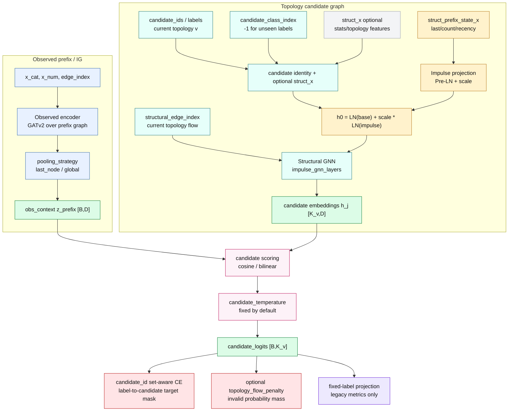
```mermaid
flowchart TD
    subgraph IG["Observed prefix / IG"]
        XCAT["x_cat, x_num, edge_index"]:::common
        OENC["Observed encoder\nGATv2 over prefix graph"]:::common
        POOL["pooling_strategy\nlast_node / global"]:::common
        Z["obs_context z_prefix [B,D]"]:::output
        XCAT --> OENC --> POOL --> Z
    end

    subgraph TG["Topology candidate graph"]
        CID["candidate_ids / labels\ncurrent topology v"]:::candidate
        CIDX["candidate_class_index\n-1 for unseen labels"]:::candidate
        EDGE["structural_edge_index\ncurrent topology flow"]:::candidate
        SX["struct_x optional\nstats/topology features"]:::optional
        PS["struct_prefix_state_x\nlast/count/recency"]:::state
        BASE["candidate identity + optional struct_x"]:::candidate
        IMP["Impulse projection\nPre-LN + scale"]:::state
        H0["h0 = LN(base) + scale * LN(impulse)"]:::state
        SGNN["Structural GNN\nimpulse_gnn_layers"]:::candidate
        HN["candidate embeddings h_j [K_v,D]"]:::output

        CID --> BASE
        CIDX --> BASE
        SX --> BASE
        PS --> IMP
        BASE --> H0
        IMP --> H0
        EDGE --> SGNN
        H0 --> SGNN --> HN
    end

    Z --> SCORE["candidate scoring\ncosine / bilinear"]:::variable
    HN --> SCORE
    SCORE --> TEMP["candidate_temperature\nfixed by default"]:::variable
    TEMP --> CLOGITS["candidate_logits [B,K_v]"]:::output

    CLOGITS --> LOSS["candidate_id set-aware CE\nlabel-to-candidate target mask"]:::loss
    CLOGITS --> FLOW["optional topology_flow_penalty\ninvalid probability mass"]:::loss
    CLOGITS --> PROJ["fixed-label projection\nlegacy metrics only"]:::compat

    classDef common fill:#E8F1FF,stroke:#3B6EA8,color:#111;
    classDef candidate fill:#E6FFFA,stroke:#2C7A7B,color:#111;
    classDef state fill:#FFF2CC,stroke:#B7791F,color:#111;
    classDef optional fill:#F3F4F6,stroke:#9CA3AF,color:#111;
    classDef variable fill:#FDF2F8,stroke:#BE185D,color:#111;
    classDef output fill:#DCFCE7,stroke:#15803D,color:#111;
    classDef loss fill:#FFE4E6,stroke:#B91C1C,color:#111;
    classDef compat fill:#EDE9FE,stroke:#6D28D9,color:#111;
```

Key distinction:

```text
BaselineGATv2:
    observed prefix -> fixed classifier -> logits [B, C_train]

EOPKGTopologyConditioned candidate_id:
    observed prefix + current topology candidates -> candidate_logits [B, K_v]
```

Stage 1 architecture:

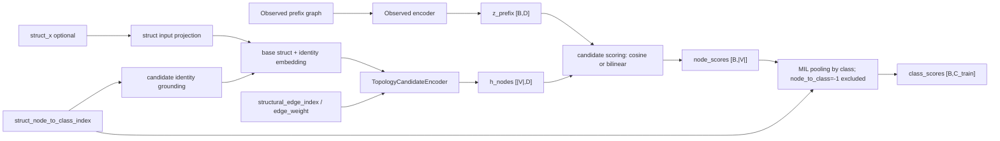
```mermaid
flowchart LR
    X["Observed prefix graph"] --> O["Observed encoder"]
    O --> Z["z_prefix [B,D]"]
    SX["struct_x optional"] --> SI["struct input projection"]
    N2C["struct_node_to_class_index"] --> ID["candidate identity grounding"]
    SI --> ADD["base struct + identity embedding"]
    ID --> ADD
    ADD --> SG["TopologyCandidateEncoder"]
    EDGE["structural_edge_index / edge_weight"] --> SG
    SG --> H["h_nodes [|V|,D]"]
    Z --> SCORE["candidate scoring: cosine or bilinear"]
    H --> SCORE
    SCORE --> NS["node_scores [B,|V|]"]
    N2C --> MIL["MIL pooling by class; node_to_class=-1 excluded"]
    NS --> MIL
    MIL --> LOGITS["class_scores [B,C_train]"]
```

Stage 2 model-level candidate contract:

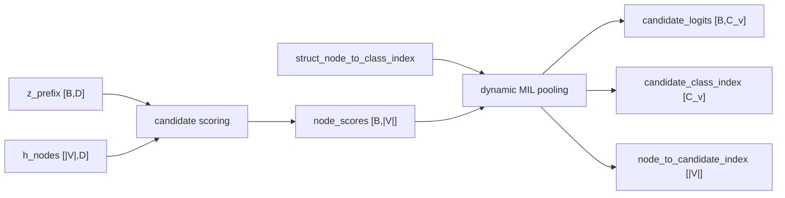
```mermaid
flowchart LR
    Z["z_prefix [B,D]"] --> SCORE["candidate scoring"]
    H["h_nodes [|V|,D]"] --> SCORE
    SCORE --> NS["node_scores [B,|V|]"]
    N2C["struct_node_to_class_index"] --> DYN["dynamic MIL pooling"]
    NS --> DYN
    DYN --> CLOGITS["candidate_logits [B,C_v]"]
    DYN --> CIDX["candidate_class_index [C_v]"]
    DYN --> NIDX["node_to_candidate_index [|V|]"]
```

`forward_candidate(contract)` returns `CandidatePredictionOutput`:

```text
candidate_logits: FloatTensor [B, C_v]
candidate_class_index: LongTensor [C_v]
node_logits: FloatTensor [B, |V|]
node_to_candidate_index: LongTensor [|V|]
node_to_class_index: LongTensor [|V|]
fixed_label_logits: FloatTensor [B, C_train] | None
```

Current boundary:

```text
forward() remains the default fixed-label train/eval path and returns
`[B, C_train]`.

`forward_candidate()` can be consumed by trainer/evaluator through either the
compatibility projection path or the true candidate-level path.
```

When `training.dynamic_candidate_contract_enabled=true` or
`training.candidate_contract_mode=fixed_projection`, trainer/evaluator call
`forward_candidate(contract)`, take `candidate_logits [B, C_v]`, and project
them into a sparse fixed-label tensor `[B, C_train]` using
`candidate_class_index`. Non-candidate fixed-label classes receive a very low
logit. This preserves existing CE, mask, calibration, and drift metric code.

This is a transitional Stage 2 compatibility path. It still cannot honestly
score an unseen activity class outside `C_train`.

When `training.candidate_contract_mode=candidate_id`, trainer/evaluator use the
topology-local candidate axis directly for the loss:

```text
candidate_logits: [B, C_v]
target_candidate_mask[b, j] = candidate_class_index[j] == y_b
loss_b = -logsumexp(candidate_logits[b, target_candidate_mask[b]])
         + logsumexp(candidate_logits[b, :])
```

This is set-aware CE: if several BPMN candidate nodes map to the same activity
class, any of them is accepted as a correct target candidate. The implementation
logs candidate target mapping diagnostics:

```text
candidate_target_in_candidate_set_rate
candidate_missing_target_rate
candidate_target_duplicate_count_max
candidate_target_set_logit_variance_mean
candidate_target_set_entropy_mean
```

Training fails when `candidate_missing_target_rate` exceeds:

```yaml
training.candidate_missing_target_fail_threshold: 0.10
```

because a high missing-target rate means the log target cannot be mapped to the
topology-local candidate space.

Candidate contract modes:

```yaml
training.candidate_contract_mode: fixed_label | fixed_projection | candidate_id
training.candidate_batch_topology_policy: single_topology_required | group_by_topology
```

- `fixed_label`: legacy `forward(contract) -> [B, C_train]`.
- `fixed_projection`: `forward_candidate(contract)` is consumed and projected
  back to `[B, C_train]`; this is equivalent to
  `training.dynamic_candidate_contract_enabled=true`.
- `candidate_id`: uses true topology-local candidate logits for train loss and
  primary train/test/drift metrics. Fixed-vocabulary projection is still logged
  as `fixed_label_*` compatibility diagnostics, but it is not the primary
  quality signal for topology-native experiments. The DataLoader must emit
  topology-homogeneous batches keyed by
  `process_version_idx + stats_snapshot_version_idx`, because the candidate
  axis `[C_v]` is topology-local. `single_topology_required` forms
  homogeneous batches for indexable graph sources, including in-memory datasets
  and `ShardedGraphDataset` disk-cache sources, and fails if a mixed batch
  reaches `_data_to_contract()`. `group_by_topology` is reserved for a future
  implementation that will split already-mixed batches inside the trainer.

Metric contract:

```text
strict_test_macro_f1
strict_test_accuracy
test_macro_f1
test_accuracy
drift_window_strict_macro_f1
```

For fixed-label models these metrics are computed in the fixed training
activity vocabulary. For `candidate_id + topology_native`, the same metric
names are computed in the topology-local candidate space `[C_v]` by matching
`target_label` from the log against `candidate_ids` / `candidate_labels` of the
current process version. Candidate-local numeric offsets are not stable across
process versions and must not be used as macro-F1 class labels. The primary
candidate-native metric key is the stable activity label/id, not the local
`[0, C_v)` candidate index. This keeps Baseline and topology-conditioned runs
comparable on one chart as “exact next activity” quality.

Candidate target matching is exact first, then uses deterministic aliases for
adapter formatting differences. For XES logs with lifecycle classifiers,
suffixes such as `+COMPLETE` are ignored during candidate matching, so
`W_Nabellen offertes+COMPLETE` can match topology candidate label/id
`W_Nabellen offertes`.

The old fixed-vocabulary projection is retained under:

```text
fixed_label_strict_test_macro_f1
fixed_label_strict_test_accuracy
fixed_label_test_macro_f1
fixed_label_test_accuracy
fixed_label_drift_window_strict_macro_f1
```

These metrics are compatibility diagnostics only. They are expected to
undercount correct topology-native predictions for unseen candidates because
new version-specific activities do not exist in `C_train`.

Calibration and NLL use the same metric-space rule:

- primary `test_ece` / `drift_window_test_ece` use confidence from the active
  prediction space and correctness in stable activity label/id space;
- primary `test_set_nll` / `drift_window_test_set_nll` use probability mass of
  the stable target label or candidate target set;
- `fixed_label_test_ece` and `fixed_label_test_set_nll` remain compatibility
  diagnostics over the frozen training vocabulary.

For fixed-head Baseline models this means an unseen future activity encoded as
`<UNK>` is penalized in primary calibration/NLL when the stable log label is a
real future activity. The old `<UNK>`-based behavior is visible only through
`fixed_label_*`.

Candidate-flow consistency:

When `training.candidate_contract_mode=candidate_id`, the trainer can project
the fixed-label `allowed_target_mask [B, C_train]` onto the topology-local
candidate axis:

```text
candidate_allowed_mask[b, j] = allowed_target_mask[b, candidate_class_index[j]]
```

This enables candidate-level topology-flow diagnostics and an optional
train-time penalty:

```yaml
training.topology_flow_penalty_enabled: true
training.topology_flow_penalty_weight: 0.05
training.topology_flow_penalty_type: invalid_probability_mass  # invalid_probability_mass | margin
training.topology_flow_penalty_margin: 0.1
training.topology_flow_penalty_fail_on_missing_mask: true
```

`invalid_probability_mass` is the stable default:

```text
L_flow = mean_b sum_j softmax(candidate_logits[b])[j]
         where candidate_allowed_mask[b,j] == false
```

`margin` requires the best valid candidate logit to exceed the best invalid
candidate logit by `training.topology_flow_penalty_margin`.

For `candidate_id`, legacy `wrong_version` and `drop_edges` CE-negative
objectives are skipped and logged as skipped candidate-id batches. They still
depend on fixed-label forward semantics and are not valid as-is for a
topology-local candidate axis.

Important semantics:

1. `struct_node_to_class_index` and `structural_edge_index` are required.
2. `struct_x` is optional enrichment. When absent, candidate nodes start from
   identity embeddings only.
3. `struct_node_to_class_index >= 0` receives a trainable candidate identity
   embedding.
4. `struct_node_to_class_index == -1` receives a shared non-target embedding and
   participates in message passing, but is excluded from class pooling.
5. Duplicate BPMN nodes mapped to the same activity class are pooled by
   `model.candidate_pooling`.
6. Default pooling is normalized `logmeanexp`, not raw `logsumexp`, to avoid
   inflating a class only because it has more duplicate nodes.
7. The model returns clean scores. `allowed_target_mask`, mask-guided inference,
   and allowed-set losses remain trainer/evaluator responsibilities.

Supported config keys:

```yaml
model.type: EOPKGTopologyConditioned
model.observed_encoder: GATv2
model.struct_encoder: GATv2
model.topology_conditioning_mode: static_candidates | impulse_activation_routing
model.candidate_scoring: cosine       # cosine | bilinear
model.candidate_pooling: logmeanexp   # logmeanexp | mean | max
model.candidate_temperature_init: 0.1
model.candidate_temperature_min: 0.05
model.candidate_temperature_max: 2.0
model.candidate_temperature_trainable: false
model.impulse_activation_enabled: true
model.impulse_scale_init: 0.1
model.impulse_gnn_layers: 1
model.impulse_residual_h0: true
training.dynamic_candidate_contract_enabled: false
training.candidate_contract_mode: fixed_label | fixed_projection | candidate_id
training.candidate_identity_mode: fixed_vocab_bridge | topology_native
training.topology_flow_penalty_enabled: false
```

`fixed_vocab_bridge` keeps the candidate axis fixed to the fitted
`activity_vocab` and is intended for fixed-label/baseline compatibility.
`topology_native` uses the version-specific BPMN candidate nodes and is intended
for zero-shot topology-conditioned experiments.

`candidate_temperature` is a score-sharpness parameter:

```text
candidate_logit_j = candidate_score_j / candidate_temperature
```

Lower values make candidate ranking sharper and more confident. Current
research presets keep it fixed (`candidate_temperature_trainable=false`) to
avoid overconfidence shortcuts during drift experiments.

`impulse_gnn_layers` is the propagation depth of the current execution pointer:

- `1`: default for `XES + gateway_mode=collapse_for_prediction`;
- `2`: meaningful ablation for Camunda-like `gateway_mode=preserve`, where
  technical/gateway nodes can sit between two business activities;
- `3+`: high over-smoothing risk and should not be a default research setting.

Diagnostics logged by trainer and exposed to selective traces:

1. `candidate_node_score_mean_abs`
2. `candidate_class_score_mean_abs`
3. `duplicate_candidate_count_max`
4. `candidate_temperature`
5. `candidate_dynamic_count`
5. `candidate_prediction_entropy`
6. `candidate_target_score`
7. `candidate_pred_score`
8. `candidate_score_gap`
9. `candidate_oos_rate`
10. `candidate_invalid_probability_mass`
11. `candidate_valid_probability_mass`
12. `candidate_valid_invalid_logit_margin`

Interpretation:

- high `duplicate_candidate_count_max` means duplicate-activity ambiguity is
  active and MIL behavior must be inspected;
- low `candidate_prediction_entropy` with poor drift F1/OOS means the candidate
  scorer is overconfident;
- low `candidate_score_gap` means target and prediction candidates are close and
  errors may be ranking/calibration issues rather than missing topology;
- high class score scale with stable node score scale may indicate pooling or
  temperature amplification.
- high `candidate_invalid_probability_mass` or `candidate_oos_rate` means the
  scorer assigns probability to candidates disallowed by current topology flow.

## 7. Loss, Evaluation, and Mask Application
1. Base objective remains cross-entropy on `y`.
2. `allowed_target_mask` is used for Stage2 diagnostics (`target_in_mask_rate`, `pred_in_mask_rate`, `strict_error_but_allowed_rate`, OOS, cardinality slices).
3. Stage3 adds optional mask-guided logits policy in trainer:
   - `off`: no mask effect on logits,
   - `soft`: subtract penalty from disallowed classes,
   - `hard`: suppress disallowed classes.
   - `auto`: preserve the reliability-based hard/soft selection.
4. Hard versus soft decision uses mask reliability:
   - if `target_in_mask_rate` meets threshold, policy may be hard,
   - otherwise policy stays soft.
   `training.mask_guided_policy=hard` bypasses reliability selection and is
   intended for reviewer-control post-filter baselines.
5. `ClassAwareStructuralScoring` may add an auxiliary structural loss:
   - `training.structural_aux_loss_enabled`: enables the auxiliary objective,
   - `training.structural_aux_loss_weight`: set-aware CE over allowed target candidates,
   - `training.structural_aux_exact_loss_weight`: small exact CE component.
6. Auxiliary structural loss uses `last_structural_class_logits` before mask
   policy application. The set-aware component treats every `allowed_target_mask`
   candidate as valid and always includes the exact target, which keeps the loss
   compatible with parallel or ambiguous target regions.
7. `StructXAttn` may add a correct-vs-corrupted topology objective during
   training only:
   - `training.struct_xattn_contrastive_enabled`: enables the objective,
   - `training.struct_xattn_contrastive_weight`: loss multiplier,
   - `training.struct_xattn_contrastive_margin`: required CE advantage for the
     correct topology,
   - `training.struct_xattn_contrastive_temperature`: softplus smoothing,
   - `training.struct_xattn_contrastive_max_loss`: per-batch clamp before
     weighting,
   - `training.struct_xattn_contrastive_warmup_epochs`: initial epochs without
     corrupted forward,
   - `training.struct_xattn_corruption_policy`: tensor-level corruption policy.
8. StructXAttn contrastive loss is not applied during validation, test, or
   `eval_drift` inference. It is a training methodology to force structural
   dependency, not an inference-time mask.

`GATv2 + Mask` is a reviewer-control baseline. It keeps the fixed-vocabulary
`BaselineGATv2` output head over `C_train`, but applies the current topology
mask to logits at inference time. With `training.mask_guided_policy=hard`,
classes outside `allowed_target_mask` are suppressed before softmax/argmax.
This can reduce OOS errors, but it cannot predict topology-native candidates
that do not exist in `C_train`.

StructXAttn contrastive formula:

```text
logits_correct = model(prefix, topology_correct)
CE_correct = CE(logits_correct, y)

logits_corrupt = model(prefix, topology_corrupt)
CE_corrupt = CE(logits_corrupt, y)

raw_gap = margin + CE_correct - CE_corrupt
L_contrastive = clamp(tau * softplus(raw_gap / tau), max=max_loss)
L_total = CE_correct + weight * L_contrastive
```

Corruption is applied to already prepared structural tensors. Runtime does not
rebuild topology or query raw sources for negative examples.

StructXAttn contrastive diagnostics:

1. `struct_xattn_correct_ce`
2. `struct_xattn_corrupt_ce`
3. `struct_xattn_correct_vs_corrupt_ce_delta`
4. `struct_xattn_contrastive_loss`
5. `struct_xattn_prediction_flip_rate`
6. `struct_xattn_contrastive_margin_violation_rate`
7. `struct_xattn_raw_context_mean_abs`
8. `struct_xattn_pre_norm_delta_mean_abs`
9. `struct_xattn_post_norm_delta_mean_abs`
10. `struct_xattn_raw_to_observed_ratio`
11. `struct_xattn_pre_norm_to_observed_ratio`
12. `struct_xattn_post_norm_to_observed_ratio`

`struct_xattn_correct_vs_corrupt_ce_delta > 0` means the correct topology gives
lower CE than the corrupted topology. If this stays near or below zero, the
model still ignores structure or the corruption policy is not meaningful.

## 7.1 Learning Strategy Hook

`model.fusion_mode` still defines only the forward architecture. Trainer-level
learning methodology is controlled by:

```yaml
training.learning_strategy: standard | topology_conditioned
```

`standard` preserves the previous CE-based training behavior. 
`topology_conditioned` wraps the same forward model with additional train-only
objectives:

1. `topology_conditioned_allowed_set_loss`
2. `topology_conditioned_wrong_version_ce_delta`
3. `topology_conditioned_drop_edges_ce_delta`
4. `topology_conditioned_retention_loss`
5. `topology_conditioned_mixed_version_batches`
6. `topology_conditioned_wrong_version_skipped_mixed_batches`
7. `allowed_set_mass_leakage`
8. `grad_norm_observed`
9. `grad_norm_struct_xattn`
10. `grad_norm_structural`
11. `topology_conditioned_*_margin_violation_rate`

These objectives are not applied during validation/test/eval_drift inference.
They are intended to make the selected `fusion_mode` depend on topology during
training. Physical `drop_edges` is used in the first implementation because the
current structural GNN path does not consume `structural_edge_weight`; Soft Edge
Drop is deferred.

## 7.1.1 MVP Debug Diagnostics

MVP debug metrics separate four diagnostic levels:

1. **Feature & Scale Level**
   - `struct_xattn_raw_context_mean_abs`: raw cross-attention context magnitude.
   - `struct_xattn_pre_norm_delta_mean_abs`: actual `scale * gate * context`
     magnitude before residual `LayerNorm`.
   - `struct_xattn_post_norm_delta_mean_abs`: observed hidden-state delta after
     residual `LayerNorm`.
   - `struct_xattn_raw_to_observed_ratio`,
     `struct_xattn_pre_norm_to_observed_ratio`,
     `struct_xattn_post_norm_to_observed_ratio`.

2. **Gradient & Loss Level**
   - `grad_norm_observed`, `grad_norm_struct_xattn`, `grad_norm_structural`.
   - `allowed_set_mass_leakage`: probability mass outside `allowed_target_mask`.
   - `struct_xattn_contrastive_margin_violation_rate`.
   - `topology_conditioned_drop_edges_margin_violation_rate`.
   - `topology_conditioned_wrong_version_margin_violation_rate`.

3. **Drift / Zero-Shot Level**
   - `drift_window_oos_confidence_mean`: mean confidence for OOS predictions in
     each drift window.

4. **Selective Trace Level**
   - The same StructXAttn scale ratios are included in selected prediction trace
     payloads and flat MLflow span attributes.

**Опис (ukr):** ці метрики потрібні, щоб відокремити три різні проблеми:
структурний сигнал майже нульовий, структурний сигнал токсично домінує, або
структурний сигнал проходить у здоровому масштабі, але loss/методологія
навчання спрямовує його не туди.

## 7.2 Selective Structural Prediction Tracing

Selective tracing is an optional qualitative debugging layer for prediction
explanations. It is not the primary scientific evidence. Dissertation/article
evidence must still be based on aggregate metrics, drift windows, calibration,
OOS/mask diagnostics, and seed variance.

Enable through `tracking.tracing.*`:

```yaml
tracking:
  tracing:
    enabled: false
    stages: test,eval_drift_one_pass
    sample_policy: interesting
    max_traces_per_run: 80
    max_traces_per_stage: 40
    max_traces_per_version: 10
    random_sample_rate: 0.0
    high_confidence_threshold: 0.8
    low_confidence_threshold: 0.4
    top_k: 5
    log_json_artifact_fallback: true
```

Recorded cases are selected by `TraceSamplingPolicy`:

1. `strict_error_but_allowed`: predicted class is allowed by mask but not the
   exact target.
2. `oos_prediction`: prediction is outside `allowed_target_mask`.
3. `high_confidence_error`: wrong prediction with high confidence.
4. `low_confidence_correct`: correct prediction but low confidence.
5. `version_first`: first traced sample for a process version.
6. `random` or `all`, if explicitly configured.

The trace payload is built by
`src/application/services/structural_trace_payload_builder.py`. All PyTorch
tensors are detached and moved to CPU before serialization. This is mandatory:
trace dictionaries must not retain computation graphs.

Trace storage:

1. If MLflow supports `mlflow.start_span`, the recorder writes one span per
   selected prediction.
2. If span tracing is unavailable or fails, the fallback writes JSONL to a
   rank/PID-scoped file:
   `outputs/mlflow_trace_fallback/structural_traces_run_<run>_pid_<pid>_rank_<rank>.jsonl`.
3. The fallback artifact is logged to MLflow before `tracker.close()`.
4. Nonzero distributed ranks do not write fallback files unless
   `tracking.tracing.allow_nonzero_rank_fallback=true`.

Flat MLflow span attributes are used for search/filtering:

```text
stage
reason
fusion_mode
structural_mode
process_version
strict_correct
strict_error_but_allowed
target_in_mask
pred_in_mask
mask_cardinality
confidence
prediction_entropy
structural_to_observed_logit_ratio
struct_xattn_gate_mean
struct_xattn_attention_entropy
struct_xattn_raw_to_observed_ratio
struct_xattn_pre_norm_to_observed_ratio
struct_xattn_post_norm_to_observed_ratio
candidate_temperature
candidate_prediction_entropy
candidate_score_gap
candidate_node_score_mean_abs
candidate_class_score_mean_abs
duplicate_candidate_count_max
```

Nested JSON payload is kept in span inputs/outputs or JSONL for explanation:

1. sample ids and snapshot metadata,
2. target/predicted labels and top-k classes,
3. mask membership and mask cardinality,
4. model diagnostics for the active `fusion_mode`,
5. selected structural contribution fields, when available.

**Опис (ukr):** tracing потрібен, щоб відповісти на питання "що саме модель
бачила у конкретному prediction і як структурний шлях вплинув на відповідь".
Це якісний debug/explainability інструмент. Він не замінює aggregated metrics і
не має використовуватись як самостійний доказ користі структури.

```mermaid
flowchart LR
    CONTRACT[GraphTensorContract batch] --> MODEL[Model forward]
    MODEL --> LOGITS_RAW[raw logits]
    MODEL --> STRUCT_LOGITS[structural class logits]
    CONTRACT --> MASK[allowed_target_mask optional]
    MASK --> POLICY[mask_guided policy off soft hard]
    LOGITS_RAW --> POLICY
    POLICY --> LOGITS_EFF[effective logits]
    CONTRACT --> Y[y]
    LOGITS_EFF --> LOSS[cross entropy]
    STRUCT_LOGITS --> AUX[structural auxiliary loss]
    MASK --> AUX
    Y --> AUX
    AUX --> LOSS
    Y --> LOSS
    LOGITS_EFF --> PRED[predictions]
    PRED --> METRICS[accuracy f1 ece]
    MASK --> METRICS
    Y --> METRICS
```

## 8. Compatibility Rules
1. Baseline path must remain valid when all structural tensors are absent.
2. EOPKG path must degrade safely to observed-only forward when structural tensors are absent.
3. Optional tensor fields must never break MVP1-compatible execution.

## 8.1 Stats-Backed Structural Payload Caching

Full drift runs with `statistic_enabled=true` use snapshot-aware stats payload
loading and deduplicated sharded structural payloads.

Repository behavior:

1. Neo4j snapshot timelines are loaded as lightweight identity rows.
2. Heavy snapshot JSON payloads are loaded by resolved snapshot identity.
3. `cache_diagnostics()` exposes timeline and payload load/cache-hit counters.

Graph dataset behavior:

1. Sharded graph cache files may use `format=dedup_structural_payloads`.
2. Per-prefix `Data` objects store `structural_payload_key`.
3. `struct_x`, `structural_edge_index`, `structural_edge_weight`, and
   `struct_node_to_class_index` are stored once per shard payload key.
4. CLI diagnostics and `ShardedGraphDataset` rehydrate structural tensors when
   iterating or loading samples.
5. Legacy `list[Data]` shard files remain supported.

Runtime diagnostics:

```text
GRAPH_DATASET_STRUCT_PAYLOADS split=<split> graphs=<n> shards=<n> structural_payloads=<n>
```

For healthy stats-backed drift runs, `structural_payloads` should be bounded by
resolved version/snapshot diversity rather than by prefix graph count.

## 8.2 One-Pass Drift Window Evaluation

Optimized `eval_drift` uses prebuilt test graph datasets when every graph sample
contains trace metadata:

1. `trace_idx`
2. `prefix_idx`
3. `trace_start_ts`
4. `trace_end_ts`

The trainer runs one non-shuffled inference pass over the full test graph
dataset, stores compact per-sample records, then aggregates drift-window metrics
from those records. It must not retain full `N x C` probability matrices for
drift windows. Store scalar values such as `confidence`, `correct`, `top3_hit`,
mask flags, `hybrid_set_nll`, prefix length, and version label.

Expected runtime log:

```text
Drift evaluation path: one_pass_prebuilt_dataset
Drift one-pass records: samples=<n> traces=<n> max_trace_idx=<n>
```

Fallback behavior:

```text
Drift evaluation path: legacy_raw_trace_windows
```

Fallback is used for old graph caches or non-prebuilt runs without `trace_idx`.

## 9. Current Batch Snapshot Limitation

Stage 4.2 uses transitional Option-A behavior for structural payload selection:

1. PyG batches may contain samples from different stats snapshots.
2. `ModelTrainer` warns when mixed snapshot version ids are detected.
3. The structural forward payload is selected from the first graph in the batch.
4. This is acceptable for exploratory/runtime compatibility, but not the final
   research-grade batching contract.

Target direction is tracked in
`docs/adr/0005-snapshot-homogeneous-batching.md`.

## 10. Topology-Native Candidate Identity

`EOPKGTopologyConditioned` now supports a topology-native candidate axis for:

```yaml
training.candidate_contract_mode: candidate_id
training.candidate_identity_mode: topology_native
```

Runtime contract:

```text
candidate_logits: [B, K_v]
candidate_ids: topology-local BPMN candidate ids
candidate_labels: labels used to match XES targets
candidate_class_index: compatibility mapping to train activity vocab, -1 for unseen labels
candidate_allowed_target_mask: topology-local allowed-candidate mask
```

`candidate_class_index=-1` no longer removes a candidate from the topology
candidate axis. It only means fixed-label compatibility metrics cannot represent
that candidate as a known train-vocab class.

For XES logs, the target is still a label, not a unique BPMN node id. Therefore
candidate-native loss maps `target_label` to all candidates with the same
`candidate_label` or `candidate_id`. The matcher also applies deterministic
XES lifecycle aliases, so `Activity+COMPLETE` can match topology candidate
`Activity`. Exact BPMN-node target supervision remains future work.

`gateway_mode` remains a data/topology alignment setting:

- `collapse_for_prediction`: canonical for XES task-label prediction;
- `preserve`: for Camunda-like logs that include technical/service nodes.

Changing the gateway mode changes the candidate universe and must match the log
source semantics.

## 11. Impulse Activation Routing

`EOPKGTopologyConditioned` supports an experimental topology-native routing
mode:

```yaml
model.type: EOPKGTopologyConditioned
model.topology_conditioning_mode: impulse_activation_routing
training.candidate_contract_mode: candidate_id
training.candidate_identity_mode: topology_native
```

This is not an `EOPKGGATv2.fusion_mode`. The primary output remains
`CandidatePredictionOutput.candidate_logits [B, K_v]`, where `K_v` is the
candidate count of the current topology version.

Forward behavior:

1. the observed prefix encoder remains active and produces `obs_context`;
2. candidate base states are built from topology candidate identity and optional
   `struct_x`;
3. `struct_prefix_state_x [B, K_v, F]` is projected as a normalized execution
   impulse and merged with Pre-LN residual semantics:
   `base = LN(base)`, `impulse = LN(impulse_proj(prefix_state))`,
   `h0 = base + impulse_scale * impulse`;
4. one or two structural GNN layers propagate the impulse over
   `structural_edge_index`;
5. `h_gnn + h0` is scored directly against `obs_context` with cosine or
   bilinear candidate scoring.

Stability defaults:

```yaml
model.impulse_scale_init: 0.1
model.impulse_scale_max: 2.0
model.impulse_gnn_layers: 1
model.impulse_residual_h0: true
model.candidate_temperature_init: 0.1
model.candidate_temperature_min: 0.05
model.candidate_temperature_max: 2.0
model.candidate_temperature_trainable: false
```

Required runtime fields for `candidate_id + topology_native +
impulse_activation_routing`:

```text
struct_prefix_state_x
candidate_ids
candidate_labels
target_label
```

For parallel XES datasets, enable `training.process_state_mask_enabled=true`
when lifecycle start/complete events and `sim:activity_instance_id` are
available. This lets the impulse and mask represent the current active task set,
not only the direct successors of the last completed task.

If `lifecycle_active_set` does not change `target_in_mask_rate`, switch to
`process_state_mask_source=relaxed_reachability` for a controlled approximation
of enabled sibling tasks before retraining.

Trainer and trace diagnostics include:

```text
impulse_activation_mean_abs
impulse_activation_max_abs
impulse_to_base_node_ratio
impulse_gnn_oversmoothing_ratio
candidate_temperature
candidate_unseen_score_mean
candidate_seen_score_mean
candidate_seen_unseen_score_gap
```
