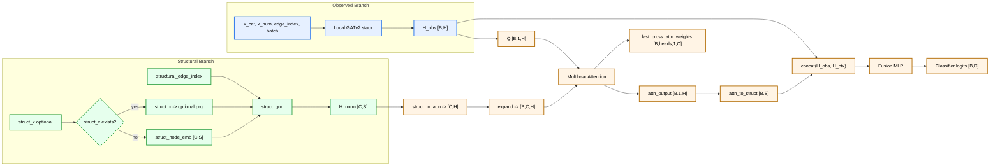

# LLD_MVP2.MD

## 1. Topology Extractor

`TopologyExtractorService` implements `IKnowledgeGraphPort` and maintains in-memory topology registry per process version.

Algorithm (`extract_from_logs(train_traces)`):
1. For each non-empty trace, resolve `version_key = str(trace.process_version).strip() or "1"`.
2. Count start activity (first event) and end activity (last event) for this version.
3. For each transition `(e_i -> e_{i+1})`:
- add edge to unique set,
- increment frequency counter.
4. Build `ProcessStructureDTO(version, allowed_edges, edge_statistics)` for each version.
5. Persist start/end registries for DFG visualization.

Future extension:
- `extract_from_bpmn(...)` is reserved for enterprise BPMN/Camunda source integration.

## 2. DynamicGraphBuilder: Mask + Structural Tensor Generation

For each `PrefixSlice`:
1. Build baseline graph tensors via `BaselineGraphBuilder`.
2. Query topology: `dto = knowledge_port.get_process_structure(prefix.process_version)`.
3. If DTO is absent or prefix is empty:
- set `allowed_target_mask=None`,
- return baseline contract (MVP1-compatible).
4. Otherwise:
- create `allowed_mask = torch.zeros(C, dtype=torch.bool)` where `C=len(activity_vocab)`.
- resolve `last_activity` from prefix last event.
- iterate `dto.allowed_edges`:
  - if edge source equals `last_activity`, mark target index in `allowed_mask`.
  - if both endpoints exist in vocab, append to `structural_edge_index` lists.
  - read optional edge weight from `edge_statistics[(src,dst)]["count"]` (default 1.0).
5. Write into contract:
- `allowed_target_mask: BoolTensor[C]`
- `structural_edge_index: LongTensor[2, E_struct]` (or empty `[2,0]`)
- `structural_edge_weight: FloatTensor[E_struct]` (or empty `[0]`)

## 3. EOPKGGATv2 Forward (Dual-Encoder + Cross-Attention)

Model branch logic:

### 3.1 Observed branch
- Encode categorical features via embeddings.
- Concatenate with numeric features.
- Apply local GATv2 stack.
- Pool node embeddings to graph context:
\[
H_{obs} \in \mathbb{R}^{B \times H}
\]

### 3.2 Structural branch
Input rules:
- if `structural_edge_index` absent/empty -> fallback to baseline output path.
- if `struct_x` exists, use it (project to `struct_hidden_dim` when needed).
- else use learned structural node embeddings:
\[
X_{struct} = Embedding(0..C-1) \in \mathbb{R}^{C \times S}
\]

Then apply structural GNN:
\[
H_{norm} = GNN_{struct}(X_{struct}, edge\_index_{struct}) \in \mathbb{R}^{C \times S}
\]

### 3.3 Soft cross-attention fusion
- Query:
\[
Q = H_{obs}.unsqueeze(1) \in \mathbb{R}^{B \times 1 \times H}
\]
- Keys/Values:
\[
K=V=Expand(Proj(H_{norm})) \in \mathbb{R}^{B \times C \times H}
\]
- Cross-attention:
\[
A, W = MHA(Q, K, V)
\]
Where:
- \(A \in \mathbb{R}^{B \times 1 \times H}\)
- \(W \in \mathbb{R}^{B \times heads \times 1 \times C}\)

Store attention weights for XAI:
- `self.last_cross_attn_weights = W.detach()`.

Project attention output back to structural fusion space:
\[
H_{ctx} = Proj_{attn\to struct}(A.squeeze(1)) \in \mathbb{R}^{B \times S}
\]

Fusion + classifier:
\[
H_{fused} = Fusion([H_{obs}; H_{ctx}]) \in \mathbb{R}^{B \times H}
\]
\[
logits = Classifier(H_{fused}) \in \mathbb{R}^{B \times C}
\]

## 4. Evaluator Metrics and Slicing

### 4.1 OOS math
Given predictions `y_hat` and mask `allowed_target_mask`:
\[
oos\_flags = \lnot allowed\_target\_mask[\text{arange}(B), y\_hat]
\]
\[
OOS = mean(oos\_flags)
\]

Implementation guards:
- `y_hat` shape must be `[B]`.
- mask shape must be `[B, C]`.
- if mask is absent, `test_oos=None`.

### 4.2 Slicing
By prefix length bins:
- `len_1_5`, `len_6_10`, `len_11_20`, `len_21_plus`.

By process version:
- metrics keyed as `test_f1_<safe_version>`, `test_accuracy_<safe_version>`, `test_oos_<safe_version>`.

## 5. Drift Window Generator (Sliding Policy)

Policy:
- `size = drift_window_size`
- `step = drift_window_sliding or size`
- iterate sorted traces using step
- drop windows where `len(window) < size`

Pseudocode:

```python
ordered = sorted(traces, key=lambda t: t.events[0].timestamp)
size = cfg.experiment.drift_window_size
step = cfg.experiment.drift_window_sliding or size

windows = []
for start in range(0, len(ordered), step):
    window = ordered[start:start + size]
    if len(window) < size:
        continue
    windows.append((start, window))
```

## 6. Dual-Encoder Attention Structure (Main Diagram)



Fallback contract:
- if `structural_edge_index` is missing/empty, skip structural branch and return `Classifier(H_obs)`.
- warning log is emitted once to signal baseline fallback.
