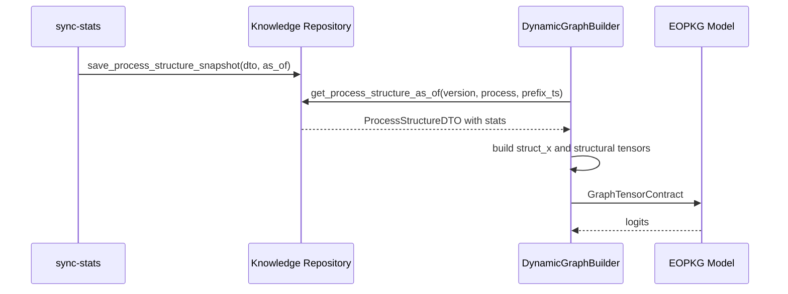

# LLD_MVP2_5.MD

Updated: 2026-03-21
Status: ACTIVE

## 1. Purpose
Low-level behavior for MVP2.5 repositories, stats snapshots, and runtime tensor mapping.

## 2. Repository Algorithms

### 2.1 `save_process_structure_snapshot`
Inputs:
1. `version`
2. `ProcessStructureDTO`
3. `process_name`
4. optional `as_of_ts`
5. optional `knowledge_version`

Algorithm:
1. Resolve strict scope identifiers (`tenant_id`, `process_name`, `version_key`, `proc_def_id`).
2. Resolve `as_of_ts` (provided or `now_utc`).
3. Persist latest base structure for backward-compatible readers.
4. If `knowledge_version` not provided, compute next sequence (`k000001`, ...).
5. Persist immutable snapshot with JSON payload fields.
6. Link snapshot to process version.

### 2.2 `get_process_structure_as_of`
Inputs:
1. `version`
2. `process_name`
3. optional `as_of_ts`

Algorithm:
1. Load base structure.
2. If `as_of_ts` is provided:
   - select snapshot with max timestamp where `snapshot.as_of_ts <= as_of_ts`.
3. If `as_of_ts` not provided:
   - select latest snapshot.
4. Overlay stats JSON payload onto returned `ProcessStructureDTO`.
5. Add snapshot metadata (`knowledge_version`, effective `as_of_ts`) into returned metadata.

## 3. JSON-Only Stats Policy

Hard rule:
1. No normalized stat subgraph (`NodeStat`, `EdgeStat`) in Stage 3.4.
2. Stats are stored in JSON payload fields only.
3. TTL is not applied.

## 4. DynamicGraphBuilder Mapping

### 4.1 Input contract
Builder expects:
1. `ProcessStructureDTO.metadata.stats_index`
2. config block `mapping.graph_feature_mapping`

### 4.2 Mapping algorithm
1. For each configured node metric spec:
   - locate key `window.scope.metric` in `stats_index.node`.
2. Build `struct_x` tensor by activity vocabulary index.
3. Fill missing values with metric default.
4. Optionally map edge metric into `structural_edge_weight`.
5. Apply numeric `encoding` chain per feature/edge spec (`identity|log1p|z-score`).
6. Evaluate consumer quality gate and disable stats tensors when policy rejects snapshot quality.

### 4.3 Time policy behavior
1. `latest`: use regular structure lookup.
2. `strict_asof`: use prefix last-event timestamp for as-of lookup.

## 5. Sync-Stats Runtime Calculation

`sync-stats` computes:
1. node metrics (`exec_count`, duration stats, loop/parallel/freshness/confidence)
2. edge metrics (`transition_probability`, latency stats)
3. global metrics (`resource_handover_entropy`, coverage)
4. producer quality telemetry (`non_zero_ratio_*`, `zero_dominant`, `is_usable_for_training`)

And stores:
1. windowed nested stats (`node_stats`, `edge_stats`, `gnn_features`)
2. flattened `metadata.stats_index`
3. universal contract block `metadata.stats_contract` (`version=1.0`, identity, quality, policy)
4. diagnostics (`stats_diagnostics`)

## 6. Sequence Diagram - Stats to Forward

## 7. Failure and Fallback Matrix
| Component | Condition | Behavior |
|---|---|---|
| snapshot save | backend write error | raise explicit exception |
| as_of lookup | no matching snapshot | fallback to repository default path |
| stats index mapping | missing metric key | use metric default |
| structure missing | no DTO | baseline-compatible contract (unless strict load) |

## 8. Known Limitation (Stage 4.2)
1. Structural stats are currently forwarded with Option-A batch policy (first-graph structural payload when PyG batch mixes copies).
2. Mixed snapshot batches are allowed but warned; full snapshot-homogeneous batching policy is deferred.
3. `strict_asof` still uses repository fallback behavior when no eligible snapshot is found for requested timestamp.
