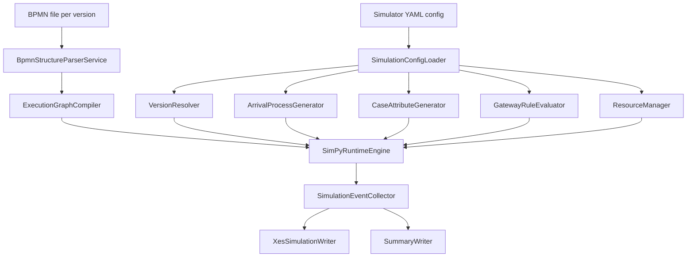
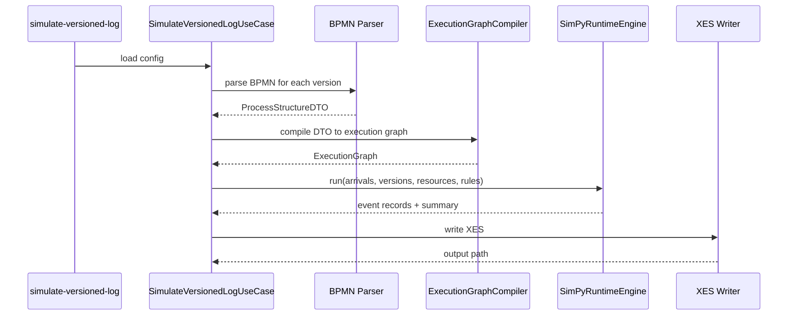

# Scec4 Simulator Stage 1

## 1. Purpose and scope

Ціль Stage 1: додати в проєкт мінімально достатній research-grade симулятор versioned BPMN-процесів, який:

- читає BPMN як структурний граф;
- читає runtime-семантику з YAML/JSON;
- виконує кейси в дискретному часі через SimPy;
- генерує один суцільний XES-лог з версіями, overlap, паралельністю, ресурсами і lifecycle `assign/start/complete`;
- дає дані, які можна напряму прогнати через поточний ingestion/training pipeline.

Це не BPMN engine і не Camunda runtime clone. Stage 1 свідомо обмежується керованим стендом для ML-експериментів.

## 2. Current project fit

### 2.1 Що вже є і що варто перевикористати

| Поточний модуль | Що дає | Рекомендація |
|---|---|---|
| `src/application/services/bpmn_structure_parser_service.py` | Нормалізація BPMN XML у `ProcessStructureDTO`, підтримка `sequenceFlow`, gateway, flatten embedded subprocess | Використати як основний structural loader для Stage 1 |
| `src/domain/entities/process_structure.py` | Канонічний DTO структури процесу | Використати як вхід у compilation step, але не як runtime state |
| `src/domain/entities/raw_trace.py` | Trace DTO | Використати для smoke/integration validation згенерованого XES |
| `src/domain/entities/event_record.py` | Канонічний event DTO з `lifecycle`, `resource_id`, `activity_instance_id`, `extra` | Використати як внутрішній event log record симулятора |
| `src/adapters/ingestion/xes_adapter.py` | Поточна XES ingestion semantics, pairing `start/complete`, `assign` як `start_transition`, `start_ts/complete_ts`, active-set snapshots | Орієнтувати XES output симулятора під цю semantics |
| `tools/add_version2xes.py` | Готові патерни XES XML write/update через `lxml` | Перевикористати техніки для нового XES writer adapter |
| `src/infrastructure/config/yaml_loader.py` | YAML include/deep-merge | Використати для simulator config |
| `main.py` + `tools/*` | Поточний CLI pattern для окремих offline tools | Новий simulator краще додати як окремий tool, а не в training composition root |
| `tests/application/*`, `tests/adapters/*` | Поточний стиль unit/integration тестів | Дотримуватись цього ж стилю для simulator |

### 2.2 Що не варто перевикористовувати напряму

| Поточний модуль | Чому не варто тягнути напряму в Stage 1 |
|---|---|
| KG/Neo4j topology sync path | Це persistence/topology path для inference, а не runtime execution engine |
| GNN dataset builders | Вони споживають логи, а не генерують їх |
| Camunda runtime adapters | Для Stage 1 зайвий runtime coupling; достатньо BPMN file input |

### 2.3 Головний висновок по fit

Проєкт уже має дві критичні половини:

- **вхід BPMN у нормалізований structural DTO**;
- **вхід XES у канонічний trace/event формат**.

Тому Stage 1 симулятора природно стає між ними: бере BPMN + config, симулює виконання, пише XES, який потім уже входить у поточний pipeline без окремої гілки даних.

## 3. Чи SimPy є правильним core

### 3.1 Висновок

Для цього проєкту SimPy є найкращим вибором на Stage 1.

### 3.2 Чому

- природно моделює **discrete-event time progression**;
- має готові примітиви для **processes, waits, resources, queues**;
- достатньо lightweight для швидкої ітерації;
- добре масштабується до research-grade сценаріїв без переходу в “повний engine”;
- не вимагає переносу доменної логіки в чужу BPMN execution model.

### 3.3 Альтернативи

| Варіант | Плюси | Мінуси | Висновок |
|---|---|---|---|
| Власний event queue scheduler | Повний контроль | Більший обсяг коду, більше помилок у join/resource semantics | Не варто для Stage 1 |
| `salabim` | Багато simulation features | Додаткова складність, менше відповідності поточному стеку | Можна розглядати лише якщо SimPy обмежить Stage 2 |
| Queueing-only libs | Прості для ресурсів | Погано лягають на BPMN routing/join semantics | Не підходять |

## 4. Proposed architecture

### 4.1 Компоненти



### 4.2 Call flow



### 4.3 Запропоноване розміщення модулів

```text
src/
  application/
    use_cases/
      simulate_versioned_log_use_case.py
  domain/
    entities/
      simulation/
        execution_graph.py
        simulation_case.py
        simulation_config.py
        simulation_summary.py
    services/
      simulation/
        execution_graph_compiler.py
        version_resolver.py
        arrival_process_service.py
        case_attribute_generator.py
        gateway_rule_evaluator.py
        duration_sampler.py
        resource_selector.py
        lifecycle_event_factory.py
        simpy_runtime_engine.py
  adapters/
    export/
      xes_simulation_writer.py
      simulation_summary_writer.py
tools/
  simulate_versioned_log.py
configs/
  simulation/
    loan_v1_v2_demo.yaml
```

### 4.4 Чому саме так

- `domain` зберігає BPMN-independent runtime semantics;
- `application` оркеструє use case;
- `adapters/export` ізолює XES/XML I/O;
- `tools` зберігає поточний pattern окремих offline команд;
- BPMN parser не дублюється, а перевикористовується.

## 5. Runtime semantics Stage 1

### 5.1 Supported BPMN scope

Stage 1 підтримує тільки:

- `startEvent`
- `endEvent`
- `task`, `userTask`, `serviceTask`, `scriptTask`
- `exclusiveGateway`
- `parallelGateway`
- `sequenceFlow`

### 5.2 Що Stage 1 свідомо відхиляє

- inclusive gateway;
- boundary events;
- timers як BPMN runtime events;
- compensation;
- message flows;
- event subprocess;
- multi-instance;
- preemption;
- call activity між окремими BPMN файлами;
- production-grade token replay.

Embedded subprocess можна підтримати тільки якщо поточний parser його вже коректно flatten-ить у `ProcessStructureDTO`.

### 5.3 Semantics версій

- Версія визначається **лише** за `case_start_time`.
- Кейс після старту **залишається** у своїй версії до завершення.
- Лог один, суцільний, з overlap між версіями.
- Відсотковий split не використовується для самої симуляції.

### 5.4 Case arrival

Мінімальний Stage 1:

- Poisson arrivals;
- одна або кілька інтенсивностей по часових сегментах;
- horizon задається явно в конфізі.

### 5.5 Case attributes

На старті кейсу генеруються статичні глобальні параметри:

- `amount`
- `risk_score`
- `client_type`
- `urgency`

Вони:

- не змінюються в ході кейсу;
- впливають на XOR routing;
- можуть впливати на duration/priority.

### 5.6 XOR routing

Routing має бути rule-based, не purely random. Для Stage 1 рекомендований declarative DSL, а не Python `eval`.

Підхід:

- gateway keyed by BPMN element `id`;
- branch keyed by outgoing `sequenceFlow id`;
- правила над case attributes;
- optional small stochastic perturbation як окремий параметр.

### 5.7 AND split / AND join

Потрібна токенова semantics без претензії на повний BPMN engine:

- `AND split` породжує кілька паралельних гілок;
- `AND join` чекає всі вхідні токени цього кейсу;
- порядок завершення паралельних задач є недетермінованим і визначається sampled durations/resources.

Це критично для майбутніх mask-aware експериментів.

### 5.8 Human tasks

Для human task:

- потрібна роль;
- є список виконавців цієї ролі;
- кожен виконавець має `capacity=1`;
- є стандартна FIFO queue;
- duration = base distribution * employee factor * optional role factor * noise.

Подія `assign` пишеться коли задача призначена конкретному виконавцю і поставлена в його чергу.  
Подія `start` пишеться коли ресурс реально взяв задачу.  
Подія `complete` пишеться по завершенні duration.

### 5.9 Automatic tasks

Для automatic/script task:

- ресурс не потрібен або використовується спеціальний `SYSTEM`;
- duration мала: fixed/lognormal with tiny variance;
- можливий very low probability extra delay.

Щоб lifecycle був єдиним для всього логу, automatic task теж пише:

- `assign`
- `start`
- `complete`

Для таких задач `assign` і `start` можуть мати однаковий timestamp.

### 5.10 Activity identity

Для generated XES критично не допустити колізії назв задач.

Рекомендація Stage 1:

- `concept:name` на event рівні має бути **канонічний activity key**, за замовчуванням BPMN element `id`;
- читабельну назву task з BPMN треба писати окремо, наприклад `sim:activity_label`.

Це захищає pipeline від кейсів, де різні задачі мають однаковий display name.

## 6. Config schema draft

### 6.1 Принципи

- config має бути keyed by BPMN `id`, не by label;
- структура і семантика розділені;
- кожна версія має власний BPMN file path і `active_from`;
- конфіг має бути валідний навіть без Neo4j/KG.

### 6.2 Draft YAML

```yaml
simulation:
  process_name: loan_process
  random_seed: 42
  start_time: "2025-01-01T00:00:00Z"
  end_time: "2025-03-01T00:00:00Z"
  timezone: "UTC"

versions:
  - version_id: "v1"
    active_from: "2025-01-01T00:00:00Z"
    bpmn_path: "data/bpmn/loan_v1.bpmn"
  - version_id: "v2"
    active_from: "2025-02-01T00:00:00Z"
    bpmn_path: "data/bpmn/loan_v2.bpmn"

arrival_process:
  type: "poisson"
  rate_per_hour: 4.0

case_attributes:
  amount:
    type: "lognormal"
    mean: 9.5
    sigma: 0.45
  risk_score:
    type: "beta"
    alpha: 2.0
    beta: 5.0
  client_type:
    type: "categorical"
    values:
      retail: 0.7
      vip: 0.1
      sme: 0.2
  urgency:
    type: "categorical"
    values:
      low: 0.6
      medium: 0.3
      high: 0.1

resources:
  roles:
    clerk:
      workers:
        - id: "clerk_1"
          factor: 1.00
        - id: "clerk_2"
          factor: 0.92
    risk_officer:
      workers:
        - id: "risk_1"
          factor: 1.15
        - id: "risk_2"
          factor: 1.00

tasks:
  check_application:
    label: "Check application completeness"
    execution_mode: "human"
    roles: ["clerk"]
    duration:
      type: "lognormal"
      mean_seconds: 480
      sigma: 0.35
  check_credit_history:
    execution_mode: "human"
    roles: ["risk_officer"]
    duration:
      type: "gamma"
      mean_seconds: 900
      k: 4.0
  appraise_property:
    execution_mode: "human"
    roles: ["risk_officer"]
    duration:
      type: "gamma"
      mean_seconds: 1600
      k: 3.0
  assess_loan_risk:
    execution_mode: "automatic"
    duration:
      type: "fixed"
      seconds: 2
    noise:
      extra_delay_probability: 0.005
      extra_delay_seconds: 30

gateways:
  gw_eligibility:
    mode: "first_true"
    default_flow_id: "flow_manual_review"
    branches:
      - flow_id: "flow_auto_approve"
        when:
          all:
            - var: "risk_score"
              op: "<="
              value: 0.2
            - var: "amount"
              op: "<"
              value: 20000
      - flow_id: "flow_manual_review"
        when:
          const: true

output:
  xes_path: "outputs/simulation/loan_v1_v2.xes"
  summary_json_path: "outputs/simulation/loan_v1_v2.summary.json"
  overwrite: true
  trace_level_case_attrs: true
  duplicate_case_attrs_on_events: false
```

### 6.3 Обов'язкові поля summary JSON

- `process_name`
- `random_seed`
- `start_time`
- `end_time`
- `case_count_total`
- `case_count_by_version`
- `event_count_total`
- `event_count_by_lifecycle`
- `task_count_by_activity`
- `gateway_branch_counts`
- `resource_utilization_estimate`
- `mean_cycle_time_by_version`

## 7. XES schema draft

### 7.1 Trace attributes

| Key | Значення | Обов'язковість |
|---|---|---|
| `concept:name` | case id | Обов'язково |
| `concept:version` | version id кейсу | Обов'язково |
| `sim:process_name` | логічна назва процесу | Обов'язково |
| `sim:case_start_time` | ISO timestamp | Обов'язково |
| `sim:generated_by` | `scec4-simulator` | Обов'язково |
| case attributes | `amount`, `risk_score`, `client_type`, `urgency` | Рекомендовано |

### 7.2 Event attributes

| Key | Значення | Обов'язковість |
|---|---|---|
| `concept:name` | канонічний activity key, за замовчуванням BPMN id | Обов'язково |
| `time:timestamp` | event timestamp | Обов'язково |
| `lifecycle:transition` | `assign` / `start` / `complete` | Обов'язково |
| `org:resource` | worker id або `SYSTEM` | Обов'язково |
| `concept:version` | version id кейсу | Рекомендовано |
| `sim:activity_label` | display name task | Рекомендовано |
| `sim:bpmn_element_id` | BPMN element id | Обов'язково |
| `sim:activity_instance_id` | один id для assign/start/complete одного task instance | Обов'язково |
| `sim:execution_mode` | `human` / `automatic` | Рекомендовано |

### 7.3 Чому така схема сумісна з поточним pipeline

- `lifecycle:transition` уже підтримується XES adapter;
- `assign` може входити в `mapping.xes_adapter.start_transitions`;
- `complete` уже є canonical target transition;
- `concept:version` уже використовується в частині pipeline;
- у разі потреби `sim:*` атрибути залишаться в `extra`.

### 7.4 Важливий нюанс сортування

Події в межах trace треба записувати:

1. за `time:timestamp`;
2. при однаковому timestamp за стабільним `local_event_order`.

Порядок tie-break:

1. `assign`
2. `start`
3. `complete`

Інакше ingestion може давати нестабільні active-set snapshots.

## 8. Stage 1 implementation plan

### 8.1 Мінімальний реалізовний шлях

1. Додати `simulation_config` DTO і config loader.
2. Обгорнути поточний `BpmnStructureParserService` у loader для simulator versions.
3. Додати `ExecutionGraphCompiler`, який з `ProcessStructureDTO` будує runtime graph:
   - node registry;
   - outgoing/incoming flow indices;
   - gateway metadata;
   - join counters.
4. Реалізувати `VersionResolver` по `active_from`.
5. Реалізувати `CaseAttributeGenerator`.
6. Реалізувати `GatewayRuleEvaluator`.
7. Реалізувати `ResourceSelector` і просту модель worker queues.
8. Реалізувати `SimPyRuntimeEngine`.
9. Реалізувати `SimulationEventCollector` + `XesSimulationWriter`.
10. Додати CLI tool `simulate-versioned-log`.
11. Додати integration smoke test: `config -> simulate -> xes_adapter.read`.

### 8.2 Що свідомо не робити в Stage 1

- не додавати generic BPMN extensibility framework;
- не робити окремий internal DSL для всіх типів drift;
- не вбудовувати одразу Camunda importer/export parity;
- не інтегрувати simulator у KG/Neo4j pipeline;
- не намагатись моделювати всі BPMN constructs.

### 8.3 Основні ризики

| Ризик | Наслідок | Як зменшити |
|---|---|---|
| Невизначена semantics join для нетривіальних BPMN | Хибна паралельність | На Stage 1 підтримувати тільки прості AND split/join patterns і валідовувати граф |
| Дублікати display names задач | Нечіткий target space для ML | Використовувати BPMN id як `concept:name` |
| Надто гнучкі gateway rules | Неконтрольовані логи | DSL з обмеженим набором операторів |
| Ресурсна модель занадто складна з першого дня | Зрив строків Stage 1 | `capacity=1`, FIFO, без preemption |

## 9. Test plan and acceptance

### 9.1 Unit tests

- `VersionResolver` повертає версію тільки по `case_start_time`;
- `ExecutionGraphCompiler` коректно збирає XOR/AND структуру з `ProcessStructureDTO`;
- `GatewayRuleEvaluator` детерміновано обирає гілку по case attrs;
- `DurationSampler` поважає конфіг distribution;
- `ResourceSelector` коректно призначає worker з ролі;
- `XesSimulationWriter` пише `assign/start/complete` і потрібні атрибути.

### 9.2 Integration tests

- `simulate -> write XES -> read via XESAdapter`;
- один кейс з XOR;
- один кейс з AND split/join;
- кілька версій з overlap;
- human task queueing;
- automatic task with tiny extra delay.

### 9.3 Acceptance criteria Stage 1

- генерується один суцільний XES файл;
- у логах є `assign/start/complete`;
- кейси старої версії доживають при активній новій версії;
- згенерований XES читається поточним `XESAdapter`;
- лог можна використати в існуючому pipeline без окремого конвертора.

## 10. Потрібна чи ні зміна основного pipeline для time boundaries

Коротка відповідь: **так, бажано**, але це окрема задача від Stage 1 симулятора.

### 10.1 Чому

Симулятор буде генерувати реалістичний суцільний лог з overlap по часу. Якщо далі ділити його тільки через `train_ratio`, то:

- втрачається сенс експерименту з version boundary;
- train/test можуть змішати старі й нові режими не так, як це сталося в часі;
- метрики drift detection будуть менш валідні.

### 10.2 Мінімальна рекомендація

Після підтвердження Stage 1 додати в main pipeline опціональний temporal split:

```yaml
experiment:
  split_strategy: temporal_cutoff
  train_until: "2025-02-01T00:00:00Z"
  val_until: "2025-02-10T00:00:00Z"
```

або version-boundary split:

```yaml
experiment:
  split_strategy: version_boundary
  train_versions: ["v1"]
  val_versions: ["v2"]
```

Перший варіант є правильнішим для overlap-сценаріїв.

### 10.3 Що важливо

Це **не блокує** Stage 1 симулятор. Stage 1 має лише:

- записувати коректні timestamps;
- записувати `concept:version`;
- робити лог одним файлом.

## 11. Рекомендований CLI

Для сумісності з поточним патерном:

```bash
python main.py simulate-versioned-log --config configs/simulation/loan_v1_v2_demo.yaml
```

Початковий CLI мінімум:

- `--config`
- `--out` як optional override для `output.xes_path`
- `--summary-out` як optional override для `summary_json_path`
- `--seed` як optional override

## 12. Bottom line for Stage 1

Найкращий варіант вбудування в поточний проєкт:

- перевикористати існуючий BPMN parser;
- не чіпати KG/runtime training path;
- додати окремий offline simulation tool;
- писати XES у форматі, який уже сумісний з поточним ingestion;
- тримати Stage 1 вузьким: BPMN structure + YAML semantics + SimPy runtime + XES output.

