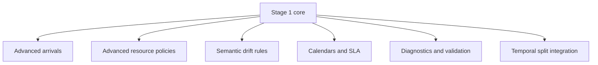

# Scec4 Simulator Stage 2

## 1. Role of Stage 2

Stage 2 запускається тільки після того, як Stage 1 підтвердить дві речі:

- симулятор реально генерує валідні XES для поточного ML pipeline;
- отримані логи достатньо корисні для перевірки version-aware/mask-aware гіпотез.

Ціль Stage 2: підняти симулятор з “мінімально достатнього генератора логів” до більш сильного research instrument рівня статті.

## 2. Архітектурний принцип Stage 2

Stage 2 не повинен ламати або переписувати ядро Stage 1. Він має добудовуватись шарами над тими самими базовими абстракціями:

- `ExecutionGraph`
- `VersionResolver`
- `GatewayRuleEvaluator`
- `ResourceManager`
- `SimPyRuntimeEngine`
- `XesSimulationWriter`



## 3. Що додавати в Stage 2

### 3.1 Resource model

- richer worker selection strategies;
- queue prioritization;
- backup roles with penalty;
- multitasking penalty;
- working calendar;
- role-level and worker-level availability windows.

### 3.2 Runtime behavior

- richer arrival schedules по годинах/днях;
- version-specific behavior drift, не тільки structural drift;
- rework loops;
- probabilistic workaround behavior;
- controllable fault injection;
- SLA-like delay escalation.

### 3.3 BPMN-adjacent extensions

Не повний BPMN 2.0, але потенційно:

- limited timer-like delays через config semantics;
- multi-instance approximation;
- event-based business noise.

### 3.4 Diagnostics

- queue wait distributions;
- worker utilization;
- branch probabilities vs configured expectations;
- cycle time distributions by version;
- conformance-style checks between configured routing and observed routing;
- overlap diagnostics між версіями.

## 4. Що не треба робити навіть у Stage 2

- повний BPMN 2.0 engine;
- Camunda execution parity;
- message broker/runtime orchestration;
- state persistence як у production engine;
- arbitrary embedded scripting inside config;
- process mining suite всередині симулятора.

## 5. Proposed Stage 2 module extensions

```text
src/
  domain/
    services/
      simulation/
        calendar_service.py
        queue_policy.py
        workload_penalty_model.py
        semantic_drift_policy.py
        diagnostics_aggregator.py
        validation_report_builder.py
  adapters/
    export/
      simulation_csv_writer.py
      simulation_validation_writer.py
```

Stage 2 має залишити без змін:

- базовий `simulate_versioned_log_use_case.py`;
- основний XES output;
- Stage 1 config shape як backward-compatible core.

## 6. Config evolution plan

### 6.1 Stage 2 additions

```yaml
arrival_process:
  type: "poisson"
  schedule:
    - from: "2025-01-01T00:00:00Z"
      to: "2025-01-31T23:59:59Z"
      rate_per_hour: 3.0
    - from: "2025-02-01T00:00:00Z"
      to: "2025-03-01T00:00:00Z"
      rate_per_hour: 5.5

resources:
  queue_policy: "priority_fifo"
  calendars:
    business_hours:
      timezone: "Europe/Kiev"
      working_days: [1, 2, 3, 4, 5]
      start_hour: "09:00"
      end_hour: "18:00"

versions:
  - version_id: "v2"
    active_from: "2025-02-01T00:00:00Z"
    behavior_overrides:
      tasks:
        assess_loan_risk:
          duration:
            type: "gamma"
            mean_seconds: 180
            k: 4.0
      gateways:
        gw_eligibility:
          branches:
            - flow_id: "flow_auto_approve"
              when:
                all:
                  - var: "risk_score"
                    op: "<="
                    value: 0.15
```

### 6.2 Принцип сумісності

- Stage 1 config має залишатись валідним без змін;
- нові секції мають бути optional;
- overrides мають працювати поверх базового config.

## 7. XES and export evolution

Stage 2 не повинен ламати XES Stage 1. Можна додати:

- `sim:queue_wait_seconds`
- `sim:service_time_seconds`
- `sim:calendar_delay_seconds`
- `sim:priority`
- `sim:rework_iteration`

Окремо, але не замість XES:

- flat CSV export для статистичного аналізу;
- JSON validation report;
- optional event-level diagnostics dump.

## 8. Stage 2 and current ML pipeline

### 8.1 Чому потрібен temporal split

Для versioned simulation найслабше місце поточного pipeline не в ingestion, а в split semantics. Якщо лишити лише ratio-based split, то:

- межі drift будуть розмиті;
- overlap кейсів не буде адекватно оцінено;
- порівняння моделей для version-aware prediction стане слабшим.

### 8.2 Рекомендоване розширення pipeline

Після Stage 1 варто окремо додати в основний pipeline техборг на `split_strategy: temporal_cutoff`:

```yaml
experiment:
  split_strategy: temporal_cutoff
  train_until: "2025-02-01T00:00:00Z"
  val_until: "2025-02-15T00:00:00Z"
  test_from: "2025-02-15T00:00:00Z"
```

Альтернатива:

```yaml
experiment:
  split_strategy: event_time_windows
  windows:
    train:
      from: "2025-01-01T00:00:00Z"
      to: "2025-02-01T00:00:00Z"
    val:
      from: "2025-02-01T00:00:00Z"
      to: "2025-02-10T00:00:00Z"
    test:
      from: "2025-02-10T00:00:00Z"
      to: "2025-03-01T00:00:00Z"
```

### 8.3 Що саме треба фільтрувати

Для суцільного versioned логу краще фільтрувати:

- або по `case start timestamp`;
- або по `event complete timestamp`.

Для drift research більш консистентний перший варіант:

- кейс належить до split за своїм стартом;
- version assignment у симуляторі задається конфігом версій і activation schedule;
- overlap при цьому залишається реалістичним.

## 9. Вплив на mask-aware/version-aware prediction

Stage 2 має бути спроєктований так, щоб спеціально створювати сценарії, де:

- є кілька допустимих наступних `complete`;
- порядок завершення паралельних задач не є фіксованим;
- структурний drift і semantic drift можуть розходитись;
- ресурси впливають на реальний next-event order.

Це напряму підсилює дослідження:

- `allowed_target_mask`;
- hybrid metrics;
- version-aware structure usage;
- drift detection по часових межах.

## 10. Research-grade validation plan

### 10.1 Потрібні перевірки після Stage 1

- чи читає поточний `XESAdapter` generated logs без нестабільностей;
- чи коректно видно overlap між версіями;
- чи є паралельні complete-order permutations;
- чи не виникає дублювання activity identity.

### 10.2 Потрібні перевірки на Stage 2

- чи observed routing відповідає config expectations;
- чи cycle time distributions схожі на target shape;
- чи ресурси реально створюють черги;
- чи semantic drift можна відокремити від structural drift;
- чи generated logs достатньо різноманітні, але відтворювані по seed.

## 11. Порядок реалізації Stage 2

1. Додати temporal split support у training/eval pipeline.
2. Додати richer diagnostics output.
3. Додати arrival schedules і calendars.
4. Додати version-specific semantic overrides.
5. Додати пріоритети і складнішу queue policy.
6. Додати CSV/validation exports.

Не навпаки. Інакше симулятор стане складнішим раніше, ніж його можна буде валідно використати в ML-експериментах.

## 12. Test plan for Stage 2

### 12.1 Unit tests

- calendar delay calculation;
- queue prioritization;
- multitasking penalty;
- version override merge logic;
- diagnostics aggregation.

### 12.2 Integration tests

- одна BPMN структура, але різні semantic rules для `v1/v2/v3`;
- same structure + different arrival schedule;
- same structure + resource bottleneck;
- temporal split у pipeline на generated log.

### 12.3 Acceptance criteria Stage 2

- Stage 1 сценарії працюють без регресій;
- можна явно моделювати semantic drift;
- generated summary пояснює observed drift;
- time-based train/val/test стає first-class path у pipeline.

## 13. Bottom line for Stage 2

Stage 2 має не “розширити симулятор до повного BPMN engine”, а зробити три речі:

- підняти контрольованість і правдоподібність логів;
- дати валідні часові сценарії для drift/version-aware evaluation;
- не зламати простий і реалізовний Stage 1 core.

Саме тому правильна стратегія:

- вузький Stage 1;
- окреме підтвердження користі;
- лише після цього нарощування richer semantics, diagnostics і temporal evaluation support.
