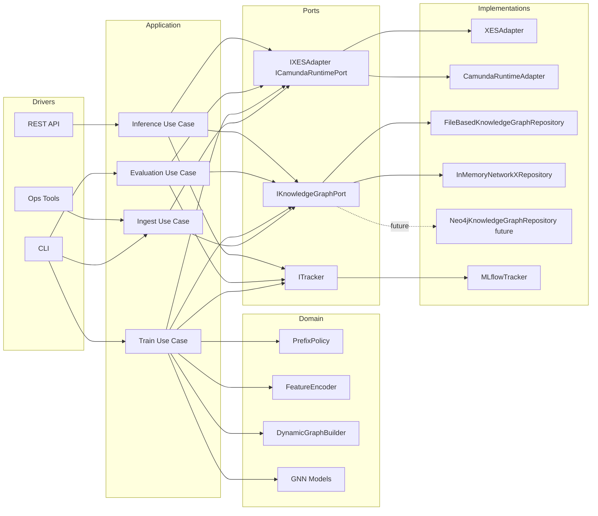

# TARGET_ARCHITECTURE.MD

Updated: 2026-03-17  
Status: Target blueprint for enterprise-ready platform evolution.

## 1. Purpose
This document defines the target architecture of `bpm_prediction` independent of a specific MVP phase.

It captures:
1. stable architectural boundaries,
2. target module layout,
3. port contracts for data, topology, and runtime graph access,
4. extensibility path to Neo4j and enterprise adapters.

Detailed phase execution plans remain in phase documents (`ARCHITECTURE_MVP*.MD`, `LLD_MVP*.MD`, `DATA_MODEL_MVP*.MD`).

## 2. Architectural Style
The target stack combines:
1. Clean Architecture for dependency direction.
2. Hexagonal Architecture for external integrations through ports/adapters.
3. Pipeline orchestration for ingestion, training, evaluation, and inference flows.

## 3. Dependency Rule
Strict rule:
1. `domain` depends on nothing external.
2. `application` depends on `domain` and abstract ports only.
3. `adapters` and `infrastructure` implement ports and may depend on external systems.

No direct infrastructure imports are allowed inside `domain`.

## 4. Target Module Layout
```text
src/
  domain/
    entities/
    services/
    models/
    ports/
  application/
    ports/
    services/
    use_cases/
  adapters/
    ingestion/
    tracking/
    gateways/
  infrastructure/
    repositories/
    config/
```

## 5. Core Ports
Key target ports include:
1. `IKnowledgeGraphPort`:
   - `save_process_structure(...)`
   - `get_process_structure(...)`
   - `list_versions(...)`
   - `get_graph_for_visualization(...)`
2. `ICamundaRuntimePort`:
   - runtime fetch methods for activity history, execution tree, variables, task and identity context.
3. `IXESAdapter`:
   - normalized trace read contract.
4. `ITracker`:
   - metric/param/artifact logging abstraction.

## 6. High-Level Component View


## 7. Data Flow Principle
Two independent pipelines are required:
1. Offline ingestion pipeline:
   - reads raw process sources,
   - produces and persists process structure artifacts.
2. Train/eval/infer pipeline:
   - reads event traces,
   - consumes prebuilt structure artifacts via `IKnowledgeGraphPort`,
   - never rebuilds topology synchronously inside training runtime.

## 8. Knowledge Storage Strategy
Backends under one port:
1. `in_memory` for tests and local fast runs.
2. `file` for persistent local artifacts.
3. `neo4j` as target enterprise backend.

Migration rule: backend switching must be config-only; no domain/application logic rewrite.

## 9. Reliability and Fallback
Target runtime must be resilient:
1. missing optional enrichment cannot crash baseline prediction path,
2. explicit strict modes may fail-fast when topology is mandatory,
3. diagnostics must be logged for cleanup coverage, fallback triggers, and data completeness.

## 10. Observability
Mandatory telemetry dimensions:
1. data volume and split metadata,
2. topology availability and backend,
3. training/evaluation metrics (Accuracy, F1, ECE, OOS when available),
4. drift window diagnostics and slice metrics.

## 11. Non-Regression Contract
Any architectural change must keep:
1. MVP1 regression shield green,
2. deterministic config-driven execution,
3. explicit data contracts between pipeline stages.
