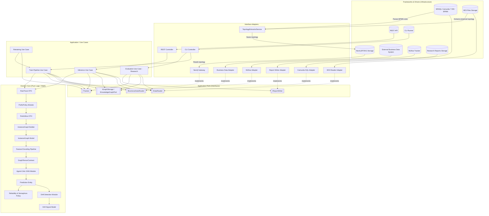
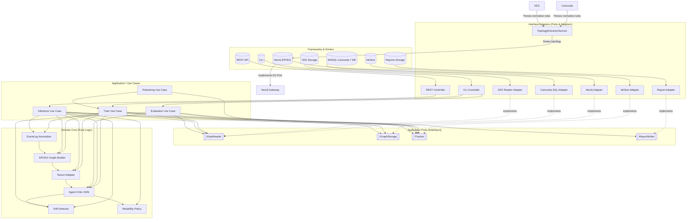
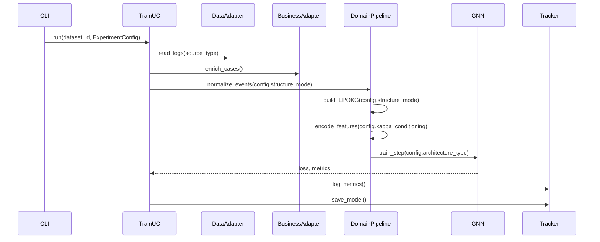
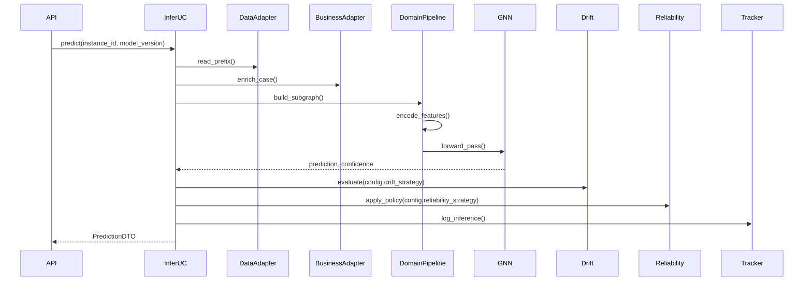
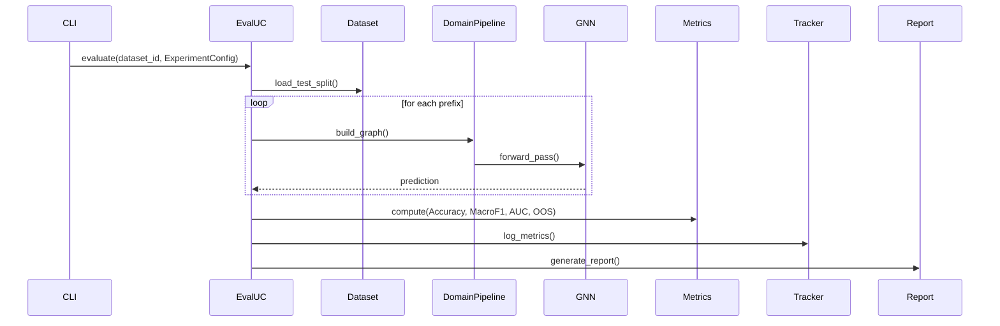
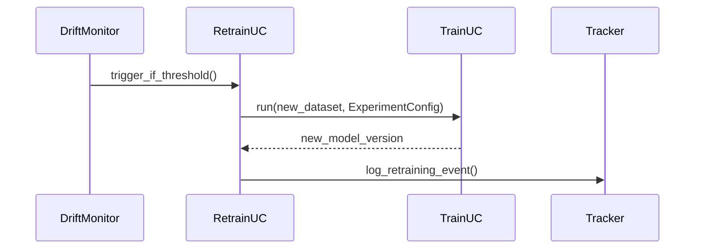
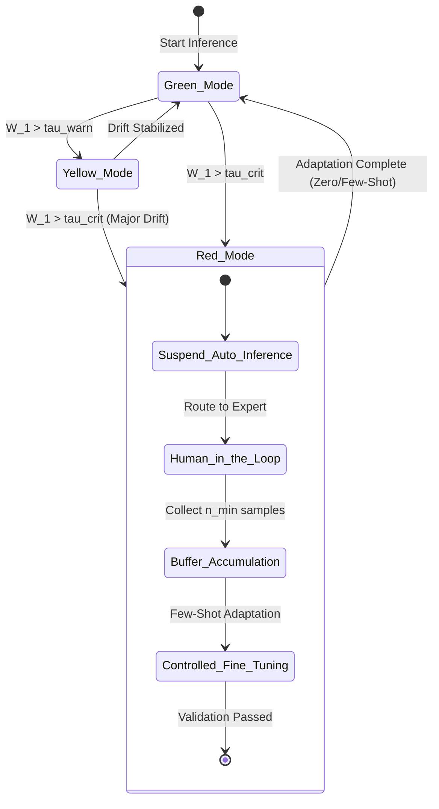
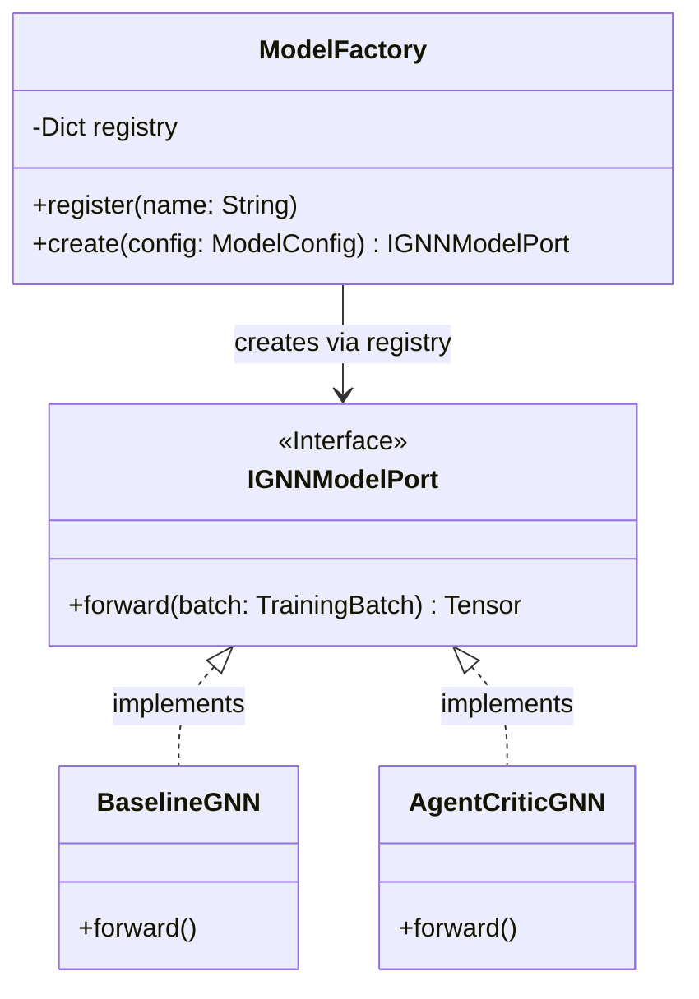

# TRAGET ARCHITECTURE.MD
(Пункт призначення): Описує фінальний вигляд системи (з Критиком, Семафором і Фабрикою Моделей, яку ми щойно додали).

## 1) Призначення
Цей документ описує цільову архітектуру `bpm_prediction` і синхронізований з:
- `ARCHITECTURE_GUIDELINES.MD` (головний набір правил);
- `GLOSSARY.MD` (канон термінів);
- `VARIABLES.MD` (канон позначень і змінних).

Документ фіксує реалізаційний профіль системи, а не лише загальні принципи.

## 2) Mode selected
**Обраний режим для поточної хвилі реалізації:** `ENTERPRISE_POC`.

Причина вибору:
1. Потрібен працюючий PoC в існуючому enterprise-контурі.
2. Потрібно зберегти наукову відтворюваність і трасованість для розділу 4 дисертації.
3. Не будуємо нову інфраструктуру з нуля, але ізолюємо математичне ядро.

---

## 3) Архітектурний стиль (узгоджено)
1. **Clean Architecture (Layered)** — базова модель розділення відповідальностей.
2. **Hexagonal (Ports & Adapters)** — механізм інверсії залежностей для зовнішніх інтеграцій.
3. **Pipeline (Pipes & Filters)** — основний каркас виконання use-case сценаріїв.
4. **Strategy Pattern** — для drift/conditioning/loss у місцях варіативності.

---

## 4) High-Level Architecture (Clean Architecture view)

### 4.1 Domain Layer (Entities + Science Core)
Містить:
- доменні сутності (`RawTrace`, `PrefixSlice`, `InstanceGraph`, `GraphTensorContract`, `Prediction`);  
- EPOKG як вирішення онтологічного розриву (Ontological Gap) — інтеграція нормативних обмежень та compliance rules у графову структуру.
- GNN-моделі прогнозування;
- Actor–Critic/Constraint-Critic логіку;
- OOD/drift-логіку і структурний regularization;
- функції втрат (`loss_task`, `loss_reg`) і контроль `beta_relax`.

Domain оперує лише тензорами/доменними DTO і **не має прямих залежностей** від Neo4j, MSSQL, MLflow, REST/CLI.

**Наукове обґрунтування:**
- **EPOKG** — реалізує принцип структурної обізнаності (Structural Awareness) та усуває онтологічний розрив (Ontological Gap), інтегруючи нормативні обмеження, compliance rules та версійність (κ) у єдиний графовий простір.
- **Knowledge-Infusion Operator (Γ)** — забезпечує злиття емпіричного префіксу ($G_{obs}$) з глобальним нормативним контекстом ($H^{(\kappa)}$), реалізуючи Zero-Shot Structural Adaptation при мінорному дрейфі та Few-Shot Adaptation при мажорному.
- **Single Generalized Model** — єдина параметрична модель $\theta_{base}$ з conditioning на версію $\kappa$, що запобігає фрагментації знань та катастрофічному забуванню.

### 4.2 Application Layer (Use Cases)
- Use cases: `Train Pipeline`, `Inference`, `Evaluation (Research Mode)`, `Retraining`;
- оркестрація сценаріїв `prepare/build_graph/train/evaluate/infer/retrain`;
- виклик **лише Application Ports (interfaces)** із `src/core/interfaces/`;
- drift detection: вбудована частина inference runtime + optional offline analysis в evaluation.

### 4.3 Interface Adapters Layer
- **Camunda SQL Adapter**: читання Camunda7 MSSQL.
- **XES Reader Adapter**: імпорт XES логів.
- **Business Data Adapter**: читання зовнішніх бізнес-даних (за наявності).
- **Neo4j Gateway**: доступ до EPOKG/POKG.
- **MLflow Adapter**: трекінг метрик/артефактів.
- **Report Writer Adapter**: генерація звітів.
- **REST/CLI Controllers**: вхідні контролери для use cases.

### 4.4 Frameworks & Drivers (Infrastructure)
- MSSQL Camunda 7 DB;
- XES Files Storage;
- External Business Data System;
- Neo4j Storage;
- MLflow Tracker;
- Research Reports Storage;
- REST API/CLI runtime.

---

## 5) Pipeline stages (обов'язковий каркас)
1. **Ingestion** — читання логу процесу/батча.
2. **Graph Builder (EPOKG context)** — побудова IG і зв'язок з EPOKG.
3. **Tensor Adapter** — перехід до `torch_geometric.data.Data`.
4. **Core ML** — inference/train крок.
5. **Drift + Reliability** — оцінка дрейфу та застосування політики надійності.
6. **Delivery** — повернення `PredictionDTO` + логування runtime метрик.

> `Evaluation` винесено в окремий **research pipeline** і не входить до runtime-контуру inference.

---

## 6) Data Flow (runtime)
1. Запит надходить через CLI або REST API з `process_instance_id` і `source_type`.
2. Application Use Case звертається до портів `IDataReader` / `IBusinessDataReader`.
3. Adapter-реалізації через порти повертають нормалізований `EventLogBatch`.
4. Graph Builder формує `process_graph` та збагачує його EPOKG-контекстом.
5. Tensor Adapter формує `node_features`, `edge_index`.
6. Core ML обчислює `prediction` + `confidence`.
7. Вбудований drift модуль обчислює drift/OOD сигнали.
8. Reliability Policy обчислює `reliability_score` і `semaphore_mode`.
9. Use Case логує runtime-метрики через `ITracker`.
10. Delivery: повернення `PredictionDTO` у CLI/API контур.

---

## 7) Reliability Semaphore (узгодження порогів)

### 7.1 Вхідні сигнали
- `wasserstein_drift` (`\mathcal{W}_1`) — структурний дрейф;
- `data_drift_score` (`D_data`);
- `concept_drift_score` (`D_concept`);
- додаткові сигнали невизначеності моделі.

### 7.2 Ієрархія порогів
1. `ood_threshold` (`\tau_{ood}`) — локальний поріг структурного OOD (по `\mathcal{W}_1`).
2. `warning_threshold` (`\tau_{warn}`) — агрегований жовтий режим.
3. `critical_threshold` (`\tau_{crit}`) — агрегований червоний режим.

Інваріант: `\tau_{warn} < \tau_{crit}`.

### 7.3 Поведінка за режимами
- **green:** стандартний inference.
- **yellow:** обмежений inference + сигнал на адаптацію.
- **red:** Human-in-the-Loop / призупинка авто-рішення.

---

## 8) Adaptation strategy
1. **Zero-Shot Structural Adaptation** — для мінорного дрейфу (оновлення графового контексту без перенавчання).
2. **Few-Shot Adaptation (Controlled Fine-Tuning)** — для глибокого OOD:
   - накопичення буфера до `min_buffer_size` (`n_min`);
   - контрольоване донавчання;
   - валідація перед поверненням у автоматичний inference.

---

## 9) Knowledge Infusion Operator
`knowledge_infusion_operator` (`\Gamma`) реалізується як `nn.Module` (або `nn.Sequential`), а не як статичний вектор.

Базова форма:
```python
fusion_repr = self.knowledge_infusion_operator(local_state_vec, global_context_vec)
```

де:
- `local_state_vec` (`h_\sigma`) — локальний стан кейсу;
- `global_context_vec` (`c_\sigma`) — глобальний контекст із EPOKG.

**Наукове обґрунтування:** Оператор Γ реалізує **knowledge injection**, усуваючи онтологічну неповноту репрезентації. Він забезпечує Zero-Shot Structural Adaptation при переході між версіями регламентів, як описано в динамічному розриві (Dynamic Gap).

### 9.1 Fusion Operator Γ та динамічна регуляризація

**Математика:**
z_fused = δ( W_f [h_σ ∥ c_σ] + b_f )

**Динамічна регуляризація β:**
β^(t) = β₀ · max(0, 1 - W₁^(t) / τ_W)

- β₀ — базова вага регуляризатора (стабільний режим)
- W₁ — 1-Wasserstein між P^(κ) та P_window
- τ_W — поріг макро-дрейфу

Коли W₁ → τ_W, β → 0 → модель може вільно адаптуватися до нового режиму.

---

## 10) Data contracts (мінімально обов'язкові)
Між кожними stage визначаються:
1. Input schema.
2. Output schema.
3. Metadata schema.

Не допускається implicit format.

---

## 11) Versioning model
Кожний артефакт має містити:
- `dataset_id`
- `schema_version`
- `process_version` (`kappa`/`version_id`)
- `model_version`
- `git_commit`
- `experiment_id`

Додатково для експериментів:
- копії конфігів (`model.yaml`, `features.yaml`, `training.yaml`);
- `preprocessor_state` для відтворюваності inference.

---

## 12) Observability & Logging
Для розуміння роботи системи та дебагу використовується структуроване логування.

### 12.1 Console & File Logging (Cross-Cutting Concern)
- **Бібліотека:** `loguru`.
- **Архітектурне правило:** Логер є кроссекційною утилітою. Прямий імпорт `from loguru import logger` **дозволено у всіх шарах**, включаючи Domain Core.
- **Конфігурація:** Налаштування форматів виводу та файлових ротацій (sinks) виконується одноразово на старті системи (у точці входу, наприклад, `cli.py`).
- **Рівні логування:**
  - `DEBUG`: розмірності тензорів, проміжні результати формування графів.
  - `INFO`: старти епох, завантаження датасетів, метрики (Accuracy, OOS).
  - `WARNING`: спрацювання семафора надійності (Yellow/Red mode), дрейф.
  - `ERROR`: помилки валідації конфігів, збої пайплайну.

### 12.2 Experiment Tracking
Мінімальний набір логування на `inference/evaluate` (зберігається в MLflow або локальних файлах через `ITracker`):
- `data_drift_score`
- `concept_drift_score`
- `wasserstein_drift`
- `reliability_score`
- `semaphore_mode`
- Accuracy/F1/OOS (де застосовно)

Логування виконується на кожному batch (або іншому атомарному кроці).
Ті кроки, по яким очікується тривале виконання більше ніж 10 секунд повинні мати progressbar і далі ієрархічно по атомарим крокам також

---

## 13) Enterprise integration strategy (PoC)
Рекомендований контур запуску:
- CLI: `--mode prepare/build_graph/train/evaluate/infer`
- REST API (PoC): `POST /api/v1/infer-by-instance` з `process_instance_id` та `source_type`.

Правило маршрутизації даних:
1. API/CLI викликає orchestration service.
2. Orchestration service обирає потрібний data adapter (`camunda7_mssql_adapter` або `xes_adapter`).
3. Дані проходять через `Data Converter` до єдиного контракту.
4. Далі запускається стандартний pipeline до inference.

Інтеграція в існуючу екосистему:
- MSSQL Camunda 7 (обов'язково для PoC);
- XES-файли в директорії даних для відкритих датасетів;
- Neo4j (за наявності);
- існуючий трекер/registry (якщо є).

Не допускається:
- прямий зв'язок raw-джерела з EPOKG без конвертора контракту;
- мікросервісний оверінжиніринг;
- побудова повного MLOps-stack у PoC-фазі.

---

## 14) Risks & trade-offs
1. **Trade-off:** чиста ізоляція Core може уповільнювати першу ітерацію, але знижує технічний борг.
2. **Risk:** неявні схеми між stage спричинять нестабільні inference-помилки.
3. **Risk:** відсутність трекінгу `kappa` руйнує валідність експериментів дрейфу.
4. **Risk:** змішування adapter-логіки всередині Core ламає переносимість і тестованість.

---

## 15) Next architectural step
Наступний крок: деталізувати `Contracts & Abstract Base Classes` для портів/адаптерів і формалізувати схеми потоків даних для кожного pipeline-stage.

---

## 16) Clean Architecture (Layered View)



## 17) Component Architecture (Hexagonal View)



### Ключова вводна (операційна модель)
Архітектура підтримує **єдині операційні сценарії** (`Train`, `Inference`, `Evaluation`), але допускає багатовимірну конфігурацію дослідницьких режимів через стратегії:
- структурного кодування;
- латентного кондиціонування версій;
- детекції дрейфу;
- політики надійності.

---

## 18) Data Flow (Use Case Scenarios)

### 18.1 TRAIN DATA FLOW


### 18.2 INFERENCE (CLI / REST API)


### 18.3 EXPERIMENTAL EVALUATION


### 18.4 RETRAINING FLOW


### 18.5 Research Axes (частина `ExperimentConfig`)

```python
class ExperimentConfig(BaseModel):
    # ... drift parameters ...
    # architecture_type перенесено у ModelConfig

class ModelConfig(BaseModel):
    type: Literal["BaselineGNN", "EOPKGFusionGNN", "AgentCriticGNN"]
    hidden_dim: int
```

#### Як інтегрується
- `Train` / `Experimental Evaluation` / `Retraining` приймають `ExperimentConfig` явно.
- `Inference` працює або в `production config`, або в `experimental config` (для research).

#### Ключова архітектурна ідея
- **Use Cases не множаться.**
- **Стратегії множаться.**

| Use Case                | Конфігурований? | Мета               |
| ----------------------- | --------------- | ------------------ |
| Train                   | ✅               | Навчання           |
| Inference               | частково        | Runtime prediction |
| Experimental Evaluation | ✅               | Порівняння режимів |
| Retraining              | ✅               | Adaptive update    |

---

## 19) Reliability Semaphore State Machine



---

## 20) Physical Directory Structure
Обов'язкова структура репозиторію для дотримання Clean Architecture:

```text
bpm_prediction/
├── configs/                   # Усі конфігурації (YAML)
│   ├── data/                  # Налаштування для Data Ingestion
│   │   └── xes_mapping.yaml   # Правила мапінгу колонок для даних та шлях до файлу
│   ├── experiments/           # Налаштування експерименту 
│   │   └── bpic_2012.yaml     # Який режим і що запускаємо
│   └── model/                 # Налаштування гіперпатраметрів моделі
│       └── gatv2_baseline.yaml # Які колонки категоріальні, які неперервні
├── data/                      # Локальні дані (ОБОВ'ЯЗКОВО додати в .gitignore)
│   ├── raw/                   # Сирі дані кешу
│   └── processed/             # Згенеровані графи та тензори (.pt)
├──  checkpoints/              # Локальні збереження ваг моделей
├── reports/                   # Згенеровані матриці помилок, графіки для дисертації
├── src/
│   ├── domain/                # Чиста математика та бізнес-логіка (Без інфраструктури!)
│   │   ├── entities/          # DTO: EventRecord, RawTrace, PrefixSlice, GraphTensorContract
│   │   ├── services/          # Сервіси: PrefixPolicy, FeatureEncoder, GraphBuilder
│   │   └── models/            # BaselineGNN (MVP1)
│   ├── application/           # Оркестрація та Use Cases
│   │   ├── ports/             # Інтерфейси: IXESAdapter, ITracker, IGNNModelPort
│   │   └── use_cases/         # trainer.py, evaluator.py
│   ├── adapters/              # Інфраструктура (Реалізація портів)
│   │   ├── ingestion/         # xes_adapter.py
│   │   └── tracking/          # mlflow_adapter.py
│   └── cli.py                 # Точка входу (--mode train/evaluate)
├── tests/                     # Pytest інтеграційні тести
├── mlruns/                    # дані ML Flow
├── tests/                     # Pytest інтеграційні тести
├── tools/                     # службові скрипти
# --- ДОКУМЕНТАЦІЯ ТА КОНТРАКТИ (Джерело правди) ---
├── README.MD                      # Головний опис проєкту
├── AGENT_GUIDE.MD                 # Головна інструкція для ШІ
├── AGENT_CONTEXT_MVP1.MD          # Контекст агента для MVP1
├── PROJECT_CONTEXT.md             # Базовий загальний контекст проекту для агента
├── docs/
│   ├── ARCHITECTURE_GUIDELINES.MD     # Конституція архітектури, незмінні правила
│   ├── ARCHITECTURE_RULES.md          # Жорсткі правила залежностей і заборон
│   ├── TARGET_ARCHITECTURE.MD         # Цільова архітектура (ENTERPRISE_POC)
│   ├── ARCHITECTURE_MVP1.MD           # Архітектура фази (MVP1)
│   ├── ARCHITECTURE_MVP2.MD           # Архітектура фази (MVP2)
│   ├── DATA_MODEL_MVP1.MD             # Канонічні DTO та структура даних фази 
│   ├── DATA_MODEL_MVP2 .MD             # Канонічні DTO та структура даних фази
│   ├── DATA_FLOWS_MVP1.MD             # Контракти сервісів і потоки даних фази
│   ├── DATA_FLOWS_MVP2.MD             # Контракти сервісів і потоки даних фази
│   ├── ADAPTER_XES.MD                 # Специфікація парсингу логів XES
│   ├── ADAPTER_CAMUNDA_SQL.MD         # Специфікація парсингу з Camunda (для майбутніх фаз)
│   ├── LLD_MVP1.MD                    # Математичне ядро та дизайн GNN фази
│   ├── LLD_MVP2.MD                    # Математичне ядро та дизайн GNN фази
│   ├── EVF_MVP1.MD                    # Фреймворк тестування (Temporal Split, MLflow) фази
│   ├── EVF_MVP2.MD                    # Фреймворк тестування (Temporal Split, MLflow) фази
│   ├── GLOSSARY.MD                    # Канон термінів
│   ├── VARIABLES.MD                   # Математичні позначення та мапінг
│
# --- РЕФЕРЕНСНІ ФАЙЛИ (Тільки для довідок) ---
├── etalon/                        # Код попередньої розробки, використовується як орієнтир а не контракт
├── ETALON_EVENT_SCHEMA.md         
├── ETALON_GAP_ANALYSIS.md         
├── ETALON_GRAPH_SCHEMA.md         
├── ETALON_TENSOR_SCHEMA.md        
└── ETALON_TRAINING_FLOW.md
```

---

## 21) Research Reporting & Section 4 Outputs
Для підтримки розділу 4 дисертації в pipeline обов'язковий окремий `Evaluation & Reporting` крок.

### 21.1 Обов'язкові артефакти
1. Таблиці метрик по режимах (Baseline vs Augmented).
2. Графіки динаміки дрейфу (`wasserstein_drift`, `data_drift_score`, `concept_drift_score`).
3. Графіки стабільності семафора (`semaphore_mode` у часі).
4. Порівняльні графіки якості (Accuracy/F1/OOS) для різних `process_version (κ)`.

### 21.2 Вимоги до трасованості звітів
Кожен згенерований звіт має містити metadata:
- `experiment_id`
- `dataset_id`
- `schema_version`
- `process_version (κ)`
- `model_version`
- `git_commit`

### 21.3 Розміщення звітів
- Локально: `reports/`.
- У трекері: artifacts в MLflow (або сумісному tracker).

---

## 22) Extensibility: ML Model Registry & Factory Pattern

Для дотримання **Open/Closed Principle (OCP)** при розробці нових архітектур нейромереж (GCN, GAT, Agent-Critic) система використовує патерн динамічного реєстру.

### 22.1 Правила розширення математичного ядра (Core)
1. **Заборонено:** Хардкодити імпорти конкретних моделей у файлах пайплайнів (наприклад, `train_pipeline.py`).
2. **Заборонено:** Використовувати стастичні словники (`MODEL_MAP`) або `if/else` для маршрутизації типів моделей.
3. **Обов'язково:** Кожна нова GNN-модель створюється в окремому файлі у `src/core/models/`, і реєструє себе через декоратор `@register_model("name")`.
4. **Жорсткий контракт ініціалізації (__init__):** Всі моделі повинні приймати строго визначений набір параметрів із `ModelConfig`. Будь-які специфічні для архітектури гіперпараметри повинні передаватися через `**kwargs` або оброблятися всередині.
5. **Жорсткий контракт виконання (forward):** Всі моделі приймають єдиний об'єкт `TrainingBatch` і повертають тензор логітів.

**Еталонний інтерфейс (Port), якого мають дотримуватись усі моделі:**
```python
class IGNNModelPort(nn.Module):
    def __init__(self, input_dim: int, hidden_dim: int, num_layers: int, dropout: float, num_classes: int, **kwargs):
        """Контракт конструктора єдиний для ВСІХ архітектур."""
        super().__init__()
        ...

    def forward(self, batch: TrainingBatch) -> torch.Tensor:
        """Контракт forward єдиний для ВСІХ архітектур."""
        ...
```
### 22.2 Механіка інстанціювання (Factory)
Пайплайн навчання та інференсу не знає про конкретні класи моделей. Він взаємодіє виключно з Фабрикою, передаючи їй текстовий ідентифікатор із конфігурації (наприклад, `architecture_type: "agent_critic_dual"`).



**Приклад контракту для агента-розробника:**
```python
# 1. Створення нової моделі (src/core/models/agent_critic.py)
from src.core.interfaces.model_port import IGNNModelPort
from src.core.registry import register_model

@register_model("agent_critic_dual")
class AgentCriticGNN(IGNNModelPort):
    ...

# 2. Виклик у пайплайні (src/pipeline/trainer.py)
model = ModelFactory.create(config.architecture_type) # Динамічне підключення
```
---

## 23) MVP1 implemented extension points

| Extension Point (MVP1) | Current MVP1 behavior | Planned MVP2 hook |
|---|---|---|
| `SchemaResolver.resolve_value(cfg, raw_value)` | Identity transform: \(\operatorname{resolve\_value}(cfg,v)=v\). No synonym/language normalization. | `SemanticMapper` for controlled semantic normalization (e.g., multilingual/synonym alignment). |
| `IGraphBuilder.build_graph(prefix)` | `BaselineGraphBuilder` builds observed sequential graph tensors only. | `DynamicStructuralGraphBuilder` for EOPKG-aware structural enrichment without changing trainer orchestration contract. |

### Architectural note
Both hooks are intentionally implemented in MVP1 as extension boundaries, not as active semantic/structural adaptation logic.
