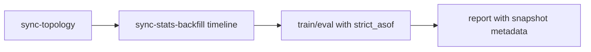

# MVP2.5 Commands Runbook

Operational command reference for MVP2.5 Stage 4.2.

---

## Metadata

- `status`: active
- `audience`: human-and-agent
- `source_of_truth`: true
- `language_policy`: keys and section headers in English, human descriptions in Ukrainian
- `last_updated`: 2026-05-22
- `primary_interface`: CLI

---

## Environment

Use the project virtual environment:

```powershell
.\.venv-modern\Scripts\python.exe <command>
```

**Description (ukr):**

У Codex або PowerShell не треба покладатися на `py -3` чи plain `python`.
Канонічний запуск — через `.venv`.

---

## Validation

```powershell
.\.venv-modern\Scripts\python.exe tools\architecture_guard.py
.\.venv-modern\Scripts\python.exe -m pytest -m mvp1_regression -v
.\.venv-modern\Scripts\python.exe -m pytest tests/ -v
```

---

## Basic Train And Eval

### train

```powershell
.\.venv-modern\Scripts\python.exe main.py --config configs/experiments/02_train_bpi2012.yaml
```

### eval_drift

```powershell
.\.venv-modern\Scripts\python.exe main.py --config configs/experiments/01_eval_drift_bpi2012.yaml
```

### generic_train_eval

```powershell
.\.venv-modern\Scripts\python.exe main.py --config <train_or_eval_experiment.yaml>
```

### eval_topology_mask_uniform

```powershell
.\.venv-modern\Scripts\python.exe main.py --config configs/experiments/<topology_mask_uniform_eval>.yaml
```

Required config keys:

```yaml
experiment:
  mode: eval_topology_mask_uniform
  uniform_mask_empty_mask_policy: raise
  uniform_mask_encoder_checkpoint: checkpoints/<reference_encoder>.pth
  uniform_mask_evaluation_seed: 20260831
  uniform_mask_mc_draws: 200
  on_missing_asof_snapshot: raise
mapping:
  knowledge_graph:
    strict_load: true
topology_projection:
  gateway_mode: collapse_for_prediction
training:
  candidate_identity_mode: topology_native
```

This mode evaluates the current topology/process-state mask only. It loads
`encoder_state`, prepares data with strict topology artifacts, and does not
create a neural model or trainer. With `tracking.enabled: true`, the run is
recorded in MLflow with the standard `mode=eval_drift` tag and
`params.experiment.mode=eval_drift`; the internal evaluator mode remains
available as `evaluation_mode` and `params.experiment.evaluation_mode`. MOU runs
log `model_type=MOU` / `model.type=MOU` and drift-window metrics under the
standard `drift_window_*` namespace for comparison with neural drift runs. It
uses the same `experiment.drift_window_size` / `experiment.drift_window_sliding`
trace-axis window policy as `eval_drift` and includes all prefix records for
the selected traces in each window. Progress is reported only through
`eval_drift.one_pass_inference` and `eval_drift.windows`.

---

## Topology Preparation

### ingest_topology_single_dataset

```powershell
.\.venv-modern\Scripts\python.exe main.py ingest-topology --config configs/experiments/02_train_bpi2012.yaml --out outputs/bpi2012_ingest_summary.json
```

### ingest_topology_cli_keys

```text
--config PATH            YAML config path
--split train|full       optional ingestion split override
--out PATH               summary JSON output path
```

### sync_topology_bulk

```powershell
.\.venv-modern\Scripts\python.exe main.py sync-topology --config <sync_topology_experiment.yaml> --out outputs/sync_topology.json
```

### sync_topology_config_matrix

```text
configs/experiments/mvp2_5_stage4_2_sync_camunda_files_file.yaml
configs/experiments/mvp2_5_stage4_2_sync_camunda_files_neo4j.yaml
configs/experiments/mvp2_5_stage4_2_sync_camunda_sql_file.yaml
configs/experiments/mvp2_5_stage4_2_sync_camunda_sql_neo4j.yaml
configs/experiments/mvp2_5_stage4_2_sync_xes_dir_file.yaml
configs/experiments/mvp2_5_stage4_2_sync_xes_dir_neo4j.yaml
```

---

## Stats Snapshots

### sync_stats_latest_or_auto_asof

```powershell
.\.venv-modern\Scripts\python.exe main.py sync-stats --config <sync_stats_experiment.yaml> --out outputs/sync_stats.json
```

### sync_stats_explicit_asof

```powershell
.\.venv-modern\Scripts\python.exe main.py sync-stats --config <sync_stats_experiment.yaml> --as-of 2024-01-01T00:00:00Z --out outputs/sync_stats_asof.json
```

### sync_stats_xes_lite

```powershell
.\.venv-modern\Scripts\python.exe main.py sync-stats --config configs/experiments/mvp2_5_stage3_4_sync_stats_xes.yaml --out outputs/sync_stats_xes.json
.\.venv-modern\Scripts\python.exe main.py sync-stats --config configs/experiments/mvp2_5_stage3_4_sync_stats_xes.yaml --as-of 2024-01-01T00:00:00Z --out outputs/sync_stats_xes_asof.json
```

### sync_stats_backfill

```powershell
.\.venv-modern\Scripts\python.exe main.py sync-stats-backfill --config <sync_stats_experiment.yaml> --step weekly --out-dir outputs/sync_stats_backfill
.\.venv-modern\Scripts\python.exe main.py sync-stats-backfill --config <sync_stats_experiment.yaml> --step monthly --from 2024-01-01T00:00:00Z --to 2024-12-31T23:59:59Z
```

`backfill_summary.json` includes:

- `runs`: per-as-of run status and summary file path
- `aggregate.runs`: total/ok/failed/planned run counts
- `aggregate.versions`: processed/skipped/usable/not-usable version counts
- `aggregate.quality.reasons`: producer quality gate reason counts
- `aggregate.alignment`: alignment ok/failed counts and minimum observed ratios
- `aggregate.skips.reasons`: skipped snapshot reason counts
- `aggregate.by_process_version`: compact per process-version rollup

### sync_stats_cli_keys

```text
--config PATH            experiment config (supports mapping.adapter=camunda|xes)
--out PATH               summary JSON output path
--as-of ISO_TS           optional historical cutoff for strict_asof policy
```

### sync_stats_backfill_cli_keys

```text
--config PATH            experiment config (camunda or xes adapter)
--out-dir PATH           directory for per-run sync summaries
--summary-out PATH       optional path for aggregated backfill summary JSON
--step VALUE             daily | weekly | monthly
--step-days N            custom step in days (overrides --step)
--from ISO_TS            optional lower bound override
--to ISO_TS              optional upper bound override
--dry-run                print planned points without executing sync-stats
```

---

## Research-Safe Workflow



Recommended research config:

```yaml
experiment:
  stats_time_policy: strict_asof
  on_missing_asof_snapshot: raise

sync_stats:
  alignment_gate:
    enabled: true
    profile: research_strict
    min_event_match_ratio: 0.9
    min_unique_activity_coverage: 0.9
    min_node_coverage: 0.8
    on_fail: raise
```

**Description (ukr):**

Для temporal/drift досліджень треба мати timeline snapshots. Fallback режими
дозволені для exploratory запусків, але фінальні висновки мають використовувати
`strict_asof` і fail-fast policy.

---

## Visualization

### visualize_topology_repository

```powershell
.\.venv-modern\Scripts\python.exe main.py visualize-topology --config <experiment.yaml> --version <version_key> --out outputs/topology.png
```

### visualize_topology_from_raw

```powershell
.\.venv-modern\Scripts\python.exe main.py visualize-topology --config <experiment.yaml> --from-raw --version <version_key> --out outputs/topology_raw.png
.\.venv-modern\Scripts\python.exe main.py visualize-topology --data "../Data/Business Process Drift/logs/cb/cb2.5k.xes" --from-raw --version <version_key> --out outputs/topology_raw_xes.png
```

### visualize_topology_cli_keys

```text
--config PATH            experiment config path
--data PATH              direct XES file path; supported only with --from-raw
--from-raw               build topology directly from raw traces
--version VALUE          process version key to render
--out PATH               optional output image path
--min-freq N             minimum DFG edge frequency
--renderer VALUE         graphviz | pm4py
--label-mode VALUE       id | name | id+name | id+name+type
--typed-colors           enable type colors
--no-typed-colors        disable type colors
```

### visualize_graph_instance

```powershell
.\.venv-modern\Scripts\python.exe main.py visualize-graph --config <experiment.yaml> --case-id <PROC_INST_ID> --out outputs/ig_case.png
```

### visualize_graph_pick_case

```powershell
.\.venv-modern\Scripts\python.exe main.py visualize-graph --config configs/experiments/mvp2_5_stage3_1_baseline_files.yaml --pick with-call-activity --index 0 --out outputs/ig_call_case.png
```

### visualize_graph_cli_keys

```text
--config PATH            experiment config path
--data PATH              direct XES file path
--case-id ID             exact process instance id
--pick VALUE             latest | random | longest | shortest | with-call-activity
--index N                index in ranked candidate list
--seed N                 seed for --pick random
--list-cases             print ranked candidates
--top N                  number of candidates to print
--mode VALUE             activity-centric | execution-centric
--max-nodes N            maximum events/nodes to render
--hide-loop-back         hide loop_back edges from rendered graph
--out PATH               optional output image path
--title TEXT             optional plot title
```

---

## Dataset And Simulation Tools

### mxml_to_xes

```powershell
.\.venv-modern\Scripts\python.exe tools\mxml2xes_convertor.py --input "../Data/Business Process Drift/logs/cb/cb2.5k.mxml" --output "../Data/Business Process Drift/logs/cb/cb2.5k.xes"
```

### add_version_to_xes

```powershell
.\.venv-modern\Scripts\python.exe main.py add-version2xes --config configs/tools/add_version2xes_re2.5.yaml
.\.venv-modern\Scripts\python.exe main.py add-version2xes --config configs/tools/add_version2xes_re2.5.yaml --out outputs/add_version2xes_summary.json
```

### simulate_versioned_log

```powershell
.\.venv-modern\Scripts\python.exe main.py simulate-versioned-log --config configs/tools/simulate_versioned_log_demo.yaml
.\.venv-modern\Scripts\python.exe main.py simulate-versioned-log --config configs/tools/simulate_versioned_log_demo.yaml --out outputs/simulate_versioned_log_summary.json
```

### simulate_versioned_log_cli_keys

```text
--config PATH            simulator YAML config path
--out PATH               optional run summary path
--seed VALUE             optional random seed override
--xes-out PATH           optional generated XES path override
--summary-out PATH       optional simulator summary path override
--data-config-out PATH   optional generated data config path override
```

Each simulator run writes a dataset statistics JSON next to the generated
dataset. The path is controlled by `output.dataset_stats_json_path`; when the
key is omitted, the file is derived from `summary_json_path` with
`.dataset_stats.json`.

The statistics file includes total and per-version trace length, inferred cycle
depth, version carryover, calendar month carryover, task-node coverage, node
usage distribution, resource/task distribution metrics, and
`bpms_native_operational_variance`. The latter describes flattened parallel
interleaving, technical retries/incidents, and resource substitution/delegation;
it should not be described as data corruption noise.

### simulate_versioned_log_conditional_waits

`tasks.<task_id>.conditional_waits[]` can add elapsed waiting time before a task
starts without occupying a worker resource. This is intended for organic
long-running cases caused by document delays, client-side waiting, extra
verification, replacement approval, or audit queues. Rules are evaluated against
trace-level `case_attributes`.

```yaml
case_attributes:
  case_delay_class:
    type: categorical
    values:
      normal: 0.714
      delay_1month: 0.15
      delay_2month: 0.12
      delay_3month: 0.004
      delay_4month: 0.012

tasks:
  t_collect_docs:
    conditional_waits:
      - when: {var: case_delay_class, op: ==, value: delay_2month}
        probability: 0.90
        duration: {type: lognormal, mean_seconds: 1123200, sigma: 0.50}
```

Use `conditional_waits` for calendar-time stretching that should not inflate
resource busy time. Use `conditional_delays` only when the worker/system should
remain busy for the added time.

### simulate_versioned_log_version_carryover

`version_carryover` can force a controlled share of cases to remain open across
process-version activation boundaries. The simulator samples one target
completion bucket per case and, when needed, inserts waiting time before a
terminal task so the XES event timestamps reflect the carryover.

```yaml
version_carryover:
  enabled: true
  targets:
    - completion: same_version
      probability: 0.70
    - completion: next_version
      probability: 0.15
    - completion: skip_one_version
      probability: 0.10
    - completion: last_version
      probability: 0.05
  jitter_seconds:
    type: uniform
    min: 3600
    max: 604800
```

Supported `completion` values are `same_version`, `next_version`,
`skip_one_version`, `last_version`, and explicit `plus_N` buckets. Targets past
the last configured version are capped to the last version.

### simulate_versioned_log_xor_branches

`gateways.<gateway_id>.branches[]` supports deterministic conditions and
bounded probabilistic loop branches for exclusive gateways:

```yaml
gateways:
  gw_retry:
    default_flow_id: f_exit
    branches:
      - flow_id: f_loop
        probability: 0.05
        max_traversals_per_case: 2
        repeat_until_max_once_selected: true
        when: {const: true}
      - flow_id: f_exit
        when: {const: true}
```

`probability` is evaluated per case when the branch condition matches.
`max_traversals_per_case` prevents unbounded BPMN loops. When
`repeat_until_max_once_selected=true`, a case that enters the branch repeats it
until the configured max, then falls through to the next matching/default
branch. These keys apply to exclusive gateways only. Parallel gateways execute
all outgoing branches and do not use branch probabilities.

Example
```powershell
.\.venv-modern\Scripts\python.exe main.py simulate-versioned-log --config configs\tools\simulate_loan_v1_v5_complex.yaml --out outputs\simulation\simulate_loan_v1_v5_complex_run.json
```

---

## Cache Maintenance

### cache_clean

```powershell
.\.venv-modern\Scripts\python.exe main.py cache-clean --cache-dir .cache/graph_datasets
```

### cache_clean_dry_run

```powershell
.\.venv-modern\Scripts\python.exe main.py cache-clean --cache-dir .cache/graph_datasets --dry-run --older-than-days 7 --keep-last 5
```

### cache_clean_size_limit

```powershell
.\.venv-modern\Scripts\python.exe main.py cache-clean --cache-dir .cache/graph_datasets --dry-run --max-size-gb 8 --keep-last 5
.\.venv-modern\Scripts\python.exe main.py cache-clean --cache-dir .cache/graph_datasets --max-size-gb 8 --keep-last 5
```

---

## UI Commands

### cdlg_benchmark_runner

Use this helper to execute only the CDLG presets listed in
`configs/ui/cdlg_benchmark_plan.yaml`, in that file's exact order. Preset
payloads remain in `configs/ui/experiment_ui_presets.json`.

```powershell
.\.venv-modern\Scripts\python.exe tools\run_cdlg_benchmark.py --dry-run
.\.venv-modern\Scripts\python.exe tools\run_cdlg_benchmark.py
```

Populate the explicit queue before running:

```yaml
runs:
  - preset: _CDLG-simple1_GATv2
  - preset: _CDLG-simple1_GATv2-drift
```

Always use `--dry-run` first. It validates names and prints the exact queue
without launching a child process. Live console lines include `Run i/N`, preset
name, completed/remaining queue counts, current stage, stage/run ETA, and the
queue ETA once a completed run provides timing evidence.

Generated configs, per-run logs, and `manifest.jsonl` are written below
`outputs/cdlg_benchmark/`. The runner stops after the first failed child; if
that child is a train entry, its directly paired later `-drift` entry is
recorded as `blocked` and is not launched.

### generic_benchmark_runner

Use this helper for an explicitly ordered Experiment UI preset queue where
preset IDs are not required to follow the canonical CDLG naming pattern.

```powershell
.\.venv-modern\Scripts\python.exe tools\run_benchmark.py --dry-run
.\.venv-modern\Scripts\python.exe tools\run_benchmark.py
```

`--dry-run` checks only that every listed preset exists in
`configs/ui/experiment_ui_presets.json`. A real run loads the preset payloads
and executes them sequentially through the same generated-config, log, manifest,
progress, and ETA path as `tools/run_cdlg_benchmark.py`.

### experiment_ui

```powershell
.\.venv-modern\Scripts\python.exe tools\experiment_ui.py --config configs/experiments/mvp2_5_stage4_2_eopkg_files_stat.yaml
.\.venv-modern\Scripts\python.exe main.py experiment-ui --config configs/experiments/mvp2_5_stage4_2_eopkg_files_stat.yaml
```

### py_side_ui_prototype

```powershell
.\.venv-modern\Scripts\python.exe main.py ui
```

Operational stance:

1. CLI is primary.
2. `experiment-ui` is the supported legacy Tkinter desktop wrapper.
3. `ui` is the parallel PySide6 desktop prototype for the new catalog-driven layout; do not treat it as the production run UI until Phase 2 is implemented.

---

## Diagnostics / Audits

### topology_drift_audit

Use this after train/eval_drift runs to explain whether post-drift degradation
comes from added/removed topology candidates, changed gateway-collapsed
successors, OOS predictions, or fixed classifier limitations.

```powershell
.\.venv-modern\Scripts\python.exe tools\audit_topology_drift.py `
  --mlruns-dir mlruns `
  --experiment-id 854778689611649472 `
  --baseline-run <baseline_eval_drift_run_id> `
  --structural-run <structural_eval_drift_run_id> `
  --train-run <train_run_id> `
  --log-path outputs\simulation\loan_v1_v4_simulated.xes `
  --output-dir outputs\audits\topology_drift
```

`--log-path` is optional but recommended for older trace artifacts. When trace
payloads do not contain `prefix_last_activity`, the audit reconstructs it from
XES using `(trace_idx, prefix_len)` and can attribute errors to changed
gateway-collapsed successor zones without rerunning `eval_drift`.

For the current loan BPMN source files, the tool reads:

```text
data/camunda_exports/bpmn_xml/loan_v1.bpmn
data/camunda_exports/bpmn_xml/loan_v2_re.bpmn
data/camunda_exports/bpmn_xml/loan_v3_re_pl.bpmn
data/camunda_exports/bpmn_xml/loan_v4_re_pl_cb.bpmn
```

Output:

```text
summary.json
version_topology_diff.csv
activity_label_diff.csv
transition_diff.csv
prediction_error_attribution.csv
by_version_metrics.csv
report.md
```

### article_figure_export

Use this after exporting and aggregating article run metrics to regenerate the
publication figures from `outputs/Export_metrics/article_run_metrics`.

```powershell
.\.venv-modern\Scripts\python.exe tools\export_article_figures.py `
  --input-dir outputs\Export_metrics\article_run_metrics `
  --output-dir outputs\article_figures `
  --formats svg,png,eps `
  --dpi 600
```

The command writes SVG/EPS files for journal submission and high-DPI PNG files
for Word drafts. By default, it exports the main article figures generated from
metrics (`Fig3`-`Fig6`). The train/validation loss diagnostic is available as
`FigS1` and must be requested explicitly through `--figures FigS1`. Learn
figures are clipped to epochs 0-50 for comparability across runs; drift figures
use the full chronological drift trajectory. Model colors and legend labels are
fixed across all figures.

### article_docx_export

Use this to convert the Markdown article draft into a DOCX draft with native
Word equations. The command requires Pandoc in `PATH` or an explicit `--pandoc`
path. The converter patches body paragraph styles to justified text, 0 cm
left/right indentation, 1.27 cm first-line indentation, 0 pt before/after
spacing, and 1.5 line spacing, while table-cell paragraphs keep 0 first-line
indentation. It also removes paragraph indents from figure/table captions,
stretches kept figures to the configured content width, and formats Word tables
with full-width geometry, horizontal rules only, no vertical rules, and no cell
shading. By default, Markdown image references are replaced with placeholders so
SVG/figure formatting does not block DOCX generation; insert final figures in
Word manually or pass `--keep-images` when all assets are Word-compatible. Use
`--no-body-style` when a journal-provided `--reference-doc` should control
paragraph formatting. Use
`--content-width-inches` to adjust full-width figure scaling for a different
page/margin template.

```powershell
.\.venv-modern\Scripts\python.exe tools\convert_article_md_to_docx.py `
  --input "Драфт_статті_4_EOPKG_структурний_дрейф.MD" `
  --output outputs\article_docx\EOPKG_structural_drift.docx
```

---

## Key Config Attributes

### experiment

- `mode`: `train | eval_drift | eval_cross_dataset`
- `split_strategy`: `temporal | versioned | none`
- `fraction_strategy`: `temporal | versioned`
- `version_scope_policy`: `all | train_cut`
- `train_ratio`, `fraction`, `split_ratio`
- `graph_dataset_cache_policy`: `off | read | write | full`
- `graph_dataset_cache_dir`
- `graph_dataset_disk_spill_enabled`: enable sharded disk spill during graph build
- `graph_dataset_shard_size`: target graphs per shard; runtime minimum is 128
- `max_ram_gb`: soft RSS limit for spill flushes; `0` disables RAM guard
- `stats_time_policy`: `latest | strict_asof`
- `on_missing_asof_snapshot`: `disable_stats | use_base | raise`

**Description (ukr):**

`graph_dataset_disk_spill_enabled=true` потребує cache write mode. Якщо policy
не дозволяє write, runtime примусово вмикає write для поточного запуску.

### mapping.knowledge_graph

- `backend`: `in_memory | file | neo4j`
- `strict_load`
- backend-specific storage/connection settings

### mapping.graph_feature_mapping

- `enabled`
- `node_numeric`
- `edge_weight`
- `encoding`: `identity | log1p | z-score`
- `stats_quality_gate`

### sync_stats.quality_gate

- `enabled`
- `zero_dominant_threshold`
- `min_non_zero_ratio_overall`
- `min_history_coverage_percent`
- `on_fail`: `write_with_flag | skip_snapshot`

### sync_stats.alignment_gate

- `enabled`
- `profile`: `legacy_exact | safe_normalized | research_strict`
- `candidate_node_fields`
- `ignore_structural_only_nodes`
- `strip_classifier_suffix`
- `normalize_case`
- `collapse_separators`
- `fail_on_ambiguity`
- `min_event_match_ratio`
- `min_unique_activity_coverage`
- `min_node_coverage`
- `on_fail`: `write_with_flag | skip_snapshot | raise`
