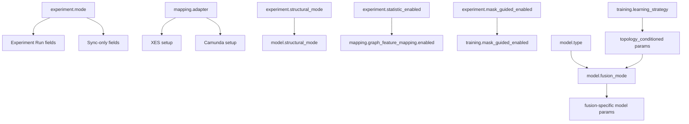

# MVP2.5 Desktop UI Field Dependency Audit - 2026-05-22

## Metadata

- `status`: audit
- `scope`: desktop Experiment UI only
- `web_ui_status`: removed from active project
- `matrix`: `outputs/ui/desktop_ui_field_dependency_matrix.csv`

## Executive Summary

Desktop UI currently mixes catalog-driven dynamic forms with manually rendered Core fields. This creates repeated defects when a new config key is added: a field can exist in `configs/ui/config_catalog.yaml`, but still be absent from `self.vars`, Core widgets, config load, defaults, or generated YAML output.

The target direction is a catalog-driven Desktop UI where every field has one metadata contract: `path`, `ui_level`, `active_when`, `widget`, `default`, `enum`, `derived_writes`, and `runtime_consumers`. Manual widgets should be limited to composite controls such as split ratio editors and YAML blocks.

## Proposed UI Levels

### Level 1: Project Setup

Purpose: stable project/infrastructure settings: dataset identity, adapter, log source, BPMN/source configuration, knowledge graph backend, stats source/mapping. These are important for setting up a project, but should not dominate daily experiment comparison.

### Level 2: Experiment Run

Purpose: frequently changed experiment controls: `experiment.mode`, checkpoint/retrain, `fraction`, versioned split controls, structural/statistics/mask toggles, `model.fusion_mode`, `training.learning_strategy`, common train hyperparameters, and key tracking names. These should stay close to Run controls.

### Level 3: Advanced

Purpose: rare or mode-specific tuning: fusion internals, learning strategy coefficients, auxiliary losses, dataloader/performance knobs, trace/debug fields, and low-level adapter details. These should remain searchable and editable, but visually secondary.

## Counts

- `project_setup`: 88 fields
- `experiment_run`: 55 fields
- `advanced`: 78 fields

## Section Distribution

- `advanced` / `experiment`: 9
- `advanced` / `mapping`: 5
- `advanced` / `model`: 28
- `advanced` / `tracking`: 15
- `advanced` / `training`: 21
- `experiment_run` / `experiment`: 16
- `experiment_run` / `model`: 5
- `experiment_run` / `seed`: 1
- `experiment_run` / `tracking`: 2
- `experiment_run` / `training`: 31
- `project_setup` / `data`: 3
- `project_setup` / `mapping`: 55
- `project_setup` / `sync_stats`: 30

## Critical Architecture Debt

1. `manual_core_widget_contract`: Core fields are duplicated across `self.vars`, widget creation, load, defaults, build-config, validation, and enable/disable logic.
2. `catalog_required_when_is_not_visibility`: `required_when` is used mostly for validation, not for active UI state or explanation.
3. `derived_convenience_fields_are_implicit`: `experiment.structural_mode`, `experiment.statistic_enabled`, and `experiment.mask_guided_enabled` map into model/training/mapping sections through CLI switch logic, but UI does not mark them as derived controls.
4. `mode_adapter_rules_are_hardcoded`: `_refresh_state_controls()` hardcodes mode/adapter prefix rules instead of using field-level active/visible metadata.
5. `field_usage_is_not_audited`: catalog fields do not carry explicit `runtime_consumers`, so stale/dead fields and missing UI fields are hard to detect.

## Recommended Target Contract

```yaml
path: experiment.fraction_strategy
ui_level: experiment_run
ui:
  tab: Experiment Run
  group: Data Slice
  widget: select
  order: 20
active_when:
  experiment.mode: [train, eval_drift, eval_cross_dataset]
runtime_consumers:
  - src.cli.prepare_data
  - ModelTrainer._prepare_data
derived_writes: []
```

## First Refactor Recommendation

Do not rewrite the whole UI at once. First, introduce a `DesktopFieldRegistry` that loads `config_catalog.yaml`, normalizes field metadata, computes active state from `mode`, `adapter`, `model.type`, `model.fusion_mode`, `training.learning_strategy`, and exposes field groups for rendering. Then migrate only the Experiment Run tab to registry rendering. Keep YAML blocks and split-ratio composite editor as custom widgets.

## Fields With Conditional Rules

- `data.log_path`: mapping.adapter=xes
- `experiment.graph_dataset_shard_size`: experiment.graph_dataset_disk_spill_enabled=True
- `mapping.camunda_adapter.runtime.runtime_source`: mapping.adapter=camunda
- `mapping.camunda_adapter.structure.bpmn_source`: mapping.adapter=camunda
- `model.fusion_mode`: model.type=EOPKGGATv2
- `model.struct_encoder_type`: model.type=EOPKGGATv2
- `model.struct_xattn_dropout`: model.type=EOPKGGATv2; model.fusion_mode=StructXAttn
- `model.struct_xattn_gate_init_bias`: model.type=EOPKGGATv2; model.fusion_mode=StructXAttn; model.struct_xattn_use_gate=true
- `model.struct_xattn_heads`: model.type=EOPKGGATv2; model.fusion_mode=StructXAttn
- `model.struct_xattn_layers`: model.type=EOPKGGATv2; model.fusion_mode=StructXAttn
- `model.struct_xattn_scale_init`: model.type=EOPKGGATv2; model.fusion_mode=StructXAttn
- `model.struct_xattn_scale_max`: model.type=EOPKGGATv2; model.fusion_mode=StructXAttn
- `model.struct_xattn_use_gate`: model.type=EOPKGGATv2; model.fusion_mode=StructXAttn
- `model.struct_xattn_use_layer_norm`: model.type=EOPKGGATv2; model.fusion_mode=StructXAttn
- `model.structural_logit_scale_init`: model.type=EOPKGGATv2; model.fusion_mode=ClassAwareStructuralScoring
- `model.structural_logit_scale_max`: model.type=EOPKGGATv2; model.fusion_mode=ClassAwareStructuralScoring
- `model.structural_observed_scale_max`: model.type=EOPKGGATv2; model.fusion_mode=ClassAwareStructuralScoring
- `model.structural_observed_scale_min`: model.type=EOPKGGATv2; model.fusion_mode=ClassAwareStructuralScoring
- `model.structural_prior_fusion`: model.type=EOPKGGATv2; model.fusion_mode=StructuralPriorEncoder
- `model.structural_prior_gate_init_bias`: model.type=EOPKGGATv2; model.fusion_mode=StructuralPriorEncoder; model.structural_prior_fusion=gated_concat
- `model.structural_prior_pooling`: model.type=EOPKGGATv2; model.fusion_mode=StructuralPriorEncoder
- `model.structural_score_mode`: model.type=EOPKGGATv2; model.fusion_mode=ClassAwareStructuralScoring
- `model.structural_stats_beta`: model.type=EOPKGGATv2; model.fusion_mode=ClassAwareStructuralScoring
- `model.topology_graph_pooling`: model.type=EOPKGGATv2; model.fusion_mode=TopologyStateGraphEncoder
- `model.topology_state_beta`: model.type=EOPKGGATv2
- `model.topology_state_beta_max`: model.type=EOPKGGATv2
- `model.topology_state_class_pooling`: model.type=EOPKGGATv2; model.fusion_mode=TopologyStateEncoder
- `model.topology_state_dropout`: model.type=EOPKGGATv2
- `model.topology_state_gate_init_bias`: model.type=EOPKGGATv2
- `training.struct_xattn_contrastive_enabled`: model.fusion_mode=StructXAttn
- `training.struct_xattn_contrastive_margin`: training.struct_xattn_contrastive_enabled=true
- `training.struct_xattn_contrastive_max_loss`: training.struct_xattn_contrastive_enabled=true
- `training.struct_xattn_contrastive_temperature`: training.struct_xattn_contrastive_enabled=true
- `training.struct_xattn_contrastive_warmup_epochs`: training.struct_xattn_contrastive_enabled=true
- `training.struct_xattn_contrastive_weight`: training.struct_xattn_contrastive_enabled=true
- `training.struct_xattn_corruption_edge_drop_prob`: training.struct_xattn_contrastive_enabled=true; training.struct_xattn_corruption_policy=edge_drop
- `training.struct_xattn_corruption_feature_noise_std`: training.struct_xattn_contrastive_enabled=true
- `training.struct_xattn_corruption_policy`: training.struct_xattn_contrastive_enabled=true
- `training.structural_aux_exact_loss_weight`: training.structural_aux_loss_enabled=true
- `training.structural_aux_loss_enabled`: model.fusion_mode=ClassAwareStructuralScoring
- `training.structural_aux_loss_weight`: training.structural_aux_loss_enabled=true
- `training.topology_conditioning_allowed_set_loss_enabled`: training.learning_strategy=topology_conditioned
- `training.topology_conditioning_allowed_set_loss_weight`: training.topology_conditioning_allowed_set_loss_enabled=true
- `training.topology_conditioning_current_version_policy`: training.topology_conditioning_retention_enabled=true
- `training.topology_conditioning_drop_edges_margin`: training.topology_conditioning_drop_edges_negative_enabled=true
- `training.topology_conditioning_drop_edges_negative_enabled`: training.learning_strategy=topology_conditioned
- `training.topology_conditioning_drop_edges_negative_weight`: training.topology_conditioning_drop_edges_negative_enabled=true
- `training.topology_conditioning_drop_edges_ratio`: training.topology_conditioning_drop_edges_negative_enabled=true
- `training.topology_conditioning_retention_enabled`: training.learning_strategy=topology_conditioned
- `training.topology_conditioning_retention_obsolete_weight`: training.topology_conditioning_retention_enabled=true
- `training.topology_conditioning_retention_old_weight`: training.topology_conditioning_retention_enabled=true
- `training.topology_conditioning_retention_policy`: training.topology_conditioning_retention_enabled=true
- `training.topology_conditioning_retention_recent_versions`: training.topology_conditioning_retention_enabled=true
- `training.topology_conditioning_retention_recent_weight`: training.topology_conditioning_retention_enabled=true
- `training.topology_conditioning_wrong_version_margin`: training.topology_conditioning_wrong_version_negative_enabled=true
- `training.topology_conditioning_wrong_version_negative_enabled`: training.learning_strategy=topology_conditioned
- `training.topology_conditioning_wrong_version_negative_weight`: training.topology_conditioning_wrong_version_negative_enabled=true

## Fields Without Obvious Runtime Consumer

These need manual review before hiding/removing; some may be consumed indirectly from nested configs or by external tools.

- `mapping.graph_feature_mapping.enabled` (mapping, proposed `project_setup`)
- `mapping.graph_feature_mapping.stats_quality_gate.enabled` (mapping, proposed `project_setup`)
- `mapping.knowledge_graph.path` (mapping, proposed `advanced`)
- `sync_stats.alignment_gate.enabled` (sync_stats, proposed `project_setup`)
- `sync_stats.quality_gate.enabled` (sync_stats, proposed `project_setup`)
- `tracking.tracing.enabled` (tracking, proposed `advanced`)

## Mermaid Dependency Sketch


