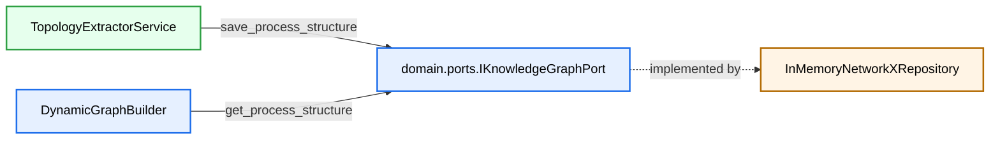

# MVP2.5 Stage 1 Plan (Refactoring Only)

Updated: 2026-03-13  
Stage scope: Introduce clean-architecture knowledge graph storage abstraction and move current XES topology flow to that abstraction.

## 1. Stage 1 Objective

Refactor current architecture so that:
1. Topology extraction writes through a storage port.
2. Graph building reads through the same storage port.
3. Storage backend is in-memory (NetworkX) for now.
4. Behavior of MVP1/MVP2 pipelines stays unchanged.

Important:
- Do not implement Camunda or Neo4j in this stage.

---

## 2. Current State (As-Is)

1. `IKnowledgeGraphPort` exists in `src/application/ports/knowledge_graph_port.py` with read-only method (`get_process_structure`).
2. `TopologyExtractorService` stores topology in its own internal dictionaries and also acts as the port.
3. `DynamicGraphBuilder` reads directly from that service instance.
4. Wiring in `cli.py` creates `TopologyExtractorService()` and passes it to builder.

Problem:
- Producer, storage, and read API are conflated, which blocks safe backend migration.

---

## 3. Target State (To-Be for Stage 1)



---

## 4. Planned File Changes

## 4.1 New files
1. `src/domain/ports/knowledge_graph_port.py`
2. `src/infrastructure/repositories/in_memory_networkx_repository.py`
3. `tests/infrastructure/test_in_memory_networkx_repository.py`
4. `tests/domain/test_dynamic_graph_builder_version_fallback.py`

## 4.2 Updated files
1. `src/application/services/topology_extractor_service.py`
2. `src/domain/services/dynamic_graph_builder.py`
3. `src/cli.py` (composition root wiring)
4. `tests/application/test_topology_extractor_service.py`
5. `tests/domain/test_dynamic_graph_builder_masks.py`
6. `tests/domain/test_dynamic_graph_builder_tensor_purity.py`

Optional compatibility shim (recommended during transition):
- keep `src/application/ports/knowledge_graph_port.py` as thin re-export/import alias to the domain port to avoid broad import breakage.

---

## 5. Port Contract Design

Proposed contract (minimal required):

```python
class IKnowledgeGraphPort(Protocol):
    def save_process_structure(self, version: str, dto: ProcessStructureDTO) -> None: ...
    def get_process_structure(self, version: str) -> Optional[ProcessStructureDTO]: ...
```

Recommended extension for tooling compatibility:

```python
    def list_versions(self) -> List[str]: ...
```

Rationale:
- `save_*` enables any producer (XES now, Camunda later).
- `get_*` keeps consumer contract stable for `DynamicGraphBuilder`.
- `list_versions` keeps visualization UX intact (`available_versions` replacement).

---

## 6. InMemoryNetworkXRepository Design

Storage strategy:
1. Primary map by version:
- `_graphs: Dict[str, nx.DiGraph]`
2. DTO cache for direct retrieval:
- `_structures: Dict[str, ProcessStructureDTO]`

Save semantics:
1. Normalize key: `version_key = str(version).strip() or "1"`.
2. Persist DTO in `_structures[version_key]`.
3. Build/update corresponding `nx.DiGraph` with edge weights from `edge_statistics`.

Read semantics:
1. Exact lookup by key.
2. Return DTO or `None`.

Why keep both graph and DTO:
- DTO is domain contract for current pipeline.
- NetworkX graph enables future algorithms/diagnostics without changing port consumers.

---

## 7. TopologyExtractorService Refactor Plan

Constructor change:
- inject `IKnowledgeGraphPort` dependency.

Behavior:
1. Parse train traces exactly as today (version grouping + edge frequencies).
2. For each version, build `ProcessStructureDTO`.
3. Persist via `knowledge_port.save_process_structure(version_key, dto)`.
4. Keep BPMN placeholder (`extract_from_bpmn`) unchanged.

Compatibility notes:
1. `fit(train_traces)` remains alias to `extract_from_logs`.
2. `get_process_structure` may stay as a convenience passthrough to port for existing call sites/tests.
3. `available_versions` should be implemented through port (`list_versions`) or service-local mirror.

---

## 8. DynamicGraphBuilder Refactor Plan

Constructor:
- keep injected `IKnowledgeGraphPort` (now from domain port path).

Lookup policy:
1. Resolve requested version key:
- `requested = str(prefix.process_version).strip() or "1"`
2. Read order:
- `dto = port.get_process_structure(requested)`
- if `dto is None and requested != "1"`: fallback `dto = port.get_process_structure("1")`
3. If still `None`: keep existing fallback behavior (`allowed_target_mask=None`, structural tensors omitted/empty).

Invariant:
- tensor construction logic (mask shape/dtypes, structural edge tensors) must not change except DTO source and fallback key handling.

---

## 9. Composition Root / Wiring Changes

`cli.py` plan:
1. Instantiate one shared repository instance:
- `knowledge_repo = InMemoryNetworkXRepository()`
2. Inject it into extractor:
- `topology_service = TopologyExtractorService(knowledge_port=knowledge_repo)`
3. Run extraction on train traces.
4. Inject same repository into `DynamicGraphBuilder`.

Result:
- producer and consumer are decoupled but share the same storage via DI.

---

## 10. Test Plan for Stage 1

## 10.1 New tests
1. `test_in_memory_networkx_repository.py`
- save/get roundtrip
- version partition isolation
- overwrite semantics for same version

2. `test_dynamic_graph_builder_version_fallback.py`
- unknown version falls back to `"1"`
- no fallback when both missing

## 10.2 Updated tests
1. `test_topology_extractor_service.py`
- assert calls/persistence through repository behavior
- unknown version returns `None`

2. Existing dynamic graph tests
- keep assertions for mask correctness and tensor purity.

## 10.3 Non-regression command set
1. `pytest -m mvp1_regression -v`
2. `pytest tests/domain/test_eopkg_gatv2_dual_encoder.py -v`
3. `pytest tests/domain/test_eopkg_models_forward.py -v`
4. `pytest tests/domain/test_dynamic_graph_builder_masks.py tests/domain/test_dynamic_graph_builder_tensor_purity.py -v`
5. `pytest tests/application/test_topology_extractor_service.py -v`

---

## 11. Definition of Done (Stage 1)

1. Port supports explicit save/get and is located in domain layer.
2. In-memory repository adapter is the storage source of truth.
3. TopologyExtractor writes through port; no private storage coupling required for runtime correctness.
4. DynamicGraphBuilder reads through port with deterministic default-version fallback.
5. CLI wiring uses one shared repository instance for extractor and builder.
6. MVP1 regression shield and Dual-Encoder tests are green.

---

## 12. Stage 1 Output for Next Stages

After this refactor, Stage 3 and Stage 4 become low-risk adapter additions:
1. Camunda adapter will only call `save_process_structure(...)`.
2. Neo4j adapter will only implement `IKnowledgeGraphPort` and replace repository wiring.
3. Model/trainer logic remains unchanged.
