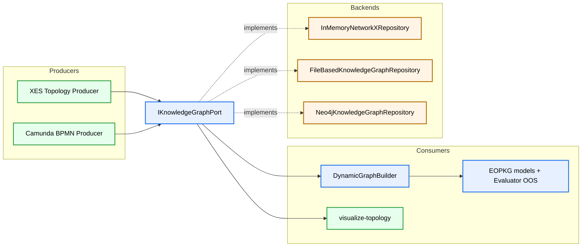

# MVP2.5 General Migration Plan

Updated: 2026-03-17  
Status: Active
Scope: Controlled migration from MVP2 to MVP2.5 target architecture (Camunda + persistent knowledge graph), with strict MVP1/MVP2 non-regression.

## 1. Goal and Constraints

Goal:
- Build a persistent, multi-source knowledge graph architecture without destabilizing train/eval/infer behavior.

Hard constraints:
1. MVP1 regression shield must remain green at every step.
2. Ingestion and training stay decoupled.
3. Camunda structure source is BPMN (not runtime logs) for Stage 3.2+.
4. No lazy-fetch for unresolved `callActivity` during ingestion.
5. `ProcessStructureDTO` identity is strict: one DTO per `proc_def_id`.
6. Version key for Camunda structure is normalized to `vNN`.

---

## 2. Program Status by Stage

## Stage 1. Port + In-Memory Repository Refactor
Status: Completed

Delivered:
1. `IKnowledgeGraphPort` abstraction in domain layer.
2. `InMemoryNetworkXRepository` implementation.
3. Refactored topology producer/consumer wiring through shared port.
4. MVP1 regression kept green.

## Stage 2. Validation and Hardening
Status: Completed

Delivered:
1. Port contract tests.
2. Repository behavior parity checks.
3. Regression and smoke validation across MVP1/MVP2 paths.

## Stage 3. Camunda Producers on Same Port
Status: In progress (3.1 and 3.2 completed, 3.3 planned)

### Stage 3.1 Runtime InstanceGraph ingestion
Status: Completed

### Stage 3.2 BPMN Structure ingestion
Status: Completed

Delivered in 3.2:
1. `CamundaBpmnAdapter` (`files` and `mssql`).
2. `BpmnStructureParserService`.
3. `call_bindings` with explicit resolved/unresolved states.
4. `inference_fallback_strategy` in `call_bindings` (`skip | use_aggregated_stats | raise`).
5. Offline ingestion route in `main.py ingest-topology`.

### Stage 3.3 Periodic stats and immutable snapshots
Status: Planned (design completed, implementation pending)

---

## 3. Current Strategic Decision (Locked)

Decision:
1. **Go to Stage 4 (Neo4j backend) before BPMS enrichment.**

Rationale:
1. Stage 4 validates storage backend migration with minimal semantic changes.
2. Running Stage 4 and BPMS together would mix two high-risk dimensions.
3. BPMS enrichment is optional and should be layered on a stable persistent backend.

---

## 4. Stage 4 Plan (Current Focus)

## 4.1 Objective
Replace volatile/in-file storage path with persistent graph storage via `Neo4jKnowledgeGraphRepository` under the same `IKnowledgeGraphPort` contract.

## 4.2 Implementation principle
Parity-first:
1. Keep DTO contract unchanged.
2. Keep ingestion/train/eval orchestration unchanged.
3. Swap repository implementation behind the same port.

## 4.3 Deliverables
1. `Neo4jKnowledgeGraphRepository` implementing:
   - `save_process_structure`
   - `get_process_structure`
   - `list_versions`
   - `get_graph_for_visualization`
2. Config switch in repository factory:
   - `mapping.knowledge_graph.backend: neo4j`
3. Connection and reliability:
   - retry/backoff,
   - session lifecycle,
   - timeout configuration.
4. Contract tests reused against Neo4j backend.

## 4.4 Exit gate for Stage 4
1. All port contract tests pass against Neo4j implementation.
2. Full `pytest tests/ -v` remains green.
3. `pytest -m mvp1_regression -v` remains green.
4. `ingest-topology` + train/eval run with `backend=neo4j` without code changes outside config.

---

## 5. Stage 5 Plan (After Stage 4)

## 5.1 Objective
Add optional BPMS enrichment adapter (executors, org structure, business context) without coupling core Camunda-only path.

## 5.2 Constraints
1. BPMS adapter is feature-flagged and optional.
2. No breakage when `enrichment.enabled=false`.
3. No replacement of Camunda anchors (`activity_def_id`, `proc_def_id`) by BPMS identifiers.

## 5.3 Typical enrichment candidates
1. executor assignment lineage,
2. candidate groups and staffing graph,
3. process business attributes for node/edge features,
4. org graph relations for future knowledge infusion branches.

---

## 6. Risks and Mitigations

1. Risk: contract drift between docs and code.
- Mitigation: treat `ProcessStructureDTO` in code as source of truth; keep docs in lockstep per stage report.

2. Risk: version resolution mismatch (`22` vs `v22`).
- Mitigation: explicit normalization and fallback mapping in graph builder/tests.

3. Risk: unresolved callActivity behavior differs by environment.
- Mitigation: explicit `call_bindings.status/reason` and `inference_fallback_strategy` persisted in structure artifact.

4. Risk: backend migration introduces latency/retry instability.
- Mitigation: parity-first repository swap with contract tests and fail-safe fallback configuration.

---

## 7. Target Architecture After Stage 4

---

## 8. References

1. `docs/worklogs/mvp2_5_Stage3_2_Report.MD`
2. `docs/worklogs/mvp2_5_Stage3_3_Plan.MD`
3. `docs/ARCHITECTURE_MVP2_5.MD`
4. `docs/DATA_MODEL_MVP2_5.MD`
5. `docs/LLD_MVP2_5.MD`