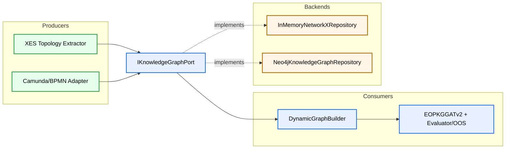

# MVP2.5 General Migration Plan

Updated: 2026-03-13  
Scope: Controlled migration path from MVP2 (XES-only topology extraction) to MVP2 final target (Camunda + Neo4j global knowledge graph) with strict MVP1/MVP2 non-regression.

## 1. Goal and Constraints

Goal:
- Reach a persistent, multi-source knowledge graph architecture without destabilizing existing training/evaluation behavior.

Hard constraints:
1. MVP1 regression shield must remain green at every step.
2. Stage 1 is refactoring only (ports + in-memory repository abstraction).
3. No Camunda or Neo4j implementation in Stage 1.
4. Existing Dual-Encoder tests must keep passing.

---

## 2. Four-Stage Strategy

## Stage 1. Port + In-Memory Repository Refactor (Current Focus)
Objective:
- Decouple topology storage from `TopologyExtractorService` internals.
- Introduce explicit clean-architecture port with save/get semantics.

Deliverables:
1. Domain knowledge-graph port contract.
2. In-memory repository adapter (NetworkX-backed).
3. Refactored `TopologyExtractorService` and `DynamicGraphBuilder` wired through shared port instance.
4. Green non-regression test suite.

Output:
- Unified abstraction ready for alternative producers (Camunda) and backends (Neo4j).

## Stage 2. Validation and Hardening on Existing Test Suite
Objective:
- Prove behavior parity with current MVP2 semantics.

Deliverables:
1. Additional repository-focused unit tests.
2. Pipeline-level integration checks for version fallback and mask generation.
3. Regression report against `mvp1_regression` and Dual-Encoder tests.

Output:
- Refactor accepted as behavior-preserving baseline.

## Stage 3. Camunda Adapters Writing to the Same Port
Objective:
- Add Camunda/BPMN knowledge producers without changing consumers.

Deliverables (high-level only at this stage):
1. Camunda extraction adapter(s) producing `ProcessStructureDTO`.
2. Save path through `IKnowledgeGraphPort.save_process_structure(...)`.
3. Producer-selection policy in configuration/composition root.

Output:
- Multi-source knowledge ingestion with unchanged `DynamicGraphBuilder`/model code.

## Stage 4. Backend Swap: In-Memory -> Neo4j
Objective:
- Replace volatile storage with persistent graph DB adapter.

Deliverables (high-level only at this stage):
1. `Neo4jKnowledgeGraphRepository` implementing the same port.
2. Query mapping between Neo4j graph data and `ProcessStructureDTO` contract.
3. Operational concerns: retries, latency, cache, connection lifecycle.

Output:
- Production-grade persistence with minimal application/domain code changes.

---

## 3. Target Architecture After Stage 4

---

## 4. Risks and Mitigations

1. Risk: hidden coupling to current `TopologyExtractorService` internal registry.
- Mitigation: route all reads/writes through the port, keep compatibility shim during transition.

2. Risk: version fallback behavior drift (`None`, empty, unknown version).
- Mitigation: enforce deterministic policy (`requested -> default "1" -> None`) with tests.

3. Risk: visualization tooling breakage.
- Mitigation: repository exposes version list/read needed by plotting path; keep API-compatible adapter layer.

4. Risk: regression in OOS mask generation.
- Mitigation: keep `DynamicGraphBuilder` tensor logic unchanged except DTO source.

---

## 5. Stage Gates (Exit Criteria)

Stage 1 exit gate:
1. New port and in-memory repository integrated by DI.
2. `TopologyExtractorService` no longer owns the single source of truth for topology storage.
3. `DynamicGraphBuilder` reads via port with default-version fallback.
4. Tests green:
- `pytest -m mvp1_regression -v`
- Dual-Encoder and topology/dynamic-graph tests.

Stage 2-4 gates:
- Defined in their dedicated stage plans and executed incrementally.

---

## 6. Out of Scope for Stage 1

1. No Camunda ingestion code.
2. No Neo4j adapter/queries.
3. No model architecture change.
4. No metric formula changes.
