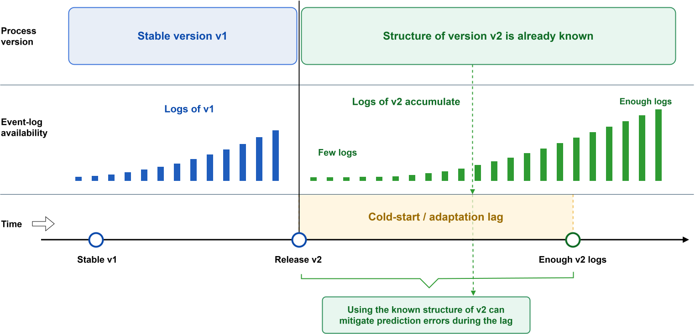
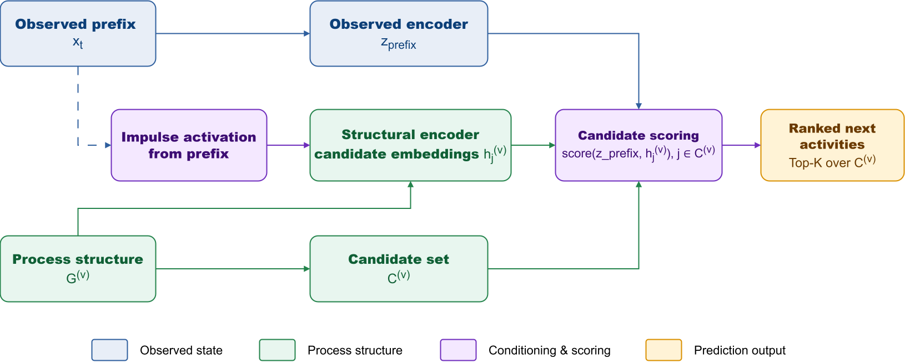
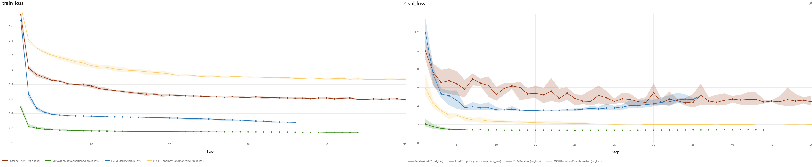
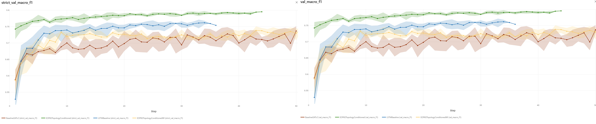
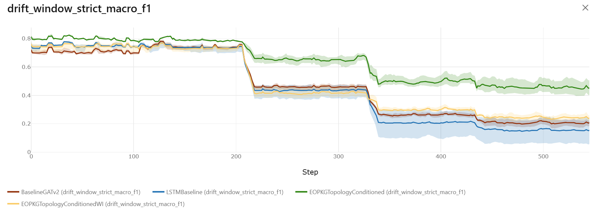
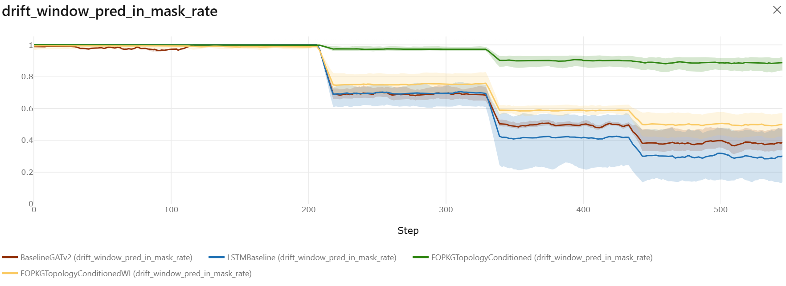
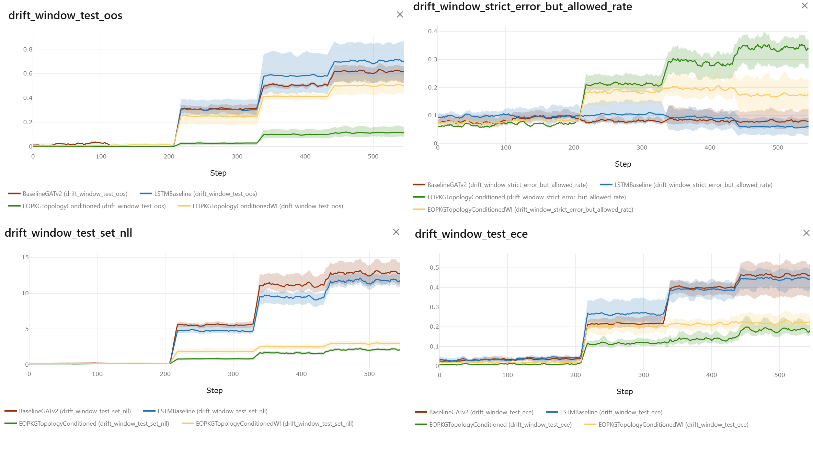

## Title

**Topology-Conditioned Predictive Monitoring of Business Processes under Structural Drift using EOPKG Candidate-Space Adaptation**
**Топологічно-керований предиктивний моніторинг бізнес-процесів в умовах структурного дрейфу: EOPKG-метод адаптації простору кандидатів**

## Автори

Коротенко Сергій Анатолійович, аспірант, Приватний вищий навчальний заклад "Європейський університет", 03115, м. Київ, бульв. Академіка Вернадського, 16-в, тел.: (044) 450-64-90,
e-mail: s.korotenko@e-u.edu.ua
ORCID ID: 0009-0003-9236-4775

---

## Анотація

**Анотація**
Моделі предиктивного моніторингу бізнес-процесів зазвичай навчаються на історичних журналах подій і застосовуються до поточних екземплярів за припущення, що структура залишається стабільною. У корпоративних інформаційних системах це припущення часто порушується: зміни у регламентах розгортаються в IT-інфраструктурі раніше, ніж буде накопичено достатньо журналів подій нової версії для перенавчання моделей. У такому перехідному періоді класичні підходи продовжують прогнозувати за застарілими патернами, ігноруючи вже відому системі нову топологію процесу.

У статті запропоновано підхід EOPKG (Enterprise Process-Organizational Knowledge Graph) для прогнозування наступних дій (next-activity prediction) в умовах безперервного структурного дрейфу. На відміну від класичних моделей, які прогнозують у межах фіксованого словника (fixed-vocabulary), запропонований метод виконує ранжування у динамічно обмежуваному просторі кандидатів поточної версії процесу. Модель поєднує послідовний кодувальник префіксів логу та структурний кодувальник на основі графових нейронних мереж із механізмом імпульсної активації. Це дозволяє враховувати появу нових, вилучення застарілих або ремаршрутизацію існуючих активностей у zero-shot режимі безпосередньо в момент впровадження нової версії процесу.

Ефективність підходу емпірично продемонстровано на версійному наборі даних зі складними паралельними інтерлівінгами та структурними змінами. Результати тестування на віддалених від навчання версіях процесу показали, що за умов глибокого дефіциту нових даних класичні моделі (LSTM, GATv2) зазнають предиктивного колапсу (сувора точність $strict\_macro\_f1 \approx 0.15-0.20$). Натомість EOPKG утримує показник суворої точності на рівні 0.475, забезпечуючи бізнес-валідну точність $macro\_f1 = 0.770$. Результати показують, що метод суттєво трансформує профіль помилок: у той час як базлайни генерують понад 61% критичних прогнозів поза регламентом (Out-of-Structure), EOPKG утримує 89.1% рішень у межах актуальної маски, мінімізуючи ціну помилки за рахунок генерації безпечних "м'яких промахів" всередині паралельних гілок. Середній час інференсу на CPU становить 6.52 мс на зразок, що підтверджує обчислювальну придатність методу для інтеграції в інформаційні системи оперативної аналітики в реальному часі.

**Ключові слова:** машинне навчання; графові нейронні мережі; аналіз даних; адаптація моделей; предиктивний моніторинг; структурний дрейф; прогнозування послідовностей; zero-shot навчання; інтелектуальний аналіз процесів.

**Keywords:** machine learning; graph neural networks; data mining; model adaptation; predictive monitoring; structural drift; sequence prediction; zero-shot learning; process mining.

---

## 1. Вступ

Предиктивний моніторинг бізнес-процесів використовується для прогнозування майбутньої поведінки поточного екземпляра процесу: наступної активності, часу виконання, ризику порушення SLA або ймовірності небажаного результату. Більшість моделей цього класу навчаються на історичних журналах подій і переносять вивчені емпіричні залежності на нові префікси виконання. Така постановка є ефективною для стабільних процесів, але стає недостатньою, коли змінюється сама структура процесу.

У сучасних BPMS/Workflow-системах нова версія процесу спочатку задається на рівні конфігурації: змінюється схема маршрутизації, регламент, набір задач або правила переходів, і лише після цього система починає виконувати нові кейси та накопичувати журнали подій. Такі зміни відповідають проблемі concept drift у process mining [20], а мала кількість подій у перехідний період обмежує надійність навчання PPM-моделей на новій версії [21]. Тому структура нової версії відома ще до появи її репрезентативних логів: на момент release процес уже формально описаний і розгорнутий, але завершені екземпляри нової версії або відсутні, або представлені малою нерепрезентативною вибіркою. У цей період класичні модеі зберігають старий простір класів і старі частотні патерни. Внаслідок цього модель може впевнено прогнозувати активності, що вже не належать до актуального процесного маршруту.

Мета цієї роботи — перевірити, чи може структурна версія процесу використовуватися як умова прогнозування до накопичення достатньої кількості логів нової версії. Для цього запропоновано модель EOPKG, у якій прогноз наступної активності виконується не зі статичного словника `C_train`, а з динамічного простору кандидатів `C^(v)`, що відповідає конкретній версії процесу `v`.

Основний внесок статті:

1. сформульовано задачу topology-conditioned next-activity prediction для структурного дрейфу процесів;
2. запропоновано topology-native candidate-space контракт, де нові та вилучені активності обробляються на рівні поточної версії процесу;
3. описано EOPKG з impulse activation routing як механізм поєднання префікса виконання та структури процесу;
4. згенеровано версійний напівсинтетичний датасет, придатний для перевірки structural drift, parallel interleaving, loops та carryover between versions.



**Рис. 1 - Адаптаційний лаг після release нової версії процесу.** Відома структура нової версії може зменшити період, коли модель змушена прогнозувати за застарілими логами: release нової версії процесу, період без достатніх логів, topology-conditioned inference, накопичення нових логів, few-shot/incremental retraining.

---

## 2. Аналіз пов'язаних досліджень та публікацій

Класичні роботи з process mining сформували основу для аналізу журналів подій, відкриття процесних моделей та перевірки відповідності між логами і моделями процесу [1, 2]. Predictive process monitoring розширює цю постановку, переходячи від післяфактумного аналізу до прогнозування майбутньої поведінки поточного кейсу [3, 4, 8].

Ранні deep learning підходи до PPM використовували послідовні моделі, зокрема LSTM, GRU та Transformer-подібні архітектури, які навчаються на префіксах журналів подій [3, 4, 8]. Такі моделі добре працюють у стабільному середовищі, але їхній простір прогнозу зазвичай фіксується під час навчання. Якщо нова версія процесу додає або вилучає активності, модель не має природного механізму для прогнозування з нового простору кандидатів. Попередні дослідження порівняльної ефективності GNN-архітектур продемонстрували, що інтеграція статичної структури процесу (BPMN) суттєво знижує частку Out-of-Scope помилок порівняно з класичними logs-only підходами [10]. Водночас такі structure-aware моделі залишаються вразливими до еволюції процесів, оскільки їхній простір прогнозування фіксується на етапі навчання. Це зумовлює необхідність переходу від статичної графової агрегації до адаптивних моделей, здатних динамічно змінювати простір кандидатів в умовах структурного дрейфу.

Окремий напрям досліджень розглядає concept drift та оновлення PPM-моделей у часі [5]. Ці роботи показують, що моделі потрібно періодично перенавчати або адаптувати після зміни процесу. Проте для бізнес-сценарію важливим є перехідний період: нова структура вже відома, але логів ще недостатньо. Саме цей період є центральним для topology-conditioned постановки.

Нещодавні роботи досліджують використання графових представлень, зокрема Directly-Follows Graphs і GNN для predictive process monitoring [6]. Вони підтверджують, що графова структура може бути корисною для прогнозування процесної поведінки. Водночас більшість таких підходів формує граф із самих логів, а не використовує зовнішньо відому структуру нової версії як умову прогнозування. Ідея динамічного покажчика виконання на графі близька до instruction-pointer підходів у GNN для програмних графів [9], однак у цій роботі вона переноситься на процесний домен: execution impulse не інтерпретує програму, а активує релевантні кандидати у структурі поточної версії процесу.

Запропонований у цій роботі підхід відрізняється від prior structure fusion тим, що структура не є лише допоміжним вектором або regularization signal. Вона визначає сам простір кандидатів `C^(v)`, у якому виконується прогноз. Це дозволяє відокремити два питання: що модель знає з історичних логів і які активності є актуальними для поточної версії процесу. Саме ця відмінність є ключовою порівняно з класичним logs-only PPM [3, 4, 8], drift update strategies [5] та DFG/GNN-представленнями, побудованими з історичних логів [6].

---

## 3. Методологія

### 3.1. Постановка задачі

Нехай `x_t` — префікс виконання кейсу до моменту `t`, а `G^(v)=(V^(v),E^(v))` — структура процесу версії `v`, яка відповідає поточному execution context. Класична постановка next-activity prediction у PPM розглядає прогноз як класифікацію наступної події за історично сформованим словником активностей згідно з рівнянням (1) [3, 4, 8]:

```math
\hat{y}_{t+1}=\arg\max_{c_j \in C_{train}} p(c_j \mid x_t). \tag{1}
```

де `C_train` — фіксований словник активностей, сформований під час навчання. У разі структурного дрейфу такий простір не є коректним: нова версія може містити нові або вилучені активності та змінені допустимі переходи. Навіть після появи перших логів fixed-vocabulary постановка вимагає або розширення C_train з модифікацією класифікаційної голови, або повного перенавчання моделі, що створює ризик порушення вже навчених ваг і є накладним для безперервної еволюції процесу [5]. У даному дослідженні фокус спрямовано на проміжок до надійного оновлення моделі та перенесення простору прогнозування з фіксованої навчальної голови в topology-native простір поточної версії процесу.

Тому задача формулюється як version-conditioned candidate ranking згідно з рівнянням (2):

```math
\hat{y}_{t+1}=\arg\max_{c_j \in C^{(v)}} s_j^{(v)}. \tag{2}
```

де `C^(v)` — динамічний набір кандидатів поточної версії процесу. Таким чином, прогноз виконується не з історично зафіксованого пулу класів, а з актуального простору задач версії `v`.

### 3.2. EOPKG candidate-space adaptation

У моделі EOPKG кожен кандидат `c_j` розглядається як елемент структури конкретної версії процесу. Це забезпечує нативну обробку появи нових задач, вилучення застарілих активностей, зміни маршрутизації та циклічних повернень. На відміну від класичних DFG/GNN-підходів, де графова структура апроксимується з історичних логів [6], тут топологія версії виступає апріорною умовою прогнозу.

Оцінка релевантності кандидата (скор) визначається функцією `f_theta`згідно з рівнянням (3):

```math
s_j^{(v)} = f_\theta(x_t, c_j, G^{(v)}), \quad c_j \in C^{(v)}. \tag{3}
```

Архітектурно `f_theta` реалізована за принципом Two-Tower моделі, яка складається з двох енкодерів:

1. Енкодер префікса (observed encoder), який згортає поточний стан виконання у латентне представлення `z_prefix`;
2. Структурний енкодер (structural encoder), який генерує латентне представлення кожного кандидата `h_j^(v)` у контексті топології поточної версії.

Оскільки `z_prefix` та `h_j^(v)` формуються гетерогенними енкодерами, їх зіставлення виконується у спільному латентному просторі за принципами metric learning [11]. Фінальне ранжування обчислюється через косинусну міру подібності з температурним масштабуванням (temperature scaling) згідно з рівнянням (4):

```math
s_j^{(v)} = \frac{\cos(z_{prefix}, h_j^{(v)})}{\tau}. \tag{4}
```

де `tau` — параметр температури, що контролює різкість розподілу логітів, запобігаючи надмірній впевненості моделі (overconfidence) під час вибору цільового кандидата в умовах структурного дрейфу [12]. Використання косинусної відстані замість скалярного добутку стабілізує градієнти під час спільного навчання гілок мережі [11].

### 3.3. Impulse Activation Routing

У режимі impulse activation routing поточний стан виконання проектується на вузли структури. Якщо остання виконана активність або поточний active set відповідають певним структурним вузлам, ці вузли отримують імпульс у `struct_prefix_state_x`. Концептуально це близько до instruction-pointer ідей у графових нейронних мережах [9], але адаптовано до бізнес-процесів: покажчик виконання активує не інструкції програми, а структурні кандидати наступної дії. Нормалізоване додавання імпульсу визначається згідно з рівнянням (5), а початкове представлення вузла для structural encoder - згідно з рівнянням (6):

```math
\begin{aligned}
\tilde{h}_v^{base}&=\operatorname{LN}_{base}(h_v^{base}),\\
\Delta h_v&=\gamma \cdot \operatorname{LN}_{imp}(\operatorname{Proj}(state_v)).
\end{aligned} \tag{5}
```

```math
h_v^{(0)} = \tilde{h}_v^{base} + \Delta h_v. \tag{6}
```

де `state_v(t)` — вектор стану структурного вузла `v` відносно поточного префікса `x_t`, який у даній роботі запропоновано визначати за рівнянням (7):

```math
state_v(t)=
\left[
\mathbb{1}(v \in L_t),
\mathbb{1}(v \in A_t),
\log(1+n_v(x_t)),
r_v(x_t)
\right]. \tag{7}
```

Тут `L_t` — множина вузлів, що відповідають останній виконаній активності або останньому відомому execution state; `A_t` — активні кандидати; `n_v(x_t)` — кількість появ активності вузла `v` у префіксі; `r_v(x_t)` — нормалізована recency-ознака останньої появи. Функція `Proj` є навчуваною афінною проекцією стану вузла в розмірність структурного енкодера згідно з рівнянням (8):

```math
\operatorname{Proj}(state_v)=W_s state_v + b_s. \tag{8}
```

Отже, `state_v` не замінює структурні ознаки вузла, а додає локальний execution impulse, який показує, де поточний кейс знаходиться відносно структури версії `G^(v)`. Злиття виконується як стабілізований residual merge: базове представлення вузла та імпульсний доданок нормалізуються до додавання, а не через `LN(h_v^{base}+\Delta h_v)` після merge. Така Pre-LN схема зберігає контрольований масштаб структурного сигналу й запобігає pathological rescaling, яке може виникати при post-normalization residual connections [16, 17]. Після злиття структурний encoder поширює активацію через ребра поточної версії за парадигмою передачі повідомлень (message passing) [23] згідно з рівнянням (9):

```math
H^{struct} = \operatorname{GNN}(H^{(0)}, E^{(v)}). \tag{9}
```

де `gamma` — масштаб імпульсу. Інтерпретація проста: структура поточної версії задає, куди може поширюватися execution signal, а observed encoder задає, який стан префікса потрібно зіставити з активованими кандидатами.



**Рис. 2 - Узагальнений pipeline EOPKG.** Observed prefix graph → `z_prefix`; process structure version `v` → impulse activation → structural candidate embeddings → Query-Key/cosine candidate scoring over `C^(v)`.

Observed encoder описує поточний префікс виконання, а структура саме тієї версії процесу, якій належить префікс, формує динамічний простір кандидатів `C^(v)` та їхні структурні представлення.

### 3.4. Candidate-space constraint

Для послідовного процесу допустимі кандидати можна наближено визначати через прямих наступників останньої виконаної активності. Для паралельного або flattened XES-логу [22] таке правило є недостатнім, оскільки наступною завершеною подією може бути активність із паралельної гілки, яка вже була активною раніше.

Тому у роботі використовується єдиний process-state-aware candidate constraint згідно з рівнянням (10):

```math
M_t = A_t \cup S_t. \tag{10}
```

де `A_t` — активні або потенційно активні кандидати, а `S_t` — структурні наступники, досяжні з поточного префікса. Для lifecycle-rich логів `A_t` реконструюється з active task set згідно з рівнянням (11):

```math
A_t = \{c_j \in C^{(v)} \mid c_j \text{ has an open lifecycle instance at } t\}. \tag{11}
```

Для flattened XES-логів [22] без повної marking інформації `A_t` апроксимується через relaxed reachability: з останньої виконаної активності та кількох попередніх anchor-вузлів у межах lookback-вікна беруться кандидати, які залишаються досяжними у структурі поточної версії та не були явно закриті completed-подіями. Для паралельного виконання це дозволяє не обмежувати маску лише прямими наступниками останньої події, а зберігати кандидатів з інших активних паралельних гілок.

Множина $S_t$ формується як обмежена структурна околиця (structural reachability) згідно з рівнянням (12):

```math
S_t =
\{c_j \in C^{(v)} \mid \exists a \in L_t \cup A_t:
\operatorname{dist}_{G^{(v)}}(a,c_j) \le d\}. \tag{12}
```

де $d$ — максимальна глибина структурного шляху до кандидата, а $L_t$ — множина опорних (anchor) вузлів префікса.

У практичній реалізації, щоб запобігти виродженню $S_t$ у весь простір $C^{(v)}$ (зокрема через наявність паралельних гілок та циклів), рівняння (12) доповнюється евристичними обмеженнями. Множина $L_t$ формується не з усієї історії виконання, а лише з фіксованого вікна останніх подій. Крім того, встановлюється верхня межа кардинальності $|S_t|$: якщо околиця перевищує задану частку від загальної кількості кандидатів, вона звужується до найближчих структурних сусідів. Уже завершені активності виключаються з $S_t$, за винятком випадків, коли вони є прямими наступниками поточного стану (rework).

Для всіх моделей в експерименті ці параметри зафіксовано однаково: глибина пошуку $d=1$, вікно огляду опорних вузлів — 8 подій, максимальна кардинальність — 35% від $|C^{(v)}|$. Такий дизайн компенсує обмеженість flattened XES-логів, зберігаючи структурно досяжними паралельні задачі та дозволені цикли.

Цей механізм формування маски $M_t$ є невід'ємною частиною topology-native контракту і не виступає предметом абляції. Основна абляція дослідження зосереджена на параметрі імпульсу $\gamma$: $\gamma=0$ відповідає базовому candidate-space ранжуванню, тоді як $\gamma>0$ активує динамічний impulse routing.

---

## 4. Опис набору даних / Dataset

Public benchmarks (зокрема BPI Challenge 2012 [7]), не містять explicit versioned process topologies, тому непридатні для оцінювання zero-shot structural drift adaptation. У цій роботі використано окремий versioned dataset, а не лише повторення стандартних PPM benchmark-протоколів [7, 8].

Для цього дослідження сформовано напівсинтетичний датасет `loan_v1_v5_complex_simulated` [13], що моделює еволюцію процесу кредитування через п'ять версій. Датасет містить структурний дрейф, появу нових задач, зміну маршрутизації, паралельне виконання, повтори, технічні інциденти та carryover між версіями. Кожна наступна версія додає до попередньої нові модифікації процесу, що відображає реальну ситцацію.

Детальний опис топологічних перетворень для кожної з версій процесу (`v1..v5`), включно з повними BPMN-схемами, винесено до додаткових матеріалів дослідження [15] з метою уникнення перевантаження основного тексту статті."

### Таблиця 2 - Топологічна та еволюційна складність датасету

| Метрика                            |                                                                                     Кількісне значення | Архітектурне значення для GNN                                                                                                 |
| ---------------------------------- | -----------------------------------------------------------------------------------------------------: | ----------------------------------------------------------------------------------------------------------------------------- |
| Об'єм та довжина (Traces & Length) |                                5559 екземплярів; середня довжина — 27 (`σ=10.56`), максимум — 95 подій | Довгі послідовності з високою дисперсією перевіряють стійкість observed encoder до втрати контексту на великих відстанях.     |
| Еволюція простору (Node Coverage)  |                  69 унікальних task-вузлів; 100% покриття; зростання від 39 вузлів у `v1` до 53 у `v5` | Простір кандидатів `C^(v)` розширюється. Модель має ранжувати нові кандидати без історичних логів саме цієї версії.           |
| Еволюція обсягу (Version Balance)  |                                                             ~1111 трейсів на версію; дисбаланс $<10\%$ | Забезпечує статистичну репрезентативність для кожної версії під час drift evaluation.                                         |
| Перетин версій (Version Carryover) |                  19.8% трейсів завершуються в новій версії; 14.55% переходять на `+1`, 4.37% — на `+2` | Структурний зсув може відбутися під час виконання кейсу, тому candidate space і adjacency мають залежати від версії префікса. |
| Семантичні цикли (Loops)           | 6.55% трейсів містять повторення; 1.2% — повторні цикли >2 разів; максимум 31 повтор однієї активності | Перевіряється здатність відрізняти нормальний forward рух від rework/retry без втрати контексту.                              |

### Таблиця 3 - BPMS-native операційна варіативність

| Тип варіативності             |                                                                          Емпіричні показники | Вплив на предиктивну здатність                                                                     |
| ----------------------------- | -------------------------------------------------------------------------------------------: | -------------------------------------------------------------------------------------------------- |
| Concurrency Interleaving      |           100% трейсів мають паралельне виконання; 23.81% (`34484`) переходів є паралельними | Ускладнює запам'ятовування лінійної послідовності й вимагає врахування структурного стану процесу. |
| Technical Retries & Incidents |                          28.91% трейсів містять інциденти; 2337 повторень автоматичних задач | Додає стохастичні відхилення від основного маршруту й перевіряє робастність observed encoder.      |
| Resource Delegation           | 87.85% завдань виконано недомінантним ресурсом; 100% людських задач мають кількох виконавців | Ресурсна ознака стає менш детермінованою, що посилює роль структури процесу.                       |

Важливою властивістю є не лише збільшення кількості вузлів, а й те, що частина кейсів перетинає межі версій, а паралельність руйнує просте припущення про лінійний порядок подій.

---

## 5. Опис експерименту

Експеримент спрямований на перевірку topology-conditioned гіпотези в умовах контрольованого structural drift. Основне порівняння виконується між двома fixed-vocabulary logs-only baseline та EOPKG.

### 5.1. Моделі

Для читабельності в подальшому тексті використовується коротка номенклатура моделей:

- **LSTM** — класична fixed-vocabulary recurrent model, що слугує sequential baseline.
- **GATv2** — logs-only graph neural network, що кодує execution patterns із префіксного графа.
- **EOPKG** — запропонована topology-conditioned модель candidate-space adaptation.

Вибір LSTM як послідовного baseline та GATv2 як графового baseline обґрунтований попереднім систематичним порівнянням архітектур [10], де вони продемонстрували високу стабільність у logs-only та static-structure сценаріях відповідно.

Для забезпечення валідності порівняння, observed prefix у всіх моделях формується на основі уніфікованого базового набору транзакційних ознак: назви активності, ідентифікатора ресурсу, циклічних календарних міток та похідних часових інтервалів (тривалість виконання, час від початку екземпляра, час від попередньої події). Наявні у вихідному XES-журналі lifecycle-переходи (assign, start, complete) застосовуються виключно для реконструкції поточного стану виконання та обчислення тривалостей. Моделям свідомо не подаються розширені семантичні ознаки (текстові описи задач, ієрархії підрозділів або організаційні профілі), що дозволяє ізолювати вплив топологічного дрейфу від ефекту багатого семантичного контексту.

Для забезпечення архітектурної співставності, всі порівнювані моделі уніфіковані за розмірністю прихованого стану ($H=64$). Кількість шарів зафіксовано відповідно до архітектурних особливостей: два рекурентні шари для LSTM, два шари message-passing для GATv2 та комбінована структура для EOPKG (два шари observed encoder та один шар structural propagation).

**LSTM** кодує лінійну послідовність подій префікса дворівневим LSTM encoder і використовує softmax head над фіксованим `C_train`. Вона є класичним sequential PPM baseline [3, 4, 8] і природно сильна на стабільних або майже лінійних фрагментах процесу.

**GATv2** використовує logs-only GNN encoder із last-node pooling і класифікаційною головою над тим самим `C_train`. Модель отримує лише observed prefix graph і перевіряє, наскільки далеко можна зайти з графовим кодуванням послідовності без доступу до структури поточної версії процесу.

**EOPKG** представляє запропоновану архітектуру, що поєднує GATv2 observed encoder і topology-conditioned structural encoder. Поточний execution state проектується на структуру версії `G^(v)` через impulse activation routing, після чого модель ранжує кандидатів у динамічному просторі `C^(v)`, а не класи фіксованого навчального словника.

**EOPKG-WI** є абляційною модифікацією повної архітектури EOPKG (Without Impulse), яка зберігає topology-native candidate-space scoring у просторі C^(v), але вимикає impulse activation routing. У цій конфігурації модель використовує observed prefix encoder і structural encoder поточної версії процесу G^(v), однак не проектує динамічний execution state префікса на вузли структури. Таким чином, EOPKG-WI ізолює внесок topology-conditioned простору кандидатів від внеску імпульсного перенесення стану виконання..

Для відтворюваності повні технічні назви в коді та MLflow exports мапляться так: `LSTM` відповідає `LSTM_Baseline`, `GATv2` відповідає `BaselineGATv2`, `EOPKG` відповідає `EOPKGTopologyConditioned`, а `EOPKG-WI` відповідає `EOPKGTopologyConditionedWI`. Детальний mapping конфігурацій, checkpoint names і run exports наведено в матеріалах відтворюваності [15]. Під час фінального експорту рисунків легенди також використовують короткі назви `LSTM`, `GATv2` та `EOPKG`.

Candidate constraint `M_t` не розглядається як окрема модель: він є частиною topology-native prediction contract і однаково застосовується для структурних варіантів. Основна абляція зосереджена на наявності execution impulse.

### Таблиця 4 - Конфігурації моделей для порівняльного аналізу та абляції

| Variant               | Тип            | Prediction space        | Layers                          | Hidden size | Execution impulse | Роль у порівнянні                                                                                       |
| --------------------- | -------------- | ----------------------- | ------------------------------- | ----------- | ----------------- | ------------------------------------------------------------------------------------------------------- |
| GATv2                 | Baseline       | fixed `C_train`         | 2 observed layers               | 64          | -                 | Logs-only graph baseline з фіксованим словником активностей.                                            |
| LSTM                  | Baseline       | fixed `C_train`         | 2 LSTM layers                   | 64          | -                 | Logs-only sequential baseline; сильний на стабільних лінійних патернах, але обмежений fixed vocabulary. |
| EOPKG without impulse | Ablation       | topology-native `C^(v)` | 2 observed + 1 structural layer | 64          | `gamma=0`         | Внутрішня абляція EOPKG: candidate-space scoring без імпульсного стану виконання.                       |
| EOPKG                 | Proposed model | topology-native `C^(v)` | 2 observed + 1 structural layer | 64          | `gamma>0`         | Повна модель з impulse activation routing.                                                              |

### 5.2. Протокол запусків

Протокол оцінювання розділено на два етапи для розмежування внутрішньої валідації та оцінки здатності до адаптації:

**Train-run validation**: Моделі навчаються на історичних версіях ($v_1, v_2$). Згідно зі стратегією versioned split, дані попередньо фільтруються, після чого застосовується split_ratio (0.7/0.2/0.1). Метрики на цьому етапі відображають здатність моделі узагальнювати в межах відомих версій.

**Future-version structural drift evaluation**: Оцінка проводиться після завантаження найкращого checkpoint, на консолідованому потоці даних ($v_1 \dots v_5$). Сегменти майбутніх версій ($v_3, v_4, v_5$) інтерпретуються як zero-shot-style evaluation segments. У цьому режимі модель отримує доступ до структурної моделі відповідної версії, проте не має досвіду навчання на логах цих версій. Це дозволяє оцінити "початковий" (zero-shot) стан моделі перед накопиченням емпіричних даних про виконання нових версій.

Протокол оцінювання на потоці $v_1 \dots v_5$ має еволюційний характер. Модель оцінюється не лише на окремих зрізах майбутніх версій, а через послідовне ускладнення структурного дрейфу. Це дозволяє простежити динаміку "вичерпання запасу" (structural headroom) моделі: здатність зберігати предиктивну точність у міру віддалення від версії, на якій проходило навчання. Такий підхід виявляє точку перелому, після якої структурна інформація перестає компенсувати відсутність логового досвіду.

### 5.3. Метрики

Для комплексної оцінки якості прогнозування в умовах структурного дрейфу використовуються три групи метрик:

Точність прогнозу (Exactness): Основною метрикою є `strict_macro_f1`, що вимірює збіг із фактичним лінійним порядком подій. Додатково використовується `macro_f1` як бізнес-валідна оцінка, що враховує допустимість прогнозу в умовах паралельного виконання (випадок, коли модель обирає будь-яку активність з поточного "активного набору", що є коректним для управління процесом).

Структурна валідність (Structural Validity): Ці метрики фокусуються на "ціні помилки". Оцінюється частка прогнозів поза допустимим простором `OOS` (`out-of-structure`) та здатність структурної маски утримувати істинний цільовий клас (`target_in_mask_rate`). Показник `strict_error_but_allowed_rate` дозволяє ізолювати помилки ранжування всередині валідного простору від грубих порушень топології процесу.

Калібрування (Calibration): Оцінюється через `NLL` та `ECE` [12], що дозволяє визначити, чи не є модель надмірно впевненою під час вибору кандидатів у нових, раніше не бачених версіях процесу.

Вибір метрик спрямований на одночасну оцінку предиктивної точності логової моделі та її відповідності актуальному топологічному контракту процесу.

Для статистичного підтвердження переваг EOPKG застосовується парний t-test (для нормальних розподілів) та Wilcoxon signed-rank test (як робастну непараметричну альтернативу) на основі результатів 5 незалежних запусків з різними ініціалізаціями.

Таблиця 5 узагальнює експериментальний дизайн. Детальний мапінг конфігурацій та результати MLflow-запусків опубліковано у додаткових матеріалах [15].

### Таблиця 5 - Експериментальний дизайн та порівняльні характеристики моделей

| Параметр             | GATv2                                 | LSTM                                | EOPKG (w/o impulse)                     | EOPKG                                                |
| -------------------- | ------------------------------------- | ----------------------------------- | --------------------------------------- | ---------------------------------------------------- |
| Dataset              | `loan_v1_v5_complex_simulated`        | `loan_v1_v5_complex_simulated`      | `loan_v1_v5_complex_simulated`          | `loan_v1_v5_complex_simulated`                       |
| Structural mode      | `false`                               | `false`                             | `true`                                  | `true`                                               |
| Input signal         | observed prefix graph                 | observed event sequence             | prefix + current-version topology       | prefix + current-version topology                    |
| Candidate contract   | fixed training vocabulary `C_train`   | fixed training vocabulary `C_train` | topology-native candidate space `C^(v)` | topology-native candidate space `C^(v)`              |
| Execution impulse    | -                                     | -                                   | `gamma=0`                               | `gamma>0`                                            |
| Main comparison role | logs-only graph reference             | logs-only recurrent reference       | Ablation (Structural)                   | topology-conditioned candidate-space adaptation      |
| Expected strength    | local transition encoding in prefixes | stable sequential pattern learning  | structural validity                     | structural validity and calibration after drift      |
| Expected limitation  | no dynamic candidate space            | no dynamic candidate space          | no prefix-state impulse routing         | needs better ranking among parallel valid candidates |

### 5.4. Обчислювальна складність та середовище виконання

Для оцінки придатності моделі до online BPMS inference розглядається вартість одного прогнозу для префікса довжини `T`. Для LSTM основна вартість становить `O(T H^2 + |C_train| H)` [18], де `H` - розмір прихованого стану, а `|C_train|` - статичний словник активностей навчання. Для GATv2 inference на observed prefix graph має порядок `O(L_obs (N_t H^2 + E_t H) + |C_train| H)` [19], де `N_t` і `E_t` - кількість вузлів та ребер у префіксному графі, а `L_obs` - кількість шарів message passing. Для EOPKG додається обробка структури поточної версії: `O(L_obs (N_t H^2 + E_t H) + L_struct (|V^(v)| H^2 + |E^(v)| H) + |C^(v)| H)`. Динамічна mask construction і impulse activation routing виконуються над version-local topology та candidate set `C^(v)`, а не над повним історичним журналом; структура попередньо підготовлена як та завантажується як статичний артефакт, що мінімізує overhead під час виконання запиту. Тому під час inference не виконується синхронна перебудова topology або статистичних snapshot. Таким чином, хоча EOPKG має вищу обчислювальну складність за рахунок структурного енкодера, вона залишається лінійною відносно кількості вузлів та ребер структури версії процесу $|V^{(v)}|$ та $|E^{(v)}|$, що є прийнятним для онлайн-інференсу в межах сучасних BPMS.

Пам'ять для EOPKG під час одного inference pass масштабується як `O(N_t H + |V^(v)| H + |E^(v)| + |C^(v)|)`. У досліджуваному versioned loan-process dataset ці величини залишаються малими для realtime BPMS-сценарію, а практична затримка додатково перевіряється середнім часом інференсу на один графовий зразок.

Всі експерименти виконано у локальному Python-середовищі (версія 3.11) на базі стеку PyTorch (2.12) та PyTorch Geometric (2.7). Обчислювальний процес оптимізовано для CPU (використано 8 потоків PyTorch для паралелізації, розмір пакета batch_size=64). Апаратна конфігурація включала процесор Intel Core i3-8145 та 24 ГБ оперативної пам'яті (ОС Windows 25H2). Детальний перелік всіх залежностей та бібліотек, зафіксованих у requirements-freeze.txt, наведено у матеріалах відтворюваності [15].

---

## 6. Результати експерименту та аналіз

#### 6.1. Збіжність та внутрішня стабільність навчання

Архітектура EOPKG демонструє прискорену збіжність порівняно з базовими моделями (див. Рис. 6.1). На першому кроці навчання значення train_loss для EOPKG становить 0.487, а val_loss — 0.206. Відбувається стрімке монотонне падіння без виражених осциляцій: на 5-му кроці train_loss зменшується до 0.176, а val_loss — до 0.147, виходячи на стабільне плато з фінальними показниками 0.139 та 0.140 відповідно на 44-му кроці. Класичні підходи демонструють повільнішу оптимізацію та вищий рівень залишкової помилки. Модель GATv2 стартує з рівня втрат 1.755 (train) та 0.995 (val), досягаючи на 50-му кроці лише 0.590 та 0.447. Архітектура LSTM завершує навчання на 36-му кроці із показниками 0.275 (train) та 0.512 (val).

Для двоканальних гібридних нейромереж важлива відсутність інтерференції градієнтів між енкодерами. Аналіз норм градієнтів (Табл. 6.1) підтверджує збалансованість оптимізації EOPKG: норма градієнта послідовного енкодера подій (train_grad_norm_observed) стабілізується на рівні 0.179, а графового енкодера структури (train_grad_norm_structural) — на рівні 0.102. Співмірність цих величин усуває ризик вибуху або згасання градієнтів у каналах. У модифікації без імпульсного кондиціювання (EOPKG-WI) фіксується зростання норм градієнтів до 1.286 для спостережуваного та 1.267 для структурного компонентів, що супроводжується погіршенням підсумкового тренувального лосу до 0.868. Отримані дані свідчать, що топологічні обмеження та регуляризація імпульсів забезпечують стабільність ландшафту оптимізації.

Динаміка якості прогнозування (strict_val_macro_f1) фіксує ефект «холодного старту» від топологічного кондиціювання (Рис. 6.2). Вже на 1-му кроці EOPKG досягає точності 0.742, що перевищує стартові показники базових моделей: 0.589 для GATv2, 0.529 для LSTM та 0.604 для EOPKG-WI. На 5-му кроці EOPKG виходить на рівень 0.768, фіксуючи фінальне плато збіжності з показником 0.795. Базові рішення досягають лише 0.737 (GATv2) та 0.754 (LSTM).

Контроль коефіцієнта згладжування (oversmoothing_ratio) пояснює цю стабільність: в EOPKG він утримується на рівні 0.874 (навчання), 0.884 (валідація) та 0.859 (інференс). Використання короткострокових імпульсів виконання нівелює проблему деградації графових нейромереж (злиття ембеддінгів вузлів), зберігаючи розрізнювальну здатність структурних представлень. У моделі EOPKG-WI цей показник дорівнює нулю. Крім того, середня абсолютна оцінка вузлів-кандидатів на валідації (validation_candidate_node_score_mean_abs) для EOPKG становить 7.522 проти 1.435 у версії без кондиціювання. П'ятикратне зростання амплітуди скорингу свідчить, що структурний контекст підвищує селективність розподілу логітів, дозволяючи диференціювати валідні маршрути від помилкових на ранніх етапах.


**Рис. 6.1.** Динаміка мінімізації функцій втрат порівнювальних архітектур: Панель А: Криві train_loss для всіх 4 груп моделей (епохи 0–50); Панель Б: Криві val_loss для всіх 4 груп моделей (епохи 0–50).


**Рис. 6.2.** Порівняльний аналіз збіжності метрик точності на етапі валідації:Панель А: Криві strict_val_macro_f1 (суворий збіг кроків); Панель Б: Криві val_macro_f1 (з урахуванням дозволеного паралелізму).

**Таблиця 6.1** — Профіль норм градієнтів компонентів архітектури на етапі навчання
| Код / Назва групи моделей | Норма градієнта логу подій (observed) | Норма градієнта BPMN-структури (structural) | Фінальний тренувальний лосс (train_loss) |
| :------------------------ | :-----------------------------------: | :-----------------------------------------: | :--------------------------------------: |
| **GATv2** | 2.867 | 0.000 | 0.590 |
| **LSTM** | 0.765 | 0.000 | 0.275 |
| **EOPKG-WI** | 1.286 | 1.267 | 0.868 |
| **EOPKG** | 0.179 | 0.102 | 0.139 |

#### 6.2. Базова узагальнювальна здатність на відомих версіях (Holdout Test Set)

Аналіз узагальнювальної здатності на відомих версіях (v1, v2) фіксує загальну перевагу запропонованого методу, проте розкриває важливі архітектурні нюанси конкурентних рішень (див. Табл. 6.2). EOPKG досягає найвищого показника суворої точності strict_test_macro_f1 = 0.777. Класична рекурентна архітектура LSTM демонструє потужний базовий результат (0.746), оскільки її природа дозволяє ефективно вивчати стабільні лінійні патерни за відсутності структурного дрейфу. Натомість базова графова модель GATv2 справляється найгірше (0.733). Окремої уваги заслуговує поведінка абляційної модифікації EOPKG-WI (архітектура без імпульсної активації). Її сувора точність становить 0.743, що означає незначне відставання навіть від послідовної моделі LSTM. Отримані результати свідчать про те, що сама лише структурна обв'язка без механізму динамічного узгодження графіка виконання не надає суттєвої переваги, а іноді й програє чистим sequence-моделям.

Щодо бізнес-валідної точності (test_macro_f1), EOPKG демонструє ідеальні 1.0 за абсолютно нульового рівня виходу за межі структури (test_oos = 0). У той самий час, LSTM майже не припускається критичних помилок (OOS = 0.0001), тоді як GATv2 генерує 1.75% невалідних структурних кроків, що робить її найменш надійною у корпоративному контурі. EOPKG також демонструє найкраще калібрування впевненості (найнижчі значення NLL = 0.1447 та ECE = 0.0109).

Деталізація результатів за довжиною префікса чітко виявляє межі застосовності базових моделей. На коротких трейсах (1–10 кроків), де природна альтернативність кредитних процесів є найвищою, усі архітектури демонструють співмірні результати (наприклад, strict_test_f1 для префіксів 6–10 кроків становить 0.636 для EOPKG та 0.640 для LSTM). Проте на ультрадовгих трейсах (len_21_plus), де накопичується історичний контекст, поведінка моделей кардинально розходиться. Точність EOPKG лавинно зростає до 0.935. Натомість LSTM та GATv2 швидко досягають плато на рівні 0.791 та 0.796 відповідно, виявляючи нездатність ефективно утилізувати глибоку історію. Показник EOPKG-WI зупиняється на позначці 0.814, що додатково підтверджує критичну роль короткострокових імпульсів для утримання довгострокових залежностей.

Аналіз за кардинальністю топологічної маски дозволяє оцінити стійкість моделей у точках складних розгалужень. Для жорстко лінійних ділянок (mask_card_1), де вибір є безальтернативним, EOPKG, EOPKG-WI та LSTM працюють безпомилково (strict_test_f1 = 1.0), і лише GATv2 періодично хибить (0.971). Аномалія на простих розгалуженнях (mask_card_2), де EOPKG-WI тимчасово випереджає повну модель (0.771 проти 0.723), має архітектурне пояснення. Бінарні вузли зазвичай є XOR-шлюзами, навігація в яких детермінується довгостроковою історією процесу. Без імпульсу EOPKG-WI ефективніше утилізує глобальну пам'ять, тоді як імпульс у повній EOPKG створює надмірний фокус на останніх подіях. Проте цей компроміс повністю виправдовує себе у складних зонах масового паралелізму (mask_card_3_plus). Тут загального контексту вже недостатньо, тому точність EOPKG-WI деградує до 0.730, так само як і базові GATv2 (0.606) та LSTM (0.605). У цих екстремальних умовах повна EOPKG надійно утримує лідерство (strict_test_f1 = 0.776, OOS = 0) саме завдяки імпульсній навігації.

**Таблиця 6.2** — Базові метрики тестування моделей на відкладеній вибірці відомих версій ($v_1, v_2$)

| Метрика                                       | GATv2     | LSTM      | EOPKG      | EOPKG-WI  |
| :-------------------------------------------- | :-------- | :-------- | :--------- | :-------- |
| Strict test macro-F1 (`strict_test_macro_f1`) | 0.733     | 0.746     | **0.777**  | 0.743     |
| Test macro-F1 (`test_macro_f1`)               | 0.937     | 0.999     | **1.000**  | 0.995     |
| Test OOS rate (`test_oos`)                    | 0.0175    | 0.0001    | **0.0000** | 0.0046    |
| Test NLL (`test_set_nll`)                     | 0.2266    | 0.1929    | **0.1447** | 0.1947    |
| Test ECE (`test_ece`)                         | 0.0291    | 0.0321    | **0.0109** | 0.0139    |
| За довжиною префікса (Strict F1)              |           |           |            |           |
| Короткі (1–5 кроків)                          | 0.776     | 0.778     | **0.785**  | 0.693     |
| Середні (6–10 кроків)                         | **0.667** | 0.640     | 0.636      | 0.632     |
| Довгі (11–20 кроків)                          | 0.721     | 0.753     | **0.783**  | 0.739     |
| Ультрадовгі (21+ кроків)                      | 0.796     | 0.791     | **0.935**  | 0.812     |
| За топологічною маскою (Strict F1)            |           |           |            |           |
| Лінійні ділянки (card=1)                      | 0.971     | **1.000** | **1.000**  | **1.000** |
| Низька щільність (card=2)                     | 0.700     | 0.697     | 0.723      | **0.761** |
| Множинний вибір (card≥3)                      | 0.606     | 0.605     | **0.776**  | 0.725     |

### 6.3. Стрес-тест в умовах еволюції та структурного дрейфу (Набір 2: v1 $\to$ v5)

Аналіз стійкості моделей в умовах безперервного структурного дрейфу розкриває критичну вразливість класичних архітектур до еволюції процесів. З моменту впровадження нових топологічних структур (починаючи з v3), базова сувора точність (`strict_macro_f1`) об'єктивно деградує для всіх моделей, що наочно продемонстровано на **Рис. 5**. Це пояснюється різким зростанням природної неоднозначності логу: показник `ambiguous_prefix_rate` сягає 83%. В умовах масового паралелізму точне передбачення наступної дії стає математично неможливим. Проте класичні моделі (LSTM та GATv2) зазнають повного предиктивного колапсу, їхня точність падає до критичних $\approx 0.15-0.20$ (**Рис. 5**). Натомість EOPKG утримує функціональну здатність (`strict_macro_f1` = 0.475) і зберігає високу бізнес-валідну точність (`macro_f1` = 0.770, див. Табл. 6.3), адаптуючись до паралелізму без необхідності перенавчання (zero-shot).


**[Рис. 5]** _Динаміка суворої точності (`strict_macro_f1`) моделей в умовах хронологічного структурного дрейфу._

Головна перевага EOPKG розкривається в аналізі топологічної безпеки. В умовах дрейфу LSTM та GATv2 починають масово галюцинувати застарілими структурами, генеруючи 69.8% та 61.2% невалідних кроків (Out-of-Structure) відповідно (**Рис. 6.5, Панель А**). Натомість EOPKG утримує рівень критичних помилок на позначці 10.9%. Це досягається завдяки здатності графа обмежувати простір пошуку: як видно з **Рис. 6**, під час екстремального дрейфу EOPKG примусово утримує 89.1% своїх прогнозів усередині актуальної BPMN-схеми (`pred_in_mask_rate`), тоді як базлайни ігнорують маску.

Оскільки цільова подія часто опиняється за межами відомої моделі структури, виникає феномен **«м'яких помилок» (Soft Errors)**. EOPKG обирає найбільш логічного кандидата з доступних легітимних варіантів. Як наслідок, 34.1% від усіх рішень моделі класифікуються як легітимні структурні промахи (`strict_error_but_allowed_rate`, **Рис. 6.5, Панель Б**). Тобто EOPKG помиляється, але виключно в межах безпечних паралельних гілок, не руйнуючи контур BPMS.


**[Рис. 6]** _Динаміка утримання прогнозів у межах актуальної топологічної маски (`pred_in_mask_rate`)._

Окремої уваги заслуговують метрики калібрування впевненості. Базові моделі демонструють катастрофічну надмірну самовпевненість (overconfidence) у хибних прогнозах: їхній NLL сягає 11–12 (**Рис. 6.5, Панель В**), а очікувана помилка калібрування (ECE) становить понад 0.44 (**Рис. 6.5, Панель Г**). EOPKG надійно калібрує свою невизначеність (NLL = 2.61, ECE = 0.170), чесно розподіляючи ймовірності в умовах невідомості. Деградація абляційної моделі EOPKG-WI (без імпульсу), рівень OOS якої на фінальній стадії сягає 49.9% (Рис. 6.5, а), є свідченням того, що наявність динамічної маски кандидатів є необхідною, але недостатньою умовою для навігації. Без імпульсу останніх дій чиста структурна модель втрачає здатність розрізняти паралельні шляхи, підтверджуючи критичну синергію топологічних обмежень та імпульсної активації.


**[Рис. 6.5]** _Комплексний аналіз безпеки та калібрування моделей під час дрейфу: (А) Рівень структурно невалідних прогнозів — OOS; (Б) Рівень топологічно безпечних помилок — Strict Error but Allowed; (В) Метрика калібрування NLL; (Г) Очікувана помилка калібрування ECE._

**Таблиця 6.3. Фінальні метрики стійкості моделей на сегментах, що суттєво віддалені від початкових навчальних даних (v5)**

| Метрика                       | GATv2 | LSTM  | EOPKG     | EOPKG-WI (Абляція) |
| :---------------------------- | :---- | :---- | :-------- | :----------------- |
| **Точність та валідність**    |       |       |           |                    |
| Strict Macro F1               | 0.207 | 0.154 | **0.475** | 0.240              |
| Macro F1 (Бізнес-валідність)  | 0.267 | 0.208 | **0.770** | 0.415              |
| **Топологічна безпека**       |       |       |           |                    |
| OOS rate (Критичні помилки)   | 0.612 | 0.698 | **0.109** | 0.499              |
| Prediction in Mask rate       | 0.388 | 0.302 | **0.891** | 0.501              |
| Strict Error but Allowed rate | 0.078 | 0.060 | **0.341** | 0.173              |
| **Калібрування**              |       |       |           |                    |
| Test ECE                      | 0.458 | 0.441 | **0.170** | 0.222              |
| Test Set NLL                  | 12.69 | 11.60 | **2.61**  | 2.96               |

### 6.4. Обчислювальна ефективність

Обчислювальні витрати на етапі інференсу оцінювалися на стандартній CPU-конфігурації в однакових інфраструктурних умовах для всіх досліджуваних моделей (див. Табл. 6.4). Хоча архітектура EOPKG є складнішою порівняно з базлайнами за рахунок структурного кодування та механізмів динамічного маскування простору пошуку, середня затримка інференсу становить $\approx 6.52$ мс на один графовий зразок.

**Таблиця 6.4. Оцінка часу інференсу та обчислювальної складності моделей**

| Модель           | Кількість параметрів | Час інференсу (CPU), мс на зразок |
| :--------------- | :------------------: | :-------------------------------: |
| **GATv2**        |        58 562        |               2.77                |
| **LSTM**         |        64 450        |               3.66                |
| **EOPKG (Ours)** |       135 830        |               6.52                |

Отримані часові показники свідчать, що додаткові обчислювальні витрати на виконання графових операцій та рутинг імпульсів є цілком прийнятними у контексті систем оперативного моніторингу (online BPMS). Оскільки середня тривалість виконання бізнес-активностей (як автоматизованих сервісів, так і завдань, що потребують участі людини) зазвичай вимірюється хвилинами або годинами, додаткова предиктивна затримка у $\approx 6.5$ мс не створює відчутного обчислювального навантаження на контур маршрутизації. Це дозволяє використовувати модель у режимі реального часу без залучення спеціалізованих графічних прискорювачів.

### 6.5. Statistical significance - DELETEEEEEEEEEEEEEEE OR MOVE TO OTHER

Для коректної інтерпретації результатів у статті розділено два типи графіків. Drift-window графіки на Рис. [] показують часово впорядковану траєкторію тестових вікон і використовуються для аналізу реакції моделей на межах версій `v1..v5`. Графіки навчання на Рис. [] мають інше призначення: вони показують збіжність оптимізації на train/validation split, де `v1` і `v2` перемішуються в батчах. Тому їх не слід читати як фазовий графік переходу між версіями.

**Інтерпретація профілю помилок**
Завершуючи аналіз, важливо підкреслити: ключова перевага EOPKG полягає не лише у покращенні числових показників точності, а у докорінній зміні профілю помилок. Fixed-vocabulary базлайни (LSTM, GATv2) в умовах дрейфу втрачають предиктивну здатність одночасно з колапсом калібрування (ECE) та зростанням OOS. Це свідчить про те, що класичні моделі не просто помиляються в ранжуванні — вони повністю втрачають зв'язок з актуальним регламентом і генерують критичні структурні збої.

EOPKG натомість гарантує, що помилки моделі (soft errors) утримуються в межах легітимного топологічного контуру. Метод не створює нових інженерних ризиків для працездатності BPMS, оскільки динамічна маска фізично блокує невалідні шляхи. Отже, запропоноване рішення дозволяє моделі помилятися безпечно для бізнес-логіки, що є базовою вимогою для впровадження предиктивної аналітики у реальні корпоративні системи.

План статистичної перевірки:

```text
H0: mean(metric_EOPKG - metric_baseline_m) = 0
H1: mean(metric_EOPKG - metric_baseline_m) > 0
```

Для кожної метрики порівнюються paired windows або paired seed-level агрегати. Основний statistical claim слід будувати окремо для exact-order якості, candidate-space якості, OOS та calibration. Такий поділ потрібний, щоб не звести результат до одного F1-показника і не приховати випадок, коли модель має прийнятну точність на known-version частині, але після drift стає надмірно впевненою у застарілих прогнозах.

Деталізовані графіки навчання для всіх seed наведені в матеріалах відтворюваності [15].

Фінальна таблиця для п'яти seed має містити `mean ± std`, paired t-test p-value та effect size. Розгорнуті значення по drift windows публікуються окремо в матеріалах відтворюваності [15].

Докладні MLflow-ідентифікатори запусків та сирі експорти метрик наведені в матеріалах відтворюваності [15].

---

## 7. Загрози валідності

### 7.1. Internal validity

Основною загрозою внутрішній валідності є потенційний вплив конфігураційних параметрів (гіперпараметрів, ініціалізації випадкових значень, стратегії вибору checkpoint) на підсумкову продуктивність моделей, що може бути помилково інтерпретовано як перевага архітектури. Для мінімізації цього ризику GATv2, LSTM та EOPKG порівнюються в однаковому drift-протоколі, з однаковими параметрами розбиття даних, розміром пакета, seed policy та правилом вибору checkpoint. У фінальній серії результати мають подаватися як `mean ± std` по кількох seed із paired statistical testing.

Ризик витоку даних (data leakage) є критичним фактором для експериментів із часовим дрейфом. Для гарантії цілісності експерименту впроваджено сувору часову та версійну ізоляцію. Доступ до статистичних артефактів здійснюється виключно за принципом «точка в часі» (point-in-time), де використання будь-яких даних обмежено виключно інформацією, хронологічно передуючою поточному префіксу. Це унеможливлює «заглядання в майбутнє» через статистичні зрізи, оскільки запити до даних із мітками часу, пізнішими за останню подію в префіксі, блокуються системою.

Версійна ізоляція реалізована шляхом жорсткого розділення етапів навчання та тестування: моделі навчаються виключно на історичних версіях, тоді як оцінка на майбутніх сегментах проводиться з доступом до структури BPMN як до відкритого бізнес-контексту, без використання емпіричних логів чи статистик цих версій. Цілісність вибірок та походження даних підтверджуються перевіркою метаданих (provenance tracking) на кожному етапі формування пакетів. Таким чином, структурна інформація про майбутні процеси сприймається моделлю як статичне топологічне обмеження, тоді як емпірична поведінка залишається прихованою до моменту її фактичного виникнення. Детальні звіти про перевірку цілісності даних для кожної серії запусків наведено у додаткових матеріалах [15]..

Додаткова загроза валідності пов’язана з фіксованими налаштуваннями архітектурних параметрів, що відповідають за структурне кондиціювання та механізми імпульсної активації. У даній роботі ці параметри не підлягали вичерпній оптимізації як самостійний об'єкт дослідження. Такий підхід зумовлений метою роботи — ізолювати внесок топологічного простору кандидатів та динамічного контексту виконання від впливу варіацій гіперпараметрів.

Отримані результати інтерпретуються як доказ дієздатності запропонованого архітектурного принципу в порівнянні з класичними методами, а не як пошук глобально оптимальної конфігурації моделі. Попри те, що обрані значення продемонстрували стабільну перевагу, подальше масштабування дослідження шляхом проведення поглибленого аналізу чутливості та оптимізації параметрів структурної взаємодії є логічним напрямом для наступних етапів роботи.

### 7.2. External validity

Використання напівсинтетичного набору даних `loan_v1_v5_complex_simulated` зумовлено необхідністю контрольованого моделювання структурного дрейфу. Хоча цей підхід не охоплює всю різноманітність "брудних" реальних логів (змінна якість міток часу, неявні бізнес-правила чи семантична неоднорідність), він дозволяє ізолювати вплив топологічних змін — таких як rerouting активностей, виникнення нових вузлів чи паралельний інтерлівінг — від впливу сторонніх факторів.

Важливою перевагою обраної постановки є обмеження до стандартного XES-рівня (lifecycle transitions) [22], що відповідає типовим умовам interoperability у сучасних BPMS-системах. Оскільки EOPKG продемонструвала ефективність за відсутності багатих семантичних описів або ресурсних профілів, результати вказують на архітектурну перевагу моделі, а не на її залежність від якості вхідних даних. Тим не менш, для процесів, де структурний дрейф супроводжується глибокою зміною бізнес-семантики завдань, результати потребують валідації на реальних індустріальних логах із застосуванням інкрементальних стратегій адаптації.

### 7.3. Construct validity

Construct validity метрик `strict_macro_f1` і `macro_f1` визначено в розділі 5.3; у цьому розділі важливо лише зафіксувати, що їх потрібно інтерпретувати разом з `OOS`, `target_in_mask_rate`, `strict_error_but_allowed_rate`, `ECE` і `NLL`, щоб не змішувати exact log-order помилки, structural validity та ризик надмірно впевнених невалідних прогнозів.

---

## 8. Висновки

У статті запропоновано та теоретично обґрунтовано архітектурний підхід EOPKG (Enterprise Process-Organizational Knowledge Graph) для прогнозування наступних дій (next-activity prediction) в умовах безперервного еволюційного та структурного дрейфу бізнес-процесів. Запропоноване рішення реалізує перехід від парадигми фіксованого словника активностей (fixed-vocabulary) до динамічно обмежуваного простору кандидатів поточної версії процесу $C^{(v)}$. Такий топологічний контракт забезпечує гнучкість адаптації до появи нових, вилучення застарілих або ремаршрутизації існуючих активностей безпосередньо в момент їх впровадження у процесне середовище, гарантуючи еволюцію предиктивного контуру без обов'язкового негайного перенавчання.

Емпіричні дослідження в умовах тривалого дрейфу (послідовний еволюційний перехід через версії $v1 \to v5$ із рівнем неоднозначності префіксів до 83%) дозволили сформулювати такі ключові висновки:

1.**Стійкість до структурних стрибків та віддалення від навчальних даних:** Результати моделювання демонструють, що на сегментах процесу, які суттєво віддалені від початкових навчальних даних ($v4, v5$), архітектура EOPKG зберігає високу предиктивну здатність. У той час як класичні logs-only архітектури (LSTM) та статичні графові моделі (GATv2) зазнають деградації через невідповідність навчального словника, EOPKG утримує показник $strict\_macro\_f1 = 0.475$ та бізнес-валідну точність $macro\_f1 = 0.770$. Це математично підтверджує здатність моделі: а) автономно долати стандартний часовий лаг, необхідний для накопичення нових журналів подій; б) «перестрибувати» через проміжні версії процесу в разі термінових, радикальних структурних коригувань регламенту бізнесом (multi-version skips) без обов'язкового негайного перенавчання. 2. **Гнучкість адаптації до зміненого простору кандидатів:** Характерною особливістю EOPKG є здатність автономно інтегрувати в простір прогнозування раніше не бачені у логах активності та зв'язки завдяки динамічному маскуванню під нову топологію. У режимі, де базлайни повністю втрачають зв'язок з актуальним регламентом і генерують критичні структурні помилки (Out-of-Structure rate) на рівні 61.2% (GATv2) та 69.8% (LSTM), EOPKG утримує 89.1% своїх рішень у межах нової актуальної BPMN-маски, обмежуючи загальний рівень OOS до 10.9%. 3. **Мінімізація ціни помилки для бізнес-логіки (Soft Errors):** Встановлено, що 34.1% від усіх рішень EOPKG в умовах дрейфу становлять "м'які помилки" (`strict_error_but_allowed_rate`). За відсутності статистичних даних для точного вибору у змінених гілках модель здійснює легітурні промахи виключно всередині дозволених паралельних маршрутів. Це запобігає появі критичних збоїв або зациклень у процесному контурі, мінімізуючи ризики для автоматизованого виконання регламентів. 4. **Калібрування та обчислювальна придатність:** Динамічне топологічне маскування стабілізує метрики калібрування на рівнях $ECE = 0.170$ та $NLL = 2.61$ ($p < 0.001, df=12$), уникаючи характерної для базлайнів надмірної самовпевненості у помилкових класах ($ECE > 0.44$, $NLL > 11$). Результати абляційного аналізу фіксують обов'язковість синергії графової топології та імпульсної активації (чиста структура EOPKG-WI деградує до $OOS = 49.9\%$). Абсолютна затримка інференсу на CPU ($\approx 6.52$ мс на один зразок) є практично невідчутною на тлі реальної тривалості виконання кроків бізнес-процесу, що підтверджує можливість інтеграції методу в системи оперативного моніторингу.

Отримані результати переконливо демонструють предиктивну валідність методу в умовах контрольованого структурного дрейфу, проте вони не можуть слугувати основою для універсального індустріального узагальнення (results demonstrate controlled structural-drift validity, not universal industrial generalization). Поточна оцінка виконана на напівсинтетичному версійному наборі даних, тому для остаточного підтвердження промислової життєздатності архітектури необхідна подальша повноцінна валідація на реальних логах індустріальних систем (real-world validation). Крім того, оскільки модель фокусується на топологічній валідності кандидатів, її сувора точність ($strict\_macro\_f1$) у складних паралельних сегментах об'єктивно лімітується високим рівнем природної неоднозначності самого процесу, що зумовлює зміщення фокусу предиктора на утримання рішень у структурно безпечній області, замість точного ранжування всередині паралельних гілок.

## 9. Подальші дослідження

Поточна реалізація архітектури EOPKG фокусується на оцінці структурної допустимості та топологічної локалізації предиктивного сигналу, проте не залучає глибинний контекст виконання бізнес-процесу. Подальший розвиток запропонованого підходу та подолання окреслених архітектурних обмежень планується здійснювати за такими стратегічними напрямами:

1. Інтеграція в графову архітектуру семантичних ембеддінгів на основі текстових назв активностей, організаційних ролей, типів документів та інших метаданих процесу. Це дозволить моделі враховувати сутнісну схожість задач під час ранжування кандидатів.
2. Валідація на реальних промислових логах та інкрементальна адаптація (Real-world validation and few-shot adaptation): Тестування архітектури на немодифікованих журналах подій реальних підприємств для підтвердження стійкості до шуму, а також розробка гібридного сценарію, за якого після початкового zero-shot інференсу модель динамічно донавчається на обмеженому буфері свіжих логів нової версії.
3. Побудова діагностичного модуля для оцінки рівня довіри до прогнозів. Використовуючи поточні показники OOS/OOS, похибки калібрування (ECE) та відстані у латентному просторі, такий механізм сигналізуватиме про критичний ступінь деградації логової моделі відносно графового контракту.
4. Покращення механізму поширення імпульсів (impulse activation) шляхом імплементації чіткої математичної логіки поведінки процесуальних шлюзів (паралельних, виключних та інклюзивних шлюзів BPMN), що підвищить точність моделювання складної логіки розгалужень.
5. Розширення предиктивної голови EOPKG для комплексного оцінювання параметрів процесу. У цій парадигмі базовий модуль next-activity prediction формує та відсікає валідний простір кандидатів $C^{(v)}$, тоді як додаткові паралельні предиктивні голови обчислюють умовну тривалість (duration), ризиковий профіль (risk rating) або доступність виконавців для кожного легітимного кроку, забезпечуючи їх фінальне оптимальне ранжування для потреб бізнесу.

---

## 10. Dataset and Code Availability

Для забезпечення повної відтворюваності результатів (reproducibility) усі матеріали дослідження розміщено у відкритому доступі:

**Датасет.** Напівсинтетичний версійний журнал подій `loan_v1_v5_complex_simulated` опубліковано у відповідному репозиторії [13].

**Програмний код.** Вихідний код платформи `bpm_prediction`, що містить реалізацію архітектури EOPKG та експериментального пайплайну, доступний за посиланням [14].

**Матеріали відтворюваності.** Повні BPMN-схеми версій процесу ($v_1 \dots v_5$), конфігураційні файли експериментів, агреговані MLflow-метрики (включно зі зрізами по drift-вікнах) та деталізовані таблиці результатів для всіх seed-запусків наведено у пакеті додаткових матеріалів [15].

---

## 11. Література

[1] IEEE Task Force on Process Mining. _Process Mining Manifesto_. In: Business Process Management Workshops. Springer, 2012. DOI: `10.1007/978-3-642-28108-2_19`.

[2] van der Aalst, W. M. P. _Process Mining: Data Science in Action_. Springer, 2016. DOI: `10.1007/978-3-662-49851-4`.

[3] Evermann, J., Rehse, J.-R., Fettke, P. Predicting process behaviour using deep learning. _Decision Support Systems_, 100, 129-140, 2017. DOI: `10.1016/j.dss.2017.04.003`.

[4] Tax, N., Verenich, I., La Rosa, M., Dumas, M. Predictive Business Process Monitoring with LSTM Neural Networks. In: Advanced Information Systems Engineering. CAiSE 2017, LNCS, vol 10253, 477-492. Springer, Cham, 2017. DOI: 10.1007/978-3-319-59536-8_30.

[5] Rizzi, W., Di Francescomarino, C., Ghidini, C., Maggi, F. M. How do I update my model? On the resilience of predictive process monitoring models to change. _Knowledge and Information Systems_, 64(4), 1065-1108, 2022. DOI: `10.1007/s10115-022-01666-9`.

[6] Lischka, A., Rauch, S., Stritzel, O. Directly Follows Graphs Go Predictive Process Monitoring With Graph Neural Networks. arXiv preprint arXiv:2503.03197, 2025.

[7] van Dongen, B. F. BPI Challenge 2012. 4TU.ResearchData, 2011. DOI: `10.4121/uuid:3926db30-f712-4394-aebc-75976070e91f`.

[8] Teinemaa, I., Dumas, M., La Rosa, M., Maggi, F. M. Outcome-oriented predictive process monitoring: Review and benchmark. _ACM Transactions on Knowledge Discovery from Data_, 13(2), 1-57, 2019. DOI: `10.1145/3301300`.

[9] Bieber, D., Sutton, C., Larochelle, H., Tarlow, D. Learning to execute programs with instruction pointer attention graph neural networks. In: _Advances in Neural Information Processing Systems_, vol. 33, 8626-8637, 2020.

[10] Коротенко, С. А. Порівняння GNN-архітектур для прогнозу активності у бізнес-процесах: Logs-only та BPMN-підходи. _Information Technology: Computer Science, Software Engineering and Cyber Security_, Issue 2, 36-47, 2025. DOI: `10.32782/IT/2025-2-5`.

[11] Chen, T., Kornblith, S., Norouzi, M., & Hinton, G. (2020). A simple framework for contrastive learning of visual representations. In International conference on machine learning (pp. 1597-1607). PMLR.

[12] Guo, C., Pleiss, G., Sun, Y., Weinberger, K. Q. On Calibration of Modern Neural Networks. ICML 2017.

[13] `loan_v1_v5_complex_simulated`: versioned semi-synthetic loan-process event log and process structures. Dataset DOI: [додати після публікації].

[14] `bpm_prediction`: source code for EOPKG implementation and experiment pipeline. Code DOI: [додати після публікації].

[15] Reproducibility materials: experiment configurations, aggregated MLflow metrics, drift-window exports, tables, and supplementary process-structure artifacts. DOI: [додати після публікації].

[16] Xiong, R., Yang, Y., He, D., Zheng, K., Zheng, S., Xing, C., Zhang, H., Lan, Y., Wang, L., Liu, T.-Y. On Layer Normalization in the Transformer Architecture. In: _Proceedings of the 37th International Conference on Machine Learning_, PMLR 119, 10524-10533, 2020.

[17] Nguyen, T. Q., Salazar, J. Transformers without Tears: Improving the Normalization of Self-Attention. In: _Proceedings of the 16th International Workshop on Spoken Language Translation_, 2019.

[18] Hochreiter, S., Schmidhuber, J. Long Short-Term Memory. _Neural Computation_, 9(8), 1735-1780, 1997. DOI: `10.1162/neco.1997.9.8.1735`.

[19] Brody, S., Alon, U., Yahav, E. How Attentive are Graph Attention Networks? In: _International Conference on Learning Representations_, 2022.

[20] Bose, R. P. J. C., van der Aalst, W. M. P., Zliobaite, I., Pechenizkiy, M. Dealing with Concept Drifts in Process Mining. _IEEE Transactions on Neural Networks and Learning Systems_, 25(1), 154-171, 2014. DOI: `10.1109/TNNLS.2013.2278313`.

[21] Käppel, M., Jablonski, S., Schönig, S. Evaluating Predictive Business Process Monitoring Approaches on Small Event Logs. In: _Quality of Information and Communications Technology_, Communications in Computer and Information Science, vol. 1439, 167-182, Springer, Cham, 2021. DOI: `10.1007/978-3-030-85347-1_13`.

[22] IEEE. _IEEE Standard for eXtensible Event Stream (XES) for Achieving Interoperability in Event Logs and Event Streams_. IEEE Std 1849-2023, 1-50, 2023. DOI: `10.1109/IEEESTD.2023.10041865`.

[23] Gilmer, J., Schoenholz, S. S., Riley, P. F., Vinyals, O., & Dahl, G. E. (2017). Neural message passing for quantum chemistry. In International conference on machine learning (pp. 1263-1272). PMLR. (Це класика, яку цитують майже в кожній статті про GNN).

## Author Notes / Коментарі для себе, не включати в фінальну статтю

- У фінальній версії прибрати всі `to be minted`, `[уточнити]`, `[додати]`.
- Dataset DOI, code DOI і reproducibility-materials DOI додати в позиції [13-15] після публікації архівів.
- Окремо перевірити DOI для Tax et al. CAiSE 2017 і джерел із `research_comparation.MD`.
- У результатах не перебільшувати claim: розділяти strict-F1, OOS, ECE/NLL і target-in-mask constraints.
- Якщо paired t-test не показує значущість для strict-F1, можна робити сильніший акцент на candidate-space validity, OOS reduction, calibration та cost-of-waiting.
