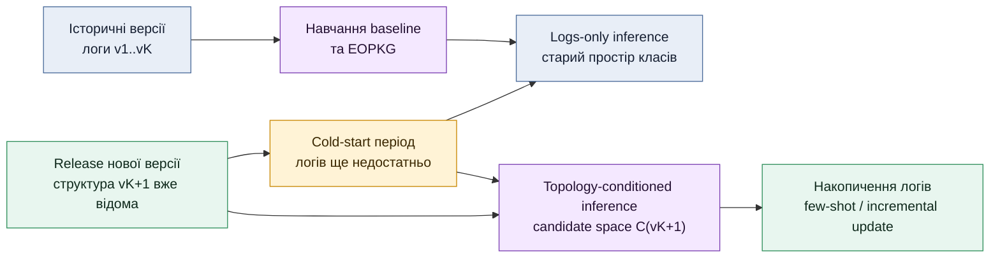
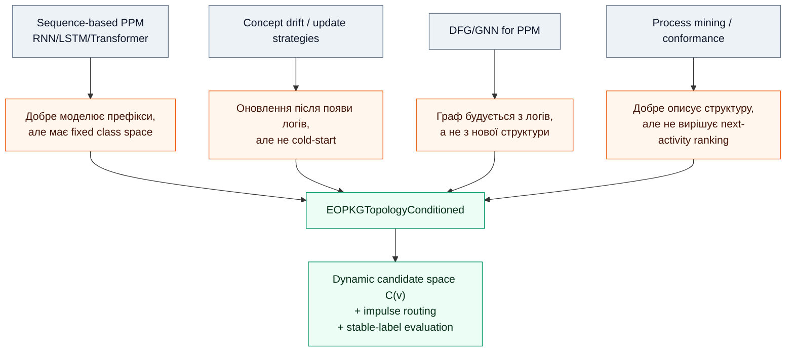
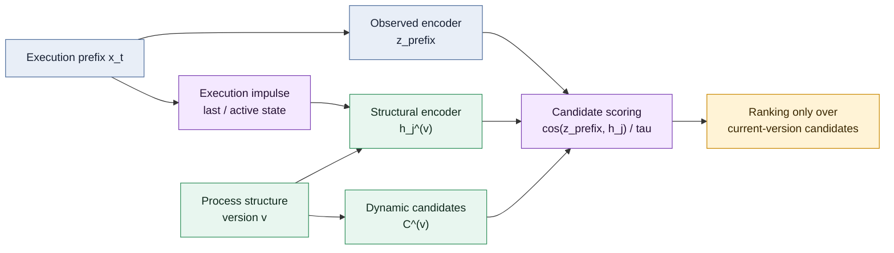
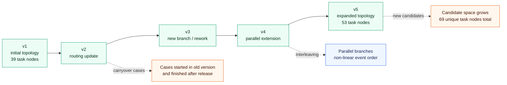
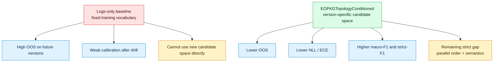

## Title

**Topology-Conditioned Predictive Monitoring of Business Processes under Structural Drift using EOPKG Candidate-Space Adaptation**

## Автори

Коротенко Р. [уточнити афіліацію]

## Dataset and Code Availability

- Dataset: `loan_v1_v5_complex_simulated` — напівсинтетичний версійний журнал процесу кредитування зі структурним дрейфом. DOI: **to be minted**.
- Source code: `bpm_prediction`, implementation of EOPKGTopologyConditioned and experiment pipeline. DOI: **to be minted**.
- Reproducibility note: фінальна версія статті має містити Zenodo/Figshare/OSF DOI для датасету, коду, конфігурацій запусків і агрегованих MLflow metrics.

---

## Abstract

Predictive process monitoring models are commonly trained on historical event logs and then applied to ongoing cases under the implicit assumption that the process structure remains stable. This assumption is violated in enterprise systems where a new process version can be deployed before enough event logs are available for reliable retraining. In such a transition period, a logs-only model continues to rank future activities according to obsolete empirical patterns, although the new process structure is already known to the information system.

This paper proposes an EOPKG-based topology-conditioned approach to next-activity prediction under structural process drift. Instead of predicting from a fixed activity vocabulary learned during training, the model predicts over a dynamic candidate set `C^(v)` associated with the current process version `v`. The proposed EOPKGTopologyConditioned model combines an observed prefix encoder with an impulse-activated structural encoder: the execution state is projected onto the process structure of the current version, propagated through graph neural message passing, and matched against prefix representations using candidate-level scoring. This enables the model to rank new, removed, and rerouted candidates in the topology-native space of the current version.

The approach is evaluated on a semi-synthetic versioned loan-process dataset containing five process versions, 5559 traces, 69 unique task nodes, complete task-node coverage, parallel interleavings, technical incidents, repeated activities, and version carryover. The experimental protocol compares five independent runs of the topology-conditioned model against logs-only baselines under future-version drift. The analysis focuses on strict next-activity F1, business-valid macro-F1 for parallel execution cases, out-of-structure predictions, calibration, negative log-likelihood, and candidate-mask diagnostics. Preliminary control runs indicate that topology-conditioned candidate ranking reduces structurally invalid predictions and improves calibration; the final statistical claim is planned through paired comparison across five seeds.

## Анотація

Моделі предиктивного моніторингу бізнес-процесів зазвичай навчаються на історичних журналах подій і застосовуються до поточних екземплярів процесу за припущення, що структура процесу залишається стабільною. У корпоративних інформаційних системах це припущення часто порушується: нова версія процесу може бути розгорнута раніше, ніж буде накопичено достатньо журналів її виконання для надійного перенавчання моделі. У такому перехідному періоді logs-only модель продовжує ранжувати майбутні активності за застарілими емпіричними патернами, хоча структура нової версії вже відома системі.

У статті запропоновано EOPKG-підхід до topology-conditioned прогнозування наступної активності в умовах структурного дрейфу процесу. На відміну від моделей, які прогнозують зі статичного словника активностей, сформованого під час навчання, запропонована модель виконує прогноз у динамічному просторі кандидатів `C^(v)`, що відповідає поточній версії процесу `v`. Модель EOPKGTopologyConditioned поєднує observed prefix encoder та impulse-activated structural encoder: стан виконання проектується на структуру поточної версії, поширюється через graph neural message passing і зіставляється з представленням префікса на рівні candidate-level scoring. Це дозволяє ранжувати нові, вилучені та змінені маршрутизацією кандидати у topology-native просторі поточної версії.

Підхід перевіряється на напівсинтетичному версійному датасеті процесу кредитування, що містить п'ять версій процесу, 5559 трейсів, 69 унікальних task-вузлів, повне покриття task-node space, паралельні інтерлівінги, технічні інциденти, повтори активностей і carryover між версіями. Експериментальний протокол передбачає порівняння п'яти незалежних запусків topology-conditioned моделі з logs-only baseline в умовах future-version drift. Аналіз фокусується на strict next-activity F1, бізнес-валідному macro-F1 для випадків паралельного виконання, прогнозах поза структурно допустимим простором, калібруванні, negative log-likelihood та candidate-mask diagnostics. Попередні контрольні запуски показують, що topology-conditioned candidate ranking зменшує кількість структурно невалідних прогнозів і покращує калібрування; фінальний статистичний висновок планується на основі парного порівняння по п'яти seed.

**Keywords:** predictive process monitoring; structural drift; graph neural networks; EOPKG; topology-conditioned learning; zero-shot adaptation; next-activity prediction; candidate-space prediction; process versioning.

---

## 1. Вступ

Предиктивний моніторинг бізнес-процесів використовується для прогнозування майбутньої поведінки поточного екземпляра процесу: наступної активності, часу виконання, ризику порушення SLA або ймовірності небажаного результату. Більшість моделей цього класу навчаються на історичних журналах подій і переносять вивчені емпіричні залежності на нові префікси виконання. Така постановка є ефективною для стабільних процесів, але стає недостатньою, коли змінюється сама структура процесу.

У реальних BPMS/Workflow-системах структурна версія процесу часто відома раніше, ніж накопичуються журнали її виконання. Нова схема, регламент або конфігурація маршрутизації вже розгорнуті, але завершені кейси нової версії ще відсутні або представлені малою, нерепрезентативною вибіркою. У цей період звичайна logs-only модель зберігає старий простір класів і старі частотні патерни. Внаслідок цього вона може впевнено прогнозувати активності, що вже не належать до актуального процесного маршруту.

Мета цієї роботи — перевірити, чи може структурна версія процесу використовуватися як умова прогнозування до накопичення достатньої кількості логів нової версії. Для цього запропоновано модель EOPKGTopologyConditioned, у якій прогноз наступної активності виконується не зі статичного словника `C_train`, а з динамічного простору кандидатів `C^(v)`, що відповідає конкретній версії процесу `v`.

Основний внесок статті:

1. сформульовано задачу topology-conditioned next-activity prediction для структурного дрейфу процесів;
2. запропоновано topology-native candidate-space контракт, де нові та вилучені активності обробляються на рівні поточної версії процесу;
3. описано EOPKGTopologyConditioned з impulse activation routing як механізм поєднання префікса виконання та структури процесу;
4. згенеровано версійний напівсинтетичний датасет, придатний для перевірки structural drift, parallel interleaving, loops та carryover between versions;
5. підготовлено експериментальний протокол з п'ятьма незалежними запусками та подальшою статистичною перевіркою значущості результатів.

**Рис. 1 - Адаптаційний лаг після release нової версії процесу.** Відома структура нової версії може зменшити період, коли модель змушена прогнозувати за застарілими логами: release нової версії процесу, період без достатніх логів, topology-conditioned inference, накопичення нових логів, few-shot/incremental retraining.



---

## 2. Аналіз пов'язаних досліджень та публікацій

Класичні роботи з process mining сформували основу для аналізу журналів подій, відкриття процесних моделей та перевірки відповідності між логами і моделями процесу [1, 2]. Predictive process monitoring розширює цю постановку, переходячи від післяфактумного аналізу до прогнозування майбутньої поведінки поточного кейсу [3, 4, 8].

Ранні deep learning підходи до PPM використовували послідовні моделі, зокрема LSTM, GRU та Transformer-подібні архітектури, які навчаються на префіксах журналів подій [3, 4, 8]. Такі моделі добре працюють у стабільному середовищі, але їхній простір прогнозу зазвичай фіксується під час навчання. Якщо нова версія процесу додає або вилучає активності, модель не має природного механізму для прогнозування з нового простору кандидатів. У попередніх експериментах автора для logs-only та structure-aware GNN режимів також було показано, що явне структурне подання може змінювати стабільність прогнозу, але просте додавання структури не вирішує задачу zero-shot перенесення між версіями [10, 11].

Окремий напрям досліджень розглядає concept drift та оновлення PPM-моделей у часі [5]. Ці роботи показують, що моделі потрібно періодично перенавчати або адаптувати після зміни процесу. Проте для бізнес-сценарію важливим є перехідний період: нова структура вже відома, але логів ще недостатньо. Саме цей період є центральним для topology-conditioned постановки.

Нещодавні роботи досліджують використання графових представлень, зокрема Directly-Follows Graphs і GNN для predictive process monitoring [6]. Вони підтверджують, що графова структура може бути корисною для прогнозування процесної поведінки. Водночас більшість таких підходів формує граф із самих логів, а не використовує зовнішньо відому структуру нової версії як умову прогнозування. Ідея динамічного покажчика виконання на графі близька до instruction-pointer підходів у GNN для програмних графів [9], однак у цій роботі вона переноситься на процесний домен: execution impulse не інтерпретує програму, а активує релевантні кандидати у структурі поточної версії процесу.

Запропонований у цій роботі підхід відрізняється від prior structure fusion тим, що структура не є лише допоміжним вектором або regularization signal. Вона визначає сам простір кандидатів `C^(v)`, у якому виконується прогноз. Це дозволяє відокремити два питання: що модель знає з історичних логів і які активності є актуальними для поточної версії процесу. Саме ця відмінність є ключовою порівняно з класичним logs-only PPM [3, 4, 8], drift update strategies [5] та DFG/GNN-представленнями, побудованими з історичних логів [6].

**Рис. 2 - Позиціонування запропонованого підходу відносно пов'язаних напрямів.** Карта related work: sequence-based PPM, drift adaptation, DFG/GNN PPM, topology-conditioned EOPKG.



Внесок полягає не лише у використанні GNN, а у переході від fixed class prediction до version-specific candidate ranking.

---

## 3. Методологія

### 3.1. Постановка задачі

Нехай `x_t` — префікс виконання кейсу до моменту `t`, а `G^(v)=(V^(v),E^(v))` — структура процесу версії `v`, яка відповідає поточному execution context. Класична постановка next-activity prediction у PPM розглядає прогноз як класифікацію наступної події за історично сформованим словником активностей [3, 4, 8]:

```math
\hat{y}_{t+1}=\arg\max_{c_j \in C_{train}} p(c_j \mid x_t)
```

де `C_train` — фіксований словник активностей, сформований під час навчання. У разі структурного дрейфу такий простір не є коректним: нова версія може мати інші кандидати та інші допустимі переходи. Concept drift literature зазвичай розглядає оновлення моделі після накопичення нових логів [5], тоді як у цій роботі фокусується проміжок до такого оновлення.

Тому задача формулюється як version-conditioned candidate ranking:

```math
\hat{y}_{t+1}=\arg\max_{c_j \in C^{(v)}} s_j^{(v)}
```

де `C^(v)` — динамічний набір кандидатів поточної версії процесу. Таким чином, прогноз виконується не з історично зафіксованого пулу класів, а з актуального простору задач версії `v`.

### 3.2. EOPKG candidate-space adaptation

У EOPKGTopologyConditioned кожен кандидат `c_j` належить структурі конкретної версії процесу. Це дозволяє моделі обробляти появу нових задач, зникнення застарілих активностей, зміну маршрутизації, циклічні повернення та потенційні дублікати ідентифікаторів у структурі. На відміну від DFG/GNN-підходів, де графова структура зазвичай оцінюється з історичних логів [6], тут структура версії виступає вхідною умовою прогнозу.

Скор кандидата визначається як:

```math
s_j^{(v)} = f_\theta(x_t, c_j, G^{(v)}), \quad c_j \in C^{(v)}
```

У практичній реалізації `f_theta` складається з двох частин:

1. observed encoder формує представлення префікса `z_prefix`;
2. structural encoder формує представлення кандидатів `h_j^(v)` у структурі поточної версії.

Після цього виконується candidate-level scoring:

```math
s_j^{(v)} = \frac{\cos(z_{prefix}, h_j^{(v)})}{\tau}
```

де `tau` — temperature parameter, що контролює різкість розподілу ймовірностей.

### 3.3. Impulse Activation Routing

У режимі impulse activation routing поточний стан виконання проектується на вузли структури. Якщо остання виконана активність або поточний active set відповідають певним структурним вузлам, ці вузли отримують імпульс у `struct_prefix_state_x`. Концептуально це близько до instruction-pointer ідей у графових нейронних мережах [9], але адаптовано до бізнес-процесів: покажчик виконання активує не інструкції програми, а структурні кандидати наступної дії. Далі імпульс поширюється структурною GNN через ребра `E^(v)`:

```math
h_v^{(0)} = h_v^{base} + \gamma \cdot \operatorname{LN}(\operatorname{Proj}(state_v))
```

```math
H^{struct} = \operatorname{GNN}(H^{(0)}, E^{(v)})
```

де `gamma` — масштаб імпульсу. Інтерпретація проста: структура поточної версії задає, куди може поширюватися execution signal, а observed encoder задає, який стан префікса потрібно зіставити з активованими кандидатами.

**Рис. 3 - Узагальнений pipeline EOPKGTopologyConditioned.** Observed prefix graph → `z_prefix`; process structure version `v` → impulse activation → structural candidate embeddings → Query-Key/cosine candidate scoring over `C^(v)`.



Observed encoder описує поточний префікс виконання, а структура саме тієї версії процесу, якій належить префікс, формує динамічний простір кандидатів `C^(v)` та їхні структурні представлення.

### 3.4. Process-state-aware candidate mask

Для послідовного процесу допустимі кандидати можна наближено визначати через прямих наступників останньої виконаної активності. Для паралельного або flattened XES-логу таке правило є недостатнім, оскільки наступною завершеною подією може бути активність із паралельної гілки, яка вже була активною раніше.

Тому у роботі використовується process-state-aware або relaxed reachability candidate mask:

```math
M_t = A_t \cup S_t
```

де `A_t` — активні або потенційно активні кандидати, а `S_t` — структурні наступники, досяжні з поточного префікса. Для lifecycle-rich логів `A_t` може реконструюватися з active task set. Для XES без повної marking інформації використовується relaxed reachability з обмеженнями на lookback, depth і cardinality.

Цей механізм не є окремим mask-aware варіантом моделі. Він входить до структурного candidate-space контракту, оскільки визначає, які кандидати версії `v` є релевантними для поточного префікса.

---

## 4. Опис набору даних / Dataset

Публічні журнали подій, такі як BPI Challenge datasets, є стандартними benchmark-джерелами для predictive process monitoring. Наприклад, BPI Challenge 2012 має DOI `10.4121/uuid:3926db30-f712-4394-aebc-75976070e91f` [7]. Проте такі журнали зазвичай не містять контрольованого версійного розбиття процесної структури, де для кожного періоду відома окрема структура процесу та її еволюція. Тому вони не є достатньо валідними для перевірки гіпотези zero-shot structural adaptation: неможливо коректно відокремити ефект нової структури від ефекту накопичених логів. Саме тому для цієї роботи потрібен окремий versioned dataset, а не лише повторення стандартних PPM benchmark-протоколів [7, 8].

Для цього дослідження сформовано напівсинтетичний датасет `loan_v1_v5_complex_simulated`, що моделює еволюцію процесу кредитування через п'ять версій. Датасет містить структурний дрейф, появу нових задач, зміну маршрутизації, паралельне виконання, повтори, технічні інциденти та carryover між версіями.

Структури процесу для всіх версій, повні таблиці значень, конфігурації запусків, MLflow-метрики та вихідний код планується опублікувати як supplementary materials з окремими DOI. BPMN/EOPKG-схеми версій `v1..v5` у статті не дублюються повністю, щоб не перевантажувати основний текст; вони мають бути доступні в додаткових матеріалах разом із датасетом.

### Таблиця 2 - Топологічна та еволюційна складність датасету

| Метрика | Кількісне значення | Архітектурне значення для GNN |
|---|---:|---|
| Об'єм та довжина (Traces & Length) | 5559 екземплярів; середня довжина — 27.05 (`σ=10.56`), максимум — 95 подій | Довгі послідовності з високою дисперсією перевіряють стійкість observed encoder до втрати контексту на великих відстанях. |
| Еволюція простору (Node Coverage) | 69 унікальних task-вузлів; 100% покриття; зростання від 39 вузлів у `v1` до 53 у `v5` | Простір кандидатів `C^(v)` розширюється. Модель має ранжувати нові кандидати без історичних логів саме цієї версії. |
| Перетин версій (Version Carryover) | 19.8% трейсів завершуються в новій версії; 14.55% переходять на `+1`, 4.37% — на `+2` | Структурний зсув може відбутися під час виконання кейсу, тому candidate space і adjacency мають залежати від версії префікса. |
| Семантичні цикли (Loops) | 6.55% трейсів містять повторення; максимум 31 повтор однієї активності | Перевіряється здатність відрізняти нормальний forward рух від rework/retry без втрати контексту. |

### Таблиця 3 - BPMS-native операційна варіативність

| Джерело варіативності | Емпіричні показники | Вплив на предиктивну здатність |
|---|---:|---|
| Concurrency Interleaving | 100% трейсів мають паралельне виконання; 23.81% (`34484`) переходів є суміжними паралельними | Ускладнює запам'ятовування лінійної послідовності й вимагає врахування структурного стану процесу. |
| Technical Retries & Incidents | 28.91% трейсів містять інциденти; 2337 повторень автоматичних задач | Додає стохастичні відхилення від основного маршруту й перевіряє робастність observed encoder. |
| Resource Delegation | 87.85% завдань виконано не-домінантним ресурсом; 100% людських задач мають кількох виконавців | Ресурсна ознака стає менш детермінованою, що посилює роль структури процесу. |

**Рис. 4 - Еволюція процесу `v1 → v5`.** Зміна кількості вузлів, додавання/видалення гілок, приклади carryover і parallel interleaving.



Важливою властивістю є не лише збільшення кількості вузлів, а й те, що частина кейсів перетинає межі версій, а паралельність руйнує просте припущення про лінійний порядок подій.

---

## 5. Опис експерименту

Експеримент спрямований на перевірку topology-conditioned гіпотези в умовах контрольованого structural drift. Основне порівняння виконується між logs-only baseline та EOPKGTopologyConditioned.

### 5.1. Моделі

- **Baseline.** Logs-only GNN model, що прогнозує наступну активність зі статичного словника активностей.
- **EOPKGTopologyConditioned.** GNN-модель з topology-native candidate-space scoring, impulse activation routing і динамічним простором кандидатів `C^(v)`.
- **Baseline + mask diagnostics / optional mask application.** Для baseline може бути окремо додано структурну маску як post-processing/diagnostic контроль, щоб відокремити ефект моделі від ефекту простого фільтрування недопустимих класів.

Mask-aware variants не розглядаються як окрема структурна модель, оскільки в EOPKGTopologyConditioned candidate mask є частиною структурного контракту поточної версії процесу.

### 5.2. Протокол запусків

Для кожної моделі планується **5 незалежних запусків** із різними seed. Основний сценарій:

```text
train on known versions -> evaluate drift on known + future versions
```

Приклад:

```text
Train: v1, v2
Drift test: v1, v2, v3, v4, v5
```

Для complex dataset також аналізується future-tail сегмент, де модель бачить структуру майбутньої версії, але не бачила її логи під час навчання.

### 5.3. Метрики

Щоб уникнути неоднозначного трактування результатів, метрики поділяються на три групи: точність exact next-activity, структурна валідність прогнозу та калібрування ймовірностей.

Основні метрики:

- `strict_macro_f1` — точний збіг наступної активності згідно з лінійним порядком подій у журналі;
- `macro_f1` — бізнес-валідна оцінка для паралельних і неоднозначних префіксів: якщо кілька задач можуть виконуватися паралельно, прогноз будь-якої структурно допустимої задачі з цього активного набору розглядається як коректний для управлінського рішення;
- `candidate_oos_rate` / `test_oos` — частка прогнозів поза допустимим простором поточної версії;
- `target_in_mask_rate` — частка випадків, де істинний target належить structural candidate mask;
- `strict_error_but_allowed_rate` — помилки, які залишаються структурно допустимими;
- `NLL` — negative log-likelihood;
- `ECE` — expected calibration error;
- `candidate_dynamic_count` — розмір динамічного candidate space поточної версії;
- `unseen_candidate_rate` — частка кандидатів, відсутніх у навчальному словнику.

У цій роботі `strict_macro_f1` є основною метрикою exact next-activity prediction: прогноз вважається правильним лише тоді, коли модель обрала ту саму наступну активність, яка фактично наступною записана у журналі. `macro_f1` відображає бізнес-валідність прогнозу в ситуаціях паралельного виконання: якщо декілька задач уже доступні або активні одночасно, то для управління процесом валідним є прогноз будь-якої задачі з цього допустимого набору, навіть якщо у конкретній лінійній проекції логу першою була записана інша паралельна активність.

`OOS` (`out-of-structure`) фіксує принципово інший тип помилки: модель обрала активність, яка не належить допустимому простору поточної версії або поточного process-state mask. Для бізнес-застосування така помилка є більш критичною, ніж помилка між кількома допустимими паралельними кандидатами. `target_in_mask_rate` показує, чи взагалі містить structural candidate mask істинну наступну активність; ця метрика задає верхню межу того, скільки strict-помилок можна пояснювати моделлю, а скільки — неповнотою реконструкції стану процесу.

`strict_error_but_allowed_rate` відокремлює помилки ранжування від помилок структурної валідності: якщо прогноз неправильний exact-wise, але належить дозволеному candidate set, модель не вийшла за межі структури, однак не змогла вибрати правильний порядок або правильну гілку. `ECE` і `NLL` використовуються для аналізу калібрування ймовірностей, що є стандартною проблемою сучасних нейронних мереж [14]: модель повинна не лише правильно ранжувати кандидатів, а й не бути надмірно впевненою у помилкових прогнозах після structural drift.

Для статистичної перевірки планується парний t-test між baseline та EOPKGTopologyConditioned по п'яти seed на однакових drift windows. Якщо розподіл різниць буде явно не-нормальним, додатково буде використано Wilcoxon signed-rank test.

### Таблиця 4 - Приклад параметрів контрольного запуску

| Параметр | Baseline example | EOPKGTopologyConditioned example |
|---|---|---|
| Dataset | `loan_v1_v5_complex_simulated` | `loan_v1_v5_complex_simulated` |
| Mode | `eval_drift` | `eval_drift` |
| Run ID | `487a3816bc7943cdaa39f5b69027e752` | `c21aca242b964633b7161e62f5cf3b8a` |
| Model type | `BaselineGATv2` | `EOPKGTopologyConditioned` |
| Structural mode | `false` | `true` |
| Candidate contract | fixed training vocabulary | topology-native candidate space `C^(v)` |
| Candidate identity mode | fixed vocabulary bridge | topology native |
| Process-state mask source | diagnostic only | `relaxed_reachability` |
| Train/eval setup | known versions → drift over known + future versions | known versions → drift over known + future versions |
| Main comparison role | logs-only reference | topology-conditioned adaptation |

Фінальна версія таблиці має містити повний перелік п'яти seed, посилання на конфігурації запусків і DOI-архів із MLflow export.

---

## 6. Результати експерименту та аналіз

Наведені нижче результати є поточним контрольним зрізом перед фінальним набором із п'яти seed. Вони не замінюють статистичну перевірку, але вже показують характер ефекту: topology-conditioned модель не лише змінює F1, а й суттєво зменшує кількість прогнозів поза структурно допустимим простором та покращує калібрування.

### 6.1. Загальні тенденції

У контрольному порівнянні на `loan_v1_v5_complex_simulated` logs-only baseline та EOPKGTopologyConditioned запускалися в однаковому drift-сценарії. Навчання виконувалося на відомих версіях, а оцінювання — на послідовності вікон, що містить як known, так і future-version сегменти.

### Таблиця 5 - Поточний контрольний зріз drift-метрик

| Метрика | Baseline | EOPKGTopologyConditioned | Інтерпретація |
|---|---:|---:|---|
| `strict_macro_f1`, mean | 0.4692 | 0.6339 | Структурна модель краще утримує exact next-activity prediction у середньому по drift windows. |
| `strict_macro_f1`, last window | 0.1943 | 0.4564 | У найскладнішому хвості структурна модель не досягає високого strict-F1, але зберігає суттєво вищий рівень за baseline. |
| `macro_f1`, mean | 0.6239 | 0.9230 | Значна різниця між бізнес-валідною та strict-оцінкою показує, що модель часто обирає допустиму задачу з активного або паралельного набору. |
| `macro_f1`, last window | 0.2583 | 0.7985 | У future-tail сегменті EOPKG зберігає здатність ранжувати бізнес-валідні області процесу, хоча точний порядок запису подій у журналі залишається складним. |
| `test_oos`, mean | 0.2853 | 0.0399 | Структура різко зменшує прогнози поза допустимою областю поточної версії. |
| `test_oos`, last window | 0.5914 | 0.0998 | Baseline у хвості часто прогнозує застарілі або недоступні активності; EOPKG переважно залишається в межах структури. |
| `target_in_mask_rate`, last window | 0.5366 | 0.6637 | Частина strict-помилок обмежена неповнотою mask/state reconstruction, особливо при паралельності та циклах. |
| `strict_error_but_allowed_rate`, last window | 0.1085 | 0.3572 | Значна частка помилок EOPKG є структурно допустимими, але не exact у порядку логу. |
| `ECE`, mean | 0.1784 | 0.0807 | Структурна модель краще калібрована. |
| `NLL`, mean | 4.9598 | 0.8623 | EOPKG значно менше штрафується за надмірно впевнені помилки. |

Отже, поточні результати не слід інтерпретувати як повне вирішення exact next-activity prediction для всіх future-version cases. Більш коректний висновок: EOPKGTopologyConditioned суттєво покращує структурну валідність прогнозу, калібрування та середню якість у candidate space, але strict-F1 залишається обмеженим неоднозначністю паралельних префіксів, якістю mask reconstruction та відсутністю семантичного/часового ранжування між кількома допустимими кандидатами.

### 6.2. Аналіз структурного ефекту

Для EOPKGTopologyConditioned важливо інтерпретувати не лише приріст F1, а й характер помилок. Якщо модель знижує OOS-rate і покращує calibration, але strict-F1 залишається обмеженим, це вказує на різницю між двома задачами:

- структурно допустимий прогноз;
- точний next-activity прогноз у паралельному або неоднозначному префіксі.

У бізнес-процесах ці помилки мають різну вартість. Прогноз у межах допустимого candidate set може бути прийнятним для раннього планування ресурсів або risk monitoring, тоді як прогноз поза структурою поточної версії є принципово невалідним.

Різниця між `strict_macro_f1` і `macro_f1` у поточному контрольному зрізі є ключовою для подальшої методології. Вона означає, що topology-conditioned модель уже навчилася не виходити далеко за межі структури, але їй бракує додаткового сигналу для вибору серед кількох допустимих кандидатів. Для таких випадків доцільним наступним кроком є не посилення жорсткої маски, а додавання семантичного та часово-ресурсного ранжування:

```math
score(c_j)=score_{topology}(c_j)+score_{semantics}(c_j)+score_{time/resource}(c_j)
```

Це дозволить відокремити питання структурної допустимості від питання бізнес-пріоритету: структура визначає, які кандидати можуть бути наступними, а семантика, очікувана тривалість, ресурсний контекст або ризик уточнюють, який із них є найбільш імовірним у конкретному префіксі.

### 6.3. Statistical significance

План статистичної перевірки:

```text
H0: mean(metric_EOPKG - metric_Baseline) = 0
H1: mean(metric_EOPKG - metric_Baseline) > 0
```

Для кожної метрики порівнюються paired windows або paired seed-level агрегати. Основна метрика для claim — `future_version_strict_macro_f1`. Допоміжні метрики — `future_version_oos_rate`, `ECE`, `NLL`, `target_in_mask_rate`.

**Рис. 5 - Узагальнення поточного експериментального ефекту.** Drift-window curves для baseline та EOPKGTopologyConditioned: strict-F1, macro-F1, OOS, ECE, NLL.



Структурне кондиціювання насамперед зменшує невалідні прогнози та покращує калібрування; залишковий розрив strict-F1 пов'язаний із вибором exact next activity серед кількох допустимих кандидатів.

**Рис. 6 - Місце вставки фактичних drift-window графіків.** Графіки з MLflow для baseline та EOPKGTopologyConditioned: `drift_window_strict_macro_f1`, `drift_window_macro_f1`, `drift_window_test_oos`, `drift_window_test_ece`, `drift_window_test_set_nll`, `drift_window_target_in_mask_rate`. Це основний рисунок для експериментальної частини.

**Рис. 7 - Місце вставки графіків навчання, optional / supplementary.** Графіки навчання для контрольних запусків: train/validation loss, strict-F1, macro-F1, calibration metrics. У основний текст їх варто включати лише якщо потрібно пояснити стабільність навчання або early stopping; інакше краще винести у supplementary materials.

### Таблиця 6 - Приклад результатів контрольного запуску

| Метрика | Baseline | EOPKGTopologyConditioned | Напрям ефекту |
|---|---:|---:|---|
| `strict_macro_f1`, mean | 0.4692 | 0.6339 | вище краще |
| `strict_macro_f1`, last window | 0.1943 | 0.4564 | вище краще |
| `macro_f1`, mean | 0.6239 | 0.9230 | вище краще |
| `macro_f1`, last window | 0.2583 | 0.7985 | вище краще |
| `test_oos`, mean | 0.2853 | 0.0399 | нижче краще |
| `test_oos`, last window | 0.5914 | 0.0998 | нижче краще |
| `ECE`, mean | 0.1784 | 0.0807 | нижче краще |
| `NLL`, mean | 4.9598 | 0.8623 | нижче краще |

Після завершення п'яти seed ця таблиця має бути замінена або доповнена фінальною таблицею `mean ± std`, paired t-test p-value та effect size.

---

## 7. Обмеження дослідження та ліміти

1. Датасет є напівсинтетичним. Це дозволяє контролювати структурний дрейф, carryover, паралельність та появу нових вузлів, але потребує подальшої перевірки на реальних BPMS-логах із версійною інформацією.

2. Журнали логів не завжди містять повний process marking або lifecycle-active set. Для таких логів використовується relaxed reachability approximation. Вона підвищує валідність маски для паралельних гілок, але не є повноцінним replay семантики виконання.

3. Unseen candidates наразі заземлюються переважно через структурну позицію та ідентичність вузлів. Для сильнішої zero-shot адаптації потрібне семантичне заземлення активностей: назви, описи, ролі, документи, політики виконання або текстові embeddings.

4. Результати не слід інтерпретувати як універсальну перевагу структури для будь-якого процесу. Якщо нова версія змінює не лише маршрутизацію, а й саму бізнес-семантику префіксів, потрібне few-shot або incremental оновлення моделі після накопичення логів.

5. Гіперпараметри структурного кондиціювання не оптимізувалися як самостійний об’єкт дослідження. Зокрема, коефіцієнт впливу структурного компонента λ, масштаб імпульсної активації γ, фіксована температура candidate scoring τ, глибина поширення імпульсу в структурному GNN L_impulse та ваги додаткових структурних штрафів були задані на основі архітектурної інтерпретації моделі, а не через повний пошук гіперпараметрів. Подальше дослідження впливу цих коефіцієнтів може підвищити якість прогнозування, але не змінює основної експериментальної постановки: модель повинна використовувати структуру поточної версії процесу як умову прогнозування.

---

## 8. Висновки

У статті запропоновано EOPKGTopologyConditioned підхід до next-activity prediction при структурному дрейфі бізнес-процесів. Основна ідея полягає в переході від статичного словника активностей до динамічного простору кандидатів поточної версії процесу. Такий контракт дозволяє моделі враховувати нові, вилучені та rerouted активності ще до накопичення достатніх логів нової версії.

На відміну від simple structure fusion, де структура додається як допоміжний сигнал, EOPKGTopologyConditioned використовує структуру як частину самого prediction space. Impulse activation routing проектує стан виконання на структуру процесу версії `v`, поширює його через графову топологію та ранжує кандидатів у `C^(v)`.

Поточні контрольні результати показують, що користь структури проявляється не лише у прирості strict-F1, а й у зниженні `OOS`, покращенні `NLL/ECE` та переході від прогнозування зі старого словника до ранжування кандидатів поточної версії. Це є важливим для практичного BPMS-сценарію: після release нової версії модель повинна прогнозувати в межах актуальної структури навіть тоді, коли логів нової версії ще недостатньо для повного перенавчання.

Водночас результати показують межу поточного підходу. У складних future-version сегментах `strict_macro_f1` залишається нижчим за бажаний рівень, тоді як `macro_f1` і `OOS` свідчать, що модель часто залишається у структурно допустимій області. Це означає, що наступний рівень якості потребує не лише topology candidate filtering, а й семантичного, часового або ресурсного ранжування допустимих кандидатів.

---

## 9. Подальші дослідження

Подальша робота буде спрямована на такі напрями:

1. **Semantic latent space for structure.** Додавання семантичних прототипів кандидатів на основі назв активностей, ролей, документів і метаданих процесу.
2. **Few-shot / incremental adaptation.** Побудова сценарію, де модель після zero-shot inference поступово донавчається на малому буфері логів нової версії.
3. **Reliability and drift semaphore.** Додавання механізму контролю довіри до структурного та observed сигналу через OOD/OOS, calibration та latent-distance diagnostics.
4. **Gateway-aware state reconstruction.** Для preserve-mode джерел потрібно враховувати semantics of parallel, exclusive та inclusive gateways.
5. **Time/resource/risk prediction extension.** Після стабілізації next-activity prediction EOPKG candidate scoring може бути розширено додатковими головами прогнозу для duration, resource або risk conditional on predicted candidate. У цьому сценарії next-activity prediction задає candidate set, а прогноз часу, ресурсу або ризику допомагає ранжувати структурно допустимі варіанти.

---

## 10. Література

[1] IEEE Task Force on Process Mining. *Process Mining Manifesto*. In: Business Process Management Workshops. Springer, 2012. DOI: `10.1007/978-3-642-28108-2_19`.

[2] van der Aalst, W. M. P. *Process Mining: Data Science in Action*. Springer, 2016. DOI: `10.1007/978-3-662-49851-4`.

[3] Evermann, J., Rehse, J.-R., Fettke, P. Predicting process behaviour using deep learning. *Decision Support Systems*, 100, 129-140, 2017. DOI: `10.1016/j.dss.2017.04.003`.

[4] Tax, N., Verenich, I., La Rosa, M., Dumas, M. Predictive Business Process Monitoring with LSTM Neural Networks. CAiSE 2017. [DOI уточнити за фінальним джерелом].

[5] Rizzi, W., Di Francescomarino, C., Ghidini, C., Maggi, F. M. How do I update my model? On the resilience of Predictive Process Monitoring models to change. arXiv:2109.03501, 2021.

[6] Lischka, A., Rauch, S., Stritzel, O. Directly Follows Graphs Go Predictive Process Monitoring With Graph Neural Networks. arXiv:2503.03197, 2025.

[7] van Dongen, B. F. BPI Challenge 2012. 4TU.ResearchData, 2011. DOI: `10.4121/uuid:3926db30-f712-4394-aebc-75976070e91f`.

[8] Teinemaa, I., Dumas, M., La Rosa, M., Maggi, F. M. Outcome-Oriented Predictive Process Monitoring: Review and Benchmark. arXiv:1707.06766, 2017.

[9] Bieber, D., et al. Learning to Execute Programs with Instruction Pointer Attention Graph Neural Networks. arXiv:2007.03157, 2020.

[10] Коротенко, С. А. Порівняння GNN-архітектур для прогнозу активності у бізнес-процесах: Logs-only та BPMN-підходи. *Information Technology: Computer Science, Software Engineering and Cyber Security*, Issue 2, 36-47, 2025. DOI: `10.32782/IT/2025-2-5`.

[11] Коротенко, С. А. Прогнозування активностей у бізнес-процесах за різної довжини префіксів: оцінка GNN у logs-only та BPMN-режимах. *Таврійський науковий вісник. Серія: Технічні науки*, Issue 5, 376-389, 2025. DOI: `10.32782/tnv-tech.2025.5.1.40`.

[12] [Додати після перевірки] RLHGNN: Reinforcement Learning-driven Heterogeneous Graph Neural Network for Next Activity Prediction.

[13] [Додати після перевірки] SNAP / semantic narrative approaches for zero-shot predictive business process monitoring.

[14] Guo, C., Pleiss, G., Sun, Y., Weinberger, K. Q. On Calibration of Modern Neural Networks. ICML 2017.

---

## Author Notes / Коментарі для себе, не включати в фінальну статтю

- Не посилатися в основному тексті на дисертацію. Стаття має бути самостійною.
- У фінальній версії прибрати всі `to be minted`, `[уточнити]`, `[додати]`.
- Dataset DOI і code DOI потрібно отримати через Zenodo/Figshare/OSF до подання.
- Окремо перевірити DOI для Tax et al. CAiSE 2017 і джерел із `research_comparation.MD`.
- У результатах не перебільшувати claim: розділяти strict-F1, OOS, ECE/NLL і target-in-mask constraints.
- Якщо paired t-test не показує значущість для strict-F1, можна робити сильніший акцент на candidate-space validity, OOS reduction, calibration та cost-of-waiting.
